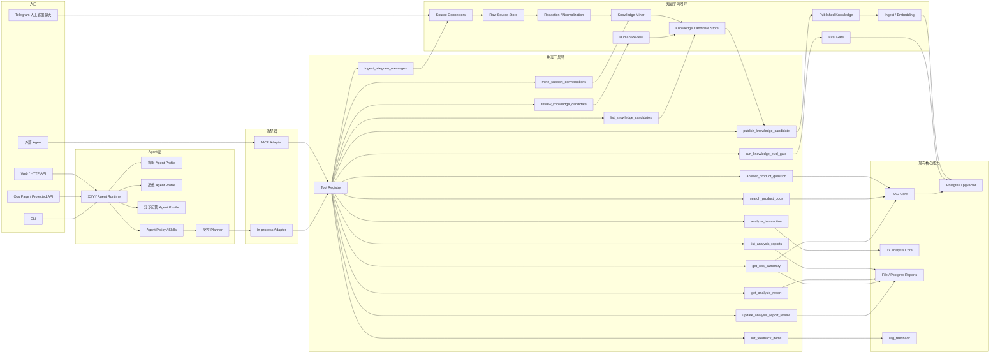

# XXYY Agentic RAG System Design

本文档设计 XXYY 客服系统从当前产品问答 RAG 演进为完整 Agentic RAG 系统的目标架构。最终系统包含客服回答、工具调用、运维辅助、知识自学习闭环和 MCP/Skills 复用。第一阶段不重写现有 RAG、交易分析、API 或 Web，而是在现有能力上抽出共享 Tool Registry；后续阶段补齐“Telegram 人工客服聊天 -> 候选知识 -> 人工审核 -> 正式知识库 -> ingest/eval”的闭环。

## 背景

当前项目已经具备稳定的客服业务能力：

- 产品问答：规则意图分类、pgvector 检索、OpenAI-compatible LLM 回答、引用和附件。
- 交易分析：单笔交易哈希识别、mock/browser provider、截图、报告、报告复查。
- 运维后台：`/ops` 页面、`/api/ops/summary`、deep health、知识库 stats、反馈 stats 和交易分析报告复查接口。
- 知识同步：产品文档和官方 X 更新支持全量入库、X 增量同步、知识库统计和负反馈导出。
- MCP 能力：`@xxyy/tx-analysis-mcp` 已把交易分析暴露为 `analyze_transaction`、`get_analysis_report` 和 `list_analysis_reports`。

但当前内部聊天链路仍是 `ChatService -> Retriever / TxAnalysisProvider` 的代码编排，运维能力也主要是页面和受保护 API，知识更新也主要依赖文档/X 同步与人工补充。它们适合当前客服 RAG 阶段，但还不是完整 Agentic RAG 应用：工具没有统一注册，客服入口、运维入口和 MCP 入口没有共用同一层工具契约，Skill/Policy 也没有进入内部运行时，Telegram 人工客服对话还没有进入可审核的知识学习流程。

## 目标

- 建立共享 Tool Registry，所有可调用能力先注册成工具。
- 让内部 Agent Runtime 和外部 MCP Server 共用同一套 tool schema 和 handler。
- 保留内部 in-process 调用，避免 Web/API 每次绕 stdio MCP。
- 让 MCP 成为 Tool Registry 的外部协议适配器，而不是另一套业务实现。
- 将当前 Skill 里的边界和使用规则沉淀为内部 Agent Policy。
- 保留并继续建设内部运维 Agent，用于健康检查、报告复查、反馈 triage 和排障摘要。
- 新增知识运营 Agent，从 Telegram 人工客服聊天、负反馈和已有知识库中发现知识缺口。
- 建立候选知识审核流：未审核内容只能进入候选池，不能进入正式 RAG 检索库。
- 审核通过后由发布流程写入正式知识源，触发 ingest、embedding 和 eval gate。
- 为知识候选、发布、ingestion run 和 eval 结果保留来源、版本和回滚线索。
- 为每次工具调用提供一致的权限判断、结构化日志和审计数据。

## 非目标

- 第一阶段不引入完全自主的多步 agent loop。
- 第一阶段不让 LLM 任意选择所有工具。
- 第一阶段不接用户账户、余额、订单、私有交易记录。
- 第一阶段不提供投资建议。
- 第一阶段不重写现有 RAG、交易分析 provider 或 Web UI。
- 第一阶段的运维 Agent 只服务内部后台，不面向终端用户。
- 第一阶段的运维 Agent 不自动执行迁移、重启、删除报告、改配置或调用外部链上写操作。
- 第一版 Telegram 学习流程不自动发布未审核内容。
- 第一版不训练或微调模型，只更新可审计的知识库内容和评测用例。
- 第一版不读取未授权 Telegram 会话，不把私聊、账户、订单、余额或身份信息沉淀为知识。

## 推荐架构



核心原则：**业务能力只实现一次，协议适配可以有多个**。内部 Agent Runtime 使用 in-process adapter 调工具；外部 Agent 使用 MCP adapter 调同一批工具。

## Tool Registry

Tool Registry 是第一阶段最重要的新增边界。每个工具都应该包含：

- `name`：稳定工具名。
- `description`：工具能力和适用场景。
- `inputSchema`：Zod schema 或可导出为 JSON Schema 的结构。
- `outputSchema`：工具返回结构，方便 MCP 和内部调用统一验证。
- `handler`：实际业务处理函数。
- `policy`：权限、边界、是否允许外部 MCP 调用、是否需要 ops token。
- `audit`：输入摘要、敏感字段处理、日志字段策略。

建议新增包或模块：

```text
packages/agent-core/
  src/tool-registry.ts
  src/tools/product-qa-tool.ts
  src/tools/product-search-tool.ts
  src/tools/tx-analysis-tool.ts
  src/tools/report-tools.ts
  src/tools/ops-summary-tool.ts
  src/tools/feedback-tools.ts
  src/tools/telegram-tools.ts
  src/tools/knowledge-candidate-tools.ts
  src/tools/knowledge-publish-tools.ts
  src/agent-runtime.ts
  src/policy.ts
  src/audit.ts
```

也可以先放在 `packages/rag-core/src/agent-*`，但长期建议独立 `@xxyy/agent-core`，避免 RAG 包继续变大。

知识学习闭环建议单独放在 `@xxyy/knowledge-ops`，避免把连接器、脱敏、候选审核和发布流程塞进 RAG 检索核心：

```text
packages/knowledge-ops/
  src/sources/telegram-connector.ts
  src/raw-source-store.ts
  src/redaction.ts
  src/conversation-miner.ts
  src/knowledge-candidate-store.ts
  src/review-workflow.ts
  src/publish-workflow.ts
  src/eval-gate.ts
```

`@xxyy/knowledge` 继续负责文档加载、chunk、embedding 和入库；`@xxyy/knowledge-ops` 负责把外部来源变成审核通过的正式知识源。

## 知识学习闭环

知识学习闭环的核心边界是：**未审核内容不是正式知识库内容**。Telegram 人工客服聊天、负反馈和自动抽取结果只能进入候选区，不能直接进入 RAG 检索库。

第一版流程：

1. Source Connector 增量读取授权来源：Telegram 人工客服群/频道、负反馈队列、后续官方公告源。
2. Raw Source Store 保存原始来源引用、消息关系、时间和去重指纹。
3. Redaction / Normalization 生成脱敏后的可学习文本，移除或摘要化钱包、订单、用户身份、联系方式、截图 OCR 等敏感信息。
4. Knowledge Miner 识别用户问题、人工客服答案、是否已解决、是否重复、是否越界。
5. Candidate Store 生成候选 FAQ、候选文档补丁、边界回复样例和 eval case。
6. Human Review 由内部人员审核、改写、拒绝或批准候选知识。
7. Publish Workflow 只把 `approved` 候选写入正式知识源。
8. Ingest / Embedding 将正式知识源写入 pgvector。
9. Eval Gate 使用候选自动生成的 eval case 和现有回归集验证回答质量。

候选知识状态建议：

```text
draft -> needs_review -> approved / rejected -> published -> ingested -> eval_passed / eval_failed
```

`approved` 只表示内容可以发布；`published` 表示已写入正式知识源；`ingested` 表示已进入向量库；`eval_passed` 才表示本次知识更新可以用于生产确认。`eval_failed` 时保留候选和发布记录，但需要回滚或修正文档后重新发布。

## Telegram Support Connector

第一版只读取明确授权的人工客服群、频道或会话，不做全量个人历史抓取。优先使用 Bot API 接入可控客服群；如果必须读取历史人工客服会话，再评估 MTProto/GramJS 这类客户端会话方案，并把会话凭据放在受保护配置中。

消息入库字段建议：

- `source: "telegram"`
- `chatIdHash`
- `messageId`
- `threadId?`
- `replyToMessageId?`
- `senderRole: "user" | "support" | "system" | "unknown"`
- `sentAt`
- `text`
- `attachmentsMetadata?`
- `contentHash`
- `ingestedAt`

Raw Store 可以保留原始文本用于审计和重跑，但访问必须受内部权限限制。进入 Knowledge Miner 的文本必须先经过 Redaction，默认只保存脱敏版本、来源引用和哈希。

## Knowledge Candidate Store

候选知识应保存为结构化对象，而不是直接拼接到 Markdown：

- `id`
- `type: "faq" | "doc_patch" | "boundary_example" | "eval_case"`
- `status`
- `question`
- `proposedAnswer`
- `targetCategory`
- `sourceRefs`
- `redactionReport`
- `existingKnowledgeMatches`
- `confidence`
- `riskLevel`
- `generatedEvalCases`
- `reviewer`
- `reviewNotes`
- `publishedTarget`
- `createdAt`
- `updatedAt`

候选生成时需要先检索现有知识库。如果已有知识可以覆盖，应把候选标为重复或建议补充引用；如果现有知识缺失，才进入 `needs_review` 队列。

## Human Review Workflow

人工审核页面或 API 至少要展示：

- 脱敏后的 Telegram 对话片段。
- 原始消息引用和内部审计入口。
- 自动识别出的用户问题与人工客服答案。
- 与现有知识库的相似内容。
- 候选 FAQ 或文档补丁。
- 自动生成的 eval case。
- 风险标记：隐私、账户/订单、投资建议、临时活动、未确认客服结论。

审核动作：

- `approve`：允许发布到正式知识源。
- `reject`：拒绝候选并记录原因。
- `request_changes`：退回候选，要求重新生成或人工改写。
- `merge_duplicate`：标记为已有知识的重复问题，只补充 eval case 或别名问法。

第一版必须人工审核后发布。高置信自动发布可以作为后续能力，但不能在第一版启用。

## Publish and Eval Gate

发布流程应该把审核通过的候选写入正式、可审计的知识源，例如：

- `docs/product-features/support-faq.md`
- 或 `docs/product-features/sources/reviewed-support-knowledge.jsonl`

如果沿用当前 Markdown loader，第一版可以在发布后触发 `pnpm rag:gate:knowledge -- --id <candidate-id> --fast`，由 gate 执行全量 `rag:ingest` 语义、重新生成 embeddings，并运行候选生成的 targeted eval case。长期更好的做法是为 reviewed support knowledge 增加 source-aware incremental sync，像 X 增量同步一样只 embedding 新增或变更 chunk。

每次发布都应生成或更新 eval case，并在进入生产前运行：

- 快速检索和引用检查。
- 候选对应问题的 targeted eval。
- 边界问题回归：账户、余额、订单、私有交易记录、投资建议。
- 关键产品问答回归。

Eval 失败时不应静默上线，应保留发布记录、失败原因和回滚目标。可以先通过发布文件版本、ingestion run id 和候选 id 建立回滚线索，后续再做完整知识版本管理。

## 首批工具

### `search_product_docs`

用途：只做知识库检索，不生成最终回答。

输入：

- `query: string`
- `topK?: number`

输出：

- `chunks`
- `citations`
- `confidence`

使用场景：

- Agent 需要先看资料再决定如何回答。
- 外部 Agent 想只检索 XXYY 文档。
- 运维 Agent、评测或知识库维护流程想检查召回片段。

### `answer_product_question`

用途：回答产品功能、配置步骤、Pro 权益、官方 X 更新等问题。

输入：

- `question: string`
- `channel?: "web" | "cli" | "telegram" | "agent"`
- `stream?: boolean`

输出：

- `answer`
- `citations`
- `attachments`
- `confidence`

内部实现第一阶段可以复用当前 retriever + `OpenAiAnswerProvider`。后续如果 Agent Runtime 需要更细粒度控制，可以先调用 `search_product_docs`，再调用回答生成工具。

### `analyze_transaction`

用途：分析单笔公开交易哈希或受支持 explorer 链接是否疑似被夹。

输入：

- `txHash: string`
- `chain?: "solana" | "base" | "ethereum" | "bsc" | "unknown"`
- `channel?: "agent" | "support" | "web"`

输出：

- `status: "success" | "failure"`
- success 时返回 `TxAnalysisResult`
- failure 时返回 `reason`、`message`、可选 metadata 和 report URL

第一阶段直接复用当前 `analyzeTransaction()` runtime。

### `list_analysis_reports`

用途：查询交易分析报告复查队列。

说明：这个工具服务于夹子查询复查、运维 Agent 和外部 Agent 复用。对外 MCP 默认只暴露只读列表能力；内部运维 Agent 可结合权限读取更多复查字段。

输入：

- `txHash?: string`
- `chain?: TxAnalysisChain`
- `status?: "success" | "failure"`
- `reviewStatus?: "open" | "in_review" | "closed"`
- `reviewAssignee?: string`
- `reason?: TxAnalysisUnavailableReason`
- `limit?: number`

输出：

- `reports`

### `get_analysis_report`

用途：读取单条完整交易分析报告。

说明：这个工具用于复查某次夹子查询证据、截图和失败原因，供内部客服入口、运维 Agent 或外部 MCP 调用。

输入：

- `id: string`

输出：

- `document?: unknown`

### `update_analysis_report_review`

用途：更新交易分析报告的复查状态、负责人和备注。

说明：这是内部运维 Agent 工具，默认不暴露给公开 MCP。调用方必须通过 ops 权限校验，审计日志需要记录 report id、review status 和 assignee 摘要，但不记录备注中的敏感内容。

输入：

- `id: string`
- `reviewStatus?: "open" | "in_review" | "closed"`
- `reviewAssignee?: string`
- `reviewNotes?: string`

输出：

- `report`

### `get_ops_summary`

用途：汇总当前服务健康状态、知识库状态、反馈状态和交易分析运行配置。

说明：第一阶段复用现有 `/api/ops/summary` 背后的聚合逻辑，作为运维 Agent 的只读诊断入口。它可以帮助内部人员快速判断是配置缺失、向量库不可用、模型不可用、知识库为空，还是交易分析 provider 未启用。

输入：

- `includeDeepHealth?: boolean`

输出：

- `health`
- `knowledgeStats`
- `feedbackStats`
- `txAnalysisRuntime`
- `warnings`

### `list_feedback_items`

用途：列出反馈 triage 队列，优先支持负反馈。

说明：这是内部运维 Agent 和知识库维护流程使用的工具，不面向终端用户。第一阶段可以复用 `rag:feedback` 已有查询逻辑，避免重新定义反馈存储。

输入：

- `rating?: "positive" | "negative"`
- `limit?: number`

输出：

- `items`

### `ingest_telegram_messages`

用途：从授权 Telegram 人工客服来源增量读取消息并写入 Raw Source Store。

说明：这是内部知识运营工具，不暴露给公开 MCP。它只负责采集和去重，不生成正式知识。

输入：

- `sourceId: string`
- `since?: string`
- `limit?: number`

输出：

- `ingestedCount`
- `skippedCount`
- `lastCursor`

### `mine_support_conversations`

用途：从脱敏后的人工客服对话中挖掘候选知识。

说明：该工具先检索现有知识库，再生成候选 FAQ、文档补丁、边界样例或 eval case。生成结果默认进入 `needs_review`，不能直接发布。

输入：

- `sourceId?: string`
- `since?: string`
- `limit?: number`

输出：

- `candidatesCreated`
- `duplicatesFound`
- `boundaryItemsIgnored`
- `warnings`

### `list_knowledge_candidates`

用途：查询候选知识审核队列。

输入：

- `status?: "draft" | "needs_review" | "approved" | "rejected" | "published" | "ingested" | "eval_passed" | "eval_failed"`
- `type?: "faq" | "doc_patch" | "boundary_example" | "eval_case"`
- `riskLevel?: "low" | "medium" | "high"`
- `limit?: number`

输出：

- `candidates`

### `review_knowledge_candidate`

用途：人工审核候选知识。

说明：这是受保护工具，必须记录 reviewer 摘要和审核动作。它可以批准、拒绝、要求修改或合并重复项，但不能绕过审核直接写入正式知识库。

输入：

- `id: string`
- `action: "approve" | "reject" | "request_changes" | "merge_duplicate"`
- `reviewNotes?: string`
- `editedQuestion?: string`
- `editedAnswer?: string`

输出：

- `candidate`

### `publish_knowledge_candidate`

用途：把已批准候选发布到正式知识源。

说明：只允许发布 `approved` 候选。发布后应写入目标文档或 reviewed support JSONL，并生成 publish run 记录。

输入：

- `id: string`
- `target?: string`

输出：

- `candidate`
- `publishedTarget`
- `publishRunId`

### `run_knowledge_eval_gate`

用途：对一次知识发布运行 targeted eval 和回归检查。

输入：

- `id: string`
- `fast?: boolean`

说明：当前第一版以 candidate id 运行；后续补 publish run 持久化后，再把入口升级为 `publishRunId` 或支持二者兼容。

输出：

- `status: "passed" | "failed"`
- `evalRunId`
- `failures`

## Agent Runtime

第一阶段 Agent Runtime 是受控 planner，不是完全自主 agent loop。它包含三个 profile：

- 客服 Agent Profile：面向 Web/API/CLI 的产品问答和夹子查询。
- 运维 Agent Profile：面向内部 `/ops`、受保护 API 或内部 CLI 的健康检查、报告复查和反馈 triage。
- 知识运营 Agent Profile：面向内部知识库维护，负责 Telegram 学习、候选知识审核辅助、发布和 eval gate。

客服 Agent 处理流程：

1. 规范化请求，保留 `message`、`channel`、可选 `sessionId` 和 `userId` 是否存在。
2. 调用现有规则分类器或新版 intent policy。
3. 根据 intent 决定可用工具：
   - `product_qa` / `how_to` -> `answer_product_question`
   - `tx_sandwich_detection` -> `analyze_transaction`
   - `realtime_account_query` / `investment_advice` / `unknown` -> 边界回复
4. 调用 Tool Registry。
5. 将工具结果格式化为 `ChatResponse` 或 stream events。
6. 写入工具调用审计日志。

第一阶段仍保持“一次请求最多调用一个主工具”。这样能先统一工具边界，又不放大客服安全风险。

运维 Agent 处理流程：

1. 先校验 ops 权限，未通过时直接拒绝。
2. 根据问题选择受保护工具：
   - 服务状态、配置、知识库情况 -> `get_ops_summary`
   - 夹子查询复查队列 -> `list_analysis_reports`
   - 单条交易分析证据 -> `get_analysis_report`
   - 复查状态、负责人、备注 -> `update_analysis_report_review`
   - 负反馈或知识库补齐线索 -> `list_feedback_items`
3. 输出诊断摘要和建议动作，但不自动执行迁移、重启、删除或配置修改。
4. 写入工具调用审计日志。

运维 Agent 可以调用多个只读工具形成摘要，但第一阶段写操作只允许 `update_analysis_report_review` 这类已有后台复查动作。

知识运营 Agent 处理流程：

1. 先校验内部知识运营权限，未通过时直接拒绝。
2. 增量采集授权 Telegram 来源：`ingest_telegram_messages`。
3. 对新消息执行脱敏、归一化和候选挖掘：`mine_support_conversations`。
4. 将候选提交到 `needs_review` 队列：`list_knowledge_candidates`。
5. 人工审核后调用 `review_knowledge_candidate`。
6. 只有 `approved` 候选才能调用 `publish_knowledge_candidate`。
7. 发布后调用 `run_knowledge_eval_gate`，通过后才把本次知识更新视为可生产确认。

知识运营 Agent 可以帮助生成候选和摘要，但第一版不能替代人工审核。

## MCP Adapter

MCP Server 不再手写独立 handler，而是从 Tool Registry 选择允许外部调用的工具并注册。

映射关系：

- Tool Registry `name` -> MCP tool name
- Tool Registry `description` -> MCP tool description
- Tool Registry `inputSchema` -> MCP input schema
- Tool handler output -> MCP `structuredContent`

现有 `@xxyy/tx-analysis-mcp` 可以先改造成只注册交易分析相关工具；后续可新增一个更通用的 `@xxyy/agent-mcp`，暴露产品问答和交易分析工具。运维工具和知识运营工具默认不进入公开 MCP，只在显式配置内部 MCP 且通过 ops/knowledge 权限校验时暴露。

## Skills 和 Policy

当前 `skills/xxyy-transaction-analysis` 主要给外部 Agent 看。下一阶段应把其中的边界沉淀为内部 Policy：

- 只允许公开交易哈希或受支持 explorer 链接进入交易分析。
- `unknown` 只表示裸 EVM 哈希在 Base、Ethereum、BSC 间自动探测，不表示任意链。
- 账户、余额、订单、私有交易记录必须拒绝。
- 投资建议必须拒绝。
- 不支持链要明确说明，不拿裸哈希强行探测已支持链。
- mock provider 结果必须标明 fixture 演示。

Skill 仍保留给外部 Agent 使用；Policy 是运行时执行的边界规则。

建议的 Skill 分层：

- `skills/xxyy-transaction-analysis`：继续作为公开夹子查询 Skill，服务外部 Agent 复用。
- `skills/xxyy-product-support`：后续可暴露产品问答、知识库检索和边界规则。
- `skills/xxyy-knowledge-curation`：内部 Skill，只给受信任 Agent 使用，说明 Telegram 学习、候选审核和发布限制。

公开 Skill 不能指导外部 Agent 读取内部 Telegram、反馈队列、ops summary 或未审核候选知识。

## 权限和审计

每次工具调用都记录结构化日志：

- `toolName`
- `intent`
- `channel`
- `status`
- `latencyMs`
- `errorCode` 或 failure reason
- `citationCount` 或 report id
- `candidateId`、`sourceId` 或 publish run id
- `sessionIdPresent`
- `userIdPresent`

不记录明文 `userId`，不记录 API key，不记录私有账户数据。交易哈希属于公开输入，可以记录 hash 摘要或完整 hash，具体策略由内部合规要求决定；Telegram `chatId`、发送者身份、联系方式、钱包、订单、账户信息默认记录摘要或脱敏结果，不进入普通工具日志。如果未来接入用户私有数据工具，应默认只记录 hash 摘要。

## 错误处理

工具错误统一分层：

- `invalid_input`：schema 不通过或引用歧义。
- `unsupported_scope`：账户、订单、余额、投资建议等越界。
- `not_configured`：缺 provider、缺数据库、缺模型配置。
- `provider_unavailable`：外部公开站点、浏览器或 LLM 暂不可用。
- `timeout`：明确超时。
- `not_found`：报告或交易不存在。
- `review_required`：候选知识未审核，不能发布或进入正式知识库。
- `eval_failed`：知识发布后的评测门禁未通过。

Agent Runtime 不直接暴露底层异常栈；对用户返回客服可读文案，对内部排障和复查保留结构化 reason。

## 分阶段落地范围

### Phase 1：Agent 工具化底座

1. 新增共享 Tool Registry。
2. 抽出客服和交易工具：`search_product_docs`、`answer_product_question`、`analyze_transaction`、`list_analysis_reports`、`get_analysis_report`。
3. 抽出运维工具：`get_ops_summary`、`list_feedback_items`、`update_analysis_report_review`。
4. 新增受控 `AgentRuntime`，支持客服 Agent Profile 和运维 Agent Profile，但保留旧 `ChatService` 兼容层。
5. 改造 `@xxyy/tx-analysis-mcp`，让它从 Tool Registry 注册交易分析工具。
6. 增加工具调用审计日志。
7. 保持现有 HTTP API、Web UI、CLI 命令和报告 store 行为不变。

### Phase 2：Telegram 知识学习闭环

1. [x] 新增 `@xxyy/knowledge-ops` 基础包。
2. [x] 新增客服消息类型、Redaction、Conversation Miner 和内存 Knowledge Candidate Store。
3. [x] 新增 Raw Source Store 和持久化 Knowledge Candidate Store。
4. [x] 新增 Telegram Support Connector 基础能力，只读取显式授权客服来源。
5. [x] 新增受保护候选列表和审核 API。
6. [x] 新增 Telegram 采集运行入口：`pnpm rag:sync:telegram` 读取授权 Telegram 消息、写入 Raw Source、生成 `needs_review` 候选并推进 getUpdates offset。
7. [ ] 新增知识运营 Agent Profile 和内部工具。
8. [x] 审核通过后发布到 reviewed support knowledge 正式知识源：`pnpm rag:publish:knowledge -- --id <candidate-id>` 只发布 `approved` 候选，并写入 `docs/product-features/pages/65-reviewed-support-knowledge.md` 或指定 `pages/*.md`。
9. [x] 发布后触发 ingest/embedding 和第一版 targeted eval gate：`pnpm rag:gate:knowledge -- --id <candidate-id> --fast` 只接受 `published` 候选，执行正式 ingest/embedding，运行候选 generated eval cases，并把状态推进到 `ingested` 后标记为 `eval_passed` 或 `eval_failed`。
10. [ ] 持久化 publish run、ingestion run 和 eval run 关联，并补 eval 失败回滚线索。

### Phase 3：知识质量和运营增强

1. 增加知识版本、发布 run、ingestion run 和 eval run 的关联查询。
2. 增加候选合并、重复问题聚类和知识缺口看板。
3. 增加 source-aware incremental sync，减少全量 embedding 成本。
4. 增加内部 MCP 暴露策略，让受信任 Agent 可复用知识运营工具。
5. 在人工审核流程稳定后，再评估高置信自动发布，但默认仍关闭。

明确不做：

- 未审核 Telegram 内容自动进入正式知识库。
- 多步完全自主规划。
- 用户私有账户工具。
- 自动执行迁移、重启、删除、改配置的运维 Agent。
- 工单系统。
- 人工客服后台完整工单流。
- 面向终端用户开放的 Telegram 自动回复。
- 新 UI 大改版。

## 迁移策略

采用渐进迁移：

1. 先把现有能力包装成工具，测试工具 handler。
2. MCP Server 切到 Tool Registry，但外部行为保持不变。
3. 新增 `AgentRuntime.ask()`，内部调用 Tool Registry。
4. 新增 `AgentRuntime.askOps()` 或等价的运维 profile 调用入口，先接入受保护 `/ops` 能力。
5. 新增 `AgentRuntime.curateKnowledge()` 或等价的知识运营 profile 调用入口，先接入 Telegram 候选知识流程。
6. `ChatService` 变成 AgentRuntime 的薄封装，或保留旧实现作为 fallback。
7. API 和 CLI 逐步切到 AgentRuntime。
8. 确认行为和评测稳定后，移除重复的私有 provider 调用路径。

## 测试方案

- Tool Registry 单元测试：注册、重复 name、schema 校验、权限过滤。
- Product QA tool 测试：有引用、无引用、LLM 降级、附件提取。
- Tx analysis tool 测试：not configured、mock success、unsupported chain、invalid reference。
- Report tools 测试：文件 store 和 Postgres store reader 行为。
- Ops tools 测试：ops token 权限、deep health 聚合、反馈列表、报告复查更新。
- Telegram connector / sync 测试：授权来源过滤、getUpdates offset、重复消息、回复关系、Raw Source 落库和候选生成。
- Redaction 测试：钱包、订单、联系方式、用户身份、截图 metadata 脱敏。
- Knowledge miner 测试：问题/答案抽取、重复知识识别、越界内容过滤。
- Candidate workflow 测试：状态流转、人工审核、拒绝、合并重复项、发布限制。
- Publish/eval 测试：只发布 `approved` 候选、写入正式 Markdown 知识源、生成 eval case、eval 失败阻断生产确认。
- MCP adapter 测试：工具元数据和 `structuredContent` 与 Tool Registry 输出一致。
- AgentRuntime 测试：产品问答、交易哈希、余额查询、投资建议、多哈希歧义、运维摘要、报告复查、知识候选挖掘。
- 回归测试：现有 `pnpm rag:evaluate -- --fast`、API 测试、MCP smoke。

## 成功标准

- 内部 Agent Runtime 和 MCP Server 共用同一套工具 handler。
- 产品问答和交易分析现有用户行为不退化。
- 外部 MCP 工具输出结构不破坏现有 smoke。
- 运维 Agent 能通过受保护工具回答服务健康、知识库状态、反馈 triage 和交易分析报告复查问题。
- 知识运营 Agent 能从授权 Telegram 来源生成候选知识，但未审核内容不会进入正式 RAG 检索库。
- 审核通过的候选能发布到正式知识源，并完成 ingest、embedding 和 eval gate。
- 每次工具调用都有结构化审计日志。
- 边界问题不会调用越界工具。
- 后续新增工单、人工接管、多渠道入口或新知识来源时，只需要新增 connector、工具和 policy，不需要重写核心聊天编排。
