# Architecture

本文档描述当前 XXYY Ask 的业务架构。当前实现聚焦产品客服 RAG：基于产品文档和官方 X 更新回答产品问题；账户、订单、私有交易记录、泛 MEV/链上取证和投资建议等问题仍走边界回复。单笔交易哈希夹子检测已有专用路由，默认未接数据源时返回“暂未启用”，配置 browser provider 时会用本机 Chrome 查询公开交易浏览器和 XXYY 原池子页；当前支持 Solana，并已接入 Base、Ethereum、BSC 浏览器取证初版。

## 当前业务架构

```mermaid
flowchart LR
  subgraph Entrances["用户入口"]
    Web["Web 聊天页"]
    Cli["CLI 提问"]
    FutureChannels["未来渠道<br/>Telegram / 站内入口"]
  end

  subgraph Api["API 服务"]
    ChatApi["/api/chat"]
    StreamApi["/api/chat/stream"]
    FeedbackApi["/api/feedback"]
    HealthApi["/health / /health/deep / /ops"]
  end

  subgraph Chat["ChatService"]
    Classifier["意图分类"]
    ProductRoute["产品问答 / 操作步骤"]
    TxRoute["交易哈希分析"]
    BoundaryRoute["边界问题直接回复"]
  end

  subgraph Rag["RAG 回答"]
    Retriever["pgvector 检索"]
    Llm["OpenAI-compatible LLM"]
    Fallback["Grounded Answer 降级"]
    Response["回答 + 引用 + 附件"]
  end

  subgraph TxAnalysis["交易分析与复查"]
    HashParser["交易哈希解析"]
    TxProvider["TxAnalysisProvider"]
    MockFixture["Mock Fixture 结果"]
    BrowserProvider["Browser Provider"]
    Explorers["公开交易浏览器"]
    XxyyDiscover["XXYY 原池子页 / Discover"]
    ImageAttachment["图片附件"]
    TxReports["交易分析报告<br/>文件 / Postgres"]
  end

  subgraph Knowledge["知识库与同步"]
    ProductDocs["产品文档 Markdown"]
    XUpdates["官方 X 更新"]
    Ingest["rag:ingest 全量入库"]
    SyncX["x:scrape + rag:sync:x 增量同步"]
    PgVector["Postgres + pgvector"]
  end

  subgraph Ops["反馈与运维"]
    UserFeedback["用户正负反馈"]
    FeedbackStore["rag_feedback"]
    DeepHealth["Deep Health"]
    OpsSummary["Ops Summary"]
    Evaluation["RAG 评测"]
  end

  subgraph Planned["未完成能力"]
    MultiTurn["多轮对话"]
    Orchestrator["自动回答总调度"]
    QualityLoop["质量策略 / 知识缺口闭环"]
    Channels["多渠道接入"]
  end

  Web --> ChatApi
  Web --> StreamApi
  Cli --> ChatApi
  FutureChannels -.-> ChatApi

  ChatApi --> Classifier
  StreamApi --> Classifier
  Classifier --> ProductRoute
  Classifier --> TxRoute
  Classifier --> BoundaryRoute

  ProductRoute --> Retriever
  Retriever --> PgVector
  Retriever --> Llm
  Llm --> Response
  Llm -.->|超时 / 限流 / 不可用| Fallback
  Fallback --> Response
  BoundaryRoute --> Response
  TxRoute --> HashParser
  HashParser --> TxProvider
  TxProvider --> MockFixture
  TxProvider --> BrowserProvider
  BrowserProvider --> Explorers
  BrowserProvider --> XxyyDiscover
  BrowserProvider --> TxReports
  MockFixture --> ImageAttachment
  XxyyDiscover --> ImageAttachment
  ImageAttachment --> Response
  Response --> ChatApi
  Response --> StreamApi
  ChatApi --> Web
  StreamApi --> Web

  ProductDocs --> Ingest
  XUpdates --> Ingest
  XUpdates --> SyncX
  Ingest --> PgVector
  SyncX --> PgVector

  Web --> FeedbackApi
  FeedbackApi --> UserFeedback
  UserFeedback --> FeedbackStore
  FeedbackStore --> OpsSummary
  TxReports --> OpsSummary
  HealthApi --> DeepHealth
  DeepHealth --> OpsSummary
  PgVector --> OpsSummary
  PgVector --> Evaluation
  FeedbackStore -.->|补知识库 / 扩评测| ProductDocs

  Planned -.->|后续路线| Chat
```

## 说明

- `ChatService` 是当前问答编排核心：先做规则意图分类，再决定进入 RAG 检索或返回边界回复。
- 产品问答和操作步骤会检索 `Postgres + pgvector`，再调用 OpenAI-compatible chat completion 生成回答。
- 交易哈希夹子检测已经有专用路由：解析交易哈希后调用 `TxAnalysisProvider`；默认启用 browser provider，使用本机 Chrome 查询公开交易浏览器页面和 XXYY 原池子页，并复用 `.tx-analysis-browser-profile` 保存安全验证状态。显式 `TX_ANALYSIS_PROVIDER=none` 时不接真实数据源且不编造结论。当前 Solana 已能定位目标交易前后窗口，使用规则化 SandwichAnalyzer 输出同一交易者前后腿、时间窗口和覆盖度证据，返回带目标行标记的 XXYY 原表格截图；browser provider 已按链适配器路由，Base、Ethereum、BSC 已接入初版 EVM 浏览器取证链路。裸 EVM 哈希会按 Base、Ethereum、BSC 顺序探测公开交易浏览器，命中后继续分析；EVM 链路会优先按 explorer 解析到的池子地址直达 XXYY 原池子页，目标交易匹配失败时再回退合约搜索。browser provider 支持可插拔异步 reviewer；配置 `TX_ANALYSIS_REVIEWER=openai` 后会复用 OpenAI-compatible chat completion 对规则分析结果做模型复核，并可调整最终结论、置信度、摘要和证据；模型复核不可用时保留规则结果。交易分析报告默认写入本地 JSON/JSONL，也可通过 `TX_ANALYSIS_REPORT_STORE=postgres` 写入 `tx_analysis_reports` 表；运维接口和 `/ops` 页面会聚合报告，展示成功/失败数量、链分布、失败原因、处理状态分布、运行配置和最近报告，并可按处理状态或负责人过滤复查队列；文件和 Postgres 模式都支持通过受保护接口保存处理状态、备注和负责人。
- LLM 超时、限流、模型路由不可用或返回不可用答案时，会降级为本地 grounded answer。
- 知识库由产品文档和官方 X 更新组成，支持全量入库和 X 增量同步。
- Web UI 支持流式回答、引用展示、视频/图片附件和正负反馈。
- `CustomerAgentRuntime` 已提供多轮追问解析、自动回答总调度、回答质量信号和知识候选闭环第一版：产品问答、交易分析、边界回复、澄清问题和工具不可用降级都在同一自动回答路径内完成。仍未完成的是会话摘要、更完整的多渠道上下文、质量队列可视化、自动重跑/聚类、候选修正/回滚工作台、Base/Ethereum/BSC 更多真实样本稳定性验证和多渠道接入。当前目标不包含用户侧人工接管或业务动作执行；无法自动回答的问题应返回清晰边界、澄清问题或沉淀为内部质量/知识候选。
