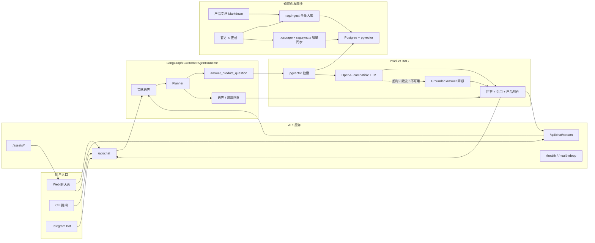

# Architecture

本文档描述当前 XXYY Ask 的业务架构。当前实现聚焦产品客服 RAG：基于产品文档和官方 X 更新回答产品问题；账户、订单、私有交易记录、交易哈希、池子查询、泛 MEV/链上取证和投资建议等问题走边界或澄清回复。

## 当前业务架构

## 说明

- `CustomerAgentRuntime` 是当前问答编排核心：先做策略边界，再由 planner 在产品问答、澄清和边界之间选择路线。
- 产品问答和操作步骤会检索 `Postgres + pgvector`，再调用 OpenAI-compatible chat completion 生成回答。
- 当前只注册 `answer_product_question` 业务工具；交易分析、池子查询、链上取证和 MCP adapter 暂不接入运行面。
- LLM 超时、限流、模型路由不可用或返回不可用答案时，会降级为本地 grounded answer。
- 知识库由产品文档和官方 X 更新组成，支持全量入库和 X 增量同步。
- Web UI 支持流式回答、引用展示、产品知识库附件和基础聊天体验。
- 当前目标不包含用户侧人工接管或业务动作执行；无法自动回答的问题应返回清晰边界或澄清问题。
