# Architecture

本文档描述当前 XXYY Ask 的业务架构。当前实现聚焦产品客服 RAG：基于产品文档和官方 X 更新回答产品问题；账户、订单、交易记录、MEV/夹子检测和投资建议等问题仍走边界回复。

## 当前业务架构

```mermaid
flowchart LR
  subgraph Entrances["用户入口"]
    Web["Web 聊天页"]
    Cli["CLI 提问"]
    FutureChannels["未来渠道<br/>Telegram / 站内入口"]
  end

  subgraph Api["API 服务"]
    ChatApi["/api/chat"]
    StreamApi["/api/chat/stream"]
    FeedbackApi["/api/feedback"]
    HealthApi["/health / /health/deep / /ops"]
  end

  subgraph Chat["ChatService"]
    Classifier["意图分类"]
    ProductRoute["产品问答 / 操作步骤"]
    BoundaryRoute["边界问题直接回复"]
  end

  subgraph Rag["RAG 回答"]
    Retriever["pgvector 检索"]
    Llm["OpenAI-compatible LLM"]
    Fallback["Grounded Answer 降级"]
    Response["回答 + 引用 + 附件"]
  end

  subgraph Knowledge["知识库与同步"]
    ProductDocs["产品文档 Markdown"]
    XUpdates["官方 X 更新"]
    Ingest["rag:ingest 全量入库"]
    SyncX["x:scrape + rag:sync:x 增量同步"]
    PgVector["Postgres + pgvector"]
  end

  subgraph Ops["反馈与运维"]
    UserFeedback["用户正负反馈"]
    FeedbackStore["rag_feedback"]
    DeepHealth["Deep Health"]
    OpsSummary["Ops Summary"]
    Evaluation["RAG 评测"]
  end

  subgraph Planned["未完成能力"]
    MultiTurn["多轮对话"]
    TxHash["交易哈希夹子检测"]
    Screenshot["夹子信息与截图"]
    Tickets["工单与人工接管"]
    Channels["多渠道接入"]
  end

  Web --> ChatApi
  Web --> StreamApi
  Cli --> ChatApi
  FutureChannels -.-> ChatApi

  ChatApi --> Classifier
  StreamApi --> Classifier
  Classifier --> ProductRoute
  Classifier --> BoundaryRoute

  ProductRoute --> Retriever
  Retriever --> PgVector
  Retriever --> Llm
  Llm --> Response
  Llm -.->|超时 / 限流 / 不可用| Fallback
  Fallback --> Response
  BoundaryRoute --> Response
  Response --> ChatApi
  Response --> StreamApi
  ChatApi --> Web
  StreamApi --> Web

  ProductDocs --> Ingest
  XUpdates --> Ingest
  XUpdates --> SyncX
  Ingest --> PgVector
  SyncX --> PgVector

  Web --> FeedbackApi
  FeedbackApi --> UserFeedback
  UserFeedback --> FeedbackStore
  FeedbackStore --> OpsSummary
  HealthApi --> DeepHealth
  DeepHealth --> OpsSummary
  PgVector --> OpsSummary
  PgVector --> Evaluation
  FeedbackStore -.->|补知识库 / 扩评测| ProductDocs

  Planned -.->|后续路线| Chat
```

## 说明

- `ChatService` 是当前问答编排核心：先做规则意图分类，再决定进入 RAG 检索或返回边界回复。
- 产品问答和操作步骤会检索 `Postgres + pgvector`，再调用 OpenAI-compatible chat completion 生成回答。
- LLM 超时、限流、模型路由不可用或返回不可用答案时，会降级为本地 grounded answer。
- 知识库由产品文档和官方 X 更新组成，支持全量入库和 X 增量同步。
- Web UI 支持流式回答、引用展示、视频附件和正负反馈。
- 交易哈希夹子检测、夹子截图、工单、人工接管、多轮对话和多渠道接入目前仍是未完成能力。
