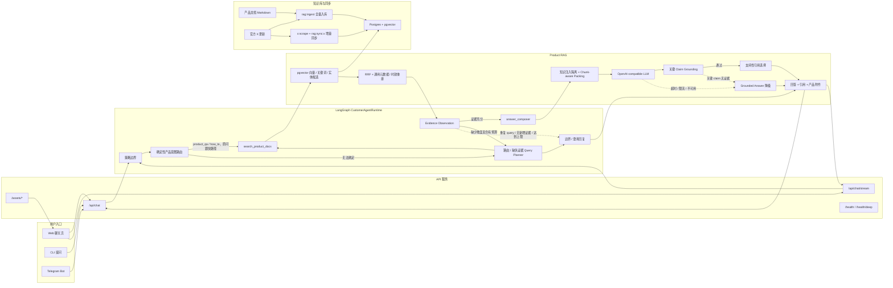
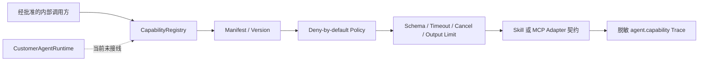

# Architecture

本文档描述当前 XXYY Ask 的业务架构。当前实现聚焦产品客服 RAG：基于产品文档和官方 X 更新回答产品问题；账户、订单、私有交易记录、交易哈希、池子查询、泛 MEV/链上取证和投资建议等问题走边界或澄清回复。

## 当前业务架构

## Capability Plane v0.1（尚未接入客服运行面）

`packages/agent-core` 另有独立的 `CapabilityRegistry`，为未来 Skill / MCP adapter 提供 transport-neutral manifest、精确授权和有界执行契约。它与当前 `ToolRegistry` 分离，尚未由 LangGraph、Planner、API、CLI 或 Telegram 创建和调用。

能力被注册不代表被授权，被授权也不代表会暴露给 Agent。外部写入和金融交易 manifest 必须声明确认与幂等要求，执行器会再次硬校验；当前没有任何实际 MCP/Skill、链上或交易能力注册。完整契约与后续接入顺序见 [capability-plane.md](capability-plane.md)。

## Read-only EVM Transaction Analysis Core v0.1（离线领域层）

`packages/transaction-analysis-core` 已建立框架无关的只读交易事实计算核心。它只消费 Zod 校验后的 normalized snapshot，使用 `bigint` 确定性生成执行状态、原生/ERC-20 资产变化、gas fee、timeline、Evidence、warnings 和 diagnostics。统一 Evidence/SkillResult 契约位于 `packages/shared`。

该包没有 RPC/Indexer/Explorer client，也不依赖 LangGraph、LLM、CapabilityRegistry 或 MCP。详细设计与 fixture 见 [transaction-analysis-core.md](transaction-analysis-core.md)。

## Allowlisted Read-only EVM Data Adapter v0.1（未接线数据边界）

`packages/evm-data-adapter` 在独立包中实现标准 JSON-RPC 数据获取与 snapshot 归一化。endpoint 只能来自启动配置；请求只能选择已配置 chain/provider。它验证 `eth_chainId`，禁止重定向和非显式 loopback HTTP，限制只读方法、batch、timeout、retry 和响应字节，并把多个 provider 的差异保留为 conflicts 与稳定 diagnostics。hex quantity 通过 `bigint` 直接转十进制，不经过有损 number。

该包没有真实 endpoint 配置，也未被任何 app、LangGraph、`ToolRegistry`、`CapabilityRegistry`、CLI 或 Telegram 引用，因此不会改变公开客服边界。它不是 MCP/Capability adapter，也不读取 trace 或 pool metadata；执行与 MEV observation 数据由权限更窄的独立 adapter 负责。离线组合/合成评测已由独立 harness 完成；真实 provider 运维、reviewed 主网评测和 Agent bridge 仍是后续阶段。详细设计见 [evm-data-adapter.md](evm-data-adapter.md)。

## Allowlisted EVM Execution Data Adapter v0.1（未接线执行数据边界）

`packages/evm-execution-data-adapter` 使用与基础 snapshot client 分离的 RPC schema，只允许固定 Geth `callTracer`、`eth_chainId`、精确 block 的 pool/factory `eth_getCode`，以及 `factory/token0/token1/fee/getPair/getPool` 六个 ABI selector。endpoint、header、factory 和 provider 只能由启动配置提供；运行时不能注入 URL、tracer、method 或 calldata。

adapter 把递归 call frame 迭代归一化为 250 节点、32 层、单 bytes 8 KiB 的扁平 trace；pool metadata 必须通过 protocol-specific factory allowlist、非空 code、排序 token、V3 fee 和 factory `getPair/getPool` 反查。最多四个 provider 生成 semantic fingerprint，等价值不产生伪冲突，差异保留为脱敏 conflict；结果可以直接进入 execution enrichment core。

该包同样没有真实 endpoint、生产 composition root、共享 QPS/熔断/缓存/metrics 或运行面引用。它没有注册 Capability/MCP，也不改变公开客服边界。详细设计见 [evm-execution-data-adapter.md](evm-execution-data-adapter.md)。

## EVM Execution Enrichment Core v0.1（未接线离线语义层）

`packages/evm-execution-enrichment-core` 消费现有 normalized snapshot、受限的扁平 call trace 和显式 pool metadata。它只用整数与 ABI 规则确定性提取已提交的 internal native transfer、Solidity `Error(string)` / `Panic(uint256)` / custom selector，以及 Uniswap V2/V3 单个 pool 的 swap balance delta。trace、log 和 pool metadata 都映射为统一 Evidence；缺失、畸形、来源不一致或无法安全判定的部分进入 coverage、warnings 和 diagnostics。

该包自身不获取 trace，不查询 pool/token，不做价格、路由、滑点、利润或 Sandwich 判定，也没有网络、LLM、LangGraph、Capability 或 MCP 依赖。独立 execution data adapter 已能生成它的输入，price-impact/Sandwich core 可以继续消费它输出的 directional swap，但这些包仍没有生产 composition root；公开运行面继续拒绝交易与链上分析请求。详细契约见 [evm-execution-enrichment.md](evm-execution-enrichment.md)。

## EVM Price Impact / Sandwich Detection Core v0.1（未接线离线 MEV 层）

`packages/evm-price-impact-sandwich-core` 消费最多 256 个同区块、同 pool directional swap，以及每笔交易前后的带来源 pool state、transaction actor token delta、coverage 和 source conflicts。V2 逐项复刻官方 `997/1000` quote；V3 只在单一 active tick range 内复刻 exact-input fee、sqrt-price 和 amount delta 舍入。所有金额、价格和 ppm 使用 `bigint` 与约分分数，不经过浮点。

Sandwich 判定使用 `confirmed | likely | unlikely | insufficient_data` 四态门禁。`confirmed` 必须同时具备相邻 front/victim/back 顺序、同一非 victim actor、方向反转、连续 pool state、受害者反事实损失、pool-token 正收益和精确 actor asset loop；缺 actor delta 最多为 `likely`，只有完整 coverage 和反例才可为 `unlikely`，来源冲突或不支持语义返回 `insufficient_data`。

该 core 不构建真实 block neighborhood，不获取 transaction-boundary archive state，不处理跨 tick/multi-hop/特殊代币，也不推断意图或扣除 gas/builder 成本。它没有 Capability/MCP/Agent/API/CLI/Telegram 引用，因此不会改变公开客服边界。详细设计见 [evm-price-impact-sandwich.md](evm-price-impact-sandwich.md)。

## Allowlisted MEV Observation Data Adapter v0.1（未接线数据边界）

`packages/evm-mev-observation-data-adapter` 使用启动时冻结的 chain/archive provider/pool allowlist，从目标交易的 canonical block 构建完整同 pool swap 顺序。专用 client 只允许标准 block、log、receipt 方法和固定 V2/V3 state selector；所有历史 state call 都使用带 `requireCanonical: true` 的 EIP-1898 block-hash reference，运行时不能注入 endpoint、method、calldata 或 block range。

V2 以 parent reserves 为起点，按 `Sync` / `Swap` 顺序重放 transaction-boundary state，并用 block-end reserves 闭合；V3 读取 parent `slot0`、active liquidity、tick spacing、有限 bitmap words 和两端 initialized tick，以 Swap event 重放单 active-range state，再与 block-end state 对账。receipt 中 token0/token1 Transfer 只计算 transaction `from` 的直接 raw delta，不做 router beneficiary 或多地址 actor 聚类。

每个 provider 独立生成完整 core input，并比较 block/order、swap、pool state 和 actor delta 语义指纹；分歧作为 source conflict 投影到 price-impact/Sandwich core，领域判断随即 fail closed。client 同时提供 provider-local QPS、并发、缓存、熔断、成本和脱敏 metrics 控制。该包仍没有真实 endpoint、环境变量、production composition root 或 Capability/MCP/Agent/API/CLI/Telegram 接线。详细设计见 [evm-mev-observation-data-adapter.md](evm-mev-observation-data-adapter.md)。

## EVM Chain Analysis Composition & Evaluation Harness v0.1（未接线离线组合层）

`packages/evm-chain-analysis-harness` 是现有 transaction、execution 和 MEV 包之上的唯一离线 composition root。它消费已经归一化/验证的对象，按 transaction、execution、observation、MEV 固定阶段调用确定性 core；chain/hash/block/index/pool/provider block 或 execution swap 语义不能闭合时阻止 MEV core。每个阶段保留 input/output fingerprint、coverage、diagnostics 和统一 Evidence，顶层再投影未来 `chain.inspect_transaction` / `chain.detect_sandwich` 的最小结构化结果及 refusal code。

同一包定义 synthetic/reviewed replay corpus、chain/protocol/router/data-state/tier coverage matrix，以及 precision、recall（包含 positive abstention）、false-positive/false-negative、unsupported rate、provider cost、expected match 和 byte determinism 报告。synthetic regression gate 只证明组合回归；internal readiness gate 强制 reviewed 样本量和更高质量阈值。当前六个合成 case 明确不能通过 internal readiness，不代表主网效果。

该 harness 不实例化 RPC adapter，不读取环境变量或 endpoint，也未被 app、LangGraph、`ToolRegistry`、`CapabilityRegistry`、CLI、Telegram 或 MCP 引用。未来能力契约不等于能力已注册；公开客服边界保持不变。详细设计见 [evm-chain-analysis-harness.md](evm-chain-analysis-harness.md)。

## Reviewed Replay & Production Readiness Control Plane v0.1（未接线）

`packages/evm-chain-analysis-readiness` 位于 harness 评测之上的离线治理和生产证据控制面。reviewable case 先经过确定性敏感信息扫描和 content-addressed intake，再由两个不同 reviewer hash 独立核对 source、重放、隐私和标签；只有一致批准的候选可 promotion。revision/supersession、retention/delete tombstone 和 export lineage 保证进入 harness 的 reviewed corpus 可以追溯，synthetic fixture 不能直接晋升为主网证据。

同一包定义只含 `secretref:` 的 provider descriptor、跨实例 budget lease/settlement、脱敏持久审计 event、共享 circuit state/coordinator interface、SLO/告警、故障演练、安全和 incident runbook evidence contract。综合 evaluator 把 governed corpus export、该 corpus 的 harness report 和生产证据闭合，并固定调用不可由 caller 弱化的 `internalReadinessQualityGate`，输出稳定的 `blocked | degraded | ready` 和逐项 reason。

readiness 契约包自身不实现 reviewer identity、数据库、worker 调度、secret manager、metrics/alerting 或真实 provider。独立的 `packages/evm-chain-analysis-control-store` 已实现可注入 client 的 Postgres 持久化层：不可变治理 artifact、authorization/revocation、retention job lease、哈希链 audit、budget window/lease/settlement/reconciliation 和 circuit history/head CAS。它不读取环境变量、不创建连接，也没有生产 grant、真实主网 corpus、worker deployment 或 provider endpoint；因此当前仍不会产生生产 `ready` 结论。两个包都未被任何 app、Agent、Capability、MCP、CLI 或 Telegram 引用。详细设计见 [evm-chain-analysis-readiness.md](evm-chain-analysis-readiness.md) 与 [evm-chain-analysis-control-store.md](evm-chain-analysis-control-store.md)。

## 说明

- `CustomerAgentRuntime` 是当前问答编排核心：先做策略边界；确定识别为 `product_qa` / `how_to` 的普通问题直接用完整原问题执行一次 `search_product_docs`，不增加 Planner 调用。模糊路由和证据不充分的复杂问题才调用 Planner。
- 产品运行面只注册检索工具。`search_product_docs` 负责检索、重排和返回安全 chunks；`observe` 按比较维度、引用和新增 chunk 判断证据是否充分；`answer_composer` 聚合去重后的 chunks 并调用 AnswerProvider，不再由一个工具同时检索和回答。
- 首次检索 query 固定为完整原问题。只有 observation 给出缺失维度后，Planner 才能改写后续 query；改写必须命中缺失维度、保持原问题范围以及时间/版本限定。原问题始终独立保留给引用选择和最终回答。
- loop 同时受 max steps、重复工具输入和无新增证据保护。不同 query 若返回同一批 chunk/引用，也会停止；已有部分证据时返回带引用的“不足以完整回答”，没有证据时返回澄清或知识不足，而不是继续循环。
- 产品问答和操作步骤会检索 `Postgres + pgvector`，再调用 OpenAI-compatible chat completion 生成回答。
- 正式检索将向量、全文关键词和实体候选按 rank 融合，再应用标题/模块覆盖、直接来源、时效与冲突元数据做通用重排；不依赖具体产品 case 的固定查询扩展。
- 检索结果不会原样进入模型：正文、标题、模块和章节先执行敏感信息脱敏与确定性 prompt injection 检测；角色覆盖、忽略规则、提示词泄露和伪造工具调用片段会被替换为隔离标记。正文随后用 JSON 字符串承载，避免知识文本突破资料边界。
- 上下文打包在总预算内为多个 chunk 公平保留空间，再按问题词、数字、完整句子、列表和限制/条件信号选择内容。只有无法继续拆分的单个内容单元才允许带省略号截短，并记录 included/omitted/quarantined/truncated 统计。
- 模型回答完成后执行本地 claim grounding，不增加第二次模型调用。每个关键陈述都要与安全知识片段在数字、支持/不支持极性和有效词项上对齐；失败时返回 deterministic grounded answer。成功时引用只从实际支撑 claim 的 chunk 生成，并用问题和回答选择相关 excerpt。
- 为避免流式 token 发出后无法撤回，answer provider 会先缓冲模型流、完成同一 grounding 校验，再发送原始有效 deltas 或安全降级回答。`status` 事件和公开 `ChatStreamEvent`/`ChatResponse` 契约保持不变；代价是 answer delta 的首包会晚于模型完成，但校验是本地线性计算，不引入额外网络往返。
- 当前客服 `ToolRegistry` 只注册 `search_product_docs` 业务工具；独立 Capability Plane、离线 EVM transaction/execution/MEV cores、三个未接线 RPC adapter、组合评测 harness、readiness 控制面和 Postgres control backend 都不会改变 Planner 的工具列表，交易分析、池子查询、链上取证和 MCP adapter 暂不接入运行面。
- LLM 超时、限流、模型路由不可用、非 JSON、不可用答案或 claim grounding 失败时，会降级为本地 grounded answer；embedding 对超时、429 和 5xx 做有界重试。
- 知识库按来源分为 `official_docs`（仅 `docs.xxyy.io`）、`x_updates`（仅 `x.com/useXXYYio`）和 `admin_verified`（客服群审核知识，当前为空）；支持全量入库和 X 增量同步。
- 图片 OCR、视频解析和官方 X 媒体会把原始媒体地址写入 chunk 元数据；被选为回答依据的 chunk 可同时返回相关截图、本地 MP4 或外部视频链接。
- Web UI 支持流式回答、引用展示、产品知识库附件和基础聊天体验。
- 当前目标不包含用户侧人工接管或业务动作执行；无法自动回答的问题应返回清晰边界或澄清问题。
