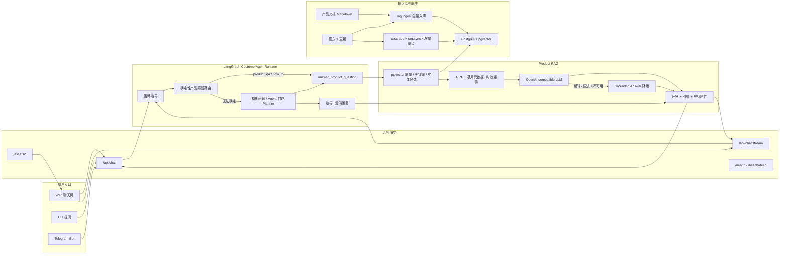

# Architecture

本文档描述当前 XXYY Ask 的业务架构。当前实现聚焦产品客服 RAG：基于产品文档和官方 X 更新回答产品问题；账户、订单、私有交易记录、交易哈希、池子查询、泛 MEV/链上取证和投资建议等问题走边界或澄清回复。

## 当前业务架构

## 说明

- `CustomerAgentRuntime` 是当前问答编排核心：先做策略边界；确定识别为 `product_qa` / `how_to` 的问题直接调用产品问答工具，避免 Planner 改写或丢失原问题；只有模糊问题和 Agent 自述再交给 Planner。
- 产品问答和操作步骤会检索 `Postgres + pgvector`，再调用 OpenAI-compatible chat completion 生成回答。
- 正式检索将向量、全文关键词和实体候选按 rank 融合，再应用标题/模块覆盖、直接来源、时效与冲突元数据做通用重排；不依赖具体产品 case 的固定查询扩展。
- 当前只注册 `answer_product_question` 业务工具；交易分析、池子查询、链上取证和 MCP adapter 暂不接入运行面。
- LLM 超时、限流、模型路由不可用、非 JSON 或不可用答案时，会降级为本地 grounded answer；embedding 对超时、429 和 5xx 做有界重试。
- 知识库按来源分为 `official_docs`（仅 `docs.xxyy.io`）、`x_updates`（仅 `x.com/useXXYYio`）和 `admin_verified`（客服群审核知识，当前为空）；支持全量入库和 X 增量同步。
- 图片 OCR、视频解析和官方 X 媒体会把原始媒体地址写入 chunk 元数据；被选为回答依据的 chunk 可同时返回相关截图、本地 MP4 或外部视频链接。
- Web UI 支持流式回答、引用展示、产品知识库附件和基础聊天体验。
- 当前目标不包含用户侧人工接管或业务动作执行；无法自动回答的问题应返回清晰边界或澄清问题。
