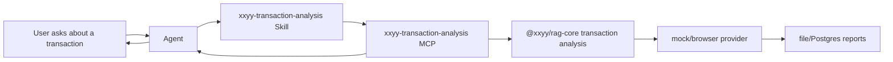

# Transaction Analysis MCP and Skill Design

## Goal

Package the existing transaction sandwich detection capability as an Agent-facing tool without weakening the current API, CLI, ops, report, and smoke-test paths.

The product-facing name is **交易夹子检测**. The longer documentation name is **交易哈希夹子检测**. The existing internal intent can remain `tx_sandwich_detection`.

## Recommendation

Use a hybrid shape:

- MCP carries the executable capability.
- Skill carries usage guidance, boundary rules, and answer style.

This keeps the chain forensics logic deterministic and reusable while giving Agents enough instruction to call it only in the right situations and explain results safely.

## Why MCP

Transaction analysis is not just prompt guidance. It starts browser automation, parses public explorers, queries XXYY pool trade windows, runs the sandwich analyzer, writes reports, and returns screenshots plus structured evidence.

That belongs behind a tool contract. MCP gives Agents a stable interface with typed inputs, typed results, errors, and report lookup. It also avoids duplicating the transaction analysis logic inside prompts or Agent-specific code.

## Why Skill

The tool alone cannot decide every conversational boundary. The Skill should teach Agents:

- Call the MCP only when the user provides one clear transaction hash or supported explorer link.
- Treat `unknown` as a bare EVM auto-detect mode, not as a real chain.
- Never claim support for unsupported chains.
- Do not provide investment advice.
- Explain `sandwiched`, `not_sandwiched`, and `inconclusive` as evidence-based conclusions, not guarantees.
- Preserve report links, screenshots, chain probe details, and failure reasons in user-facing answers.

## MCP Server

Proposed package:

`packages/tx-analysis-mcp`

Proposed server name:

`xxyy-transaction-analysis`

The server should reuse the existing `@xxyy/rag-core` transaction analysis modules instead of reimplementing browser or analyzer logic.

## MCP Tools

### `analyze_transaction`

Input:

```ts
{
  txHash: string;
  chain?: 'solana' | 'base' | 'ethereum' | 'bsc' | 'unknown';
  channel?: 'agent' | 'ops' | 'support';
}
```

Behavior:

- Parse transaction hashes and supported explorer links with existing parsing rules.
- Use `TX_ANALYSIS_PROVIDER`.
- Return `not_configured` when no real provider is enabled.
- For `unknown` EVM hashes, probe Base, Ethereum, and BSC in the existing order.
- Persist reports through the configured report store.

Output:

```ts
{
  status: 'success' | 'failure';
  result?: TxAnalysisResult;
  failure?: {
    reason: TxAnalysisUnavailableReason;
    message: string;
    metadata?: TxAnalysisFailureMetadata;
    reportUrl?: string;
  };
}
```

### `get_analysis_report`

Input:

```ts
{
  id?: string;
  txHash?: string;
  chain?: 'solana' | 'base' | 'ethereum' | 'bsc' | 'unknown';
}
```

Behavior:

- Read from the configured file or Postgres report store.
- Accept report id, transaction hash, or supported explorer link.
- Preserve the existing EVM case-insensitive and Solana exact-match semantics.

### `list_analysis_reports`

Input:

```ts
{
  chain?: 'solana' | 'base' | 'ethereum' | 'bsc' | 'unknown';
  status?: 'success' | 'failure';
  reason?: TxAnalysisUnavailableReason;
  reviewStatus?: 'open' | 'in_review' | 'closed';
  assignee?: string;
  limit?: number;
}
```

Behavior:

- Reuse the existing report index/store filters.
- Cap `limit` at the same maximum as the HTTP API.
- Return summary fields for support and ops triage.

## Skill

Proposed Skill name:

`xxyy-transaction-analysis`

The Skill should not execute browser work directly. It should describe when and how to call the MCP tools.

Core routing:

- If the user asks whether a specific transaction was sandwiched, call `analyze_transaction`.
- If the user gives multiple different transaction hashes, ask for one transaction at a time.
- If the user asks about wallet balance, private orders, account state, or trading advice, do not call the MCP.
- If the user asks about an old report or ops queue, use report lookup tools.

Answer style:

- Lead with chain, tx hash, verdict, confidence, and summary.
- Include report and screenshot links when available.
- Include front/user/back transaction evidence when present.
- For failures, show the exact reason and any useful metadata such as unsupported chain, unsupported explorer host, probe attempts, explorer URL, or XXYY pool URL.

## Data Flow



## Configuration

The MCP server should read the same root `.env` and environment variables as the API:

- `TX_ANALYSIS_PROVIDER`
- `TX_ANALYSIS_REVIEWER`
- `TX_ANALYSIS_REPORT_STORE`
- `TX_ANALYSIS_BROWSER_*`
- `TX_ANALYSIS_SCREENSHOT_*`
- `OPENAI_*` when reviewer is enabled
- Postgres settings when the report store is Postgres

Shell environment variables still take precedence over `.env`.

## Error Handling

The MCP server should preserve existing failure reasons:

- `not_configured`
- `provider_unavailable`
- `invalid_reference`
- `unsupported_chain`
- `browser_verification_required`
- `tx_not_found`
- `tx_failed`
- `tx_pending`
- `pool_not_found`
- `target_trade_not_found`
- `screenshot_unavailable`
- `timeout`

It should not flatten these into generic exceptions. Agent-facing clients need the reason field to produce useful support answers.

## Testing

Focused tests:

- MCP tool schemas reject malformed input.
- `analyze_transaction` routes supported chains and `unknown` correctly.
- Failure reasons are returned as structured `failure` objects.
- Report lookup reuses file and Postgres report store semantics.
- Skill fixture examples demonstrate correct tool usage and boundary refusal.

Regression tests:

- Keep existing `tx-hash`, `browser-tx-analysis`, `tx-analysis-report-store`, API, and ops smoke coverage.
- Add a local MCP smoke command that can run the existing `docs/tx-analysis-smoke-samples.example.json` samples through the MCP server.

## Rollout

1. Add MCP package that reuses current transaction analysis modules.
2. Add a small CLI or script for MCP smoke testing.
3. Add the Skill with examples and boundary rules.
4. Keep `/api/tx-analysis`, `/api/chat`, CLI, and ops pages unchanged.
5. Once MCP is stable, Agent integrations should prefer MCP over direct HTTP calls.

## Non-goals

- Do not replace the existing HTTP API.
- Do not move browser provider logic into the MCP package.
- Do not add unsupported chains as part of this packaging work.
- Do not turn `unknown` into a real chain.
- Do not expose private user/account/order data.
