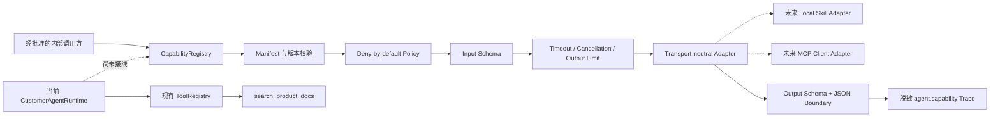

# MCP / Skill Capability Plane v0.1

## 当前状态

Capability Plane v0.1 是未来 MCP 和本地 Skill 的安全执行基础，当前只作为 `packages/agent-core` 的独立库存在。它没有接入 `CustomerAgentRuntime`、Planner、Web / Telegram / CLI 客服入口，也没有启动 MCP server 或注册链上、交易能力。

现有客服运行面继续使用 `ToolRegistry`，生产业务工具仍只有 `search_product_docs`。Capability 的“被描述”“被注册”“被授权”和“被 Agent 暴露”是四个独立步骤，任何一步都不会隐式完成下一步。

## 设计

代码职责：

- `capability-contract.ts`：manifest、调用上下文和 adapter 契约。
- `capability-policy.ts`：精确 grant 和默认拒绝策略。
- `capability-registry.ts`：注册目录、执行门禁、资源边界与审计。
- `index.ts`：只导出稳定的能力平面契约，不改变公开 Chat API。

## Manifest

每个能力必须显式声明：

| 字段                   | 约束                                                                 |
| ---------------------- | -------------------------------------------------------------------- |
| `id`                   | 小写、带命名空间，例如 `chain.inspect_transaction`                   |
| `version`              | 精确 semver；授权不会自动跨版本继承                                  |
| `source`               | `builtin`、`skill` 或 `mcp`，且必须和 adapter 来源一致               |
| `risk`                 | `low`、`moderate`、`high` 或 `critical`                              |
| `sideEffect`           | `none`、`external_read`、`external_write` 或 `financial_transaction` |
| `dataScopes`           | 能力所读取或处理的数据范围；必须非空且无重复                         |
| `requiresConfirmation` | 外部写入和金融交易必须为 `true`                                      |
| `idempotency`          | 外部写入和金融交易必须为 `required`                                  |
| `limits`               | 单次调用的超时和最大 JSON 输出字节数                                 |

Registry 在注册时重新解析并冻结 manifest。MCP discovery 或 Skill 元数据未来只能形成“待审核定义”，不得未经本地风险标注和版本固定就自动注册。

## 授权模型

默认 policy 没有 grant，因此即使能力已经注册，也不能执行。一个 grant 必须同时覆盖以下维度：

- 精确 capability id、version 和 source；
- 调用 channel 和 principal；
- 不低于 manifest 的最大风险等级；
- side effect；
- manifest 声明的全部 data scopes。

`channel`、`principal` 和 `userConfirmed` 是可信组合层传入的安全上下文，不能由 Planner、模型输出或未经认证的请求字段直接指定。未来确认流程还必须把确认记录绑定到具体 capability、版本和输入摘要；v0.1 的布尔字段只定义执行门禁，不等于已经实现用户确认 UI 或防重放凭证。

外部写入和金融交易还有独立于可替换 policy 的执行器硬门禁：必须带用户确认和至少 8 字符的 idempotency key。当前 v0.1 只强制 key 存在并将其传给 adapter；真正的跨进程去重、结果重放和 exactly-once 语义必须由未来 adapter 或持久化协调器实现，在完成前不得开放写能力。

## 单次调用流程

1. 校验 channel、principal、request id、确认状态和可选取消信号。
2. 查找精确注册的 capability；未注册调用也会产生不含输入值的审计记录。
3. 执行 policy；默认拒绝，且在拒绝时不会解析业务输入或调用 adapter。
4. 对已授权请求执行 input schema。
5. 取 manifest 限制和 Registry 全局限制中的更小值作为实际超时与输出上限。
6. 调用 adapter，并向其传递组合后的 `AbortSignal`。超时或上游取消时 Registry 会立即停止等待；adapter 契约要求同时停止底层网络或进程工作。
7. 校验 output schema，确认结果可 JSON 序列化并检查 UTF-8 字节数。
8. 返回结果，只把固定元数据、值类型、字段/元素数量和大小摘要写入 `agent.capability` trace。

## 审计与隐私

`agent.capability` 可以记录 capability id/version/source、channel、principal、风险、副作用、data scope 数量、policy 结果、有效 timeout/output limit、是否提供确认和幂等 key，以及输入/输出的值类型、字段/元素数量和输出字节数。字段名也视为调用方可控数据，不进入 trace。

禁止记录：

- capability 输入值或输出值；
- idempotency key 原文；
- session / user id、Authorization、私钥或 API key；
- RPC 返回的完整交易、钱包或账户数据；
- 错误堆栈和 adapter 内部凭证。

## 未来能力分层

下表是规划分类，不代表已经注册或可调用：

| 能力示例                    | 建议风险 / 副作用                | 数据范围                        | 当前状态                                          |
| --------------------------- | -------------------------------- | ------------------------------- | ------------------------------------------------- |
| `chain.inspect_transaction` | moderate / external read         | `chain.public`                  | 基础/enrichment core + RPC adapter 已实现；未注册 |
| `chain.detect_sandwich`     | moderate / external read         | `chain.public`                  | 未实现、未注册                                    |
| `trade.analyze_execution`   | high / external read             | `chain.public`, `market.public` | 未实现；仍需禁止投资建议                          |
| `account.read_private`      | high / external read             | `account.private`               | 长期不进入公开客服                                |
| `trade.submit_transaction`  | critical / financial transaction | `wallet.private`                | 不在当前产品范围                                  |

第一批真正接入的能力应只选公开数据、只读、可离线评测的链上分析，并先限于内部或管理 channel。底层标准 RPC allowlist、snapshot provenance、基础交易事实和离线 trace/revert/swap 语义已经分别实现，但仍缺受控 trace/pool metadata adapter、生产 provider 配额/观测、Skill/Capability adapter、授权 grant、显式 bridge 和端到端评测；Capability Plane 本身不会让 Planner 自动发现或执行能力。
