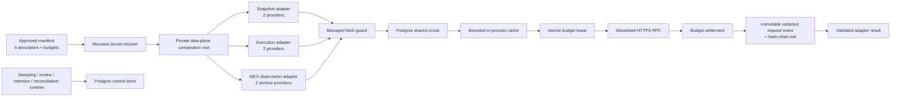

# Chain Analysis Provider & Worker Data Plane

## 状态与边界

`@xxyy/evm-chain-analysis-data-plane` 和私有 `@xxyy/chain-operations-cli` 是 Goal 20B-2 的仓库侧执行面。它们把三个既有只读 adapter 接到同一套受控运行边界：

- `snapshot`：transaction、receipt、chain id 与 block；
- `execution`：`callTracer` 与 allowlisted Uniswap V2/V3 pool/factory metadata；
- `mev_observation`：archive block neighborhood、transaction-boundary pool state 与 actor token delta。

每个 adapter 必须恰好配置两个不同 provider organization、failure domain、endpoint secret reference 和 provider id。MEV provider 必须声明 archive；其余两类禁止伪称 archive requirement。配置只保存 `secretref:`，endpoint 和 header value 只能在进程启动时从受控挂载解析。

该执行面仍然是私有的：它没有注册 Capability、MCP、Skill、LangGraph tool，也没有被 API、Web、Telegram、Product RAG 或客服 Agent 导入。仓库中的 schema、fake provider 和本地 PostgreSQL 验证不等于真实 provider 已采购、生产 worker 已部署或 readiness 已通过。

## 请求路径



一次真实 HTTP attempt 的固定顺序为：

1. 重新验证 binding、transport、runtime/manifest fingerprint、header 名值边界和 HTTPS endpoint，并精确匹配启动时已解析的 endpoint；运行时请求不能注入 URL。
2. 从 PostgreSQL 读取共享 circuit。缺失、数据库失败、`open` 或被其他实例占用的 `half_open` 都在网络请求前拒绝。
3. 只对不含 `latest/pending/safe/finalized` 的 JSON-RPC body 尝试短期缓存。私有 CLI 同时限制 512 entries 与 64 MiB aggregate body；缓存错误旁路并告警，不把 endpoint、body 或 credential 写入日志。
4. 按 provider policy 原子预留 request、RPC call、最大 response bytes、cost unit 和 global concurrency。
5. 调用原 adapter 已有的 timeout、abort、method、batch、redirect 和 response schema 边界；managed transport 另将 JSON body 限制为 4,194,304 个字符、64 层/100,000 节点，response stream 限制为 65,536 个 chunk。
6. 按流读取响应，在超过批准字节上限的首个 chunk 立即取消，不先把无界 body 读入内存；随后构造实际用量 settlement。
7. 在同一 PostgreSQL 事务中结算 lease、持久化 content-addressed `provider_request` event，并把 manifest/provider configuration fingerprint、request fingerprint、结果与用量的脱敏摘要链接进 `provider_control` hash chain。
8. 根据任意非 2xx HTTP、transport failure 或成功结果，用 generation/fingerprint CAS 更新共享 circuit；并发 stale generation 最多重读重试三次。
9. 只有预算结算、持久审计和 circuit 更新全部成功，调用方才收到 provider 响应。

因此 budget backend、audit sink 或 circuit backend 不可用时不会退化成“只靠本地计数继续请求”。HTTP 失败可以由另一个独立 provider 形成 partial/failover 结果，但来源冲突仍由 adapter 保留并让后续分析 fail closed。

## Manifest

`productionDataPlaneManifestSchema` 固定并重新验证 content-addressed `manifestId` / `manifestFingerprint`：

- chain id `1`；
- 一个 owner hash；
- 三类 adapter 各两个 provider binding，共六条；
- descriptor、public runtime configuration fingerprint 和 budget policy 的精确 lineage；
- provider organization/failure-domain hash；
- endpoint secret reference 与 credential header → secret reference 映射；
- request timeout、retry、response bytes、cache TTL、circuit threshold/open interval；
- budget lease 必须覆盖单次 request timeout，并至少留下 5 秒原子结算窗口；
- execution factory allowlist 和 MEV pool allowlist。

`fingerprintProviderRuntimeConfiguration()` 对 adapter、chain、provider、region、archive requirement、organization/failure domain、cost、endpoint ref 和 header/ref mapping 做规范化 fingerprint。descriptor 的 `configurationFingerprint` 必须与其相等。任何 credential value、URL、API key 或姓名都不能进入 manifest。

配置生成方应使用 readiness 包中的：

- `createProviderDeploymentDescriptor()`；
- `createProviderBudgetPolicy()`；
- `fingerprintProviderRuntimeConfiguration()`。

先以待批准 public binding 计算 configuration fingerprint，再生成最终 descriptor 和完整 manifest，最后用 `productionDataPlaneManifestSchema` 验证。不要手工填随机 SHA 来冒充 owner/provider 审批。

## Secret mount

`CHAIN_DATA_PLANE_SECRET_DIR` 是 secret manager、Vault/Kubernetes CSI 或等价系统挂载出的根目录。引用：

```text
secretref:providers/snapshot/primary/endpoint
```

映射为：

```text
${CHAIN_DATA_PLANE_SECRET_DIR}/providers/snapshot/primary/endpoint
```

resolver 会：

- 重新验证 `secretref:`，拒绝 `..`、空段和 traversal；
- 对 root 与目标执行 `realpath`，目标必须仍在 trusted root 内；
- 最终以 `O_NOFOLLOW` 打开 bounded regular file；
- endpoint 生产环境只接受 HTTPS，禁止 URL credential 和 fragment；
- header value 限制 8 KiB 并拒绝 CR/LF；
- 同一 adapter 两个 secret reference 最终解析到相同 endpoint 时拒绝启动。

composition root 还会把六条 resolved binding 的完整 fingerprint 和 header 名集合重新与 manifest
比对，避免调用方把另一份已通过 schema 的 Provider 配置拼接进当前 manifest。

secret 可以含 endpoint path/query 中的 token，但不会出现在 manifest、metric、alert、audit 或 CLI summary。客服服务容器不得挂载该目录。

## Runtime 配置

私有 CLI 不自动读取项目 `.env`：

| 变量                                        | 约束                                                           |
| ------------------------------------------- | -------------------------------------------------------------- |
| `CHAIN_CONTROL_DATABASE_URL`                | 与 Product RAG 分离；远程必须 `sslmode=verify-ca/verify-full`  |
| `CHAIN_DATA_PLANE_MANIFEST_FILE`            | 受控、bounded JSON manifest                                    |
| `CHAIN_DATA_PLANE_SECRET_DIR`               | provider secret mount root                                     |
| `CHAIN_DATA_PLANE_INSTANCE_ID_HASH`         | 持有 `provider_operator` grant 的 service-account hash         |
| `CHAIN_RECONCILIATION_WORKER_ID_HASH`       | 默认同 data-plane instance；必须持有 `provider_operator` grant |
| `CHAIN_RETENTION_WORKER_ID_HASH`            | 独立 retention service-account hash                            |
| `CHAIN_DATA_PLANE_ALLOW_INSECURE_LOCALHOST` | 仅测试；`NODE_ENV=production` 时强制拒绝                       |

`DATABASE_URL` 或 `POSTGRES_DB/HOST/PORT` 仅用于比较 Product RAG database identity；若相同，CLI 拒绝运行。

## 部署顺序

### 1. Provision 与迁移

先按 [Chain Control Production Provisioning Operations](chain-control-provisioning-operations.md) 取得真实 receipt 并验证 audit/lineage，再用 DDL identity 执行：

```bash
pnpm chain:control:migrate
```

运行时 identity 不应拥有 DDL 权限。

### 2. 验证 secret 与 manifest

```bash
pnpm chain:ops:validate
```

输出只有 chain、adapter/provider id、数量和 schema version，不输出 endpoint。

### 3. 初始化 budget 与 circuit

```bash
pnpm chain:ops:bootstrap
```

它为六个 binding 安装 content-addressed active budget policy，并把每个共享 circuit 初始化为 generation `0 / closed`。完全相同的重试幂等；active policy 漂移、不同 circuit 初态、grant 缺失或数据库失败均拒绝。替换 policy 必须走显式 expected-fingerprint 运维流程，bootstrap 不会静默覆盖。

### 4. 双 Provider 探测

```bash
pnpm chain:ops:probe -- --transaction-hash 0x...
```

探测会同时走两个 snapshot provider、共享控制和持久审计。先使用已知公开、已 final 的 Ethereum 交易哈希；检查一个 provider timeout/429 时另一个来源仍可返回 partial，两个来源语义不同则必须保留 conflict。

### 5. Worker

以下命令是适合 CronJob/受控 scheduler 的单次执行单元：

```bash
pnpm chain:worker:reconcile
pnpm chain:worker:retention
```

- reconciliation 使用 `FOR UPDATE SKIP LOCKED` 把过期未结算 budget lease 变成按完整 reserved usage 计费的保守 `cancelled` settlement，未知请求不会被当作零成本；
- retention 领取一条到期 job，在 lease 内生成 expiry decision，并对已 promotion case 写 tombstone。

`createProductionWorkerRuntime()` 还提供 sampling 和 single-owner review 的 claim/handler/complete/fail 边界。handler 失败只持久化稳定 error code 的 SHA-256，不保存 provider body 或异常原文。真实 sampling collector、manifest/candidate handoff 和 owner review 输入属于 Goal 20B-3；在该 handler 完成和部署前，不要启动这两个 worker，也不能把空队列或 contract fixture 当作 reviewed corpus。

## Metrics 与告警

managed transport 只发出脱敏结构：

- adapter、chain、provider id；
- cache hit；
- request fingerprint；
- result code、duration；
- requests/RPC calls/response bytes/cost units。

告警 code 包含：

- `budget_control_unavailable` / `budget_rejected`；
- `circuit_backend_unavailable` / `circuit_open`；
- `audit_sink_unavailable`；
- `provider_failure`；
- `cache_unavailable`。

私有 CLI 把 metric/alert JSON line 写到 `stderr`，业务结果写到 `stdout`。生产部署必须由日志/metrics agent 路由到实际时序库和 on-call channel，并验证通知；仅看到本地 JSON line 不能生成 `productionAlertingControlEvidence.notificationTestPassed=true`。

## 验证与剩余生产条件

仓库验证：

```bash
pnpm --filter @xxyy/evm-chain-analysis-data-plane typecheck
pnpm --filter @xxyy/evm-chain-analysis-data-plane test
pnpm --filter @xxyy/chain-operations-cli typecheck
pnpm --filter @xxyy/chain-operations-cli test
pnpm check
```

可选 PostgreSQL integration test 只接受专用空数据库：

```bash
CHAIN_DATA_PLANE_INTEGRATION_DATABASE_URL=postgresql://... \
  pnpm exec vitest run packages/evm-chain-analysis-data-plane/src/postgres.integration.test.ts
```

它会二次执行 migration、写入一条 contract-only `provider_operator` grant、初始化六个 binding，
验证一次真实预算结算、不可变 request event 和 provider-control hash chain。测试数据库必须由执行者
在测试后显式删除；该结果不构成 production grant、Provider 或 readiness evidence。

测试覆盖双独立 provider/secret 约束、预算与审计、cache、共享 circuit、backend unavailable fail-closed、worker fencing、CLI 配置与公开运行面隔离。生产仍必须另行提供并验证：

- 两家真实独立 provider、archive 能力、credential rotation 和供应商配额；
- 目标数据库最小权限、TLS、加密、备份、WORM/保留和访问审计；
- scheduler、metrics collector、alert route 与通知演练；
- 真实 sampling/review handler；
- 长期 SLO 和 Goal 20B-4 故障演练。

这些外部条件没有落地前，Goal 20B-2 只能记为“仓库执行面完成、生产激活待执行”，不能继续声称 Goal 20B-3 corpus 或 `ready` 已完成。
