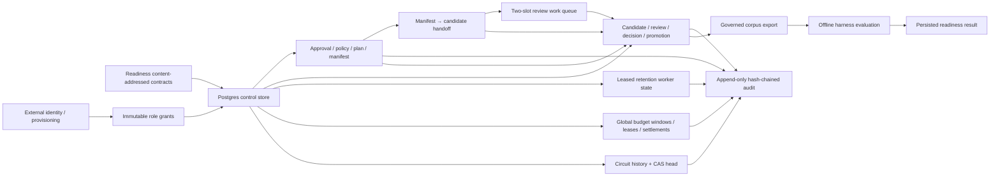

# Chain Analysis Governance Persistence & Shared Provider Controls v0.1

## 当前状态

`@xxyy/evm-chain-analysis-control-store` 是 `@xxyy/evm-chain-analysis-readiness` 的独立 Postgres backend。它把已存在的 content-addressed sampling、reviewed replay 治理和 provider-control 契约落到事务、行锁、generation fence、不可变 artifact 表和哈希链审计中，但不改变任何客服运行面。

当前包：

- 不读取环境变量，也不创建数据库连接；composition root 必须显式注入 `PgControlClientLike`；
- 不访问 RPC、Indexer、Explorer、HTTP、secret manager 或 provider endpoint；
- 不导入 Agent、LangGraph、Capability、MCP、API、CLI 或 Telegram；
- 不包含真实主网样本、真实 reviewer 身份、生产 grant、provider credential 或生产 readiness evidence；
- 未被 `apps/*`、`agent-core` 或 `rag-core` 引用，公开客服的链上问题边界保持不变。

它是可部署 backend 实现，不是“已经部署并通过生产评审”的证明。包级 contract-only fixture、fake PostgreSQL client 和迁移测试不能作为主网 corpus、故障演练或 `ready` attestation。

## 设计位置



职责边界保持明确：readiness 包负责 schema 和纯状态机，本包负责 Postgres 一致性；未来 composition root 才负责连接池、secret manager、worker 调度、metrics/alerting 和真实 provider。

## 数据模型

### 不可变 artifact

以下表只允许 `INSERT`，migration 为其安装 `BEFORE UPDATE OR DELETE` 拒绝触发器：

- reviewer/worker/operator authorization 与 revocation；
- replay candidate、review、governance decision、promotion 和 tombstone；
- reviewed corpus export 与 readiness attestation；
- sampling source approval、policy、plan、sample manifest、manifest/candidate handoff 和 coverage run；
- audit event；
- budget policy、lease 和 settlement；
- circuit state history。

每次读取 JSONB payload 后都会重新执行原始 Zod schema；每次业务写入还会重新调用 readiness 纯函数，例如 `reviseReviewedReplayCandidate()`、`recordReviewedReplayDecision()`、`promoteReviewedReplayCandidate()`、`settleProviderBudgetLease()` 和 `transitionSharedProviderCircuitState()`。因此数据库中即使出现字段篡改、旧指纹复用或非法状态跳转，也不会被当成有效 artifact。

### 可变协调状态

只有协调所需的小型 head/state 表允许受控更新：

| 状态                   | 更新约束                                                               |
| ---------------------- | ---------------------------------------------------------------------- |
| audit head             | stream 行锁；sequence 必须从前一值加一                                 |
| retention job          | `queued → running → completed`；worker lease 和过期重领                |
| sampling intake job    | `queued → running → succeeded/failed`；lease、attempt 与 planner retry |
| review work job        | `queued/failed → running → succeeded/failed`；reviewer/attempt fence   |
| active budget policy   | advisory lock + generation/fingerprint CAS                             |
| budget window counters | policy/window 行锁；reserved 与 used 分开对账                          |
| circuit head           | provider identity 行锁 + expected generation/state fingerprint CAS     |

完整 artifact 始终保留在不可变历史表，head 只指向当前版本。

## 治理写入流程

1. 外部受控 provisioning 先写入 content-addressed role grant。可用角色包括 submitter、independent reviewer、publisher、retention worker、sampling planner/worker、readiness attestor 和 provider operator。
2. 每个业务事务按 artifact id 或业务唯一键获取 transaction-scoped advisory lock，并在操作时间点检查有效 grant 和未生效/已生效 revocation。
3. 普通 candidate 写入会验证初始创建或完整 revision/supersession 转移，并同时创建唯一 retention job；sampling handoff 还会重新读取 manifest、重算完整 handoff，并原子创建初始 candidate 与两个 review work slot。
4. review 写入强制 actor hash 等于 reviewer hash、reviewer 不等于 submitter，并以 `(candidate, reviewer)` 唯一约束阻止同一身份改写决定；handoff candidate 还必须持有匹配 `jobId + attemptCount` 的有效 lease。
5. decision 从当前持久化 reviews 重新计算；promotion 必须引用一个已持久化、仍能由当前 review 集合重算出的 `approved` decision。
6. corpus export 从所有 promotion/tombstone 构建确定性 snapshot；readiness attestation 必须引用已持久化的精确 export fingerprint。
7. artifact 与对应 audit link 在同一事务提交；任一步失败都回滚。

`recordAuthorization()` 是 provisioning 存储原语，不是公开自助授权 API。生产部署必须在包外保护其调用权限、映射真实身份并保管 grant 审批证据。本仓库没有创建任何生产 grant。

## Retention worker contract

candidate 入库后生成一个唯一 job：

- `claimRetentionJob()` 只选择已到期的 queued job 或 lease 已过期的 running job，使用 `FOR UPDATE SKIP LOCKED` 支持多 worker 竞争；
- worker 必须持有操作时间有效的 `retention_worker` grant；
- `completeRetentionJob()` 要求同一 worker 在 lease 到期前完成；
- 未晋升 candidate 写入 `retention_expired` decision，结果为 `expired_unpromoted`；
- 已晋升 candidate 同时生成不可变 `retention_expired` tombstone，结果为 `tombstoned`。

worker 调度、重试频率和告警由未来部署层负责，本包不启动后台进程。

## Sampling evidence intake contract

`createPgEvmChainAnalysisSamplingStore()` 实现采样 artifact 和 job 的事务边界：

1. `sampling_planner` 依次记录 source/retention approval、policy 和 plan；每次写入都会读取上游 artifact 并重新执行 readiness 纯函数，不能跳过 approval anchor 或自行改写 quota。
2. plan insert 与所有稳定 slot 对应的 queued job 在同一事务提交；同一 slot 只有一个 job，默认最多尝试三次。
3. `claimIntakeJob()` 只领取已进入采样窗口、未过期、attempt 未耗尽的 queued job 或 lease 已过期的 running job，并用 `FOR UPDATE SKIP LOCKED` 支持多个 worker。
4. `sampling_worker` 只能在自己的有效 lease 内 `completeIntakeJob()` 或 `failIntakeJob()`；失败只能由 planner 显式 `retryIntakeJob()`。
5. 完成前重新校验 manifest 的 plan/policy/approval/slot/stratum/source/time anchor，并检查 slot 与 `(chainId, transactionHash)` 唯一性。
6. manifest insert、job success、manifest audit 和 completion audit 同事务提交；coverage run 从数据库中的 plan/approval/manifests 重新执行纯 evaluator 后保存。
7. `candidate_submitter` 显式调用 `recordCandidateHandoff()`；store 从持久化 manifest 重算 chain/transaction/block、dimension、source/scan/retention/time lineage，不能信任调用方自哈希对象。
8. handoff、revision-1 candidate、唯一 retention job、两个确定性 review job、`candidate_recorded` 和 `sampling_candidate_handoff_recorded` 在同一事务提交；manifest/candidate 一对一，相同 handoff 幂等，target deviation 不会触发筛除。

approval/policy/plan/manifest/handoff/run 是 append-only artifact；job 是协调状态。control store 不采集 payload、不调用 provider，也不会后台自动触发 handoff 或 review；未来受控部署层必须显式提交已归一化并扫描的 replay payload。contract-only tests 不能代表来源或法律评审完成。详细设计见 [Mainnet Sampling Plan & Evidence Intake Control Plane](evm-chain-analysis-sampling.md)、[Sampling Manifest → Reviewed Replay Candidate Handoff](evm-chain-analysis-sampling-handoff.md) 与 [Independent Review Work Queue](evm-chain-analysis-review-work-queue.md)。

## Independent review work contract

每个 sampling handoff candidate 有且只有两个 content-derived slot。`createPgEvmChainAnalysisReviewWorkStore()` 提供 claim、fail、get 和 list：

- claim 在操作时间验证 `independent_reviewer` grant，以 `FOR UPDATE SKIP LOCKED` 选择 queued、可重试 failed 或 lease 已过期的 running job；
- candidate submitter、已经提交 review 的 reviewer，以及正在持有或已经完成同一 candidate 另一槽的 reviewer 都会被排除；
- reviewer advisory lock、partial unique index 和 replay review 唯一约束共同封闭并发重复领取；
- claim 增加 attempt，lease 不得越过 candidate retention expiry；失败保存 hashed reason、释放 lease，attempt 达上限后不再领取；
- handoff review 必须把 claim 返回的 `jobId + attemptCount` 传给 `recordReview()`，旧 generation、过期 lease、错误 reviewer 或 candidate 全部 fail closed；
- review insert、job success、`review_recorded` 与 `review_job_completed` 使用同一事务和 audit chain head；
- 非 handoff candidate 保持原有直接 review 契约，不能伪造 work lease 混入 handoff 路径。

两个 review 发生争议时不自动增加第三槽；既有 `disputed`/`rejected` 与 revision/supersession 流程继续作为唯一治理路径。完整状态机见 [Independent Review Work Queue](evm-chain-analysis-review-work-queue.md)。

## 跨实例 provider controls

### Budget

`createPgEvmChainAnalysisProviderControlStore()` 实现 readiness 的 `ProviderBudgetCoordinator`：

- active policy 使用 budget advisory lock 和 generation fence 安装；
- reservation request fingerprint 唯一，重试返回同一 lease；
- active policy 行锁串行化同一 budget 的窗口初始化、全局并发统计和 reserved usage 更新；
- aggregate `used + reserved + requested` 不能超过 cost/request/bytes/RPC limits；
- settlement 对 lease 唯一，先释放 reserved，再把实际 usage 计入原窗口；
- `reconcileExpiredLeases()` 用 `FOR UPDATE SKIP LOCKED` 把未结算过期 lease 归档为零用量 `cancelled` settlement。

数据库不可用、active policy 不匹配、窗口额度不足、全局并发耗尽或对账失配都会抛出明确错误并回滚，不能退化为 provider-local 非原子额度。

### Shared circuit

每个 `(adapter, chain, provider)` 保存不可变 state history 和一个 current head：

- 初始化只能从 generation `0` 开始；
- transition 必须保留 provider identity、时间向前且 generation 只增加一次；
- `compareAndSet()` 同时检查 expected generation 和 expected state fingerprint；
- retry 若已经到达完全相同的 next state，会幂等返回；
- stale caller 在写 history 前失败，head 更新还会再次使用 SQL `WHERE generation + fingerprint` fencing。

## 审计链

治理和 provider control 使用两个独立 stream。append 时锁定 stream head，事件包含 sequence、previous event fingerprint、actor hash、entity fingerprint、payload fingerprint 和时间，再对完整 link 计算 event fingerprint。event 表拒绝 update/delete；`readAudit()` 会重新解析每个事件并验证从 sequence 1 开始的全部 predecessor link。

审计 payload 只保存 hash、状态、计数和稳定 reason，不保存 endpoint、credential 或原始 provider body。生产环境仍需额外配置数据库加密、最小权限、备份/WORM 策略、访问审计和故障告警；本实现本身不能宣称这些运维控制已通过。

## 使用与验证

本包没有 CLI 或环境配置入口。未来内部 composition root 需要显式：

1. 创建并注入 PostgreSQL Pool/transaction client；
2. 在部署 migration 阶段调用 `migrateEvmChainAnalysisControlStore()`；
3. 通过受保护 provisioning 写入实际 authorization；
4. 独立运行 sampling、review、retention 和 expired-lease reconciliation worker；
5. 把 backend unavailable、预算耗尽和 stale CAS 纳入真实故障演练。

当前验证命令：

```bash
pnpm --filter @xxyy/evm-chain-analysis-control-store typecheck
pnpm exec vitest run packages/evm-chain-analysis-control-store/src
pnpm check
```

一次性真实 PostgreSQL 验证还执行了完整 migration、偏差 handoff 的 candidate/retention/two-review-slot 原子写入、两个 reviewer 独立 claim/complete、同 reviewer 第二槽排除、三次失败终止领取、hash-chain audit、幂等重试和 append-only update 拒绝；临时数据库随后删除。该结果不等于生产部署或真实主网 evidence。

下一阶段仍需：由有权人员完成真实 sampling source/legal-retention 审批，部署真实 identity/数据库/worker，配置 secret manager、metrics/alerting 和 provider failover，按 plan 采集并双人复核主网 corpus，运行故障演练与长期 SLO，再由 readiness evaluator 生成可独立审计的结论。满足这些条件前不得接入 Capability 或客服运行面。
