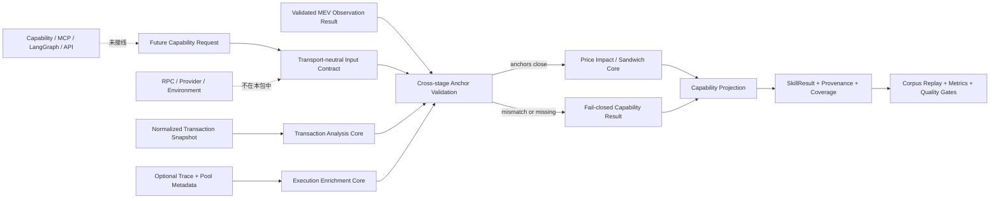

# EVM Chain Analysis Composition & Evaluation Harness v0.1

## 当前状态

`@xxyy/evm-chain-analysis-harness` 是未接线、不执行网络 I/O 的离线组合与评测包。它把已经归一化的 transaction snapshot、可选 execution trace/pool metadata、已经由受控 adapter 验证的 MEV observation，以及现有 price-impact/Sandwich core 组合成一个可重放 pipeline。

该包同时定义未来 `chain.inspect_transaction` 与 `chain.detect_sandwich` 的最小 transport-neutral 请求和结构化结果，但没有注册 Capability manifest、授权 grant、MCP tool、LangGraph tool 或任何 API/CLI/Telegram 入口。公开客服对交易哈希、Explorer、池子、链上取证和 MEV 请求仍返回既有边界或澄清回复。

## 设计目标

- 一个明确的 composition root，阶段之间只传递已校验对象，不隐式联网或补值；
- 对 transaction、execution、observation、MEV 四个阶段保留状态、diagnostic 和输入/输出指纹；
- chain、transaction、block、index、pool 和 canonical provider block 不能闭合时 fail closed；
- 合成回归与人工审核样本分层，禁止用合成 fixture 冒充主网质量；
- 统一计算 precision、recall、abstention、coverage、unsupported rate、provider cost 与 byte determinism；
- 在任何运行面接线前，用显式质量门禁证明是否具备内部试用条件。

## 离线数据流



pipeline 是同步纯函数。它只调用现有确定性 core，不实例化 `evm-data-adapter`、`evm-execution-data-adapter` 或 `evm-mev-observation-data-adapter`，也不读取 endpoint、环境变量或密钥。

## 输入契约

顶层输入只包含：

- `requests`：最多各一个 `chain.inspect_transaction`、`chain.detect_sandwich`；
- `snapshot`：已经归一化且带 provenance 的 EVM transaction snapshot；
- `execution`：可选的 bounded call trace 和/或经过验证的 pool metadata；
- `observation`：可选的完整 `EvmMevObservationDataAdapterResult`。

未来能力请求的最小 public-chain 输入为：

| Capability                  | 必填字段                                             |
| --------------------------- | ---------------------------------------------------- |
| `chain.inspect_transaction` | `chainId`, `transactionHash`                         |
| `chain.detect_sandwich`     | `chainId`, `transactionHash`, non-zero `poolAddress` |

请求的 chain/hash 必须与 snapshot 请求锚点一致。schema 使用 strict object，因此 endpoint、provider id、header、RPC method、calldata、tracer、block range、账户标识或任意私有参数都不能混入运行时输入。

## 阶段与组合门禁

阶段固定按以下顺序出现：

| 阶段          | 输入                            | 输出                             | 未提供时行为                      |
| ------------- | ------------------------------- | -------------------------------- | --------------------------------- |
| `transaction` | snapshot                        | transaction facts                | 必跑；缺关键事实为 insufficient   |
| `execution`   | snapshot + trace/pool metadata  | internal transfer/revert/swap    | `not_provided`，不伪造 trace 结论 |
| `observation` | 已验证 adapter result           | 原样保留 observation/provenance  | detection 请求为 `not_provided`   |
| `mev`         | observation 中的 analysis input | price impact + Sandwich 四态结果 | 缺输入或锚点冲突时 `blocked`      |

MEV core 运行前必须验证：

1. observation chain、target transaction 和 pool 与 detection request 一致；
2. snapshot transaction/block number 与 observation target block 一致；
3. transaction index 一致；
4. canonical observation provider 的 block hash 与 snapshot block hash 一致；
5. 如果 execution 已解出同 pool target swap，其协议、token、direction 和 pool delta 必须与 observation 相同；同一目标交易出现多个同 pool swap 时不猜测对应关系；
6. provider conflict 保留到下游 core，使 core 输出 source-conflict/insufficient 结论，不通过多数投票消除分歧。

任何身份或语义锚点不一致都会阻止 MEV core，并返回稳定 composition diagnostic。pipeline 不尝试从其他阶段推断或修复缺失字段。

## 组合状态矩阵

| 场景                               | Inspection                     | Detection                                  | Pipeline 语义                    |
| ---------------------------------- | ------------------------------ | ------------------------------------------ | -------------------------------- |
| 完整、闭合、支持的输入             | `success`                      | core 的可用结果                            | 全部 capability 成功时 `success` |
| transaction 缺失/不可用            | `insufficient_data`            | `insufficient_data`                        | 全部不可用时 `insufficient_data` |
| transaction 或 execution 有缺口    | `partial` 或 insufficient      | 保守降级                                   | 至少一个结果可用时 `partial`     |
| observation 缺失                   | 不受影响                       | `observation_missing`                      | detection 不运行 MEV core        |
| 跨阶段 chain/hash/block/index 冲突 | 不受影响或按自身 coverage 输出 | `composition_conflict`                     | MEV stage `blocked`              |
| provider semantic conflict         | 不受影响                       | `provider_conflict` + insufficient verdict | 分歧进入 core，不输出高置信结论  |
| 不支持的 route/token/tick 语义     | 不受影响                       | `unsupported_semantics`                    | 不把 unsupported 当成 negative   |

顶层状态由 capability 结果确定：全部 success 才是 `success`；至少一个 capability 仍可用则为 `partial`；全部都不可用才是 `insufficient_data`。

## Provenance 与确定性

输出保留：

- 完整 transaction、可选 execution、原始 observation 和可选 MEV core 结果；
- 每个阶段的 state、status、diagnostic code、input fingerprint 和 output fingerprint；
- 覆盖 transaction/execution/observation/MEV 的统一 Evidence 引用；
- `inputFingerprint`：规范化 pipeline 输入的 SHA-256；
- `replayFingerprint`：输入指纹、阶段状态及阶段输出指纹的 SHA-256；
- provider request/cost、各阶段 coverage 和稳定 refusal code。

Canonical JSON 递归按 Unicode code unit 比较 ASCII key，不依赖系统 locale；同一输入连续运行两次必须产生相同 canonical bytes。评测报告还包含精确 corpus fingerprint 和 report fingerprint，修改输入、标签、维度、结果或报告内容都会改变对应指纹。

## Future Capability 输出与拒绝契约

`chain.inspect_transaction` 只投影公开交易事实：执行状态、transaction analysis 状态、trace coverage，以及 token transfer、internal transfer 和 swap 数量。

`chain.detect_sandwich` 只投影 chain/hash/pool、observation/core 状态、coverage、price-impact ppm、四态 verdict 和拒绝原因。它不输出投资建议、意图归因、用户身份、钱包私有数据或交易执行动作。

稳定拒绝原因包括：

- `transaction_data_insufficient`；
- `execution_data_partial`；
- `observation_missing` / `observation_insufficient`；
- `provider_conflict`；
- `composition_conflict`；
- `unsupported_semantics`；
- `pool_not_observed`（为未来 adapter 投影预留，当前 composer 不主动生成）。

`success` 结果不能携带 refusal code，`insufficient_data` 必须至少携带一个 refusal code。

## Replay Corpus 治理

corpus 最多 500 个 case，每个 case 固定包含输入、期望 pipeline/capability 状态、期望 verdict、ground truth、coverage dimensions、privacy 声明和 review metadata。

样本严格分层：

| Tier        | 用途                        | 强制条件                                                                  |
| ----------- | --------------------------- | ------------------------------------------------------------------------- |
| `synthetic` | 协议、状态机和确定性回归    | synthetic address policy、generator version、无凭证、无私有数据           |
| `reviewed`  | 主网误报/漏报与内部就绪评测 | public-chain policy、review time、hashed reviewer id、原始 payload hashes |

reviewed case 不能声明 synthetic address policy；任何 case 都必须显式声明不含 credential 和 private data。当前仓库只有六个合成回归 case，没有伪造 reviewed 样本，也不据此声称主网质量。

coverage matrix 固定按以下维度汇总 case 数、pipeline 状态和 provider cost：

- chain；
- protocol；
- router；
- data state；
- corpus tier。

## 指标定义

Sandwich prediction 映射为：`confirmed | likely -> positive`、`unlikely -> negative`、`insufficient_data/无 verdict -> abstain`。unsupported 是单独的 coverage 状态，不会被计为 negative。

| 指标                    | 定义                                                                 |
| ----------------------- | -------------------------------------------------------------------- |
| precision               | `TP / (TP + FP)`                                                     |
| recall                  | `TP / (TP + FN + positive abstention)`                               |
| classification coverage | 正负标注 case 中实际给出 positive/negative 的比例                    |
| unsupported rate        | detection case 中输出 unsupported semantics 的比例                   |
| expected match          | 实际 capability/status/diagnostic/verdict 与 case 期望完全一致的比例 |
| byte determinism        | 每个 case 连续运行两次 canonical bytes 完全一致的比例                |
| provider cost           | observation adapter 已记录 cost unit 的总和与每 case 平均值          |

recall 显式把 positive abstention 放进分母，避免系统通过大量弃权虚高召回率。所有比例使用整数 ppm 和向下取整，不使用浮点阈值比较。

## 质量门禁

包内提供两套配置：

### Synthetic regression gate

- 至少一个 case；
- byte determinism = 100%；
- expected match = 100%；
- 不把合成样本的 precision/recall 当成内部就绪证明。

### Internal readiness gate

- 至少 20 个 case，其中至少 10 个 reviewed；
- precision 至少 95%，recall 至少 90%；
- classification coverage 至少 95%；
- false positive 为 0，false negative 最多 1，positive abstention 最多 1；
- unsupported rate 最多 10%；
- byte determinism 与 expected match 均为 100%；
- V2/V3、provider conflict 和 allowlisted router 达到最低覆盖数量；
- 平均 provider cost 不超过配置阈值。

当前六个 synthetic cases 可以通过 regression gate，但会因 reviewed case、样本量、coverage、recall、classification coverage 和 unsupported rate 等条件明确无法通过 internal readiness gate。这是预期行为。

## 合成回归基线

当前 test-only corpus 覆盖：

- V2 confirmed；
- V3 unlikely；
- provider conflict 下的 positive abstention；
- unsupported aggregator route；
- observation 缺失；
- 带 execution trace/pool metadata 的 inspection。

固定基线为 6 cases、100% byte determinism、100% expected match、0 false positive、0 false negative、2 positive abstentions、1 unsupported prediction。它只验证组合和指标实现，不替代人工审核主网 corpus。

## 运行面隔离

本包不得：

- 读取环境变量、真实 endpoint、provider credential 或任意网络资源；
- 实例化三个 RPC adapter 或选择 provider；
- 注册 Capability manifest/grant 或修改 `CapabilityRegistry`；
- 被 `agent-core`、`rag-core`、API、CLI、Telegram、Web 或 LangGraph 引用；
- 暴露 MCP server/tool；
- 改变公开客服边界。

验证命令：

```bash
pnpm --filter @xxyy/evm-chain-analysis-harness typecheck
pnpm exec vitest run packages/evm-chain-analysis-harness/src
pnpm check
```

## 后续工作

独立的 [Mainnet Sampling Plan & Evidence Intake Control Plane](evm-chain-analysis-sampling.md) 已定义来源/保留 approval、覆盖 strata、quota slots、public-chain manifest 和 gap evaluator；[Sampling Manifest → Reviewed Replay Candidate Handoff](evm-chain-analysis-sampling-handoff.md) 已用 target-agnostic contract 闭合 manifest/candidate anchor、source/scan/retention lineage 与原子 Postgres 写入；[Single-owner Review Work Queue](evm-chain-analysis-review-work-queue.md) 已为每个 handoff candidate 创建一个带 RBAC、lease/attempt fence 和原子 review/audit 完成的 slot；readiness/control-store 已实现证据与持久化控制，[Provider & Worker Data Plane](chain-data-plane-operations.md) 已实现仓库侧双 Provider/shared-control composition。当前仍没有真实审批、真实 owner、主网 reviewed case、已部署 control store、真实 provider credential 或运维 evidence。

下一阶段不是直接接入客服，而是由 owner 完成真实来源/法律/保留审批和自动验证，部署现有 shared-control data plane，再按已定义 plan 实际采集、重放和复核公开主网样本，验证 metrics/alerting 与安全演练，并让 governed corpus 实际通过 internal readiness gate。

只有 reviewed corpus、真实 provider 安全运维、内部授权、Capability adapter 和运行面安全审查全部通过，才考虑在内部/管理 channel 受限注册链上能力。公开客服入口仍需独立产品与安全决策。
