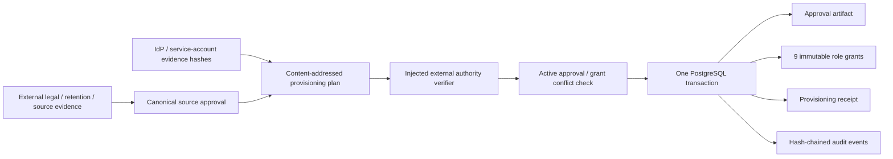

# Chain Analysis Production Approval & Identity Provisioning

## 当前状态

本文档描述 v0.14b2b2a / Goal 20A 的仓库侧 provisioning boundary。它提供可部署的契约和 Postgres 原子写入流程；需要第二名真实人员、组织审批系统和生产环境的实际激活已拆分为 v0.14b2b2b / Goal 20B Release Gate。

```text
goal_20a_repository_boundary: completed
goal_20b_production_activation: deferred_single_owner
external_authority_verifier_configured: false
real_source_legal_retention_approval: unapproved
real_organization_identities_verified: false
real_authorization_grants_recorded: false
production_provisioning_receipt_persisted: false
```

测试中的 hash、approval、identity 和 verifier 全部是 `contract-only` 输入，只证明 schema、事务和 fail-closed 行为，不是法律意见、真实审批、真实人员或生产授权。

## 单人开发决策

当前项目只有一名实际参与者，无法真实满足两名独立 approver/reviewer。产品负责人已明确选择：

- Goal 20A 以“仓库侧安全边界完整、验证通过、默认未激活”为完成标准；
- Goal 20B 作为真实链上能力上线前的延期 Release Gate，不阻塞知识库 Agent、MCP/Skill 设计等非生产激活工作；
- 不通过同一人控制多个账号伪装独立审批；
- Goal 20B 完成前不启动真实 sampling worker、不写入生产 receipt、不声明 production ready。

## 目标与边界

Goal 19 已确认 Ethereum chain `1`、Uniswap V2/V3、`public_rpc + official_explorer_export`、90 天保留期、双 Provider、私有控制面和职责 owner。Goal 20A 负责把其中的来源/法律/保留决定和组织身份安全转换为默认 fail-closed 的 control-store artifacts：

- 只接收 SHA-256 evidence/principal fingerprints，不接收姓名、邮箱、证件、endpoint、credential 或 secret；
- approval 必须通过既有 `mainnetSamplingSourceApprovalSchema`，包含至少两个不同 approver、法律/保留/来源 evidence、有效期和 public-only 数据边界；
- identity plan 必须覆盖全部八类治理角色，其中 `independent_reviewer` 需要两个不同身份，因此总计九个 principal；
- plan 固定 Goal 19 已确认的四类 owner baseline，并逐角色校验 `product_owner`、`platform_operations`、`technical_owner` 责任域；
- 每个 principal 只获得一个角色，approval identities 与 runtime principals 完全分离；
- plan application 与 external verification 由两个不同 approver 完成；
- 外部权威验证失败、活动 approval/grant 漂移、数据库或审计失败时全部 fail closed；
- 公共 governance/sampling store 不暴露直接 grant 或 source approval 写入；包内 artifact writer 只能由已验证的 production provisioning 事务使用；
- 不接入 Agent、Capability、MCP、API、CLI、Telegram 或 Product RAG。

本包不能判断一个 SHA-256 是否真的来自公司 IdP、法律审批系统或工单系统。因此生产 composition root 必须注入真实 `ProductionProvisioningAuthorityVerifier`；仓库没有提供默认 verifier，也不会把“格式正确”解释为“有权批准”。

## 固定身份模型

| Role                   | Identity kind              | Owner domain          | 数量 | 职责分离要求                        |
| ---------------------- | -------------------------- | --------------------- | ---- | ----------------------------------- |
| `candidate_submitter`  | `platform_service_account` | `platform_operations` | 1    | 不得成为 reviewer                   |
| `governance_publisher` | `controlled_human_account` | `product_owner`       | 1    | 不得兼任 readiness attestor         |
| `independent_reviewer` | `controlled_human_account` | `product_owner`       | 2    | 两个 principal/evidence 必须不同    |
| `provider_operator`    | `platform_service_account` | `platform_operations` | 1    | 不得批准 readiness policy           |
| `readiness_attestor`   | `controlled_human_account` | `technical_owner`     | 1    | 只引用 persisted evidence           |
| `retention_worker`     | `platform_service_account` | `platform_operations` | 1    | 使用独立、可撤销 worker grant       |
| `sampling_planner`     | `controlled_human_account` | `product_owner`       | 1    | 不得复核自己规划产生的样本          |
| `sampling_worker`      | `platform_service_account` | `platform_operations` | 1    | 只执行受 plan/slot/lease 约束的采集 |

九个 principal hash 和九个 identity evidence hash 必须分别唯一；法律、保留、来源和身份 evidence 也不能复用同一个 fingerprint，principal 与 evidence 必须引用不同记录。`provisionedByHash` 与 `verifiedByHash` 必须来自 approval 的独立 approver 集合、彼此不同，并且不能出现在 runtime principal 集合中。授权有效期不得晚于 source/legal/retention approval 的有效期。

## Artifact 流程



### 1. Plan

`createProductionProvisioningPlan()` 固定并验证：

- `targetChainIds = ["1"]`；
- `protocols = ["uniswap_v2", "uniswap_v3"]`；
- `sourceKinds = ["official_explorer_export", "public_rpc"]`；
- `retentionDays = 90`；
- owner baseline 固定为 governance/legal/retention → `product_owner`、provider operations → `platform_operations`、readiness policy → `technical_owner`；
- 九个单角色、唯一 principal 的 identity assignments；
- approval 和 authorization 的共同有效期；
- content-addressed plan、approval 和 authorization lineage。

production approval name、retention policy id 和 authority system id 会拒绝明显的 `test`、`fixture`、`example`、`placeholder` 等标记。这只是防止误用，不能替代外部真实性验证。

### 2. External verification

外部系统生成 content-addressed `ProductionProvisioningVerificationClaim`，绑定：

- 精确 plan fingerprint；
- authority system id；
- verifier principal hash；
- verification evidence hash；
- verification time。

`createPgEvmChainAnalysisProductionProvisioningStore()` 在访问数据库前调用注入的 verifier。verifier 抛错时返回稳定的 `provisioning_verification_failed`，不会开始事务或写入任何 artifact。传给 verifier 的对象是 clone，verifier 不能改变后续持久化内容。

### 3. Transactional apply

外部验证通过后，store 在一个事务中：

1. 对 plan id、approval schedule 和全部治理 role schedule 获取 transaction-scoped advisory lock，所有底层 approval/grant 写入使用同一组调度锁以关闭预检竞态窗口；
2. 对相同 plan 的已有 receipt 做完整 fingerprint 幂等校验；
3. 查询操作时间仍有效的所有 source approvals 和 governance grants；
4. 发现任何不属于当前 plan 的 active artifact，或计划内 grant 在首个 receipt 产生前已被撤销时，以 `provisioning_conflict` 回滚；
5. 写入或复用精确 source approval；
6. 写入或复用九个精确、content-addressed authorization；
7. 写入包含完整 hash lineage 的 immutable provisioning receipt，并以规范化关联表和外键逐一锚定九个 authorization；
8. 为 approval、每个 grant 和 receipt 追加同一 governance hash chain。

receipt 表安装 append-only trigger；重复执行同一个 plan 仍会重新调用外部 verifier，然后返回同一个 receipt。数据库、fingerprint、审计或 insert 任一步失败都会回滚完整事务。

### 4. Revocation

receipt 和原始 grant 是历史事实，不允许覆盖或删除。身份禁用、职责调整或权限回收时，由持有 `governance_publisher` grant 的受控身份调用既有 `revokeAuthorization()` 写入 content-addressed revocation；该操作与 provisioning 使用相同的 role schedule lock，避免“预检通过后、receipt 提交前”插入撤销的竞态，并追加 `authorization_revoked` 审计事件。后续授权检查在撤销时间起 fail closed；尚未产生 receipt 的 plan 不能复用已撤销 grant。恢复权限必须重新走真实 evidence、外部验证和新 plan，不能修改旧 receipt。

## Goal 20B 真实激活所需输入

当前仍缺少且不得由代码生成：

- 两名有权、互相独立的 approver principal hashes；
- 法律评审、90 天保留评审和两类来源审批的真实 evidence fingerprints；
- approval name、retention policy id、有效起止时间；
- 四个 service account 和五个受控人工账号的稳定 principal/identity evidence fingerprints；
- 组织 approval/IdP 系统对应的 verifier 实现与 verification evidence；
- 已迁移、最小权限、加密并纳入备份审计的独立生产 PostgreSQL。

这些输入只能通过受保护的运维通道进入未来 composition root，不能提交到仓库、`.env`、日志或聊天记录。真实 receipt 必须从部署后的 store 读取并独立核对 audit chain；Markdown 勾选、测试 fixture 或本地 fake client 不能替代。

## 验证

确定性测试覆盖：

- 固定 chain/protocol/source/retention baseline；
- 九 principal、单角色、identity-kind、owner-domain 和四眼分离；
- principal/evidence 跨类别不复用；
- plan/verification/receipt 的 content addressing 与 lineage；
- external verifier 失败前零数据库写入；
- 公共 governance/sampling store 无 grant/source-approval bootstrap 入口；
- active approval/grant 漂移、预先撤销与并发调度冲突时事务回滚；
- grant 撤销使用共享 role schedule lock、append-only revocation 和治理审计；
- approval、九 grants、receipt 和 audit 的原子写入；
- 幂等重试、append-only migration 与运行面隔离。

仓库侧还使用一次性临时 pgvector/PostgreSQL 验证了 migration 二次执行、owner baseline 持久化、1 approval / 9 grants / 1 receipt / 9 normalized lineage、幂等重读、governance publisher 撤销、撤销后授权 fail closed，以及包含 revocation 的 12 事件审计链；临时数据库与脚本已删除。该验证仍只使用 `contract-only` 输入，不是生产审批、组织身份或主网 evidence。

```bash
pnpm exec vitest run packages/evm-chain-analysis-control-store/src/production-provisioning-contracts.test.ts
pnpm exec vitest run packages/evm-chain-analysis-control-store/src/production-provisioning-store.test.ts
pnpm check
```

Goal 20A 的仓库交付在上述验证通过后完成。真实 evidence、identity、verifier 和 PostgreSQL receipt 都存在前，Goal 20B 保持 `deferred_single_owner`，不得进入真实采样或声明 production ready。
