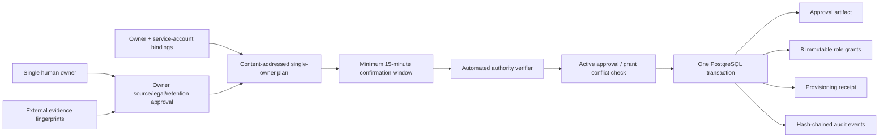

# Chain Analysis Production Approval & Identity Provisioning

## 当前状态

本文档描述 v0.14b2b2a / Goal 20A 的仓库侧 provisioning boundary，以及后续采用的单 owner 治理修订。它提供可部署的契约和 Postgres 原子写入流程；真实生产环境、Provider、审批 evidence 和主网 corpus 仍属于 v0.14b2b2b / Goal 20B。

```text
goal_20a_repository_boundary: completed_single_owner_profile
goal_20b_production_activation: pending_owner_execution
governance_mode: single_owner
human_owner_count: 1
repository_provisioning_cli: implemented
repository_ed25519_verifier: implemented
external_authority_verifier_configured: false
real_source_legal_retention_approval: unapproved
real_identity_bindings_verified: false
real_authorization_grants_recorded: false
production_provisioning_receipt_persisted: false
```

测试中的 hash、approval、identity 和 verifier 全部是 `contract-only` 输入，只证明 schema、事务和 fail-closed 行为，不是法律意见、真实审批、真实人员或生产授权。

## 单 owner 治理决策

当前项目由一名真实 owner 维护，因此治理模型明确采用 `single_owner`，不再要求第二名真人，也不通过同一人控制多个账号伪装组织独立性：

- 一个受控人工 principal 同时承担 `sampling_planner`、`governance_publisher`、`independent_reviewer` 和 `readiness_attestor`；角色 grant 仍分别记录、到期和撤销；
- `candidate_submitter`、`sampling_worker`、`provider_operator` 和 `retention_worker` 使用四个不同的平台服务账号；
- candidate 必须由服务账号提交，再由唯一人工 owner 复核；owner 仍不能复核自己作为 submitter 创建的 candidate；
- 来源、法律和 90 天保留由 owner 一次批准，精确 provisioning plan 必须等待至少 15 分钟，再由自动 authority verifier 校验签名、证据、策略和 fingerprint；
- 自动 verifier 是机器控制，不被描述为第二名审批人；它不能复用 owner 或 runtime principal，也不能替代 owner 的业务判断；
- readiness 仍只能引用 persisted evidence 并运行 canonical evaluator；缺少 evidence、Provider、数据库、演练或质量门禁时继续 fail closed。

该模型降低了多人职责分离带来的保护，因此使用确认冷静期、自动验证、服务账号隔离、不可变 receipt、哈希链审计、最小权限和显式回滚作为补偿控制。未来增加真实协作者后，可以再引入可选的多人复核策略，但它不再是当前产品上线的硬前置条件。

## 目标与边界

Goal 19 已确认 Ethereum chain `1`、Uniswap V2/V3、`public_rpc + official_explorer_export`、90 天保留期、双 Provider、私有控制面和责任 owner。Provisioning boundary 负责把这些决定安全转换为默认 fail-closed 的 control-store artifacts：

- 只接收 SHA-256 evidence/principal fingerprints，不接收姓名、邮箱、证件、endpoint、credential 或 secret；
- approval 必须通过 `mainnetSamplingSourceApprovalSchema`，包含唯一 owner、法律/保留/来源 evidence、有效期和 public-only 数据边界；
- identity plan 覆盖全部八类治理角色，形成八条 role binding 和八条 authorization；
- 四个人工角色绑定同一个真实 owner principal；四个执行角色分别绑定不同 service-account principal；
- plan 固定 Goal 19 已确认的 owner baseline，并逐角色校验 `product_owner`、`platform_operations`、`technical_owner` 责任域；
- plan application 只能由唯一 owner 发起，且必须经过不同的自动 authority verifier 和至少 15 分钟确认窗口；
- 外部验证失败、活动 approval/grant 漂移、数据库或审计失败时全部 fail closed；
- 公共 governance/sampling store 不暴露直接 grant 或 source approval 写入；
- 不接入 Agent、Capability、MCP、API、Telegram 或 Product RAG；唯一 app 入口是隔离的私有 `apps/chain-control-cli`，只负责 provisioning。

本包不能判断一个 SHA-256 是否真的来自受控人工账号、平台 IAM、审批记录或工单系统。因此生产 composition root 必须注入真实 `ProductionProvisioningAuthorityVerifier`。仓库提供 Ed25519 attestation/verifier 实现和独立 CLI，但可信 public key、authority id、机器策略 evidence 以及实际受控身份仍必须由部署方注入；格式正确或本地签名不等于有权批准。

## 固定身份模型

| Role                   | Identity kind              | Owner domain          | Principal            | 安全约束                            |
| ---------------------- | -------------------------- | --------------------- | -------------------- | ----------------------------------- |
| `candidate_submitter`  | `platform_service_account` | `platform_operations` | 独立 service account | 不得成为 reviewer                   |
| `governance_publisher` | `controlled_human_account` | `product_owner`       | 唯一 human owner     | 只发布 persisted governance 结果    |
| `independent_reviewer` | `controlled_human_account` | `product_owner`       | 唯一 human owner     | 必须与 candidate submitter 分离     |
| `provider_operator`    | `platform_service_account` | `platform_operations` | 独立 service account | 不自行生成 readiness 结论           |
| `readiness_attestor`   | `controlled_human_account` | `technical_owner`     | 唯一 human owner     | 只引用 persisted evidence           |
| `retention_worker`     | `platform_service_account` | `platform_operations` | 独立 service account | 使用可撤销 worker grant             |
| `sampling_planner`     | `controlled_human_account` | `product_owner`       | 唯一 human owner     | 固定 policy/plan，不执行自动采集    |
| `sampling_worker`      | `platform_service_account` | `platform_operations` | 独立 service account | 只执行受 plan/slot/lease 约束的采集 |

八个 identity evidence hash 表示八条独立角色绑定，因此必须唯一；四个人工绑定共享同一个 owner principal hash，四个服务账号 principal 必须彼此不同且不能等于 owner。法律、保留、来源和角色绑定 evidence 不能复用同一个 fingerprint，principal 与 evidence 也必须引用不同记录。

为保持现有 artifact 和数据库角色兼容，角色名仍为 `independent_reviewer`；在单 owner profile 中，`independent` 明确表示 reviewer 与自动 `candidate_submitter` principal 分离，不表示存在第二名真人。

自动 verifier 使用 plan 外的机器 principal。`verifiedByHash` 必须不同于 owner 和所有 runtime principal；`verificationEvidenceHash` 也必须与来源、法律、保留和角色绑定 evidence 分离。

## Artifact 流程



### 1. Plan

`createProductionProvisioningPlan()` 固定并验证：

- `governanceProfile.mode = "single_owner"`；
- `humanApproverCount = 1`、`humanReviewerCount = 1`；
- `minimumConfirmationDelaySeconds = 900`；
- `targetChainIds = ["1"]`；
- `protocols = ["uniswap_v2", "uniswap_v3"]`；
- `sourceKinds = ["official_explorer_export", "public_rpc"]`；
- `retentionDays = 90`；
- owner baseline 固定为 governance/legal/retention → `product_owner`、provider operations → `platform_operations`、readiness policy → `technical_owner`；
- 八条角色绑定、一个 human owner principal 和四个不同 service-account principal；
- approval 和 authorization 的共同有效期；
- content-addressed plan、approval 和 authorization lineage。

production approval name、retention policy id 和 authority system id 会拒绝明显的 `test`、`fixture`、`example`、`placeholder` 等标记。这只是防止误用，不能替代外部真实性验证。

### 2. 自动验证与二次确认

外部系统生成 content-addressed `ProductionProvisioningVerificationClaim`，固定 `verificationKind = automated_policy_verifier`，并绑定：

- 精确 plan fingerprint；
- authority system id；
- verifier service principal hash；
- verification evidence hash；
- verification time。

verification time 必须晚于 owner approval 至少 15 分钟，并且不得晚于 plan application。`createPgEvmChainAnalysisProductionProvisioningStore()` 在访问数据库前调用注入 verifier；失败时返回稳定的 `provisioning_verification_failed`，不会开始事务或写入 artifact。传给 verifier 的对象是 clone，verifier 不能改变后续持久化内容。

`apps/chain-control-cli` 的 `attest` 命令只使用执行机当前时间，不接受 caller-supplied `verifiedAt`；`apply` 对尚无 receipt 的 plan 额外要求实际时钟位于 `[provisionedAt, provisionedAt + 15 minutes)`。窗口外不能首次写入；已经成功写入的相同 plan 仍可安全幂等重读。Ed25519 signature 覆盖 canonical decision，public-key SPKI fingerprint 必须与 `verifiedByHash` 相同。

### 3. Transactional apply

自动验证通过后，store 在一个事务中：

1. 对 plan id、approval schedule 和全部治理 role schedule 获取 transaction-scoped advisory lock；
2. 对相同 plan 的已有 receipt 做完整 fingerprint 幂等校验；
3. 查询操作时间仍有效的 source approvals 和 governance grants；
4. 发现不属于当前 plan 的 active artifact，或计划内 grant 已撤销时，以 `provisioning_conflict` 回滚；
5. 写入或复用精确 source approval；
6. 写入或复用八个 content-addressed authorization；
7. 写入 immutable provisioning receipt，并以规范化关联表逐一锚定八个 authorization；
8. 为 approval、每个 grant 和 receipt 追加同一 governance hash chain。

receipt 表安装 append-only trigger；重复执行同一个 plan 仍会重新调用 verifier，然后返回同一个 receipt。数据库、fingerprint、审计或 insert 任一步失败都会回滚完整事务。

### 4. Revocation

receipt 和原始 grant 是历史事实，不允许覆盖或删除。身份禁用、职责调整或权限回收时，owner 使用 `governance_publisher` grant 调用 `revokeAuthorization()` 写入 content-addressed revocation。该操作与 provisioning 使用相同 role schedule lock并追加 `authorization_revoked` 审计事件。恢复权限必须重新走 evidence、二次确认、自动验证和新 plan，不能修改旧 receipt。

## Goal 20B 真实激活所需输入

当前仍缺少且不得由代码生成：

- 唯一 owner 的受控人工 principal hash；
- 法律评审、90 天保留评审和两类来源审批的真实 evidence fingerprints；
- approval name、retention policy id、有效起止时间；
- 四个 service account principal，以及八条角色绑定的 identity evidence fingerprints；
- 自动 authority verifier 的真实机器 principal、受保护 Ed25519 key、固定 authority id、部署策略和 verification evidence；
- 已迁移、最小权限、加密并纳入备份审计的独立生产 PostgreSQL；
- 双 Provider secret references、workers、metrics、告警、故障演练和真实主网 corpus。

这些输入只能通过受保护的运维通道进入 `apps/chain-control-cli`，不能提交到仓库、`.env`、日志或聊天记录。完整命令、时间窗口、文件权限、数据库隔离和验证步骤见 [Chain Control Production Provisioning Operations](chain-control-provisioning-operations.md)。真实 receipt 必须从部署后的 store 读取并核对 audit chain；Markdown 勾选、测试 fixture 或本地 fake client 不能替代。

## 验证

确定性测试覆盖：

- 固定 chain/protocol/source/retention 和 `single_owner` baseline；
- 一个 human owner principal 跨四个人工角色、四个隔离 service principal 和八条 role binding；
- 单 owner approval、15 分钟确认窗口和独立自动 verifier；
- principal/evidence 跨类别不复用；
- plan/verification/receipt 的 content addressing 与 lineage；
- external verifier 失败前零数据库写入；
- Ed25519 wrong-key、wrong-authority、结构一致但签名伪造时 fail closed；
- caller 不能覆盖 verification time，首次 apply 只能发生在 15 分钟 application window；
- active approval/grant 漂移、预先撤销与并发调度冲突时事务回滚；
- approval、八个 grants、receipt 和 audit 的原子写入；
- 幂等重试、append-only migration 与运行面隔离。

旧双人 profile 的一次性 PostgreSQL `1 approval / 9 grants` 验证已被本设计取代，不能作为当前生产放行证据。真实激活前必须针对单 owner profile 在目标 PostgreSQL 上重新验证 `1 approval / 8 grants / 1 receipt / 8 normalized lineage`、迁移幂等、撤销、fail-closed 和 audit chain。

迁移会拒绝仍含 slot ordinal `2`、9-grant receipt 或 ordinal `9` lineage 的旧数据库，不会自动删除或改写不可变治理历史。当前没有生产数据；若本地测试库存在旧 contract-only rows，应先确认并归档/重建测试库，再重新执行迁移。

```bash
pnpm exec vitest run packages/evm-chain-analysis-control-store/src/production-provisioning-contracts.test.ts
pnpm exec vitest run packages/evm-chain-analysis-control-store/src/production-provisioning-store.test.ts
pnpm --filter @xxyy/chain-control-cli test
pnpm check
```

仓库已在一次性真实 PostgreSQL 数据库验证 migration 二次执行、CLI plan/attest/apply/retry/receipt/verify、`1 approval / 8 grants / 8 normalized lineage / 1 receipt / 10 audit events` 和 append-only trigger，随后删除测试数据库。该结果证明 composition root 可执行，不是目标生产库 receipt 或真实 owner evidence。

仓库侧单 owner contract 完成不等于生产激活。真实 evidence、identity、verifier、Provider、PostgreSQL receipt、reviewed corpus 和 readiness attestation 存在前，不得启动对外链上能力或声明 production ready。
