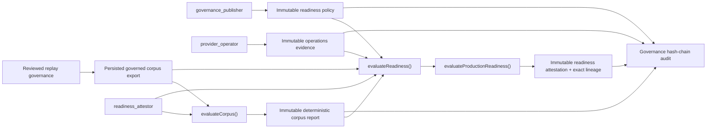

# Reproducible Readiness Evidence Ledger v0.1

## 当前状态

v0.14b2a4 在 `@xxyy/evm-chain-analysis-control-store` 中增加了未接入运行面的 readiness evidence ledger。它把综合 readiness 判定所依赖的 policy、operations evidence、governed corpus export 和 corpus evaluation report 固定为数据库中的精确、不可变输入，再由 store 重新执行纯 evaluator 生成 attestation。

本阶段关闭的是一个信任缺口：旧接口允许调用方把已经计算好的 `ProductionReadinessResult` 直接交给 governance store 持久化。即使结果本身有内容指纹，数据库也无法证明调用方使用了哪份 policy、operations evidence 和 corpus report，更无法证明这些输入已持久化或确实重新执行过 evaluator。旧的 raw result writer 已移除。

当前实现仍然：

- 不创建 PostgreSQL 连接，只接受注入的 `PgControlClientLike`；
- 不访问 RPC、HTTP、Explorer、Indexer、provider endpoint 或 secret manager；
- 不包含真实生产 grant、来源/法律审批、主网 reviewed corpus 或运维证据；
- 不注册 Capability、MCP、Skill 或 LangGraph tool，也不被 API、CLI、Telegram、Agent 或 RAG 引用；
- 不产生可发布的 `ready` 声明。contract-only fixture 的真实计算结果是 `blocked`。

## 信任链



调用方只提交 artifact fingerprint 和评估时间，不能提交 readiness result。store 在一个事务内读取精确输入、校验 lineage、重新计算并写入结果与 audit link。

## 持久化模型

| Artifact                 | PostgreSQL 表                                 | 内容地址                          | 关键 lineage                                              |
| ------------------------ | --------------------------------------------- | --------------------------------- | --------------------------------------------------------- |
| governed corpus export   | `evm_chain_control_corpus_exports`            | `export_fingerprint`              | corpus id、promotion/review lineage                       |
| readiness policy         | `evm_chain_control_readiness_policies`        | `policy_fingerprint`              | publisher actor 与 recorded time                          |
| operations evidence      | `evm_chain_control_operations_evidence`       | 规范化 evidence bundle 的 SHA-256 | provider operator actor 与 recorded time                  |
| corpus evaluation report | `evm_chain_control_corpus_evaluation_reports` | `report_fingerprint`              | export fingerprint、corpus fingerprint/id、evaluated time |
| readiness attestation    | `evm_chain_control_readiness_attestations`    | `readiness_fingerprint`           | report、operations evidence、policy 三个外键              |

这些表全部安装 `BEFORE UPDATE OR DELETE` trigger。新建数据库中 attestation 的三个 lineage 列都是 `NOT NULL` 外键；已有数据库升级时先以 nullable 列保留无法证明来源的历史行，再安装 `NOT VALID` check，阻止任何新的无 lineage 写入。应用读取历史无 lineage row 时也会返回 `immutable_conflict`，不会把它升级为可信 attestation。

`NOT VALID` 只表示 migration 不把旧 row 追认为合规，不代表约束不生效；PostgreSQL 仍会检查 migration 之后的 insert/update。

## 角色分离

| 操作                         | 必需角色               | 原因                                                        |
| ---------------------------- | ---------------------- | ----------------------------------------------------------- |
| `recordPolicy()`             | `governance_publisher` | readiness 阈值不能由 provider operator 或 attestor 自行改写 |
| `recordOperationsEvidence()` | `provider_operator`    | 运维证据提交与治理 policy 发布分离                          |
| `evaluateCorpus()`           | `readiness_attestor`   | corpus report 只能从已持久化 export 确定性生成              |
| `evaluateReadiness()`        | `readiness_attestor`   | attestor 只能选择已持久化指纹，不能提供自算结果             |

授权仍由外部受控 provisioning 写入 content-addressed grant。仓库测试中的 actor hash 只是 contract fixture，不是生产身份或审批。

## 确定性流程

### 记录 policy 与 operations evidence

1. 对 `recordedAt` 做严格 ISO timestamp 校验。
2. 在该时间点检查对应角色 grant。
3. 解析完整 Zod schema；policy 使用内嵌的 content fingerprint，operations evidence 对规范化 bundle 计算 fingerprint。
4. 对 fingerprint 获取 transaction advisory lock。
5. 已存在相同 artifact 时重新解析和校验指纹后幂等返回；不存在时写入 artifact 和同事务 audit event。

record time 是 ledger provenance，不会伪装成 evidence 自身的测试、审批或有效期。综合 evaluator 仍会独立检查 bundle 内部各项时间窗口。

### 生成 corpus report

`evaluateCorpus()` 不接受 report payload：

1. 检查 `readiness_attestor` grant；
2. 从 `evm_chain_control_corpus_exports` 读取指定 export，并重新执行 export schema；
3. 拒绝早于 export 的 evaluation time；
4. 调用 `evaluateEvmChainAnalysisCorpus(export.corpus, { evaluatedAt })`；
5. 以 `(export fingerprint, evaluatedAt)` 做幂等键，持久化 report 与 export 外键；
6. 在同一事务追加 `corpus_evaluation_recorded` audit event。

同一 export 与 evaluation time 必须得到同一 report fingerprint，否则返回 `immutable_conflict`。

### 生成 readiness attestation

`evaluateReadiness()` 只接受六项控制输入：actor、export fingerprint、report fingerprint、operations evidence fingerprint、policy fingerprint 和 `evaluatedAt`。

事务内依次执行：

1. 检查 `readiness_attestor` grant；
2. 读取精确 export 与 report，并确认 report row 引用该 export；
3. 按 report 自身的 `evaluatedAt` 再次对 persisted export 运行 corpus evaluator，确认 report 是这份 export 的确定性产物；
4. 读取精确 operations evidence 与 policy，重新验证 schema/content fingerprint；
5. 拒绝在 policy 或 evidence 记录时间之前回填 attestation；
6. 调用 `evaluateProductionReadiness()`，固定使用仓库内置 `internalReadinessQualityGate`；
7. 以重新计算出的 readiness fingerprint 加锁；
8. 原子写入 result、三个 lineage 外键和 `readiness_attested` audit event。

如果相同 result 已存在，store 会同时核对 payload fingerprint 与三个 lineage 外键后幂等返回。任何 legacy null lineage、外键指向冲突或 payload/row lineage 不一致都会失败关闭。

## 失败语义

| 场景                                               | 结果                                              |
| -------------------------------------------------- | ------------------------------------------------- |
| 角色 grant 缺失或已撤销                            | `authorization_missing` / `authorization_revoked` |
| export、report、evidence 或 policy 不存在          | 对应的 `*_not_found` error                        |
| report 不是指定 export 的确定性产物                | `immutable_conflict`                              |
| policy/evidence 在 attestation 时间之后才记录      | `invalid_state`                                   |
| 已存在 artifact 或 attestation 的内容/lineage 冲突 | `immutable_conflict`                              |
| PostgreSQL read/write/commit 失败                  | `database_unavailable`，事务回滚，不追加 audit    |
| evidence 完整但 corpus 未通过固定门禁              | 正常写入可审计的 `blocked` 结果，不伪造 `ready`   |

`blocked` 是 evaluator 对有效输入给出的业务结论；数据库、授权、指纹或 lineage 错误则是控制面失败，两者不会混为一类。

## 审计与数据最小化

新增 governance audit kinds：

- `readiness_policy_recorded`；
- `operations_evidence_recorded`；
- `corpus_evaluation_recorded`；
- 既有 `readiness_attested` 现在覆盖精确的 report/evidence/policy lineage。

audit event 只记录 actor hash、artifact fingerprint、稳定计数、状态和下一次评估时间，不保存 endpoint、credential 或 provider raw body。operations fixture 中的 `secretref:` 也只是引用格式契约，不会解析 secret。

## 验证结果

control-store 的 unit/store/migration/isolation tests 覆盖：

- 三角色分离与 raw result writer 不再存在；
- policy/evidence/report/attestation 的幂等写入；
- report 对 persisted export 的重新派生；
- 缺失 artifact、错误 lineage、legacy null lineage 和数据库错误失败关闭；
- append-only migration、外键和 hash-chain audit；
- control-store 继续不依赖环境变量、网络、RPC、Agent、MCP 或 app。

一次性真实 PostgreSQL 验证还连续执行两次 migration，重复记录与评估后确认四类 artifact 各只有一行；验证了 getter 重读、七事件完整 hash chain、无 lineage raw insert 拒绝和 immutable update 拒绝。临时数据库和验证脚本随后删除。

使用的 corpus 与 operations evidence 全部是 contract-only fixture。实际结果为：

```text
status: blocked
reason: corpus_quality_gate_failed
```

这只证明持久化和重算机制按契约工作，不是来源/法务审批、真实主网质量、provider SLO、故障演练、生产安全评审或上线许可。

## 后续条件

v0.14b2b 仍需由包外真实部署完成：

1. 真实来源、法律、保留审批及最小权限 identity/grant；
2. 真实 sampling/review/retention workers 和双人 reviewed mainnet corpus；
3. secret manager、provider failover、metrics/alerting、数据库加密/备份/保留；
4. 新鲜 SLO、故障演练、安全与 runbook evidence；
5. 由本 ledger 固定精确输入并重新计算的独立审计结论。

达到这些条件且 evaluator 实际返回 `ready`，也只允许提出后续内部 Capability bridge 评审；是否接入公开客服仍是另一项独立产品、安全与合规决策。
