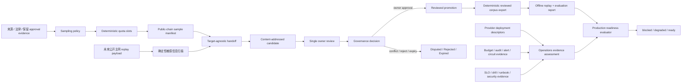

# Reviewed Replay Corpus Governance & Production Data-plane Readiness v0.1 (Single-owner Profile)

## 当前状态

`@xxyy/evm-chain-analysis-readiness` 是一个未接线、无网络 I/O 的离线控制面包。它解决三个问题：

1. 未来公开主网样本如何在真实采集前形成来源/保留审批、分层 sampling policy、确定性 quota plan 和 evidence manifest；
2. 公开主网 replay case 在进入 `@xxyy/evm-chain-analysis-harness` 前，如何经过可审计的采集、单 owner 复核、修订、保留和删除流程；
3. 未来真实 provider 数据面需要提交哪些预算、审计、告警、共享熔断、SLO、故障演练、安全和 runbook 证据，才能判断是否具备内部试用条件。

本契约包没有真实主网样本、真实来源/法务审批、endpoint、credential、数据库 client、Redis 或 RPC client，也不读取环境变量。独立 control-store 已实现 Postgres 治理与共享控制 backend，data-plane 包与私有 operations CLI 已实现 opaque secret、双 Provider composition、持久请求审计和 worker handler runtime；它们均未部署、未配置真实 grant/provider/credential，也没有注册 Capability、MCP、Skill、LangGraph tool、API、Web 或 Telegram 入口。当前公开客服仍只回答产品知识问题，交易哈希、Explorer、池子、链上取证和 MEV 请求继续返回边界或澄清回复。私有运行边界见 [Chain Analysis Provider & Worker Data Plane](chain-data-plane-operations.md)。

## 总体流程



`ready` 不是配置开关。只有治理导出的 corpus 与评测报告指纹一致、固定的 `internalReadinessQualityGate` 实际通过，而且生产运维证据完整、有效且满足实时阈值时才会产生。调用方不能传入自定义弱化 gate。

## Mainnet sampling planning 与 evidence intake

v0.14b2a 已新增真实采集之前的离线规划层：

- approval artifact 固定外部来源/法律/保留 evidence hash、唯一 owner hash、允许来源类型、有效期和 public-only 数据边界；代码只验证结构和指纹，不验证真实身份，也不声称外部评审已完成；
- policy 强制覆盖 V2/V3、direct/allowlisted/complex route、正例/反例/unsupported、完整/部分数据、provider conflict、reorg 和特殊 token；
- plan 把 quota 确定性展开为稳定 slot；manifest 必须匹配 slot、来源和采样时间窗，并按 `(chainId, transactionHash)` 去重；
- coverage evaluator 报告每个 stratum 的接受数与缺口；approval 不匹配、尚未生效或过期时 fail closed；
- companion control store 用 role-scoped planner/worker/submitter/reviewer grant、不可变 artifact、`FOR UPDATE SKIP LOCKED`、lease/attempt fencing、原子 candidate handoff、单槽 owner review work queue 和哈希链审计持久化该流程。

manifest 不是 reviewed replay candidate，更不是 ground truth。v0.14b2a2 已定义显式 handoff：从持久化 manifest 继承 source/retention lineage，重新扫描 normalized replay payload，闭合 chain/transaction/block、protocol/route/data-state 和时间锚点，再在一个 Postgres 事务中创建初始 candidate、retention job 与审计 link。当前单 owner profile 同事务创建一个确定性 review slot，并要求 owner 以 `jobId + attemptCount` fenced lease 提交结果。sampling target 与 proposed ground truth 不一致只记录 `deviated`，不会拒绝样本。真实 worker 和 owner identity 仍未部署，candidate 仍须经过真实 review 和 promotion。完整契约见 [Mainnet Sampling Plan & Evidence Intake Control Plane](evm-chain-analysis-sampling.md)、[Sampling Manifest → Reviewed Replay Candidate Handoff](evm-chain-analysis-sampling-handoff.md) 与 [Single-owner Review Work Queue](evm-chain-analysis-review-work-queue.md)。

## Reviewed replay 治理

### Intake 与敏感信息门禁

候选 payload 必须符合 harness 的 case schema，但不能自带 `review` 字段。强制条件包括：

- `privacy.addressPolicy = public_chain`；
- `containsCredentials = false`；
- `containsPrivateData = false`；
- source payload 只保存 SHA-256，不保存 provider endpoint 或认证材料；
- scanner 明确记录版本、扫描时间和所覆盖的 normalized payload fingerprint。

内置确定性扫描会拒绝 endpoint、URL、header、authorization、cookie、API key、private key、mnemonic、password、secret、seed phrase，以及常见 Bearer / `sk-*` 值。扫描成功记录仍必须与归一化 payload 指纹一致；复用旧 scanner attestation 会失败。

### 状态和单 owner 复核

| 状态                | 产生条件                                              | 是否可晋升 |
| ------------------- | ----------------------------------------------------- | ---------- |
| `pending_review`    | 尚无有效 owner 审核                                   | 否         |
| `approved`          | owner 全量核对 source、重放、隐私和标签并批准         | 是         |
| `disputed`          | 调用方提交互相冲突或重复身份的 review、标签或证据争议 | 否         |
| `rejected`          | owner 拒绝                                            | 否         |
| `retention_expired` | 到达候选保留期限                                      | 否         |

submitter 不能审核自己的候选。批准必须覆盖全部 `sourcePayloadHashes`，并使用由 `expected + groundTruth` 计算的标签指纹；标签争议必须给出不同的建议 ground truth。候选、审核、治理决定、晋升、墓碑和 corpus export 都有可重新校验的内容指纹，篡改单个字段会使 schema 验证失败。

sampling handoff candidate 还必须从唯一确定性 review slot 领取任务。control store 排除 submitter 和已有 review 的身份，使用 `FOR UPDATE SKIP LOCKED`、lease expiry 与 attempt generation 支持并发和安全重领。review artifact、job completion 与 audit 原子提交。普通非 handoff candidate 仍使用直接 review 契约；完整数据库状态机见 [Single-owner Review Work Queue](evm-chain-analysis-review-work-queue.md)。

### Revision、supersession 与删除

- revision 必须保留原 submitter hash，时间向前，并改变 payload 或 source evidence；
- 新 revision 保存被替代 candidate 的 id 和 fingerprint；
- replacement promotion 不能早于原 promotion；
- retention、隐私、source withdrawal、法律/策略请求和 supersession 可生成不可变删除墓碑；
- supersession 墓碑必须指向实际 replacement，replacement 必须反向引用被替代 candidate；
- 导出按 `exportedAt` 排除尚未生效、已删除、已过保留期或已被替代的 case。

导出同时包含有序 case、排除原因和 included promotion lineage，包括 candidate/promotion fingerprint 与至少一个 approval review fingerprint。该 lineage 用于后续审计，不替代真实身份系统、签名或 reviewer 授权 backend。

## Production data-plane 契约

本包只定义 transport-neutral artifact 和 evidence。独立 control-store 包实现下表中 Postgres 可承担的持久化/协调部分；生产部署、身份映射和外部系统仍不在契约包内。

| 范围             | 契约                                                                                       | 生产实现仍需负责                                                                   |
| ---------------- | ------------------------------------------------------------------------------------------ | ---------------------------------------------------------------------------------- |
| Provider 配置    | chain/adapter/provider/region、owner 审批、配置指纹、`secretref:` endpoint/credential 引用 | secret manager、endpoint 解析、启动冻结和轮换                                      |
| 跨实例预算       | policy、reservation、lease、usage settlement、coordinator interface                        | control store 已实现 Postgres 原子预留/并发/幂等结算/过期对账；仍需部署与演练      |
| 持久审计         | 只含 hash、计数、耗时、result code 和 usage 的 content-addressed event                     | control store 已实现 append-only hash chain；仍需加密、访问控制、备份和保留证明    |
| 共享熔断         | generation + state fingerprint、compare-and-set interface、closed/open/half-open 状态      | control store 已实现 Postgres history/head CAS；仍需受控 probe、部署和故障恢复演练 |
| 告警与 SLO       | SLO window、sample、availability/error/latency/cost/incident 和告警控制证据                | metrics backend、paging/on-call、真实窗口数据                                      |
| 演练与事件响应   | timeout、rate limit、provider conflict、reorg、backend unavailable 等 drill evidence       | 定期故障注入、incident 记录、升级和回滚执行                                        |
| 安全与供应商风险 | threat model、provider risk、retention、credential rotation 和 no-LLM-secret attestation   | 安全评审、审批身份、真实 evidence artifact 的保管                                  |

`materializeGrantedProviderBudgetLease()` 仍然只是原子 grant 后的纯 artifact helper；真正的序列化由 companion control store 的 policy/window row lock、advisory lock 和事务完成。shared circuit 的接口由同一 companion 通过不可变 state history、head row lock 和 generation/fingerprint CAS 实现。实现存在不代表生产 backend、访问控制或故障演练已经完成。

## Readiness 判定

综合 evaluator 输入固定为：

- governed `ReviewedReplayCorpusExport`；
- harness 对该精确 corpus 生成的 `ChainAnalysisEvaluationReport`；
- production operations evidence bundle；
- content-addressed readiness policy；
- 显式 `evaluatedAt`。

companion control store 现在会把 policy、operations evidence 和由 persisted governed export 确定性生成的 corpus report 分别保存为不可变 artifact。attestor 只能提交这些 artifact 的精确 fingerprint；store 会重新派生 corpus report、调用本包的 `evaluateProductionReadiness()`，并把 report/evidence/policy 三个外键与 result 原子写入。旧的 caller-supplied result writer 已移除，legacy 无 lineage row 也不会被信任。完整设计见 [Reproducible Readiness Evidence Ledger](evm-chain-analysis-readiness-evidence-ledger.md)。

结果分三级：

| 结果       | 含义                                                                                                      |
| ---------- | --------------------------------------------------------------------------------------------------------- |
| `blocked`  | corpus/gate/lineage 不通过，或 provider coverage、预算、审计、告警、SLO 样本、安全/runbook 证据缺失或过期 |
| `degraded` | 结构和证据完整，但实时 SLO、open incident、circuit 状态或最新故障演练未达标                               |
| `ready`    | 没有 blocking/degraded reason，且固定 internal-readiness gate 实际通过                                    |

每个 reason 都有稳定 code、severity、subject、actual 和 threshold；结果同时输出 provider/drill coverage、证据指纹、gate 指纹、最终 readiness 指纹和下一次必须重新评估的时间。

当前仓库没有经人工审核的公开主网 corpus，也没有真实生产 operations evidence。测试中的 `contract-only` fixture 只验证 schema、状态机和 fail-closed 行为，不是主网证据、生产证明或可发布 corpus。它只有一个 case，因此综合 evaluator 会按设计稳定返回 `blocked`，不会出现伪造的 `ready` 基线。

## 运行面隔离

本契约包生产源码不得：

- 使用 `fetch`、HTTP/TLS/socket 或读取 `process.env`；
- 保存明文 endpoint、credential、header 或原始 provider body；
- 实例化 RPC/database/Redis/secret-manager backend；
- 导入 `agent-core`、LangGraph、CapabilityRegistry、ToolRegistry 或 MCP；
- 被当前 `apps/*`、CLI、Telegram 或客服 Agent 引用。

隔离测试会扫描生产源码和当前运行面 import graph。验证命令：

```bash
pnpm --filter @xxyy/evm-chain-analysis-readiness typecheck
pnpm exec vitest run packages/evm-chain-analysis-readiness/src
pnpm check
```

## 下一阶段

下一阶段是 v0.14b2b 的真实证据建设，而不是能力接线：

1. 由唯一 owner 完成真实来源/法律/保留审批，经确认窗口和自动 verifier 后映射到 approval/policy/plan；
2. 部署 companion Postgres backend，接入真实 planner/sampling worker/submitter/reviewer 身份与 grant，并通过已定义 handoff 与 review work queue 把受控 manifest 转入候选/审核/墓碑流程；
3. 实现 secret manager、metrics/alerting 和 provider failover，验证已实现的共享 budget/circuit/审计在真实故障下 fail closed；
4. 运行故障演练并持续生成新鲜 SLO、安全和 runbook evidence；
5. 让真实 reviewed corpus 实际通过 internal-readiness gate，并由 evidence ledger 固定精确输入、重新计算和保存可独立审计的结论。

companion backend 的设计与边界见 [Chain Analysis Governance Persistence & Shared Provider Controls](evm-chain-analysis-control-store.md)。完成这些条件后，是否实现内部受限 Capability Adapter & Authorization Bridge 仍是独立决策；公开客服接线还需要额外产品、安全与合规批准。
