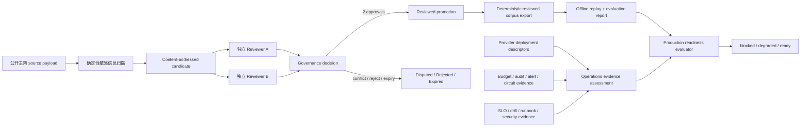

# Reviewed Replay Corpus Governance & Production Data-plane Readiness v0.1

## 当前状态

`@xxyy/evm-chain-analysis-readiness` 是一个未接线、无网络 I/O 的离线控制面包。它解决两个问题：

1. 公开主网 replay case 在进入 `@xxyy/evm-chain-analysis-harness` 前，如何经过可审计的采集、双人复核、修订、保留和删除流程；
2. 未来真实 provider 数据面需要提交哪些预算、审计、告警、共享熔断、SLO、故障演练、安全和 runbook 证据，才能判断是否具备内部试用条件。

本包没有真实主网样本、endpoint、credential、数据库、Redis、RPC client 或 provider backend，也不读取环境变量。它没有注册 Capability、MCP、Skill、LangGraph tool、API、CLI 或 Telegram 入口。当前公开客服仍只回答产品知识问题，交易哈希、Explorer、池子、链上取证和 MEV 请求继续返回边界或澄清回复。

## 总体流程



`ready` 不是配置开关。只有治理导出的 corpus 与评测报告指纹一致、固定的 `internalReadinessQualityGate` 实际通过，而且生产运维证据完整、有效且满足实时阈值时才会产生。调用方不能传入自定义弱化 gate。

## Reviewed replay 治理

### Intake 与敏感信息门禁

候选 payload 必须符合 harness 的 case schema，但不能自带 `review` 字段。强制条件包括：

- `privacy.addressPolicy = public_chain`；
- `containsCredentials = false`；
- `containsPrivateData = false`；
- source payload 只保存 SHA-256，不保存 provider endpoint 或认证材料；
- scanner 明确记录版本、扫描时间和所覆盖的 normalized payload fingerprint。

内置确定性扫描会拒绝 endpoint、URL、header、authorization、cookie、API key、private key、mnemonic、password、secret、seed phrase，以及常见 Bearer / `sk-*` 值。扫描成功记录仍必须与归一化 payload 指纹一致；复用旧 scanner attestation 会失败。

### 状态和双人复核

| 状态                | 产生条件                                                               | 是否可晋升 |
| ------------------- | ---------------------------------------------------------------------- | ---------- |
| `pending_review`    | 少于两个有效独立审核                                                   | 否         |
| `approved`          | 至少两个不同 reviewer hash 全量核对 source、重放、隐私和标签，并都批准 | 是         |
| `disputed`          | 批准与拒绝冲突、重复 reviewer identity、标签或证据争议                 | 否         |
| `rejected`          | 两个不同 reviewer 都拒绝                                               | 否         |
| `retention_expired` | 到达候选保留期限                                                       | 否         |

submitter 不能审核自己的候选。批准必须覆盖全部 `sourcePayloadHashes`，并使用由 `expected + groundTruth` 计算的标签指纹；标签争议必须给出不同的建议 ground truth。候选、审核、治理决定、晋升、墓碑和 corpus export 都有可重新校验的内容指纹，篡改单个字段会使 schema 验证失败。

### Revision、supersession 与删除

- revision 必须保留原 submitter hash，时间向前，并改变 payload 或 source evidence；
- 新 revision 保存被替代 candidate 的 id 和 fingerprint；
- replacement promotion 不能早于原 promotion；
- retention、隐私、source withdrawal、法律/策略请求和 supersession 可生成不可变删除墓碑；
- supersession 墓碑必须指向实际 replacement，replacement 必须反向引用被替代 candidate；
- 导出按 `exportedAt` 排除尚未生效、已删除、已过保留期或已被替代的 case。

导出同时包含有序 case、排除原因和 included promotion lineage，包括 candidate/promotion fingerprint 与至少两个 approval review fingerprint。该 lineage 用于后续审计，不替代真实身份系统、签名或 reviewer 授权 backend。

## Production data-plane 契约

本包只定义 transport-neutral artifact 和 evidence，不实现下面任何 backend。

| 范围             | 契约                                                                                     | 生产实现仍需负责                                  |
| ---------------- | ---------------------------------------------------------------------------------------- | ------------------------------------------------- |
| Provider 配置    | chain/adapter/provider/region、双人审批、配置指纹、`secretref:` endpoint/credential 引用 | secret manager、endpoint 解析、启动冻结和轮换     |
| 跨实例预算       | policy、reservation、lease、usage settlement、coordinator interface                      | 原子预留、全局并发、租约过期、幂等结算和对账      |
| 持久审计         | 只含 hash、计数、耗时、result code 和 usage 的 content-addressed event                   | append-only 存储、加密、访问控制和删除/保留任务   |
| 共享熔断         | generation + state fingerprint、compare-and-set interface、closed/open/half-open 状态    | Redis/Postgres 原子状态、受控 probe 和故障恢复    |
| 告警与 SLO       | SLO window、sample、availability/error/latency/cost/incident 和告警控制证据              | metrics backend、paging/on-call、真实窗口数据     |
| 演练与事件响应   | timeout、rate limit、provider conflict、reorg、backend unavailable 等 drill evidence     | 定期故障注入、incident 记录、升级和回滚执行       |
| 安全与供应商风险 | threat model、provider risk、retention、credential rotation 和 no-LLM-secret attestation | 安全评审、审批身份、真实 evidence artifact 的保管 |

`materializeGrantedProviderBudgetLease()` 只在外部 coordinator 已完成原子 grant 后生成确定性 lease artifact；它本身不是分布式锁或配额 backend。相同地，shared circuit coordinator 只是接口，不声称仓库已有 Redis/Postgres 实现。

## Readiness 判定

综合 evaluator 输入固定为：

- governed `ReviewedReplayCorpusExport`；
- harness 对该精确 corpus 生成的 `ChainAnalysisEvaluationReport`；
- production operations evidence bundle；
- content-addressed readiness policy；
- 显式 `evaluatedAt`。

结果分三级：

| 结果       | 含义                                                                                                      |
| ---------- | --------------------------------------------------------------------------------------------------------- |
| `blocked`  | corpus/gate/lineage 不通过，或 provider coverage、预算、审计、告警、SLO 样本、安全/runbook 证据缺失或过期 |
| `degraded` | 结构和证据完整，但实时 SLO、open incident、circuit 状态或最新故障演练未达标                               |
| `ready`    | 没有 blocking/degraded reason，且固定 internal-readiness gate 实际通过                                    |

每个 reason 都有稳定 code、severity、subject、actual 和 threshold；结果同时输出 provider/drill coverage、证据指纹、gate 指纹、最终 readiness 指纹和下一次必须重新评估的时间。

当前仓库没有经人工审核的公开主网 corpus，也没有真实生产 operations evidence。测试中的 `contract-only` fixture 只验证 schema、状态机和 fail-closed 行为，不是主网证据、生产证明或可发布 corpus。它只有一个 case，因此综合 evaluator 会按设计稳定返回 `blocked`，不会出现伪造的 `ready` 基线。

## 运行面隔离

生产源码不得：

- 使用 `fetch`、HTTP/TLS/socket 或读取 `process.env`；
- 保存明文 endpoint、credential、header 或原始 provider body；
- 实例化 RPC/database/Redis/secret-manager backend；
- 导入 `agent-core`、LangGraph、CapabilityRegistry、ToolRegistry 或 MCP；
- 被当前 `apps/*`、CLI、Telegram 或客服 Agent 引用。

隔离测试会扫描生产源码和当前运行面 import graph。验证命令：

```bash
pnpm --filter @xxyy/evm-chain-analysis-readiness typecheck
pnpm exec vitest run packages/evm-chain-analysis-readiness/src
pnpm check
```

## 下一阶段

下一阶段是 v0.14b 的真实证据建设，而不是能力接线：

1. 选择目标 chain/protocol/router coverage 和合法公开主网样本来源；
2. 接入真实 reviewer 授权、持久化候选/审核/墓碑存储与保留任务；
3. 实现 secret manager、共享 budget/circuit、持久审计、metrics/alerting backend；
4. 运行故障演练并持续生成新鲜 SLO、安全和 runbook evidence；
5. 让真实 reviewed corpus 实际通过 internal-readiness gate。

完成这些条件后，是否实现内部受限 Capability Adapter & Authorization Bridge 仍是独立决策；公开客服接线还需要额外产品、安全与合规批准。
