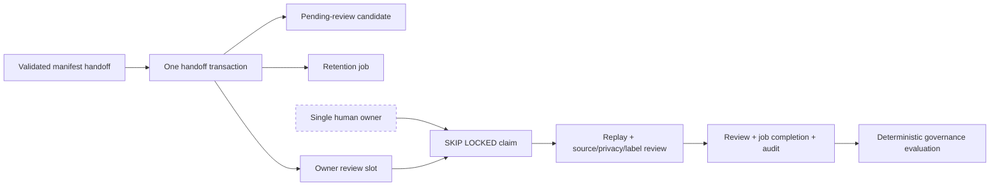

# Single-owner Review Work Queue v0.1

## 当前状态

本阶段在未接线的 `@xxyy/evm-chain-analysis-control-store` 中实现 sampling handoff candidate 的单 owner 复核调度。它解决的是“唯一人工 owner 如何领取待复核 candidate、租约过期后如何安全重领、复核结果如何与任务状态原子提交”，不是自动审核 Agent，也没有创建任何真实 reviewer 或主网审核结论。

当前实现：

- 每个新 handoff candidate 在同一 Postgres 事务中生成一个确定性 owner review slot；
- 只有持有有效 `independent_reviewer` grant 的身份可以领取；
- submitter 服务账号不能领取自己的 candidate，人工 owner 必须与 submitter principal 分离；
- claim 使用 `FOR UPDATE SKIP LOCKED`，支持多个 review worker 实例安全竞争；
- review 提交必须携带本次 claim 返回的 `jobId + attemptCount`，并在未过期 lease 内完成；
- review artifact、job success 和两条 hash-chain audit event 在同一事务提交；
- 普通、非 sampling handoff 的治理 candidate 保持原有直接 review 契约；
- 包仍不访问 RPC、HTTP、provider 或网络，也未接入 Agent、Capability、MCP、Skill、API、CLI、Telegram。

contract-only fixture 和一次性 PostgreSQL 验证只能证明状态机与事务行为，不能证明复核质量、真实身份、法律审批、生产部署或主网 evidence 已完成。

## 流程



虚线 owner 仍是未来部署责任。仓库只实现 transport-neutral store API 和数据库约束，不启动 worker，也不创建真实身份。

## 单槽入队不变量

`recordCandidateHandoff()` 在插入 handoff 之前创建唯一 slot ordinal `1`。job id 由以下内容确定性派生：

```text
candidateId + candidateFingerprint + slotOrdinal
```

该 job：

- `notBefore = candidate.submittedAt`；
- `expiresAt = candidate.retainUntil`；
- 初始状态为 `queued`、`attemptCount = 0`；
- 默认最多三次 claim attempt；
- 以 `(candidateId, slotOrdinal)` 唯一；
- 与 candidate、retention job、handoff 和 candidate/handoff audit 一起提交或一起回滚。

相同 handoff 的幂等重试在检测到既有 handoff 后直接返回，不会重复创建 review job。

## 领取规则

`claimReviewJob()` 在请求时间检查 `independent_reviewer` grant，并按稳定顺序选择一条满足以下条件的任务：

- 已到 `notBefore` 且未到 `expiresAt`；
- attempt 尚未达到上限；
- 状态为 `queued`、可重试的 `failed`，或 lease 已过期的 `running`；
- reviewer 不是 candidate submitter；
- reviewer 尚未为该 candidate 写入 review；

claim 会增加 `attemptCount`，将 lease 截止时间限制在 candidate expiry 以内，并清除上一失败 attempt 的结果。reviewer-scoped advisory lock、防重复 SQL 条件、`(candidate, reviewer)` partial unique index 和既有 review 唯一约束共同防止重复领取或重复完成。

## Lease 与 attempt fencing

只检查 reviewer hash 不足以阻止旧执行者在 lease 被重新领取后提交。handoff review 因此要求调用方把 claim 返回的以下引用传给 `recordReview()`：

```ts
{
  reviewWorkLease: {
    jobId,
    attemptCount,
  },
}
```

提交时会锁定 handoff 与 job，并验证：

- job 属于同一 candidate id 和 fingerprint；
- job 当前为 `running`；
- reviewer hash 与 lease owner 相同；
- `attemptCount` 精确等于当前 generation；
- `reviewedAt` 不晚于 lease，且早于 candidate expiry。

任何旧 attempt、过期 lease、错误 candidate 或错误 reviewer 都 fail closed。成功路径先写不可变 review，再用带状态、reviewer、attempt 和时间条件的 SQL 完成 job，随后追加 `review_recorded` 和 `review_job_completed`；整个过程共用一个事务，任一步失败都会回滚 review、job 和 audit head。

已经成功保存的完全相同 review 可按既有规则幂等读取，不要求重新持有已经完成的 lease。

## 失败与终止

`failReviewJob()` 同样要求 reviewer、`jobId`、`attemptCount` 和有效 lease。失败会：

- 保存 hashed failure code 与失败时间；
- 清除 lease，使未耗尽任务可由 owner 后续重新领取；
- 追加 `review_job_failed` 审计事件；
- 对相同 reviewer、attempt、时间和 failure hash 的重试幂等返回；
- 在 attempt 达到上限后不再被 claim 查询选中。

单 owner 拒绝后 candidate 进入 `rejected`；payload、来源或标签需要修正时继续使用既有 revision/supersession 治理流程，不能通过匿名追加 review 把拒绝静默改写为批准。调用方若额外提供互相冲突或重复身份的 review，canonical evaluator 仍返回 `disputed`。

## 普通 candidate 的兼容边界

review queue 只由 sampling handoff 创建。非 handoff governance candidate 仍可在有效 `independent_reviewer` grant 下直接调用 `recordReview()`，不需要 review work lease。反过来，为非 handoff candidate 伪造 lease 引用会被拒绝，避免两种工作流被调用方混用。

## 验证

包级测试覆盖：

- 单槽确定性 id、schema 状态互斥与 migration 约束；
- reviewer RBAC、submitter 排除、已有 review 排除和 `SKIP LOCKED` claim；
- failed release、幂等失败、attempt generation fencing 与上限条件；
- handoff 无 lease 拒绝，以及 review/job/audit 原子完成；
- 普通 candidate 兼容和运行面隔离。

```bash
pnpm --filter @xxyy/evm-chain-analysis-control-store typecheck
pnpm exec vitest run packages/evm-chain-analysis-control-store/src
pnpm check
```

旧双槽 profile 的一次性 PostgreSQL 验证已被当前设计取代，不能作为单 owner profile 的生产证据。真实激活前需要在目标 PostgreSQL 重新验证完整 migration、handoff 自动生成一个 slot、owner 领取与完成、三次失败后终止领取，以及完整 hash-chain audit。

## 下一阶段

v0.14b2b 必须在仓库外部署最小权限数据库、真实 owner/grant 与 review worker，由 owner 实际重放公开主网 payload、核对来源/隐私/标签，并保存可审计结果。还需要队列深度、lease expiry、terminal failure、拒绝率和审核时延的 metrics/alerting，以及真实 backend unavailable/并发/恢复演练。

只有 owner 复核后的 governed corpus 和生产运维证据通过固定 readiness gate，才可以讨论内部 Capability bridge；本队列不会改变当前客服边界。
