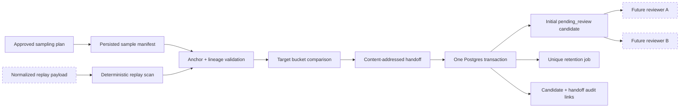

# Sampling Manifest → Reviewed Replay Candidate Handoff v0.1

## 当前状态

本阶段补齐 public-chain sample manifest 与 reviewed replay candidate 之间原来依赖人工拼接的边界。实现仍位于未接线的离线控制面：

- `@xxyy/evm-chain-analysis-readiness` 生成可独立重算的 content-addressed handoff；
- `@xxyy/evm-chain-analysis-control-store` 在一个 Postgres 事务中写入 handoff、初始 candidate、retention job 和哈希链审计；
- handoff 只把已采集 manifest 转成 `pending_review` candidate，不代表 replay 正确、标签已批准或样本可进入 reviewed corpus；
- 没有 worker、RPC、Explorer、Indexer、HTTP、provider endpoint、真实主网 payload 或生产身份；
- 没有接入 Agent、Capability、MCP、Skill、API、CLI、Telegram 或公开客服。

测试 fixture 仍是 `contract-only` 合成对象。它可以证明契约、事务和拒绝路径，不能证明真实来源/法律审批、公开链采集、人工复核或生产 readiness 已完成。

## 流程与信任边界



调用方提供 replay payload、重新扫描时间/版本、提交时间和 submitter hash。函数不信任调用方构造 candidate，而是从持久化 manifest 继承 retention policy/deadline 与 source lineage，再调用既有敏感信息扫描和初始 candidate factory。

## Handoff 不变量

`SamplingCandidateHandoff` 内嵌完整 manifest 与 candidate，并固定 additional source hash、target comparison、selection policy、版本、handoff fingerprint 和派生 id。任一字段改变都会破坏闭合指纹。

### 链与交易锚点

- candidate dimension、snapshot 和 manifest 的 `chainId` 必须一致；
- requested transaction、已存在 transaction 和 receipt hash 必须等于 manifest transaction hash；
- 已存在的 block hash/number 和 transaction/receipt index 必须等于 manifest；
- `complete` 样本必须同时具有 transaction、receipt、block、block number 和 transaction index；
- `partial` / `unsupported` 可缺少字段，但任何已存在字段仍必须精确匹配，不能用“数据不完整”掩盖冲突。

### 语义维度

映射是固定的，不由调用方选择：

| Manifest                           | Candidate dimension  |
| ---------------------------------- | -------------------- |
| `uniswap_v2` / `uniswap_v3`        | 同名 protocol        |
| `direct_pool`                      | `direct_pool`        |
| `allowlisted_router`               | `allowlisted_router` |
| `complex_route`                    | `aggregator`         |
| `provider_conflict`                | `provider_conflict`  |
| 其他 chain condition + data 完整度 | 对应 data state      |

reorg 的 orphan/replacement 证据继续保存在 manifest；candidate snapshot 必须锚定 manifest 记录的 observed block。handoff 不把 reorg 隐式改写为 canonical。

### Source、scan、retention 与时间

- manifest 的 `retentionPolicyId` 和 `retainUntil` 原样传入 candidate，调用方不能延长保留期或替换策略；
- candidate sources 必须是 manifest source hashes 与显式 additional normalized replay hashes 的精确有序并集，最多 16 个；
- snapshot 中已声明的 payload hash 必须存在于 manifest source lineage；`complete` 样本的每个 snapshot source 都必须有 hash；
- replay payload 必须重新执行 credential/private-data 确定性扫描，scanner fingerprint 必须覆盖 normalized payload；
- replay scan 与 submission 不得早于 manifest collection，submission 必须早于 retention expiry；
- handoff 只能创建 revision 1，不能伪装成 revision/supersession。

## Target bucket 不参与筛除

sampling `targetLabel` 只是配额规划时希望覆盖的 bucket，不是真实标签。handoff 固定：

```text
selectionPolicy = target_agnostic_no_exclusion
```

`targetComparison` 同时保存 sampling target、candidate proposed ground truth 与 `matched | deviated`。两者不一致时函数仍创建 candidate，并明确记录 `deviated`；`not_applicable` 也会自然形成 deviation。不存在“标签不符合计划所以拒绝”的分支。

这避免为了填满 positive/negative quota 而静默删除不利样本。后续 reviewer 可以批准、拒绝或提出 label disagreement，但 sampling worker、submitter 和数据库都不能把 planning target 当作审核结果。

## Postgres 原子写入

`recordCandidateHandoff()` 要求 candidate 的 submitter 与调用 actor 相同，并在 candidate `submittedAt` 检查有效 `candidate_submitter` grant。事务顺序为：

1. 对 manifest handoff identity 和 candidate id 获取 transaction advisory lock；
2. 读取持久化 manifest，重新构造 handoff 并比较完整 fingerprint；
3. 检查 manifest/candidate 一对一关系；
4. 拒绝已经绕过 handoff 单独存在的 candidate，防止事后补挂来源；
5. 插入 revision-1 candidate；
6. 插入唯一 retention job；
7. 插入 append-only handoff；
8. 追加 `candidate_recorded` 与 `sampling_candidate_handoff_recorded` 两条 hash-chain event；
9. 一次提交，任一步失败全部回滚。

相同 handoff 重试返回既有 artifact，不重复 candidate、retention job 或审计事件。相同 manifest 指向不同 candidate、相同 candidate 指向不同 manifest、无授权 actor、数据库错误或指纹不闭合均 fail closed。handoff 表安装 `BEFORE UPDATE OR DELETE` 拒绝触发器。

该 API 是显式存储原语，不是后台自动转换器。未来部署层必须在真实 manifest 成功持久化、payload 归一化和扫描完成后主动调用；当前仓库没有运行该 worker。

## 验证

测试覆盖：

- 确定性 handoff 与全部 content-addressed id/fingerprint；
- chain/transaction/block/index、protocol/route/data-state 和 complete-anchor 拒绝；
- source hash、scan、retention policy/deadline 与时间 lineage；
- target matched/deviated 都创建 candidate，偏差不会被筛除；
- candidate submitter RBAC、manifest/candidate 一对一、幂等写入和事后补挂拒绝；
- 单事务 candidate/handoff/retention/audit，以及运行面隔离。

```bash
pnpm exec vitest run packages/evm-chain-analysis-readiness/src/sampling-candidate-handoff.test.ts
pnpm exec vitest run packages/evm-chain-analysis-control-store/src/sampling-store.test.ts
pnpm check
```

本阶段还使用一次性真实 PostgreSQL 验证了迁移、偏差 handoff、单事务写入、幂等重试、唯一行数和 append-only trigger；临时数据库随后删除。该验证仍只使用 contract-only fixture。

## 下一阶段

v0.14b2b 仍需在仓库外完成真实来源/法律/保留审批、受控采集和 payload 保管，部署最小权限 identity/database/workers，并让两个独立 reviewer 重放和审核每个 candidate。只有 governed reviewed corpus、真实 provider 运维证据和固定 internal-readiness gate 全部通过后，才能提出内部 Capability bridge 评审；本 handoff 不改变该顺序。
