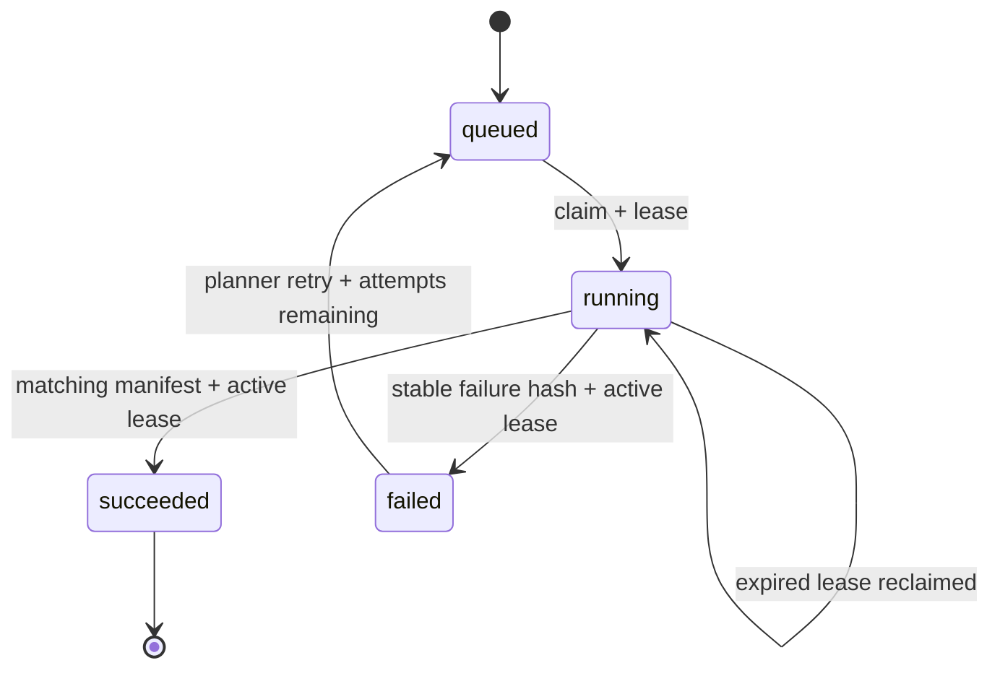

# Mainnet Sampling Plan & Evidence Intake Control Plane v0.1

## 当前状态

本阶段只完成“怎样规划和接收未来公开主网样本”的离线契约与 Postgres 控制面，不执行真实采集。

- `@xxyy/evm-chain-analysis-readiness` 定义 content-addressed 来源/保留审批记录、分层采样策略、确定性 quota plan、公开链样本 manifest、coverage result，以及 manifest 到初始 reviewed replay candidate 的 handoff；
- `@xxyy/evm-chain-analysis-control-store` 保存不可变 artifact，并提供带角色授权、lease、重试、原子 candidate handoff、单槽 owner review work queue 和审计的 intake 状态机；
- 两个包都不访问 RPC、Explorer、Indexer、HTTP 或 provider，不读取 endpoint/credential，也不创建数据库连接；
- 仓库没有真实来源/法务/保留审批，没有真实主网 transaction 样本，也没有部署 sampling worker；
- 当前客服、Agent、Capability、MCP、Skill、API、CLI 和 Telegram 均未接入该流程。

测试中的 chain id、交易哈希、审批 hash 和 manifest 都是 `contract-only` 合成数据。它们只能证明 schema、SQL 和状态机行为，不能作为审批、主网证据、reviewed corpus 或上线依据。

## 设计位置

```mermaid
flowchart LR
  ExternalReview["外部来源 / 法务 / 保留评审"] --> Approval["Content-addressed approval evidence"]
  Approval --> Policy["Sampling policy + coverage strata"]
  Policy --> Plan["Deterministic quota slots"]
  Plan --> Jobs["Postgres intake jobs"]
  Jobs --> Worker["未来受控 sampling worker"]
  Worker --> Manifest["Public-chain sample manifest"]
  Manifest --> Coverage["Coverage / gap evaluation"]
  Manifest --> Handoff["Target-agnostic candidate handoff"]
  Handoff --> Candidate["pending_review candidate"]
  Candidate --> Review["单 owner 复核"]
  Review --> Corpus["Governed reviewed corpus"]

  style Worker stroke-dasharray: 5 5
  style Review stroke-dasharray: 5 5
  style Corpus stroke-dasharray: 5 5
```



虚线节点仍未实际执行。manifest 只是采集元数据和 payload hash，不是 ground truth。已实现的 handoff 会重新扫描 replay payload 并创建 `pending_review` candidate，但不会绕过 replay、owner 复核、promotion 和 corpus export。

## Content-addressed artifacts

| Artifact                        | 固定内容                                                                                             | 明确不代表                                        |
| ------------------------------- | ---------------------------------------------------------------------------------------------------- | ------------------------------------------------- |
| `MainnetSamplingSourceApproval` | 审批人 hash、来源审批证据 hash、法律/保留评审 hash、来源类型、有效期、保留天数和 public-only 约束    | 包已验证审批人身份或真实评审已完成                |
| `MainnetSamplingPolicy`         | 时间窗、目标 chain 和完整 strata；继承 approval fingerprint、来源类型和保留天数                      | 已经找到、采集或审核这些样本                      |
| `MainnetSamplingPlan`           | 对每个 stratum 的 quota 展开为稳定 `slotId`，固定 policy/approval fingerprint                        | worker、provider 或网络已经配置                   |
| `PublicChainSampleManifest`     | chain/transaction/block、slot、来源 payload hash、provider observation hash、scan 结果和保留截止时间 | replay 正确、标签正确或该样本已成为 reviewed case |
| `SamplingCandidateHandoff`      | 完整 manifest/candidate、链与语义锚点、source/scan/retention/time lineage、target comparison         | target 与标签一致、复核已完成或 candidate 可晋升  |
| `MainnetSamplingCoverageResult` | 接受/拒绝 manifest、每个 stratum 的缺口、审批/时间状态和确定性 run fingerprint                       | harness quality gate 或 production readiness 通过 |

所有 id 从 artifact fingerprint 派生。修改任一时间、quota、维度、来源、交易或 evidence hash 都会改变 fingerprint；schema 会拒绝 id/fingerprint 不闭合的对象。

## Sampling policy 基线

策略必须显式包含以下覆盖，否则创建失败：

- protocol：Uniswap V2 与 Uniswap V3；
- route：`direct_pool`、`allowlisted_router` 与 `complex_route`；
- target bucket：`positive`、`negative` 与 `unsupported`；
- data completeness：`complete`、`partial` 与 `unsupported`；
- chain condition：`canonical`、`provider_conflict` 与 `reorged`；
- token behavior：标准 token，以及至少一种 `fee_on_transfer`、`rebasing` 或 `unknown` 特殊行为；
- 一个或多个显式 chain id。

`unsupported` target 必须与 `unsupported` data completeness 对齐。这里的 target 只是待采样桶，不是未经审核的 ground truth。每个 stratum 有有界 `targetSamples`，全计划最多 500 个 slot；同一策略和 `plannedAt` 总会展开为相同有序 slot 集合。

## Manifest 门禁与去重

manifest 只能由已物化 plan 的 slot 创建，并继承该 slot 的 chain、protocol、route、target、data、condition 和 token behavior：

- `sourceKind` 必须在 approval 允许范围内；
- `collectedAt` 必须位于 sampling window；
- credential/private-data scan 必须为 `passed`，只保存 payload hash，不保存原始 provider body；
- `provider_conflict` 至少需要两个不同 provider observation hash；
- `reorged` 必须同时固定 observed orphan block 和不同的 canonical replacement block；
- 保留策略 id 从 approval 经 policy/plan 传到 manifest，截止时间由 `collectedAt + retentionDays` 确定；
- `(chainId, transactionHash)` 生成稳定 sample identity，跨 slot 重复不会计入 quota；
- 同一 slot 只能成功写入一个 manifest。

Coverage evaluator 按 manifest fingerprint 排序后执行确定性接受/拒绝。foreign plan、维度不一致、重复 slot 和重复 transaction identity 会被列为 rejected manifest。审批尚未生效、已过期或 fingerprint 不匹配时，即使 quota 已满也返回 `blocked`；窗口结束仍有缺口时返回 `incomplete`。

## Manifest → candidate handoff

handoff 从持久化 manifest 继承 source、retention policy 和 deadline，并从调用方提供的 normalized replay payload 重新生成 scanner attestation 与 revision-1 candidate。它确定性校验 chain/transaction/block/index、protocol/route/data-state、source hash 和 collection/scan/submission/retention 时间链。

sampling target 只用于覆盖规划。handoff 固定 `target_agnostic_no_exclusion`：candidate proposed ground truth 与 target 相同记录 `matched`，不同记录 `deviated`，两种情况都进入 `pending_review`。因此 worker 不能为了命中 quota 静默丢弃 false positive、false negative 或 `not_applicable` 样本。

control store 要求 `candidate_submitter` grant，在单个事务中写 candidate、唯一 retention job、一个确定性 review job、不可变 handoff，以及 candidate/handoff 两条 hash-chain audit link；manifest/candidate 都是一对一。相同 handoff 幂等，冲突 handoff 或已绕过 handoff 单独写入的 candidate 会 fail closed。后续 owner 只能在有效 `jobId + attemptCount` lease 下提交 handoff review。完整设计见 [Sampling Manifest → Reviewed Replay Candidate Handoff](evm-chain-analysis-sampling-handoff.md) 与 [Single-owner Review Work Queue](evm-chain-analysis-review-work-queue.md)。

## Postgres intake 状态机

control store 新增 `sampling_planner` 和 `sampling_worker` 两个独立角色：

- planner 写入 approval、policy、plan，执行 coverage run，并显式重试失败 job；
- worker 只能领取、完成或失败一个已 lease 的 job；不能修改 plan 或自行扩展 quota。

不可变表保存 approval、policy、plan、manifest 和 coverage run，全部安装 `BEFORE UPDATE OR DELETE` 拒绝触发器。plan 与每个 slot 在同一事务创建唯一 job。job 是唯一可变协调状态：



领取 SQL 使用 `FOR UPDATE SKIP LOCKED`，只选择已进入时间窗、未过窗口、仍有 attempt、处于 queued 或 lease 已过期 running 的 job。完成/失败同时校验 worker identity 和 lease generation；manifest insert、job success 和两个 hash-chain audit event 在同一事务提交。重复 chain/transaction identity、slot 冲突、过期 lease、超出 attempts 或数据库不可用都会 fail closed。

## 验证与边界

包级测试覆盖：

- approval/policy/plan/manifest/run 指纹与篡改拒绝；
- baseline strata、approval/window expiry、provider conflict、reorg 和 retention；
- quota 展开、slot/transaction 去重和 coverage gap；
- RBAC、`SKIP LOCKED`、lease fencing、fail/retry、原子完成和 hash-chain audit；
- manifest/candidate 锚点、target deviation 保留、handoff 一对一、原子 candidate/retention/owner-review-slot/audit 和幂等重试；
- 生产源码无网络/环境读取，公开运行面无 import。

开发验证命令：

```bash
pnpm exec vitest run packages/evm-chain-analysis-readiness/src/mainnet-sampling.test.ts
pnpm exec vitest run packages/evm-chain-analysis-readiness/src/sampling-candidate-handoff.test.ts
pnpm exec vitest run packages/evm-chain-analysis-control-store/src/sampling-store.test.ts
pnpm check
```

旧双槽 profile 的一次性 PostgreSQL 验证已被单 owner 设计取代。真实激活前需要在目标数据库重新验证迁移幂等、artifact append-only trigger、quota job、失败/重试/完成、审计链、coverage，以及偏差 handoff 的 candidate/retention/单 review slot 原子写入和幂等重试。这仍是契约验证要求，不是生产部署或主网 evidence。

## 下一阶段

后续 v0.14b2b 才能在包外执行真实工作：

1. 由唯一 owner 完成并保管真实来源、法律和保留评审，登记 owner 与 service-account identity；
2. 部署最小权限 Postgres、sampling/retention/reconciliation worker、secret manager 和 provider；
3. 按 plan 采集公开链 payload，通过已定义 handoff 转为 candidate，再执行 replay 与 owner 复核；
4. 补齐真实 provider failover、metrics/alerting、SLO、安全和故障演练证据；
5. 让 governed reviewed corpus 实际通过固定 internal-readiness gate。

完成这些条件只代表可以提出内部 Capability bridge 评审，不会自动接入客服。公开链上分析仍需独立的产品、安全、合规和运行面授权。
