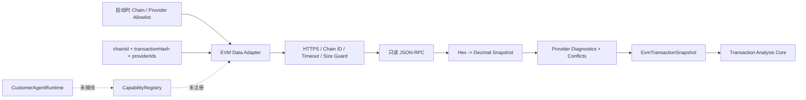

# Allowlisted Read-only EVM Data Adapter v0.1

## 当前状态

`@xxyy/evm-data-adapter` 是 `@xxyy/transaction-analysis-core` 之前的只读数据边界。它通过受控的标准 EVM JSON-RPC 获取公开 transaction、receipt、chain id 和 block，将 hex quantity 无精度损失地转换为 normalized `EvmTransactionSnapshot`，再由离线领域核心计算交易事实。独立的 `@xxyy/evm-execution-enrichment-core` 已实现 trace/revert/Uniswap swap 的离线语义，但本 adapter 尚不获取它需要的 trace 或 pool metadata。

该包已经实现，但仓库没有生产 RPC endpoint 配置，也没有任何 app、LangGraph、`ToolRegistry`、`CapabilityRegistry`、CLI、API 或 Telegram composition root 引用它。它不是 MCP server 或 capability adapter；公开客服收到交易、Explorer、链上取证或 MEV 问题时仍返回现有边界回复。

## 组件边界

领域核心仍然没有网络依赖。adapter 不计算 success/reverted 的资产变化，不解码 ERC-20，也不调用 LLM；它只负责可信获取、校验、归一化和来源协调。

## Allowlist 与 SSRF 边界

- RPC URL 只能出现在启动时 `chains[].providers[]` 配置中；运行时输入不接受 URL，只能选择已配置的 `chainId` 和 `providerIds`。
- endpoint 默认必须使用 HTTPS。只有显式设置 `allowInsecureLocalhost` 时才允许 `localhost`、`127.0.0.0/8` 或 `::1` 的 HTTP 开发节点。
- URL user/password 和 fragment 被拒绝；provider path/query 可以承载供应商路由，但 provenance 只输出 origin，避免泄露 path/query token。
- HTTP 请求固定 `redirect: "error"`，不跟随 endpoint 重定向。
- 自定义 header 最多 32 个；Host、Content-Length、Content-Type、Connection、Transfer-Encoding 和 Proxy-Authorization 等由 adapter 控制。认证 header 只留在 client 闭包，不进入 snapshot、diagnostic 或公开错误。
- 低层 client 只接受 `eth_getTransactionByHash`、`eth_getTransactionReceipt`、`eth_chainId` 和 `eth_getBlockByNumber`，不能构造签名、模拟、广播或写链调用。

配置本身属于受信任的部署权限边界。未来若由管理面维护 provider 配置，必须继续走独立 RBAC 和密钥存储，不能允许聊天输入动态添加 endpoint。

## 有界传输

默认限制：

| 项目          | 默认值   | 绝对上限 |
| ------------- | -------- | -------- |
| 单批 RPC 数量 | 4        | 20       |
| 响应正文      | 1 MiB    | 5 MiB    |
| 单次请求超时  | 10 秒    | 120 秒   |
| 自动重试      | 1 次     | 3 次     |
| 基础退避      | 100 毫秒 | 2 秒     |
| 单链 provider | 配置决定 | 8 个     |

adapter 首批固定使用三调用 batch：transaction、receipt 和 `eth_chainId`。只有 HTTP 408/425/429、5xx、网络错误和 timeout 可以有界重试；调用方 abort、4xx、响应超限、非法 JSON/JSON-RPC 和非法 provider payload 不重试。响应正文通过 stream 累计字节，不能用缺失或伪造的 Content-Length 绕过上限。

`EvmRpcRequestError` 只公开稳定 code、provider id、attempts、retryable、可选 HTTP status 和 size limit。底层 fetch/JSON error 不作为 `cause` 暴露，避免日志间接记录 endpoint 密钥或响应片段。

## Provider Contract 流程

1. 校验 chain、provider 选择和 transaction hash；provider 顺序来自启动配置，不受请求排序影响。
2. 并行调用最多 8 个已选择 provider；单个 provider 内批量读取 transaction、receipt 和 chain id。
3. `eth_chainId` 与配置不一致、不可用或格式非法时 fail closed：该 provider 的 transaction/receipt 不进入 snapshot。
4. 把 canonical hex quantity 直接通过 `bigint` 转为十进制字符串；transaction/log index 只有验证不超过领域上限后才转为 number。
5. 根据已验证的 receipt 或 transaction block number 读取 block，并校验 transaction hash、receipt hash、block number 和 transaction index 关联。
6. 每个来源记录稳定 provider id、观测时间、脱敏 origin 和原始响应 SHA-256；不保存 RPC body。
7. 按配置顺序选择首个有效 canonical transaction/receipt/block，同时把 provider 间 presence 和关键字段差异写入 snapshot `conflicts`。

adapter 返回独立状态：

- `success`：存在有效 transaction，且没有 provider diagnostic 或 conflict；
- `partial`：存在有效 transaction，但 provider 缺失、失败、不一致或多来源冲突；
- `insufficient_data`：没有任何可以接纳的目标 transaction。

下游领域核心仍会独立验证 snapshot，并生成自己的 `SkillResult` 状态、Evidence、warnings 和 diagnostics。adapter 状态不能替代领域分析状态。

## 可重放测试资产

`packages/evm-data-adapter/src/fixtures` 包含合成 JSON-RPC batch/block 响应，覆盖：

- 成功 transaction、receipt、chain 和 block；
- 第二 provider 的 transaction、receipt 和 block 冲突；
- out-of-order batch response 和 provider 扩展字段。

provider contract tests 另外覆盖 missing result、错误 chain、hash/index/block 不一致、非法 hex、单 provider 失败/多 provider 降级、HTTP retry、timeout、abort、chunked response 超限、非法 JSON/JSON-RPC、只读方法 allowlist、endpoint/header 限制和错误脱敏。测试全部使用注入的 `fetch`，不访问真实网络。

## 明确未实现

- 在 `.env`、Docker、API、CLI 或后台任务中配置和启用真实 RPC provider；
- provider 级 QPS 配额、共享熔断、缓存、持久化审计和生产 metrics；
- Indexer、Explorer、trace/debug RPC、pool metadata 或 archive node adapter；
- adapter 内的 internal transfer、revert reason 或协议计算；这些确定性语义位于独立 enrichment core；
- pool metadata 链上交叉验证、价格影响或 Sandwich 检测；
- Capability manifest/adapter、MCP client/server、LangGraph bridge 或任何用户可见入口；
- 私有账户查询、签名、模拟、交易发送或其他写操作。

下一阶段若继续链上能力，应先实现受控 trace/debug RPC 与 pool metadata adapter，把数据归一化到 [EVM Execution Enrichment Core](evm-execution-enrichment.md) 的输入契约。只有完成生产 provider 配额与观测、交叉验证、内部 channel 授权、Capability bridge 和端到端评测后，才考虑注册 `chain.inspect_transaction`。
