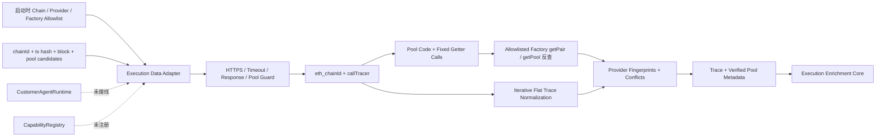

# Allowlisted EVM Execution Data Adapter v0.1

## 当前状态

`@xxyy/evm-execution-data-adapter` 是未接线的公开链执行数据边界。它从启动时配置的 provider 获取 Geth `debug_traceTransaction` / `callTracer`，并在指定历史 block 上读取和验证 Uniswap V2/V3 pool metadata，输出可以直接交给 `@xxyy/evm-execution-enrichment-core` 的 `EvmCallTrace` 与 `EvmPoolMetadata`。

该包没有真实 endpoint、环境变量 loader、后台任务或 composition root，也没有被 API、CLI、Telegram、LangGraph、`ToolRegistry`、`CapabilityRegistry` 或 MCP 引用。公开客服仍拒绝交易哈希、Explorer、链上取证和 MEV 分析；实现一个数据 adapter 不等于能力已注册、已授权或已对用户开放。

现有 `@xxyy/evm-data-adapter` 的标准 RPC allowlist 仍保持 transaction、receipt、chain id 和 block 四个方法不变。执行数据使用独立包和独立 RPC call schema，避免把通用 `debug_*` 或任意 `eth_call` 权限加入基础 snapshot client。

## 数据流

调用方只提交：

- 已配置的十进制 `chainId`；
- 32-byte `transactionHash`；
- 精确十进制 `blockNumber`，pool code 和 metadata 不使用 `latest`；
- 最多配置上限内的 `{ poolAddress, protocol }` 候选；
- 可选、但只能从启动配置中选择的 `providerIds`。

请求不能提交 endpoint、header、factory、ABI、RPC method、tracer、block tag 或任意 calldata。pool 候选应由上游 successful receipt 中 allowlisted Swap topic 提取；adapter 不从聊天文本发现或猜测 pool。

## 专用 RPC Allowlist

低层 transport 只接受以下四个 wire method：

| Method                   | 固定用途                                                                    |
| ------------------------ | --------------------------------------------------------------------------- |
| `eth_chainId`            | 验证 provider 链身份                                                        |
| `debug_traceTransaction` | 固定 `callTracer`、`onlyTopCall=false`、`withLog=false`、server timeout 10s |
| `eth_getCode`            | 在精确 block 读取候选 pool 和 allowlisted factory code                      |
| `eth_call`               | 只允许下面列出的 pool getter 与 factory lookup calldata                     |

`eth_call` 不是通用透传。首批 selector 固定为：

| ABI                               | Selector     | 用途                 |
| --------------------------------- | ------------ | -------------------- |
| `factory()`                       | `0xc45a0155` | 读取 pool factory    |
| `token0()`                        | `0x0dfe1681` | 读取排序后的 token0  |
| `token1()`                        | `0xd21220a7` | 读取排序后的 token1  |
| `fee()`                           | `0xddca3f43` | 读取 V3 uint24 fee   |
| `getPair(address,address)`        | `0xe6a43905` | V2 factory 反查 pair |
| `getPool(address,address,uint24)` | `0x1698ee82` | V3 factory 反查 pool |

pool getter 以外的参数只由 adapter 从已经校验的 token/fee 编码；写 RPC、签名、模拟、广播、任意 debug tracer、`debug_traceCall` 和任意 calldata 都会在发出 HTTP 前被拒绝。

接口与语义以 [Geth callTracer 官方文档](https://geth.ethereum.org/docs/developers/evm-tracing/built-in-tracers)、[Uniswap V2 Pair 官方接口](https://github.com/Uniswap/v2-core/blob/master/contracts/interfaces/IUniswapV2Pair.sol)、[Uniswap V3 Pool Immutables 官方接口](https://github.com/Uniswap/v3-core/blob/main/contracts/interfaces/pool/IUniswapV3PoolImmutables.sol) 和 [Uniswap V3 Factory 官方源码](https://github.com/Uniswap/v3-core/blob/main/contracts/UniswapV3Factory.sol) 为准。

## Endpoint 与传输边界

- endpoint 和认证 header 只能来自启动配置；运行时只能选择稳定 provider id。
- endpoint 默认必须为 HTTPS。只有显式启用开发选项时，才允许 `localhost`、`127.0.0.0/8` 或 `::1` 的 HTTP。
- 拒绝 URL user/password 和 fragment；path/query 可用于 provider 路由，但 provenance 不保存它们。
- HTTP 固定 `redirect: "error"`；自定义 header 复用基础 EVM provider schema，Host、Content-Length、Content-Type、Connection、Transfer-Encoding 等仍由 client 控制。
- JSON-RPC error 只保留数值 code；HTTP/fetch/provider message、响应正文、endpoint token 和 header secret 不进入结果、错误或 diagnostic。
- 响应正文同时检查声明长度并流式累计实际字节，缺少或伪造 Content-Length 不能绕过限制。

默认和绝对上限：

| 项目                    | 默认值 | 绝对上限 |
| ----------------------- | ------ | -------- |
| 单次 JSON-RPC batch     | 6      | 10       |
| 单响应正文              | 16 MiB | 32 MiB   |
| HTTP request timeout    | 30 秒  | 120 秒   |
| 自动重试                | 0 次   | 2 次     |
| retry 基础退避          | 100 ms | 2 秒     |
| 单链 execution provider | 配置   | 4 个     |
| 单请求 pool candidate   | 25     | 250      |
| normalized trace node   | 250    | 250      |
| normalized trace depth  | 32     | 32       |
| 单 trace input / output | 8 KiB  | 8 KiB    |

只有 408、425、429、5xx、网络错误和 timeout 可按部署配置有界重试；默认不自动重放高成本 trace。调用方 abort、4xx、响应超限、非法 JSON/JSON-RPC 和非法 payload 不重试。

这些是单进程、单请求的安全边界，不是生产共享 QPS、熔断或预算系统。

## Call Trace 归一化

Geth `callTracer` 返回递归 call frame。adapter 不把递归对象交给领域核心，而是用显式 stack 做前序遍历并生成 `traceAddress: number[]`：

- 节点超过 250、深度超过 32 或单个 input/output 超过 8 KiB 时整体拒绝该 provider trace，不静默截断；
- 只接受 `CALL`、`CALLCODE`、`DELEGATECALL`、`STATICCALL`、`CREATE`、`CREATE2` 和 `SELFDESTRUCT/SUICIDE`；
- address、bytes 和 canonical hex quantity 在边界校验；quantity 通过 `bigint` 直接转十进制字符串；
- provider `error` 文本只映射成稳定的 `execution_reverted`、`out_of_gas`、`invalid_opcode` 等 code，未知内容统一为 `unknown_execution_error`；原始错误文本和 `revertReason` 不保存；
- raw response 只留下 SHA-256，normalized trace source 只包含 provider id、观测时间和 payload hash；
- 跨 provider 比较使用忽略 source id/payload formatting 的 semantic fingerprint，等价 trace 不产生伪冲突。

adapter 不在这里决定 internal transfer 是否已提交，也不解码 Solidity revert data；这些语义仍由 enrichment core 根据 receipt、祖先回滚和 ABI 规则计算。

## Pool Metadata 验证

每个候选 pool 在指定历史 block 上分两阶段验证。

第一阶段读取：

1. pool code 必须存在且是有界 EVM bytes；
2. `factory()`、`token0()` 和 `token1()` 必须返回 canonical 32-byte ABI address；
3. token 不能为零、必须不同且按地址严格升序；
4. self-reported factory 必须属于当前 chain/protocol 的启动 allowlist；
5. V3 `fee()` 必须为 canonical uint24，且满足官方 factory 的 `0 < fee < 1,000,000` 边界。

第二阶段不能只相信 pool 自报 getter：

1. allowlisted factory code 必须存在；
2. V2 调用 factory `getPair(token0, token1)`，V3 调用 `getPool(token0, token1, fee)`；
3. factory 返回值必须与候选 pool address 完全相同。

通过后生成两份对齐数据：

- `poolMetadata`：enrichment core 可直接消费的 chain/pool/protocol/token/source；
- `verifiedPools`：额外保留 factory address、V3 fee、pool/factory code SHA-256 和相同 source。

两份数组按原请求 pool 顺序排列，result schema 再验证 identity、token 和 source 完全一致。原始 bytecode 和 RPC body 不进入结果。

## 多 Provider 协调与状态

最多四个已配置 provider 并行观测，单 provider 内的 pool 顺序执行，避免 pool 数量直接转化为无界并发。

1. 先单独读取并验证 chain id；chain payload 无效或与配置不一致时，不发送高成本 trace 或任何 metadata 请求。
2. chain 验证通过后才读取 trace，再按候选 pool 顺序执行两阶段 metadata 验证。
3. 每个有效 trace 和 verified pool 都生成与来源无关的 semantic fingerprint。
4. canonical 数据始终取启动配置顺序中的第一个有效观察；请求中的 `providerIds` 只能筛选，不能重排信任优先级。
5. 两个以上有效来源值不同时，输出 `trace` 或 `pool_metadata` conflict，只暴露 provider id 和 SHA-256 fingerprint，不复制大型 trace/code。
6. provider 局部失败不会丢弃其他 provider 的有效数据，但结果降级为 `partial`。

adapter 状态：

- `success`：trace 存在、所有请求 pool 均验证成功，且没有 diagnostic/conflict；
- `partial`：至少有 trace 或一个 verified pool，但存在缺失、失败、不支持或来源冲突；
- `insufficient_data`：没有任何可用 trace 或 pool metadata。

该状态只描述数据获取完整性。enrichment core 会再次验证 transaction envelope、receipt、trace parent/path/source 和日志语义，并独立输出领域 `SkillResult` 状态。

## 可重放验证

`packages/evm-execution-data-adapter/src/fixtures` 提供成功与冲突 provider replay：

- nested call/create/selfdestruct 与回滚子调用；
- V2/V3 pool、factory、token、fee、code 和 factory lookup；
- trace value 与 V3 token metadata 跨 provider 冲突。

包级测试全部注入 `fetch`，不访问真实网络，覆盖：

- 固定 selector/tracer/method 和 endpoint/header/redirect 边界；
- retry、timeout、abort、stream response limit、非法调用和错误脱敏；
- trace flatten、source-independent fingerprint、节点/深度/bytes 上限和畸形字段；
- V2/V3 成功验证、精确 block tag、factory spoof、错误链、局部 provider 失败、等价/冲突 provider、协议未配置和 pool 配额；
- adapter 输出无需转换即可进入 execution enrichment core。

## 明确未实现

- 真实 provider `.env`、Docker 配置、后台 worker、持久化或生产 composition root；
- 共享 QPS/并发预算、熔断、缓存、provider 成本计量、metrics、告警或审计存储；
- Erigon/Parity `trace_transaction`、Indexer、Explorer、archive fallback 或 provider 自动发现；
- 本 adapter 内的 block transaction 集合、pool reserve/state delta、价格、滑点、price impact、利润或 Sandwich verdict；这些由独立 MEV observation adapter 和离线 price-impact/Sandwich core 负责；
- Capability manifest/adapter、内部授权 grant、MCP、LangGraph bridge、API/CLI/Telegram 入口；
- 私有账户、签名、模拟、交易广播、投资建议或任何写链操作。

独立 [MEV Observation Data Adapter](evm-mev-observation-data-adapter.md) 已能生成 [EVM Price Impact / Sandwich Core](evm-price-impact-sandwich.md) 所需的 block 邻近交易、pre/post pool state、actor token delta 和 source conflicts；[Chain Analysis Harness](evm-chain-analysis-harness.md) 已完成离线组合、合成回放与质量门禁；[Readiness Control Plane](evm-chain-analysis-readiness.md) 已定义单 owner 复核 corpus 和真实 provider 跨实例预算/审计/告警证据契约。下一阶段仍须实际采集主网 reviewed evidence、实现 provider backend，并完成内部 channel 授权、Capability bridge 和运行面安全审查。满足这些条件前，不注册链上 Capability。
