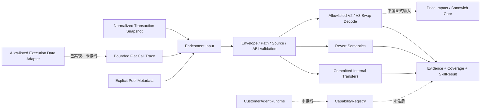

# EVM Execution Enrichment Core v0.1

## 当前状态

`@xxyy/evm-execution-enrichment-core` 是未接线、无网络依赖的离线领域包。它在 `@xxyy/transaction-analysis-core` 的 transaction/receipt 基础事实之外，消费 normalized call trace 与显式 pool metadata，确定性输出 internal native transfer、revert 语义和首批 Uniswap V2/V3 swap 语义。

该包不获取 trace，不调用 RPC、Indexer 或 Explorer，不读取环境变量，不依赖 LLM、LangGraph、`ToolRegistry`、`CapabilityRegistry` 或 MCP。现有 `@xxyy/evm-data-adapter` 仍只读取 transaction、receipt、chain id 和 block；独立的 `@xxyy/evm-execution-data-adapter` 已能从受控 callTracer 和 factory 反查生成 trace/pool metadata；`@xxyy/evm-price-impact-sandwich-core` 可在额外 block/state/delta 输入完整时消费 directional swap。仓库中仍没有 composition root 把这些包连接到 API、CLI、Telegram 或客服 Agent。交易、Explorer、链上取证和 MEV 问题继续返回现有边界回复。

## 数据流与职责边界

`transaction-analysis-core` 仍负责 root transaction value、gas fee、标准 ERC-20 Transfer 和 block timeline。enrichment core 排除 root value，只描述调用树内部的额外原生资产移动，避免合并结果时重复计算。

## 输入契约与资源上限

### Flat Call Trace

Trace 使用扁平节点和 `traceAddress: number[]`，不接受递归对象。这样可以在进入算法前限制总节点与深度，避免深递归和无界调用树。

| 项目                  | v0.1 上限 |
| --------------------- | --------- |
| Trace 节点            | 250       |
| Trace 深度            | 32        |
| 单个 input / output   | 8 KiB     |
| 单个 path component   | 999       |
| 可处理 swap event     | 250       |
| Pool metadata 条目    | 250       |
| Snapshot receipt logs | 500       |

Trace 必须满足：

- 恰好一个 `traceAddress: []` root；每个非 root 节点都有已存在的 parent；path 唯一；
- 所有节点引用同一个显式 trace source；chain id 与 transaction hash 匹配；
- root 的 from、to/creation 类型、value 和 input 与 normalized transaction envelope 匹配；
- call type 只允许 `call`、`callcode`、`create`、`create2`、`delegatecall`、`selfdestruct` 和 `staticcall`；
- value、gas、地址和 bytes 在 Zod 边界归一化并保持 lossless 十进制或 hex。

Trace 字段畸形时不会把 Zod issue、原始 output 或供应商错误透传到结果；enrichment 返回 `trace_invalid`。语法正确但链、交易或 root envelope 不匹配时返回 `trace_transaction_mismatch` 或 `trace_envelope_mismatch`，并拒绝从该 trace 生成转账或回滚结论。

### Pool Metadata

每条 metadata 必须显式声明 chain、pool address、`uniswap_v2 | uniswap_v3`、不同的 token0/token1，以及带观测时间的 source。相同 chain/pool 不允许重复。core 不通过日志地址猜 token，不查询 `token0()` / `token1()`，也不让 LLM补充元数据。

Metadata 是带 provenance 的输入事实，core 本身不假定所有调用方都完成链上验证。独立 execution data adapter 会在精确 block 上交叉检查 pool/factory code、protocol-specific factory allowlist、排序 token、V3 fee 和 factory `getPair/getPool` 返回值，并把验证来源映射到 metadata；其他调用方若直接构造输入，仍必须把可信度限制在其 source 范围内。

## Internal Native Transfer 的提交语义

内部原生转账只有同时满足以下条件才进入结果：

1. 存在匹配且状态为 success 的 receipt；
2. 当前 trace 节点为 success；
3. root 到 parent 的每个祖先节点都是 success；
4. call type 为 `call`、`create`、`create2` 或 `selfdestruct`；
5. value 大于零且 recipient 存在。

回滚节点、成功但位于回滚祖先下的节点，以及 `delegatecall` / `staticcall` / `callcode` 不产生已提交转账。非 value call type 若报告非零 value，会返回 `non_value_call_reports_value`，不会把它当作资产移动。

每个 transfer 绑定唯一 trace Evidence。聚合后的 `nativeAssetChanges` 只包含 internal transfer，不包含 root value 或 gas fee；结果 schema 再次验证所有 change 属于当前 chain、零变化被省略且全局 raw delta 净和为零。

## Revert 语义

对每个 `status: reverted` 节点，core 严格区分：

- `Error(string)`：selector 为 `0x08c379a0`，要求 canonical offset、长度、32-byte padding、有效 UTF-8、最多 1024 bytes 且不含控制字符；
- `Panic(uint256)`：selector 为 `0x4e487b71`，要求恰好一个 uint256 word，并按 Solidity 官方 panic code 映射稳定说明；
- `custom_error`：只保留未知 4-byte selector，不猜错误名称或参数 ABI；
- `empty`：没有 revert data；
- `malformed`：标准 selector 存在但 ABI 非 canonical、越界或包含非法文本。

Evidence 只保存 call type、from/to、path、status、value、input/output 长度和已解码语义，不复制原始 trace input/output。`Error(string)` 的短 reason 属于解码事实，可以进入结构化结果；任何 finding statement 都不会拼接不可信 reason 文本。

Panic code 和内置 Error/Panic 行为以 [Solidity 官方控制结构文档](https://docs.soliditylang.org/en/latest/control-structures.html) 为准。

## Uniswap V2 / V3 Swap 解码

v0.1 只 allowlist 两个官方 pool 事件：

- V2 `Swap(address,uint256,uint256,uint256,uint256,address)`，对应 [Uniswap V2 Pair 官方源码](https://github.com/Uniswap/v2-core/blob/master/contracts/UniswapV2Pair.sol)；
- V3 `Swap(address,address,int256,int256,uint160,uint128,int24)`，对应 [Uniswap V3 Pool Events 官方接口](https://github.com/Uniswap/v3-core/blob/main/contracts/interfaces/pool/IUniswapV3PoolEvents.sol)。

V2 输出四个原始 in/out uint256，并用 `amountIn - amountOut` 计算 pool 的 token0/token1 delta。V3 把前两个 ABI word 作为 signed int256 pool delta，同时验证 `sqrtPriceX96 <= uint160`、`liquidity <= uint128` 和 `tick` 在 int24 范围。所有数值使用 `bigint` 后转 canonical 十进制字符串，不经过 JS number。

只有一个 pool delta 为正、另一个为负时，结果才给出 `token0_to_token1` 或 `token1_to_token0`、tokenIn/tokenOut 和 amountIn/amountOut。相同符号或零方向仍可保留原始 pool delta，但方向是 `ambiguous`，不输出推测的 token 或金额方向，结果降级为 `partial`。

以下情况只记录 recognized/unresolved coverage，不生成 swap：

- 缺 pool metadata 或 metadata protocol 与 event topic 不一致；
- topic address、data word 数或 V3 位宽不合法；
- log 被 removed 或 log index 重复；
- 超过 250 个 recognized swap event。

日志来源未注册时，core 可以保留通过 ABI 与显式 metadata 得到的结构化 swap，但必须返回 `unknown_log_source` 并降级为 `partial`；调用方不能把这种结果当作 provenance 完整的结论。

v0.1 的 delta 是事件声明的 pool balance delta，不等于独立验证过的 token Transfer 总和、用户实际成交额或价格影响。多 pool 路由也不会自动合并为一笔用户 swap。独立 [EVM Price Impact / Sandwich Core](evm-price-impact-sandwich.md) 只在调用方额外提供受验证的单 pool pre/post state、route/mode/token behavior 和 block coverage 后，才会复算支持范围内的 quote。

## 状态与 Coverage

结果使用统一 `SkillResult`：

- `success`：transaction/receipt/trace 一致，输入均有效，且没有无法解析或来源缺口；交易本身可以是 reverted，回滚不是分析失败；
- `partial`：缺 receipt/trace/metadata，trace 或来源不一致，ABI/log 畸形、方向 ambiguous、资源超限，或只有部分语义可确认；
- `insufficient_data`：缺 requested transaction，或返回 transaction hash 与请求不一致；
- `failed`：保留给未来不可恢复的执行故障；当前纯函数对 schema 合法输入不使用该状态。

`coverage` 独立记录 trace 是否 available/missing/invalid/mismatched、有效节点数、receipt logs 状态，以及 recognized/decoded/unresolved swap 数。schema 要求 `recognized = decoded + unresolved`，非成功 receipt 不允许产生 recognized swap，trace 不可用时节点数必须为零。

## 可重放测试资产

`packages/evm-execution-enrichment-core/src/fixtures` 包含四组完全合成的数据：

| Fixture                               | 主要覆盖                                                        |
| ------------------------------------- | --------------------------------------------------------------- |
| `success-internal-swaps.json`         | 成功 trace、回滚子调用、call/create/selfdestruct、V2/V3 swap    |
| `reverted-error.json`                 | 整体回滚、Error(string)、root/descendant value 不提交           |
| `nested-reverts.json`                 | 被捕获 Panic、未知 custom selector、empty revert、祖先回滚      |
| `partial-missing-trace-metadata.json` | trace 与 pool metadata 缺失、recognized 但 unresolved 的 V2 log |

包级测试还覆盖 path/source/深度/节点/bytes 上限、transaction envelope mismatch、receipt 缺失、非 value call、malformed Error、V3 位宽、removed/重复/未知来源 log、metadata 冲突、ambiguous direction、250-event 上限、Evidence 引用、方向一致性和原生资产守恒。测试只读取 fixtures，不访问网络。

## 明确未实现

- 本 core 内的 debug/trace RPC、archive node、Indexer 或 Explorer trace adapter；callTracer 数据获取位于独立 execution data adapter；
- 本 core 内的 pool factory/code/token metadata 查询；独立 execution data adapter 已实现 allowlisted provider 获取、factory 反查和多 provider 冲突保留；
- ERC-20 Transfer 与 swap event 的逐笔对账、fee-on-transfer/rebase token 特殊处理；
- router calldata、multicall、多 hop path 或聚合器语义；
- decimals、symbol、价格、滑点、price impact、法币金额或利润；
- 本 core 内的 block 邻近交易、价格影响和 Sandwich 判定；独立 price-impact/Sandwich core 已实现有界单 pool 四态 verdict，但不做多地址攻击者聚类；
- Capability manifest/adapter、MCP、LangGraph bridge、API/CLI/Telegram 入口；
- 私有账户数据、签名、模拟、交易发送或投资建议。

独立、allowlisted 的 [EVM Execution Data Adapter](evm-execution-data-adapter.md)、[MEV Observation Data Adapter](evm-mev-observation-data-adapter.md) 及交叉 provider replay，离线 [EVM Price Impact / Sandwich Core](evm-price-impact-sandwich.md)、[Chain Analysis Harness](evm-chain-analysis-harness.md)、[Readiness Control Plane](evm-chain-analysis-readiness.md) 和未部署的 [Postgres Control Store](evm-chain-analysis-control-store.md) 已完成。仍缺真实 reviewed 主网 corpus、真实 provider/composition backend、control store 生产部署、有效运维证据、内部授权和运行面安全审查；这些完成前不注册链上 Capability。
