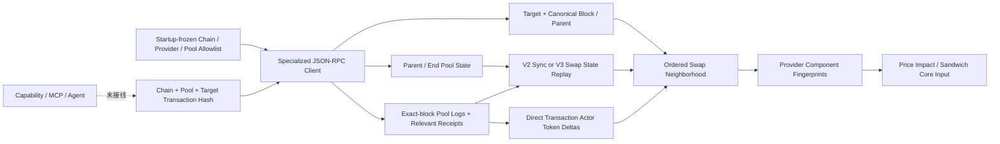

# Allowlisted MEV Observation Data Adapter v0.1

## 当前状态

`@xxyy/evm-mev-observation-data-adapter` 是一个未接线的只读 EVM 数据边界。它以启动时冻结的 chain、archive provider、Uniswap V2/V3 pool、排序 token、fee 和 exact-input route policy 为信任根，从精确目标交易构建同区块 pool swap neighborhood，并直接输出 `@xxyy/evm-price-impact-sandwich-core` 的输入。

该包没有真实 RPC endpoint、环境变量 loader、后台任务或生产 composition root，也没有被 API、CLI、Telegram、LangGraph、`ToolRegistry`、`CapabilityRegistry` 或 MCP 引用。它不会改变公开客服边界；交易哈希、Explorer、池子查询、链上取证和 MEV 问题仍返回现有边界或澄清回复。

## 数据流与信任边界

运行时输入只有：

- `chainId`；
- 已配置 `poolAddress`；
- `targetTransactionHash`；
- 可选的已配置 provider id 子集。

运行时不能提供 endpoint、header、pool metadata、fee、router policy、RPC method、calldata、tracer 或 block range。provider 必须在启动配置中显式声明 `archive: true`；pool 必须声明 `standard` token behavior，V2 fee 固定为官方 3000 pips，token0/token1 必须非零且严格地址排序。

## 专用 JSON-RPC Allowlist

client 只接受以下语义化 operation 和固定 wire method：

| Operation          | Wire method                 | 固定约束                                                |
| ------------------ | --------------------------- | ------------------------------------------------------- |
| chain id           | `eth_chainId`               | 无参数                                                  |
| target transaction | `eth_getTransactionByHash`  | 参数必须等于目标 hash                                   |
| block              | `eth_getBlockByHash`        | 目标 block hash，完整 transaction objects               |
| parent block       | `eth_getBlockByHash`        | 精确 parent hash，仅 header                             |
| pool logs          | `eth_getLogs`               | 只允许 `{ blockHash, address: configuredPool }`         |
| receipt            | `eth_getTransactionReceipt` | 只读取已发现 pool swap 的 transaction                   |
| V2 reserves        | `eth_call`                  | 固定 `getReserves()` selector                           |
| V3 state           | `eth_call`                  | 固定 `slot0()`、`liquidity()`、`tickSpacing()` selector |
| V3 range           | `eth_call`                  | adapter 内部编码的 `tickBitmap(int16)`、`ticks(int24)`  |

所有 state call 都使用 EIP-1898 `{ blockHash, requireCanonical: true }`，不使用易受链头移动影响的 `latest` 或仅 block number 引用。EIP-1898 明确定义了按 block hash 请求状态及 `requireCanonical` 语义；标准 JSON-RPC 的 block、receipt、log 与 call 形状以 Ethereum 官方文档为准。

参考：

- [EIP-1898: Add `blockHash` to JSON-RPC methods which accept a default block parameter](https://eips.ethereum.org/EIPS/eip-1898)
- [Ethereum JSON-RPC API](https://ethereum.org/developers/docs/apis/json-rpc/)

任意写方法、generic read、`debug_traceTransaction`、arbitrary `eth_call`、非 canonical state reference、`fromBlock/toBlock` log range 或不匹配的 hash/address 都在发起网络请求前被 schema 拒绝。

## Block、Receipt 与顺序验证

adapter 先读取目标 transaction，再用其 `blockHash` 获取完整 block。它要求：

1. target 的 block hash、number 和 transaction index 都非 pending；
2. block hash/number 与 target 完全一致；
3. block 中每笔 transaction 的 `transactionIndex` 等于数组位置，hash 唯一，并指回同一 block；
4. block 内目标 transaction 的 hash、from、to、input、nonce 和 value 与 discovery 结果一致；
5. parent hash 存在，parent number 恰好为当前 block number 减一；
6. pool logs 按全局 log index 严格递增、未 removed，并能映射回 block transaction；
7. 每个相关 receipt 成功、属于同一 block/transaction，receipt 中的 pool logs 与 `eth_getLogs` 结果逐项一致。

任何 reorg、缺 block、顺序不一致、receipt 回滚、log 缺失或 provider payload 畸形都 fail closed，不生成分析输入。

## Transaction-boundary Pool State

JSON-RPC 没有通用的“交易执行到第 N 笔后的 `eth_call`”接口，因此 v0.1 不伪造 transaction-boundary archive call。它用 canonical parent state 作为起点、官方 pool event 作为顺序状态转换、canonical block-end state 作为闭合校验。

### Uniswap V2

1. 在 parent block hash 读取 `getReserves()`；
2. 按 block log 顺序处理 pool `Sync` 与 `Swap`；
3. Uniswap V2 Pair 在 `_update` 中更新 reserves 并发出 `Sync`，随后 swap 流程发出 `Swap`，因此对应 `Sync` 可作为该 swap 的 post-state；
4. 上一状态作为 pre-state，`Sync` reserves 作为 post-state；
5. 重放终态必须与当前 block hash 的 `getReserves()` 完全一致。

实现依据：[Uniswap V2 Pair 官方源码](https://github.com/Uniswap/v2-core/blob/master/contracts/UniswapV2Pair.sol)。

### Uniswap V3

1. 在 parent block hash 读取 `slot0()`、`liquidity()` 和 `tickSpacing()`；
2. 在有界 bitmap word 窗口中读取 `tickBitmap`，查找包围 parent tick 的最近 initialized lower/upper tick；
3. 用 `ticks(lower/upper)` 验证两端确实 initialized，并用官方 TickMath 计算严格 active-range sqrt-price 边界；
4. 按 `Swap` event 中的 post `sqrtPriceX96`、`liquidity` 和 `tick` 重放每笔状态；
5. 任一 swap 到达/跨过边界、出现同 pool 的非 Swap event，或终态与当前 block 的 `slot0()` / `liquidity()` 不一致时，返回不支持或状态冲突。

这意味着 v0.1 只证明单一 active range、区块内没有其他 pool 状态事件的 V3 neighborhood，不会把跨 tick 或 liquidity mutation 当成常量流动性近似。

实现依据：

- [Uniswap V3 pool state interface](https://github.com/Uniswap/v3-core/blob/main/contracts/interfaces/pool/IUniswapV3PoolState.sol)
- [Uniswap V3 pool events](https://github.com/Uniswap/v3-core/blob/main/contracts/interfaces/pool/IUniswapV3PoolEvents.sol)
- [Uniswap V3 TickBitmap](https://github.com/Uniswap/v3-core/blob/main/contracts/libraries/TickBitmap.sol)
- [Uniswap V3 TickMath](https://github.com/Uniswap/v3-core/blob/main/contracts/libraries/TickMath.sol)

## Swap、Route 与 Actor Delta

每个 pool Swap 必须在一个成功 receipt 中唯一出现，并通过现有 execution enrichment core 的严格 V2/V3 event decoder 转成 directional swap。

- `actor` 固定为 transaction `from`；不把 router、recipient、builder、coinbase 或关联地址聚类为同一 actor。
- 只汇总 token0/token1 的标准 ERC-20 `Transfer`，并只计算直接流入/流出 transaction actor 的 raw delta。
- 同时汇总 pool 的 token transfer delta，并与 Swap event 的 pool delta 对账；不一致时 token behavior 降为 `unknown`，下游 core 不使用 standard-token 数学。
- receipt 只有一个 V2/V3 Swap topic 时 route 为 `single_pool`；多个时为 `multi_hop`，否则为 `unknown`。
- `exact_input` 只在 startup allowlisted route target + selector 命中，或 V3 direct pool calldata 的 `amountSpecified > 0` 时成立；V2 direct pair `swap` 是 exact-output 语义。无法证明时输出 `unknown`，不猜 router 行为。

因此 router 代持、最终 beneficiary、多地址攻击者、native/WETH unwrap 和特殊 token 等场景会保守降级，而不是扩大 actor 归因。

## 多 Provider 一致性与输出状态

每个 provider 独立构建完整分析输入。adapter 对以下语义组件分别生成不含 provider source 的 SHA-256 fingerprint：

- canonical block hash、number 与完整 transaction order；
- swap、transaction index、route/mode/token behavior；
- 每笔 pre/post pool state；
- actor identity 与 actor token delta。

按启动配置顺序选择第一个完整 provider 作为 canonical input。两个完整 provider 对任一组件有差异时，生成 `block_transactions | swap | pool_state | actor_asset_deltas` conflict，并原样投影到 price-impact/Sandwich core 输入，使领域 core 返回 `insufficient_data`，不会“多数投票”掩盖 reorg 或 provider 分歧。

adapter 的结果状态为：

- `success`：所有请求 provider 都完整成功，三类 coverage complete，且没有 diagnostic/conflict；
- `partial`：至少一个 provider 形成可用 canonical input，但存在 provider 失败、coverage 缺口或 conflict；
- `insufficient_data`：没有 provider 能形成满足 schema 的分析输入。

provenance 只保留 provider id、origin、统一观测时间和所有 RPC response payload hash 的组合指纹；endpoint path/query、header、RPC error message 与 response body 不进入对外 diagnostic。

## Transport 与资源边界

每个 provider client 独立实施：

- HTTPS；只有显式 opt-in 才允许 loopback HTTP；拒绝 URL credentials、fragment 和 redirect；
- timeout、有界 retry、流式 response byte limit、batch limit；
- provider-local 并发上限、固定窗口请求预算和 circuit breaker；
- 有界 immutable-call LRU/TTL cache；
- request、RPC call、response bytes、cache hit 和启动配置 cost unit 计量；
- 只含 provider id、operation、fingerprint、耗时、成本和稳定结果码的 metrics hook。

主要默认值与绝对上限：

| 资源                          |     默认 | 绝对上限 |
| ----------------------------- | -------: | -------: |
| Provider / chain              | 配置数量 |        4 |
| Pool / chain                  | 配置数量 |       64 |
| Block transactions            |      512 |    1,024 |
| Pool logs                     |      512 |    2,048 |
| Relevant swap transactions    |       64 |      256 |
| Receipt logs / transaction    |      500 |      500 |
| V3 bitmap words / side        |        8 |       32 |
| RPC batch                     |       32 |      256 |
| Response bytes / request      |    8 MiB |   32 MiB |
| Timeout                       |     30 s |    120 s |
| Retry                         |        1 |        3 |
| Concurrent request / provider |        2 |       16 |
| Cache entries / provider      |      256 |    4,096 |

这些控制是进程内、provider-local 的 v0.1 防护，不是多副本共享配额、持久化审计、告警系统或生产 provider SLA。

## 可重放验证

包内两组完全合成 replay fixture：

| Fixture       | 覆盖                                                                               |
| ------------- | ---------------------------------------------------------------------------------- |
| `provider-v2` | 三笔相邻 swap、Sync 状态重放、完整 actor delta，直接进入 core 得到 confirmed       |
| `provider-v3` | 单 active range、bitmap/tick 验证、官方 TickMath 边界，直接进入 core 得到 unlikely |

35 个包级测试覆盖 V2/V3、canonical EIP-1898 call、block/log/receipt 对账、四类 provider component conflict、archive 不可用、终态不闭合、资源上限、immutable cache、路由语义未知、byte determinism、ABI width/sign、TickMath、endpoint/method/calldata allowlist、retry、timeout、abort、response bytes、rate/concurrency/circuit 和错误脱敏。

fixtures 不含真实 endpoint、用户钱包、API key 或主网事实；它们是确定性协议与安全回归，不是主网误报/漏报评测。

## 明确未实现

- 真实 archive provider 配置、密钥注入、跨实例共享配额、持久化审计、告警和 SLA；
- 由基础 transaction adapter、execution adapter 与 observation adapter 组成的生产 composition root；
- 经人工审核的主网 corpus、目标 router/chain 的实际覆盖和通过 internal-readiness 的误报/漏报基线；离线 corpus schema、合成矩阵与门禁已在独立 harness 中实现；
- V3 跨 tick、Mint/Burn 等同区块 liquidity mutation、multi-pool/multi-hop、aggregator、fee-on-transfer 或 rebase；
- 多地址 actor clustering、private bundle/mempool attribution、intent 判断、gas/builder payment 后净利润；
- Capability adapter、授权 grant、MCP、LangGraph bridge、API、CLI 或 Telegram 入口。

独立 [EVM Chain Analysis Composition & Evaluation Harness](evm-chain-analysis-harness.md) 已把 transaction snapshot、execution enrichment、MEV observation 与 price-impact/Sandwich core 串成可重放 pipeline，并建立 future capability projection、synthetic/reviewed corpus schema、coverage/误报/漏报指标和两层质量门禁；[Readiness Control Plane](evm-chain-analysis-readiness.md) 已定义单 owner 复核和真实 provider 跨实例预算/审计/告警证据契约。下一阶段是按契约实际采集公开主网样本、实现共享 backend，并实际通过 internal-readiness gate。完成真实 provider 安全评审、内部授权和端到端质量门禁前，不注册 `chain.detect_sandwich`。
