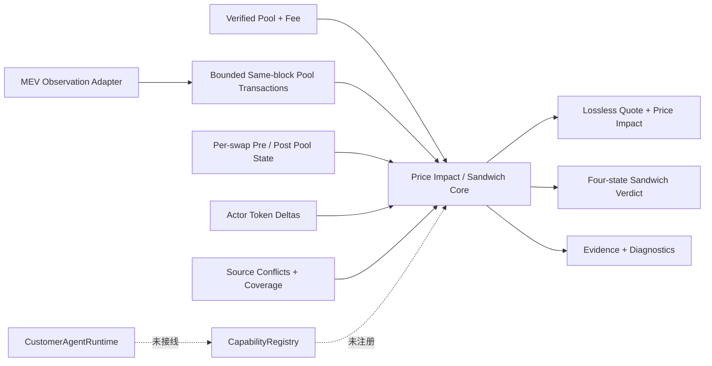

# EVM Price Impact / Sandwich Detection Core v0.1

## 当前状态

`@xxyy/evm-price-impact-sandwich-core` 是未接线、无网络依赖的离线领域包。它消费一个已经归一化的同区块、同 pool swap neighborhood，以及每笔 swap 前后的 pool state 和交易 actor 的 token delta，确定性输出：

- 目标 swap 的 raw execution price、pre-swap spot price、官方公式 quote 和 price impact ppm；
- 候选 frontrun 之前执行目标 swap 的 counterfactual quote 与受害者 raw loss；
- `confirmed | likely | unlikely | insufficient_data` 四态 Sandwich verdict；
- 可引用的 transaction、block、pool-state 和 calculation Evidence，以及稳定 diagnostics。

该包没有 RPC、Indexer、Explorer、环境变量、LLM、LangGraph、Capability 或 MCP 依赖，也没有被 API、CLI、Telegram 或客服 Agent 引用。交易哈希、Explorer、链上取证和 MEV 问题仍走公开客服的边界回复。

`confirmed` 只确认本 v0.1 证据模型中的同 pool 三笔交易结构，不推断攻击者主观意图，也不等于法律判断。`attackerProfitRaw` 是 profit token 的 raw gross gain，`intermediateRemainderRaw` 单独记录另一 pool token 的剩余量；两者都未扣 gas、builder payment、借贷费或其他链下成本。

## 数据流



## 输入契约

输入只接受一个已经验证的 pool 和最多 256 个相关 swap observation。每个 observation 必须包含：

- 同一 `blockNumber` 中唯一的 transaction hash 和 transaction index；
- 明确的 transaction actor；
- enrichment core 输出的单个 Uniswap V2/V3 directional swap；
- `single_pool | multi_hop | aggregator | unknown` route kind；
- `exact_input | exact_output | unknown` swap mode；
- `standard | fee_on_transfer | rebase | unknown` token behavior；
- swap 前后带独立 provenance 的 pool state；
- 可选 actor token delta。

pool identity 固定 chain、address、排序 token0/token1、protocol 和 fee。V2 只接受官方 3000 fee pips 与正的 uint112 reserves；V3 接受受验证的 fee、正的 uint128 active liquidity、uint160 `sqrtPriceX96`、int24 tick，以及严格包围当前价格的 active-range 边界。

`coverage` 显式声明：

- block 中与该 pool 相关的交易是否完整；
- 每笔交易边界的 pool state 是否完整；
- actor token delta 是否完整。

任何 `pool_state`、`swap`、`actor_identity`、`actor_asset_deltas`、`pool_metadata` 或 `block_transactions` source conflict 都阻止 `confirmed` / `likely` / `unlikely`，结果降级为 `insufficient_data`。声明 actor delta coverage 完整时，每个 observation 都必须提供 delta，不能用 coverage 标签掩盖缺失数据。

## Lossless AMM 数学

所有 token、reserve、liquidity、price 和比例计算都使用 `bigint`。输出使用 canonical 十进制字符串和约分后的 `{ numerator, denominator }`，不经过 JavaScript floating point，也不读取 token decimals 或法币价格。

### Uniswap V2

V2 exact-input quote 逐项复刻官方 `getAmountOut`：

```text
amountInWithFee = amountIn * 997
amountOut = floor(
  amountInWithFee * reserveOut /
  (reserveIn * 1000 + amountInWithFee)
)
```

中间 `SafeMath` uint256 溢出与 pool reserve uint112 边界都会 fail closed。pre-state reserves 加上 Swap event 的两个 pool delta 必须精确等于 post-state reserves，observed output 也必须等于 quote，否则返回 `quote_mismatch` 或 `pool_state_transition_mismatch`。

公式以 [Uniswap V2 Library 官方源码](https://github.com/Uniswap/v2-periphery/blob/master/contracts/libraries/UniswapV2Library.sol) 和 [Uniswap V2 Pair 官方源码](https://github.com/Uniswap/v2-core/blob/master/contracts/UniswapV2Pair.sol) 为准。

### Uniswap V3

V3 v0.1 只支持 `exact_input` 且不跨 initialized tick 的单 active range：

1. 按 `floor(amountRemaining * (1e6 - feePips) / 1e6)` 扣除输入 fee；
2. token0 input 使用 `getNextSqrtPriceFromAmount0RoundingUp` 的溢出分支与向上舍入；
3. token1 input 使用 `getNextSqrtPriceFromAmount1RoundingDown` 的向下舍入；
4. output 分别使用向下舍入的 amount1 / amount0 delta；
5. expected next price 必须严格留在声明的 active range，并与 post-state 及 Swap event 的 `sqrtPriceX96` 完全一致；liquidity、tick 和 observed output 也必须一致。

这对应官方 [SwapMath](https://github.com/Uniswap/v3-core/blob/main/contracts/libraries/SwapMath.sol)、[SqrtPriceMath](https://github.com/Uniswap/v3-core/blob/main/contracts/libraries/SqrtPriceMath.sol) 和 [V3 Swap event](https://github.com/Uniswap/v3-core/blob/main/contracts/interfaces/pool/IUniswapV3PoolEvents.sol)。需要跨 tick 时不静默使用常量 liquidity 近似，而是返回 `unsupported_active_tick_crossing`。

### Price Impact

execution price 是 raw `amountOut / amountIn`。pre-swap spot price 为：

- V2 token0 → token1：`reserve1 / reserve0`；反向取倒数；
- V3 token0 → token1：`sqrtPriceX96² / 2¹⁹²`；反向取倒数。

输出 ppm 使用有符号整数截断：

```text
priceImpactPpm =
  (spotPrice - executionPrice) / spotPrice * 1,000,000
```

price impact 包括 pool fee 和 curve movement，只描述 raw token execution，不是法币损失、滑点设置或投资建议。目标 observed output 必须先通过官方 quote 与 post-state 复算，才会生成 price impact。

## Sandwich 四态门禁

研究文献把 Sandwich 描述为 attacker manipulation、victim execution、attacker de-manipulation 的有序三阶段，并强调 profit 是资产流入减流出。v0.1 采用更保守的链上证据门禁，参考 [High-Frequency Trading on Decentralized On-Chain Exchanges](https://arxiv.org/abs/2009.14021)、[Flash Boys 2.0](https://arxiv.org/abs/1904.05234) 和 [USENIX Ethereum Arbitrage Ecosystem 研究](https://www.usenix.org/conference/usenixsecurity23/presentation/mclaughlin)。

只检查目标交易在同 pool observation 序列中的直接前一笔和后一笔，避免在 v0.1 中组合大量启发式候选。

### `confirmed`

必须同时满足：

1. `front.index < victim.index < back.index`，三笔交易是该 pool 的直接相邻 observation；
2. front/back 是同一个非 victim actor；
3. front 与 victim 同方向，back 方向相反；
4. front post-state 等于 victim pre-state，victim post-state 等于 back pre-state；
5. 三笔 swap 均通过官方 quote、post-state 和资源边界验证；
6. 以 front pre-state 重放 victim 时，counterfactual output 大于实际 output；
7. front 和 victim 沿目标方向降低 directional spot，back 将 spot 向相反方向恢复；
8. pool-level front/back raw delta 显示 profit token 为正、intermediate token 不需要外部补充；
9. front/back actor token delta 分别精确镜像对应 pool swap，形成可验证的资产闭环。

如果上述局部三笔证据完整闭环，但更宽 neighborhood 的 coverage 仍为 partial，verdict 可以保留 `confirmed`，整体 `SkillResult.status` 必须降为 `partial`；只有局部证据与更宽 coverage 都完整且无 diagnostic 时才返回 `success`。

### `likely`

满足顺序、actor、方向、state continuity、counterfactual victim loss 和 pool-level 正收益，但 actor token delta coverage 明确为 partial。它不会声称资产闭环已经验证，并返回 `actor_deltas_missing` diagnostic。

### `unlikely`

只有 block transaction、pool state、actor delta 三类 coverage 全部 complete、没有 source conflict、所有 observation 都受支持且可复算时，缺少有效相邻三笔结构或存在明确反例才返回 `unlikely`。完整 actor delta 与候选 pool flow 冲突时也属于反例，不会降级成 `likely`。

### `insufficient_data`

以下任一情况都会返回 `insufficient_data`：

- neighborhood、pool state 或 actor delta coverage 不完整，且没有达到 confirmed/likely 的局部证据；
- source conflict；
- 目标或候选 quote/state 不一致；
- multi-hop、aggregator、exact-output、fee-on-transfer、rebase 或 unknown 语义；
- V3 quote 跨 active tick；
- 缺相邻 front/back 时又无法证明 block coverage 完整。

如果目标 price impact 可独立计算，但 Sandwich 证据不足，统一 `SkillResult.status` 为 `partial`；两者都不可用时为 `insufficient_data`。

## Evidence 与可重放验证

结果复用共享 `SkillResult`，输出：

- `transaction:<hash>`：actor、index、方向、route/mode/token behavior；
- `pool-state:<hash>:before|after`：有界 pool state 和独立 source；
- `block:<chain>:<number>`：coverage 与脱敏 source conflict；
- `calculation:price-impact:<hash>`：quote model、amount 和 ppm；
- `calculation:sandwich:<hash>`：counterfactual loss、pool-token gross profit 和资产闭环状态。

fixtures 全部使用合成地址、hash、数值和 provenance，不包含生产 endpoint、用户钱包或真实 API 数据：

| Fixture        | 覆盖                                                                     |
| -------------- | ------------------------------------------------------------------------ |
| `confirmed-v2` | 相邻三笔、counterfactual victim loss、正收益、完整 actor token 闭环      |
| `unlikely-v3`  | 官方 V3 单 active-range rounding、完整单笔 neighborhood、无相邻 Sandwich |

deterministic tests 还覆盖 likely、source conflict、actor delta 反例、partial neighborhood、multi-hop/aggregator、exact-output、特殊代币、V3 tick crossing、quote/state mismatch、资源上限、Evidence 引用和 byte-identical replay。该集合是 v0.1 的合成误报/漏报回归基线，不声称覆盖真实主网所有 router、builder bundle 或多地址攻击者。

## 明确未实现

- core 本身不访问网络；独立 [MEV Observation Data Adapter](evm-mev-observation-data-adapter.md) 已能用 allowlisted provider replay 构建 block neighborhood、V2/V3 单 active-range transaction-boundary state 和直接 actor delta，但尚无真实生产 endpoint/composition root；
- V3 跨 tick、多 pool/multi-hop、aggregator、exact-output、fee-on-transfer 或 rebase 数学；
- 多地址 actor clustering、private bundle / mempool attribution、intent 推断或真实 gas/builder payment 后的净利润；
- token decimals、symbol、USD price、市场基准、交易建议或损失追偿结论；
- 跨实例共享 provider 配额、持久化审计、告警、真实 provider SLA 和主网标注质量基线；
- Capability adapter、授权 grant、MCP、LangGraph bridge、API/CLI/Telegram 入口。

[EVM Chain Analysis Composition & Evaluation Harness](evm-chain-analysis-harness.md) 已把 transaction、execution、observation 和本 core 串成可重放 pipeline，并建立 synthetic/reviewed corpus schema、coverage matrix 与误报/漏报门禁。下一阶段是经审批的 reviewed 主网 corpus 和真实 provider 运维设计；完成 internal-readiness gate、内部授权、Capability bridge、安全审查和端到端评测前，不注册 `chain.detect_sandwich`，也不改变公开客服边界。
