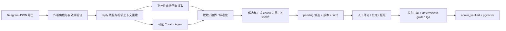

# 受控知识演进与 Knowledge Curator

当前实现不会让模型直接“学习群聊”或自动修改线上知识。Telegram 消息先经过作者验证、线程重建、确定性规则与可选 Knowledge Curator Agent，生成 `pending` 候选；只有人工审核和现有发布门禁全部通过后，才会进入 `admin_verified` 知识库。

Web、Telegram Bot、API 和 CLI 始终只读取已经发布到 pgvector 的正式知识。公开客服运行面没有候选写入、批准或发布工具。



## 安全边界

- Telegram 原始导出不提交到 Git，也不直接进入正式知识库。
- 作者权限只来自时点有效的可信作者名册、Telegram Bot API 当前管理员结果，或人工显式传入的 `--admin-id`；禁止根据语气、昵称、频率或内容猜管理员。
- Telegram API 的当前管理员结果不能证明历史角色。历史导出使用该结果时，候选会带 `historical_role_unverified` 风险，必须人工复核。
- 匿名管理员、以群或频道身份发言、缺少作者 ID 的消息不会被当作已验证知识来源。
- 账户、订单、余额、私有交易、投资建议和当前不支持的链上取证问题在候选阶段过滤。
- 进入模型和数据库前会脱敏密钥、地址、交易哈希、邮箱、电话、Telegram 用户名和常见 Solana 签名；脱敏后的来源文本与标准化结果分开保存供审核。
- Agent 输出必须引用当前线程中已验证知识作者的消息 ID，并再次通过结构校验、产品边界分类和脱敏；模型不能自行授予作者权限。
- 所有自动路径只调用 `createMany` 创建 `pending` 候选。`KnowledgeGovernanceService` 不暴露 publish 方法；发布继续使用独立门禁。

## 数据与审计模型

普通迁移会建立或扩展以下表：

- `knowledge_trusted_authors`：群、用户、角色、`valid_from`、`valid_to`、验证来源和验证人。
- `knowledge_candidates`：标准问题/答案、脱敏来源文本、上下文消息 ID、作者验证快照、Curator 版本、质量分、风险、重复和冲突证据。
- `knowledge_candidate_revisions`：候选每次人工修订的不可变版本。
- `knowledge_candidate_reviews`：批准/拒绝所针对的候选版本、审核人和备注。
- `knowledge_governance_audit_events`：候选创建、修订、审核、发布和可信作者变更事件。

候选状态只能按以下方向变化：

```text
pending --人工批准--> approved --发布门禁--> published
   |
   +--人工拒绝--> rejected
```

修订只允许发生在 `pending`。已经批准、拒绝或发布的候选不会被原地改写。

第一次部署或升级后运行：

```bash
pnpm rag:migrate
```

该命令执行非破坏性数据库迁移，不调用 embedding 或 LLM。生产 API 进程仍不会自行迁移或写知识。

## 1. 维护可信作者名册

推荐先登记有时效边界的作者角色，而不是每次导入都传 `--admin-id`：

```bash
pnpm rag:knowledge:author:trust -- \
  --chat-id -1001234567890 \
  --user-id 123456789 \
  --role knowledge_editor \
  --valid-from 2026-07-01T00:00:00Z \
  --valid-to 2026-08-01T00:00:00Z \
  --reviewer ops:alice
```

支持角色：`owner`、`administrator`、`knowledge_editor`。默认验证来源是 `manual`；只有确有对应证据时才使用 `--source telegram_api` 或 `--source import`。

查看名册或某一时点有效的角色：

```bash
pnpm rag:knowledge:author:list -- --chat-id -1001234567890
pnpm rag:knowledge:author:list -- \
  --chat-id -1001234567890 \
  --active-at 2026-07-15T08:00:00Z
```

要调整同一条记录的截止时间，可用相同 `chat-id`、`user-id` 和 `valid-from` 再次执行 trust 命令并设置新的 `valid-to`；变更会产生审计事件。

## 2. 导入 Telegram JSON

用 Telegram Desktop 导出机器可读 JSON。已维护名册时可以直接导入，不再强制指定管理员：

```bash
pnpm rag:knowledge:import:telegram -- /absolute/path/result.json
```

角色解析顺序如下：

1. 按群 ID、作者 ID 和消息时间匹配可信作者有效期。
2. 若配置 `TELEGRAM_BOT_TOKEN` 且 Bot 有权限，调用 `getChatAdministrators` 获取当前管理员；当前身份不能证明历史身份，因此增加风险标签。
3. 兼容旧流程，可显式重复传入 `--admin-id`；这种未版本化覆盖会增加 `unversioned_explicit_admin` 风险。
4. 三种方式都无法验证任何作者时失败关闭，不创建候选。

```bash
pnpm rag:knowledge:import:telegram -- /absolute/path/result.json \
  --admin-id 123456789 \
  --admin-id 987654321
```

默认只启用高精度确定性路径：管理员直接回复普通成员，问题属于 `product_qa` 或 `how_to`，且文本非空。导入器会重建完整 reply component，并附加最多一条相邻上下文用于审核。

需要识别跨多条消息、补全上下文或非直接回复时，显式开启 Agent：

```bash
pnpm rag:knowledge:import:telegram -- /absolute/path/result.json --agent
```

`--agent` 使用 `OPENAI_API_KEY`、`OPENAI_BASE_URL` 和 `OPENAI_MODEL`。模型只处理包含已验证作者且确定性路径未完整覆盖的多消息线程；普通管理员直接回复不会为“使用 Agent”而重复调用模型。

导入摘要包含：消息/线程数、已验证和未验证作者消息数、确定性与 Agent 候选数、被拒绝的 Agent proposal、边界过滤数、重复数和 Curator run ID。

## 3. Curator 处理与风险

每条候选依次执行：

1. 消息格式校验和 reply 线程重建。
2. 作者角色与消息时间有效期验证。
3. 写库前脱敏与空文本拒绝。
4. 产品问题边界分类。
5. 问题、答案、标题和模块标准化。
6. 候选内容哈希幂等去重。
7. 与最多 100 条已有候选做确定性相似度比较。
8. 使用 Postgres token 索引从当前正式 chunks 取回候选，检测近似重复和明显正反结论冲突。
9. 汇总质量分、风险标签、重复候选 ID 和冲突 chunk ID。
10. 保存为 `pending`，记录初始 revision 和审计事件。

常见风险标签包括：

- `historical_role_unverified`
- `unversioned_explicit_admin`
- `missing_message_timestamp`
- `redacted_sensitive_data`
- `missing_official_source` / `non_official_source`
- `short_answer` / `uncertain_language`
- `possible_user_specific_case`
- `agent_generated`
- `low_source_fidelity`
- `possible_duplicate_candidate` / `possible_duplicate_chunk`
- `possible_knowledge_conflict`

质量分只用于排序和审核提示，不会触发自动批准。

## 4. 候选审核、修订与历史

列出候选：

```bash
pnpm rag:knowledge:list -- --status pending --limit 20
```

命令按 JSONL 输出。审核者至少核对作者权限、来源消息、隐私、事实时效、官方依据、重复/冲突证据和适用条件。

修订仍处于 `pending` 的候选：

```bash
pnpm rag:knowledge:revise -- knowledge_candidate_0123456789abcdef \
  --editor ops:alice \
  --question "XXYY 如何开启价格提醒？" \
  --answer "在提醒设置中开启并保存。" \
  --title "设置价格提醒" \
  --module "操作指南" \
  --reason "去除用户个案并补充入口"
```

查看不可变 revision 和 review 历史：

```bash
pnpm rag:knowledge:history -- knowledge_candidate_0123456789abcdef
```

批准：

```bash
pnpm rag:knowledge:approve -- knowledge_candidate_0123456789abcdef \
  --reviewer ops:alice \
  --effective-at 2026-07-15T08:00:00Z \
  --source-url https://docs.xxyy.io/product/feature \
  --supersedes official_docs:old-feature \
  --note "已与产品负责人确认"
```

拒绝：

```bash
pnpm rag:knowledge:reject -- knowledge_candidate_0123456789abcdef \
  --reviewer ops:alice \
  --note "属于用户账户个案，不是通用产品规则"
```

## 5. 发布门禁

```bash
pnpm rag:knowledge:publish -- knowledge_candidate_0123456789abcdef
```

发布只接受 `approved` 候选，并继续复用原有门禁：

1. 在 `docs/product-features/admin-verified/` 生成版本化 Markdown。
2. 验证问题仍属于产品问答边界。
3. 验证本地检索能命中新知识。
4. 运行完整 deterministic golden QA。
5. 生成 embeddings，在数据库事务内替换 chunks、记录 ingestion run 并把候选标为 `published`。

任一步失败都会回滚数据库替换与候选状态，并删除本次新建的 Markdown。未经批准的候选无法调用 `markPublished` 成功。

## 管理接口现状

`packages/rag-core` 提供框架无关的 `KnowledgeGovernanceService`，覆盖导入、列表、详情、revision/history、批准、拒绝和可信作者维护；它仍不暴露直接 publish 方法。`GET /admin` 提供 React 管理后台，`/admin/api/*` 是独立受保护的管理 adapter，没有挂到公开 `/api/chat`、`/api/chat/stream` 或 `/api/feedback`。

### 认证和 RBAC

管理 API 使用高熵 Bearer Token。服务端配置只保存 SHA-256 哈希，明文令牌只在生成时展示一次：

```bash
pnpm admin:token:create -- alice admin
```

把输出的 JSON record 组成数组，按单行写入 `KNOWLEDGE_ADMIN_TOKENS_JSON`。不要把明文令牌或真实哈希配置提交到 Git。角色权限如下：

| 角色        | 查看 | 修订/审核/导入 | 申请和重试发布 | 维护可信作者 |
| ----------- | ---- | -------------- | -------------- | ------------ |
| `viewer`    | 是   | 否             | 否             | 否           |
| `reviewer`  | 是   | 是             | 否             | 否           |
| `publisher` | 是   | 是             | 是             | 否           |
| `admin`     | 是   | 是             | 是             | 是           |

审核人、修订人、发布申请人和可信作者验证人都由认证主体生成，HTTP body 不能覆盖 actor。未配置管理令牌时 `/admin/api/*` 失败关闭并返回 `503`；无效令牌返回 `401`。管理接口同源运行，不开放管理 CORS；页面启用严格 CSP、`no-store`、frame deny，并有独立于公开聊天的限流。Bearer Header 不会由浏览器跨站自动附带，因此没有 Cookie 型 CSRF 通道；生产仍必须使用 HTTPS，并建议再放在管理网络或身份代理之后。

### 管理功能

后台支持：

- 按状态查看候选，展开脱敏后的原始问题/回复、作者验证快照和上下文消息 ID。
- 并排查看 Curator 标准知识、重复候选和正式 `knowledge_chunks` 冲突正文。
- 保存 revision、批准、拒绝、审核备注、生效时间、来源和 `supersedes`。
- 查看 revision、review、publication audit timeline。
- 维护按 Chat、用户和有效期生效的可信作者。
- 上传 Telegram Desktop JSON，默认自动使用可信名册和可用的 Telegram 当前管理员查询，不接受客户端伪造 `admin-id`。
- 查看发布任务、失败原因、尝试次数和安全重试。

后台不能直接编辑 pgvector 行；候选 revision、审核记录、版本化 Markdown 和 ingestion run 是事实源，向量索引只是派生数据。

### PublicationJob

后台的“申请发布”只创建唯一的持久化 `PublicationJob`，不会在 HTTP 请求内运行长时间 embedding 或全量索引：

```bash
pnpm rag:knowledge:publication:work
```

Worker 每次领取一条 `queued` 或租约过期的任务，状态为 `queued → running → succeeded|failed`。领取会写入 worker、租约和 attempt count；崩溃后其他 Worker 可在租约过期后接管。完成和失败写入同时校验 worker ID 与 attempt count，旧租约的执行器会被 fencing 拒绝。失败任务只能由 `publisher/admin` 明确重置为 queued。候选 ID 是幂等键，重复申请不会创建多个发布任务。

Worker 继续使用本节已有的 Markdown、边界、检索、Golden QA 和 ingest 门禁。最终 chunk 替换、ingestion run、候选 `published` 与任务 `succeeded` 在同一个 PostgreSQL 事务完成；并发或重放最多造成重复计算，不能重复发布或越过候选状态机。生产 API 不执行数据库迁移，部署时仍先运行 `pnpm rag:migrate`。

## 验证

相关单元测试覆盖：角色有效期、当前管理员历史风险、匿名/越权作者拒绝、线程重建、PII 脱敏、Agent Schema 与消息权限校验、重复/冲突识别、候选 revision/review、pending-only、管理认证/RBAC、actor 防伪、管理 body 限制以及 PublicationJob 状态机。`docs/eval/knowledge-curator-golden.jsonl` 还提供版本化的确定性 Curator 回归样本。

```bash
pnpm check
```

数据库迁移还应在 PostgreSQL + pgvector 环境中执行 `pnpm rag:migrate`。发布前使用脱敏的真实群聊样本做人工抽查，重点统计候选接受率、PII 泄漏率、事实保真度和重复/冲突识别率。

## 当前仍未自动执行

- 不监听 Bot 未加入的群，也不使用个人账号 MTProto 抓取群聊。
- 不根据高频发言、投票或用户共识自动改变产品事实。
- 不抓取 Telegram 消息中的任意链接并自动发布。
- 不自动批准高质量分候选。
- 尚未提供 Telegram Guest Mode 的 `/teach`、`/approve`、`/reject`；这些入口必须复用当前服务与门禁。
- 当前 Publication Worker 是显式 CLI 单任务执行器；常驻调度、跨重启长任务编排和 Temporal 属于后续规模化阶段。
