# 全自动知识演进与 Knowledge Curator

当前实现不会让模型直接“学习群聊”或无条件修改线上知识。Telegram 群内管理员对用户问题的直接回复，以及 Telegram Desktop JSON 导出，都会先经过身份验证、线程重建、确定性规则与受控 Knowledge Curator Agent，再由版本化严格策略自动批准或拒绝。批准项自动创建 `PublicationJob`，隔离 Worker 通过发布门禁后才进入 `admin_verified` 和 pgvector；证据不完整、低质量、重复、冲突或包含阻断风险的候选会自动拒绝，不停留等待人工审核。

公开问答路径始终只读取已发布的正式知识。Telegram Bot 额外具有窄化的群回复采集入口，但不直接写 pgvector；公开 Chat API 和 LangGraph Agent 都没有候选、审批或发布工具。

```mermaid
flowchart LR
  Live["群内管理员直接回复"] --> Role["作者角色与有效期验证"]
  Export["Telegram JSON 导出"] --> Role
  Role --> Thread["reply 线程与相邻上下文重建"]
  Thread --> Rules["确定性直接回复提取"]
  Thread --> Agent["Auto / deterministic / required Curator"]
  Rules --> Guard["脱敏 / 边界 / 标准化"]
  Agent --> Guard
  Guard --> Match["候选与正式 chunk 去重、冲突检查"]
  Match --> Pending["短暂 pending 候选 + 审计"]
  Pending --> Policy["严格自动决策 knowledge-automation-v1"]
  Policy -->|不满足| Rejected["rejected + 原因码"]
  Policy -->|满足| Queue["approved + PublicationJob"]
  Queue --> Gate["隔离 Worker：发布门禁 + deterministic golden QA"]
  Gate --> Published["admin_verified + pgvector"]
```



## 安全边界

- Telegram 原始导出不提交到 Git，也不直接进入正式知识库。
- 作者权限只来自时点有效的可信作者名册、Telegram Bot API 当前管理员结果，或兼容旧流程显式传入的 `--admin-id`；禁止根据语气、昵称、频率或内容猜管理员。
- Telegram API 当前管理员证据只有在验证时间与消息时间相差不超过 10 分钟时才可自动通过。历史导出使用当前角色会带 `historical_role_unverified` 风险并自动拒绝，不能把现在的管理员身份伪装成历史证据。
- 匿名管理员、以群或频道身份发言、缺少作者 ID 的消息不会被当作已验证知识来源。
- 账户、订单、余额、私有交易、投资建议和当前不支持的链上取证问题在候选阶段过滤。
- 进入模型和数据库前会脱敏密钥、地址、交易哈希、邮箱、电话、Telegram 用户名和常见 Solana 签名；脱敏后的来源文本与标准化结果分开保存供审计。
- Agent 输出必须引用当前线程中已验证知识作者的消息 ID，并再次通过结构校验、产品边界分类和脱敏；模型不能自行授予作者权限。
- 自动策略只允许 Telegram 来源、受支持的提取方式、有效作者证据、质量分不低于 `0.8`、无重复/冲突和无阻断风险的候选。`agent_generated` 与 `missing_official_source` 是仅有的非阻断标签；其余风险失败关闭。
- 模型只负责提取和标准化，不能决定发布。批准/拒绝由确定性策略执行，并以 `system:knowledge-automation-v1` 写入不可变 review。
- `KnowledgeGovernanceService` 不暴露直接 publish 方法；自动策略只能创建持久化发布任务，最终写库仍经过隔离 Worker 的确定性门禁。

## 数据与审计模型

普通迁移会建立或扩展以下表：

- `knowledge_trusted_authors`：群、用户、角色、`valid_from`、`valid_to`、验证来源和验证人。
- `knowledge_candidates`：标准问题/答案、脱敏来源文本、上下文消息 ID、作者验证快照、Curator 版本、质量分、风险、重复和冲突证据。
- `knowledge_candidate_revisions`：候选初始版本及紧急纠错产生的不可变版本。
- `knowledge_candidate_reviews`：自动批准/拒绝所针对的候选版本、策略主体、版本和原因码；紧急覆盖也会单独留痕。
- `knowledge_governance_audit_events`：候选创建、修订、决策、发布和可信作者变更事件。

候选状态只能按以下方向变化：

```text
pending --严格策略通过--> approved --自动入队和发布门禁--> published
   |
   +--严格策略不通过--> rejected
```

`pending` 是同一导入链路中的短暂状态，正常情况下会立即结束为 `approved` 或 `rejected`。修订只允许发生在异常遗留的 `pending`；已经批准、拒绝或发布的候选不会被原地改写。

第一次部署或升级后运行：

```bash
pnpm rag:migrate
```

该命令执行非破坏性数据库迁移，不调用 embedding 或 LLM。生产 API 进程不会自行迁移；正式知识写入只发生在独立刷新/发布 Worker。

## 1. 作者身份

群内实时回复默认调用 Telegram `getChatAdministrators` 自动识别管理员，不需要 `--admin-id`。管理员结果按群缓存 5 分钟，并把实际验证时间写入证据。

对于历史导出，当前角色无法证明过去角色，可预先登记有时效边界的可信作者：

```bash
pnpm rag:knowledge:author:trust -- \
  --chat-id -1001234567890 \
  --user-id 123456789 \
  --role knowledge_editor \
  --valid-from 2026-07-01T00:00:00Z \
  --valid-to 2026-08-01T00:00:00Z \
  --reviewer ops:owner
```

支持角色：`owner`、`administrator`、`knowledge_editor`。默认验证来源是 `manual`；只有确有对应证据时才使用 `--source telegram_api` 或 `--source import`。名册属于身份配置，不是逐条知识审核。

查看名册或某一时点有效的角色：

```bash
pnpm rag:knowledge:author:list -- --chat-id -1001234567890
pnpm rag:knowledge:author:list -- \
  --chat-id -1001234567890 \
  --active-at 2026-07-15T08:00:00Z
```

要调整同一条记录的截止时间，可用相同 `chat-id`、`user-id` 和 `valid-from` 再次执行 trust 命令并设置新的 `valid-to`；变更会产生审计事件。

## 2. Telegram 采集

### 群内实时采集

Bot 收到 `group` 或 `supergroup` 中的文本时，会优先检查它是否为某位管理员对用户文本问题的直接回复。满足条件时：

1. 调用或复用缓存的 `getChatAdministrators` 证据。
2. 把父消息和管理员回复转换成最小两消息线程。
3. 执行同一 Curator、严格自动决策和发布入队。
4. 静默结束该条 update，不把管理员答案当作新的客服提问回复。

Bot 必须能看到普通群消息；Telegram BotFather 的 Privacy Mode 需要按部署需求关闭，并确保 Bot 有读取消息及查询管理员列表所需权限。匿名管理员、Bot 自己、`sender_chat` 和非直接回复不会被采集。管理员查询暂时失败时会回退到时间有效的可信作者名册；仍无法验证则不创建候选，客服回复路径继续正常运行。

### Telegram Desktop JSON

用 Telegram Desktop 导出机器可读 JSON。已维护名册时可以直接导入，不强制指定管理员：

```bash
pnpm rag:knowledge:import:telegram -- /absolute/path/result.json
```

角色解析顺序如下：

1. 按群 ID、作者 ID 和消息时间匹配可信作者有效期。
2. 若配置 `TELEGRAM_BOT_TOKEN` 且 Bot 有权限，调用 `getChatAdministrators` 获取当前管理员；验证时间与消息时间相差不超过 10 分钟时可用于实时自动化，否则增加历史身份风险并自动拒绝。
3. 兼容旧流程，可显式重复传入 `--admin-id`；这种未版本化覆盖会增加 `unversioned_explicit_admin` 风险并自动拒绝，不应用于无人值守生产链路。
4. 三种方式都无法验证任何作者时失败关闭，不创建候选。

默认使用 `auto` 模式：先运行高精度确定性路径；如果 Chat 模型配置完整，只把包含已验证作者、尚未被确定性路径完整覆盖的多消息线程交给 Curator Agent。没有配置模型时安全退化为纯确定性提取，不会阻止可由确定性规则处理的内容。

三种模式可由 CLI、管理 API 和管理后台统一选择：

```bash
pnpm rag:knowledge:import:telegram -- /absolute/path/result.json \
  --curation-mode auto
pnpm rag:knowledge:import:telegram -- /absolute/path/result.json \
  --curation-mode deterministic
pnpm rag:knowledge:import:telegram -- /absolute/path/result.json \
  --curation-mode required
```

- `auto`（默认）：模型可用时自动处理复杂线程；模型缺失或单线程调用失败时保留确定性结果，并返回脱敏失败统计。
- `deterministic`：完全不调用模型，适合离线导入、成本控制或故障排查；兼容别名为 `--no-agent`。
- `required`：明确要求 Agent；模型缺失、任一线程失败或需要调用的线程超过单批上限时整批失败关闭；原有 `--agent` 继续作为该模式的兼容别名。

Agent 使用 `OPENAI_API_KEY`、`OPENAI_BASE_URL` 和 `OPENAI_MODEL`。普通管理员直接回复不会为了“使用 Agent”重复调用模型。每次导入按稳定线程顺序最多尝试 20 个 Agent 线程；`auto` 会统计因预算跳过的剩余线程，`required` 会拒绝超预算导入。自动模式按线程隔离错误，不保留 Provider 异常原文，只输出 `timeout`、`provider_error`、`invalid_output`、`unknown` 四类计数。

导入摘要包含模式、消息/线程数、已验证和未验证作者消息数、Agent eligible/attempted/succeeded/failed/跳过统计、确定性与 Agent 候选数、被拒绝的 Agent proposal、边界过滤数、重复数、Curator run ID，以及自动批准、自动拒绝和发布入队数量。

## 3. Curator 与严格自动决策

每条候选依次执行：

1. 消息格式校验和 reply 线程重建。
2. 作者角色与消息时间有效期验证。
3. 写库前脱敏与空文本拒绝。
4. 产品问题边界分类。
5. 问题、答案、标题和模块标准化。
6. 候选内容哈希幂等去重。
7. 与最多 100 条已有候选做确定性相似度比较。
8. 使用 Postgres token 索引从当前正式 chunks 取回候选，检测近似重复和明显正反结论冲突。
9. 汇总质量分、风险标签、重复候选 ID 和冲突 chunk ID。
10. 保存为短暂 `pending`，记录初始 revision 和审计事件。
11. 运行 `knowledge-automation-v1`：验证来源、提取方式、作者时效、质量、重复/冲突、风险、Agent lineage 和 prompt injection。
12. 自动批准并创建唯一 `PublicationJob`，或自动拒绝并记录稳定原因码。

常见风险标签包括：

- `historical_role_unverified`
- `unversioned_explicit_admin`
- `missing_message_timestamp`
- `redacted_sensitive_data`
- `missing_official_source` / `non_official_source`
- `short_answer` / `uncertain_language`
- `possible_user_specific_case`
- `agent_generated`
- `low_source_fidelity`
- `possible_duplicate_candidate` / `possible_duplicate_chunk`
- `possible_knowledge_conflict`

质量分是自动策略的必要条件但不是充分条件：必须不低于 `0.8`，并同时满足全部身份、安全、来源、去重与冲突条件。

## 4. 自动对账与发布

日常无人值守入口：

```bash
pnpm rag:knowledge:automation:work -- --limit 20
```

该命令会：

1. 领取并自动决定异常遗留的 `pending`。
2. 为所有 `approved` 候选幂等补建 `PublicationJob`。
3. 把尝试次数少于 3 的 `failed` 任务安全重置为 `queued`。
4. 最多执行 `--limit` 条发布任务。

`pnpm rag:refresh` 的固定计划已经把它作为最后一步，因此外部 scheduler 周期运行刷新任务即可闭合候选、重试和发布，无需逐条人工操作。尝试达到 3 次仍失败的任务保持 `failed` 并触发运维告警，系统不会放宽门禁或无限重试。

发布只接受 `approved` 候选，并继续复用原有门禁：

1. 在 `docs/product-features/admin-verified/` 生成版本化 Markdown。
2. 验证问题仍属于产品问答边界。
3. 验证本地检索能命中新知识。
4. 运行完整 deterministic golden QA。
5. 生成 embeddings，在数据库事务内替换 chunks、记录 ingestion run 并把候选标为 `published`。

任一步失败都会回滚数据库替换与候选状态，并删除本次新建的 Markdown。未经自动批准的候选无法调用 `markPublished` 成功；自动策略也无权跳过任一门禁。

查看候选和不可变历史：

```bash
pnpm rag:knowledge:list -- --status rejected --limit 20
pnpm rag:knowledge:history -- knowledge_candidate_0123456789abcdef
```

原有 revise/approve/reject/publish 命令和管理 API 仅作为有认证、有审计的紧急纠错兼容面，不属于正常自动化流程，也不会被 scheduler 调用。

## 管理接口

`packages/rag-core` 提供框架无关的 `KnowledgeGovernanceService` 和 `KnowledgeAutomationController`，覆盖导入、自动决策、对账、列表、详情、revision/history 和可信作者维护；它仍不暴露直接 publish 方法。`GET /admin` 提供 React 可观测与紧急恢复后台，`/admin/api/*` 是独立受保护的管理 adapter，没有挂到公开 `/api/chat`、`/api/chat/stream` 或 `/api/feedback`。

### 认证和 RBAC

管理 API 使用高熵 Bearer Token。服务端配置只保存 SHA-256 哈希，明文令牌只在生成时展示一次：

```bash
pnpm admin:token:create -- owner admin
```

把输出的 JSON record 组成数组，按单行写入 `KNOWLEDGE_ADMIN_TOKENS_JSON`。不要把明文令牌或真实哈希配置提交到 Git。角色权限如下：

| 角色        | 查看 | 导入/紧急覆盖 | 紧急补建或重试发布 | 维护可信作者 |
| ----------- | ---- | ------------- | ------------------ | ------------ |
| `viewer`    | 是   | 否            | 否                 | 否           |
| `reviewer`  | 是   | 是            | 否                 | 否           |
| `publisher` | 是   | 是            | 是                 | 否           |
| `admin`     | 是   | 是            | 是                 | 是           |

自动 review 使用固定系统主体和策略版本；紧急覆盖人、修订人、发布申请人和可信作者验证人都由认证主体生成，HTTP body 不能覆盖 actor。未配置管理令牌时 `/admin/api/*` 失败关闭并返回 `503`；无效令牌返回 `401`。管理接口同源运行，不开放管理 CORS；页面启用严格 CSP、`no-store`、frame deny，并有独立于公开聊天的限流。生产必须使用 HTTPS，并建议再放在管理网络或身份代理之后。

后台支持：

- 按状态查看候选，展开脱敏后的原始问题/回复、作者验证快照和上下文消息 ID。
- 并排查看 Curator 标准知识、重复候选和正式 `knowledge_chunks` 冲突正文。
- 查看自动策略原因码、revision、review 和 publication audit timeline。
- 在自动链路异常遗留时执行有审计的紧急 revision、覆盖决定或任务修复。
- 维护按 Chat、用户和有效期生效的可信作者。
- 上传 Telegram Desktop JSON，默认自动使用可信名册和可用的 Telegram 当前管理员查询，不接受客户端伪造 `admin-id`。
- 查看发布任务、失败原因和尝试次数。

后台不能直接编辑 pgvector 行；候选 revision、决策记录、版本化 Markdown 和 ingestion run 是事实源，向量索引只是派生数据。

### PublicationJob

自动策略只创建唯一的持久化 `PublicationJob`，不会在 Telegram update 或 HTTP 请求内运行长时间 embedding 或全量索引。Worker 每次领取一条 `queued` 或租约过期的任务，状态为 `queued → running → succeeded|failed`。领取会写入 worker、租约和 attempt count；崩溃后其他 Worker 可在租约过期后接管。完成和失败写入同时校验 worker ID 与 attempt count，旧租约的执行器会被 fencing 拒绝。自动对账会重试少于 3 次的失败任务，达到上限后保持失败并告警。候选 ID 是幂等键，重复申请不会创建多个发布任务。

最终 chunk 替换、ingestion run、候选 `published` 与任务 `succeeded` 在同一个 PostgreSQL 事务完成；并发或重放最多造成重复计算，不能重复发布或越过候选状态机。生产 API 不执行数据库迁移，部署时仍先运行 `pnpm rag:migrate`。

## 验证

相关单元测试覆盖角色有效期、10 分钟当前管理员窗口、历史角色风险、匿名/越权作者拒绝、线程重建、PII 与 prompt injection 隔离、Agent Schema 与消息权限校验、自动路由、模型缺失降级、单线程失败隔离、required fail-closed、调用预算、严格自动批准/拒绝、重复/冲突识别、并发 review、自动补队列、三次重试上限、候选 revision/review、管理认证/RBAC、actor 防伪、管理 body 限制以及 PublicationJob 状态机。`docs/eval/knowledge-curator-golden.jsonl` 还提供版本化的确定性 Curator 回归样本。

```bash
pnpm check
```

数据库迁移还应在 PostgreSQL + pgvector 环境中执行 `pnpm rag:migrate`。发布前使用脱敏回放集自动统计候选接受率、PII 泄漏率、事实保真度、重复/冲突识别率和发布门禁通过率；生产告警只要求处理系统故障，不要求逐条内容审批。

## 自动化不会做的事情

- 不监听 Bot 未加入的群，也不使用个人账号 MTProto 抓取群聊。
- 不根据高频发言、投票或用户共识自动改变产品事实。
- 不抓取 Telegram 消息中的任意链接并自动发布。
- 不因为质量分高就忽略作者、来源、冲突、安全或时效门禁。
- `auto` 模式不会自动提高 Agent 调用上限、把参与者发言提升为权威来源，或在 Provider 失败时猜测知识。
- 不提供 `/approve`、`/reject` 之类逐条人工审批流程；Bot 直接观察已验证管理员的自然回复。
- `rag:knowledge:automation:work` 是一次性 Worker，由外部 scheduler 周期调用；当前不内嵌常驻 daemon 或 Temporal。
- 发布失败达到三次后不会无限重试或放宽门禁，只会保留失败状态并告警。
