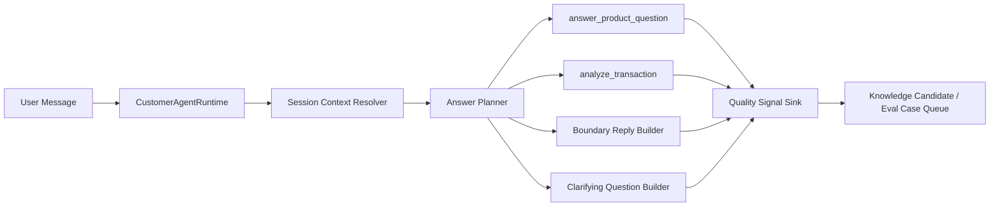

# Autonomous Answering Agent Design

## Goal

Move XXYY Ask toward a fully automated customer-support answering agent. The agent answers product and public transaction-analysis questions, asks clarifying questions when the input is incomplete, and returns clear boundary replies for unsupported or private-data requests. It does not execute business actions, query private account/order/balance data, create user-facing tickets, or hand conversations to human support.

## Current State

The repository already has the right foundation:

- `@xxyy/agent-core` provides a `ToolRegistry`, product tools, transaction-analysis tools, audit events, and `CustomerAgentRuntime`.
- `@xxyy/product-qa-mcp`, `@xxyy/tx-analysis-mcp`, and `@xxyy/knowledge-ops-mcp` expose the same tool definitions to external agents.
- `ChatRequest` already carries `sessionId`, but the runtime currently treats each message as a single-turn request.
- Feedback, low-quality answers, Telegram-derived support knowledge candidates, eval gates, and transaction-analysis reports already exist as separate pieces.

The next step is to connect these pieces into an automated answering loop without adding human handoff or business-action execution.

## Non-Goals

- No user-facing human handoff.
- No customer ticket creation as a support resolution path.
- No authenticated account, order, wallet balance, private transaction, refund, compensation, or entitlement-change actions.
- No investment advice or profit/loss recommendation.
- No automatic publication of unreviewed Telegram or feedback-derived knowledge.

Internal review can still exist for knowledge governance and quality control. It is not part of the customer conversation path.

## Target Behavior

The customer-facing agent should choose one of five outcomes for every message:

1. Answer from product knowledge with citations.
2. Analyze one public transaction hash or supported explorer link.
3. Ask a concise clarifying question when the user intent or required input is incomplete.
4. Return a deterministic boundary reply for private data, investment advice, unsupported chains, unsupported real-time data, or unsafe requests.
5. Record a quality signal when the answer is low-confidence, unsupported, or negatively rated.

The agent should never imply that a human will take over. When it cannot answer, it should say why and give the best self-service next step, such as sending one clear transaction hash, checking the authenticated XXYY product page, or waiting until a data source is enabled.

## Architecture

The current `CustomerAgentRuntime` remains the orchestration boundary. The implementation should add small internal components rather than a free-form LLM agent loop.

## Components

### Session Context Resolver

Purpose: turn a short follow-up into a self-contained question when it is safe.

Inputs:

- Current `ChatRequest`.
- Recent sanitized turns for the same `sessionId`.
- Last answer metadata: intent, citations, confidence, transaction hash, and chain when present.

Outputs:

- `resolvedMessage`: the message to classify and route.
- `resolution`: `unchanged`, `resolved_followup`, or `needs_clarification`.
- `contextSummary`: short sanitized context for audit and future turns.

Rules:

- Resolve simple references such as “那 Pro 呢”, “刚才那个怎么配置”, or “这笔呢” only when the previous turn has one obvious referent.
- Do not combine multiple previous transactions or infer a chain when the user pasted conflicting links.
- Do not store private identifiers in the context summary.

### Answer Planner

Purpose: make the route explicit before calling tools.

Routes:

- `product_answer`: product features, setup steps, plans, public updates.
- `transaction_analysis`: one public transaction reference.
- `clarify`: missing or ambiguous input.
- `boundary`: private data, unsupported real-time lookup, investment advice, unsafe request, unsupported chain.

The first version can stay deterministic, using `classifyQuestion`, transaction-reference parsing, and session resolution. LLM-based planning can be added later only if it is constrained to these routes and audited.

### Quality Policy

Purpose: standardize what happens when the agent should not confidently answer.

Triggers:

- Intent is `unknown`.
- Product answer confidence is below the configured threshold.
- Product answer has no citations.
- Transaction provider is not configured or returns a known failure.
- User requests private account/order/balance data.
- User requests investment advice.

Actions:

- Return a boundary or clarification answer to the user.
- Record a structured quality signal with reason, channel, session presence, intent, confidence, citation count, and redacted question.
- For product gaps, create or update a knowledge candidate or eval case through the existing knowledge-ops workflow.

### Knowledge Gap Loop

Purpose: turn failure modes into better future answers.

Inputs:

- Negative feedback from `rag_feedback`.
- Low-confidence product answers.
- Unknown-intent questions.
- Boundary requests that reveal missing product docs.
- Transaction-analysis failure clusters and real-sample drift.

Outputs:

- `needs_review` knowledge candidates.
- Targeted eval cases.
- Suggested product-doc patch records.
- Transaction smoke sample additions when the issue is public-chain parsing drift.

Publication remains review-gated: candidates must be approved, published, ingested, and eval-gated before they become production knowledge.

## Skills and MCP Direction

Existing skills remain valid:

- `xxyy-product-support`
- `xxyy-transaction-analysis`
- `xxyy-knowledge-ops`

New or expanded skills should be introduced in small steps:

- `xxyy-autonomous-answering-agent`: routing, clarification, boundary, and quality policy for customer-facing automatic answers.
- `xxyy-session-support`: session context resolution and follow-up rules.
- `xxyy-answer-quality-policy`: low-confidence, no-citation, unavailable-tool, private-data, and investment-advice behavior.

New MCP should wait until the in-process design proves useful. If needed later, expose:

- `session-mcp`: `get_session_context`, `append_session_event`, `summarize_session`, `resolve_followup_reference`.
- `quality-ops-mcp`: `record_quality_signal`, `list_quality_signals`, `create_eval_case_from_signal`, `create_knowledge_candidate_from_signal`.

The customer-facing API should continue using in-process tools first. MCP remains an adapter for external agents.

## Data Flow

1. API receives `ChatRequest`.
2. Runtime loads sanitized session context when `sessionId` is present.
3. Resolver creates a self-contained message or marks the turn as needing clarification.
4. Planner chooses one route.
5. Runtime calls exactly the required tool or returns a boundary/clarifying answer.
6. Runtime records answer metadata and a sanitized session event.
7. Quality policy records signals for weak or failed outcomes.
8. Knowledge-ops converts selected signals into review-gated candidates or eval cases.

## Error Handling

- Missing session context store: continue single-turn answering and record a `session_unavailable` quality signal only when a follow-up could not be resolved.
- Ambiguous follow-up: ask one clarifying question instead of guessing.
- Tool unavailable: return the existing explicit unavailable/boundary answer and record a quality signal.
- Low citation or low confidence: answer only if grounded enough; otherwise say the current knowledge base is insufficient.
- Private data request: never ask the user to paste secrets or account identifiers into public chat.

## Implementation Slices

1. Documentation alignment: update roadmap/status/architecture to remove user-facing handoff and tickets from the current target.
2. Session context interfaces: define a minimal in-memory session store for tests and a Postgres-ready interface for later persistence.
3. Follow-up resolver: deterministic resolver for obvious product and transaction follow-ups, plus clarification fallback.
4. Runtime planner: make the current single-turn route explicit and feed it resolved messages.
5. Quality signal model: record low-confidence, no-citation, unknown, boundary, and tool-failure cases.
6. Knowledge-gap integration: convert selected quality signals into knowledge candidates or eval cases through `@xxyy/knowledge-ops`.
7. Regression tests: cover single-turn compatibility, follow-up resolution, ambiguity, boundary stability, quality signals, and no-handoff wording.

## Verification

The feature is ready only when these checks pass:

- Product follow-up: user asks “XXYY Pro 有哪些权益？” then “怎么升级？” and the second turn answers as an upgrade question with citations.
- Transaction follow-up: user sends one supported transaction hash, then “这笔被夹了吗？” and the second turn resolves to that hash.
- Ambiguous follow-up: user discusses two transactions, then asks “这笔呢？” and the agent asks which transaction to analyze.
- Boundary stability: wallet balance, order status, private transaction history, and investment advice still do not call product or transaction tools.
- Quality loop: low-confidence or no-citation answers create a structured quality signal without exposing private user identity.
- Text check: active docs and customer-facing responses do not promise human handoff or ticket creation as the resolution path.
