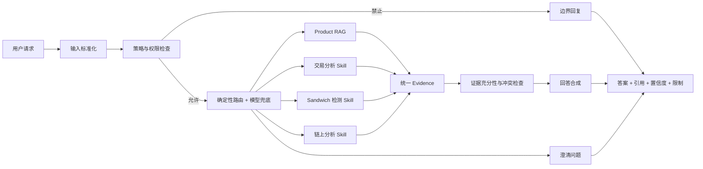
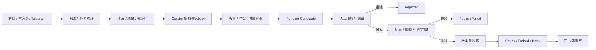
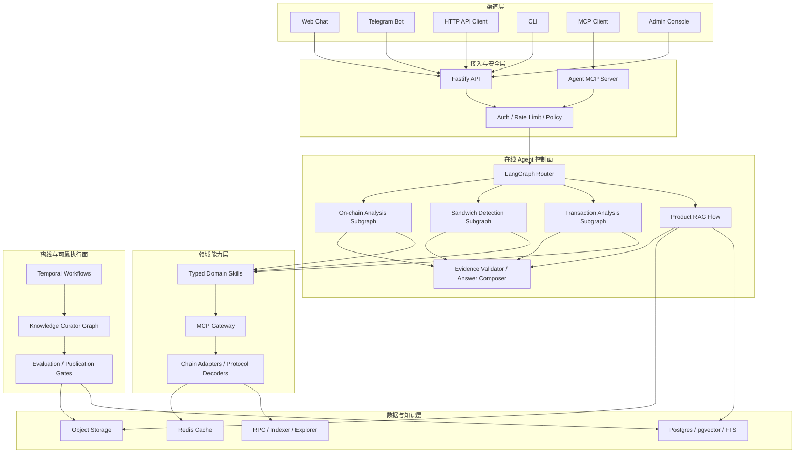

# XXYY Agent 目标产品需求与总体设计

> 状态：Draft / 目标态设计  
> 适用范围：产品规划、架构设计、需求拆分和阶段验收  
> 重要说明：本文描述最终产品方向，不表示相关能力已经上线。当前实现与对外边界以 [Feature Status](feature-status.md) 和 [Architecture](architecture.md) 为准。

## 1. 文档目的

本文把 XXYY Agent 的最终产品目标整理为一份统一的产品需求和总体技术设计，用于回答以下问题：

- 产品最终为谁解决什么问题。
- Product RAG、Agent、Skill、MCP 和知识库分别承担什么职责。
- 产品问答、交易分析、夹子检测和链上分析如何协作。
- 官网、官方 X 和 Telegram 群聊知识如何安全进入知识库。
- 哪些能力可以自动完成，哪些操作必须拒绝、澄清或等待人工批准。
- 系统应按什么阶段演进，以及每个阶段如何验收。

本文是目标态设计，不替代当前运行文档，也不直接扩大当前公开 API 的能力范围。

## 2. 产品定义

### 2.1 一句话定义

XXYY Agent 是一个面向 Web、Telegram、API 和其他 Agent 客户端的智能产品支持与公开链上分析平台：它基于受控知识库回答 XXYY 产品问题，通过领域 Skill 和 MCP 分析公开链上数据，并为每个重要结论提供证据、置信度和能力边界。

### 2.2 核心价值

1. **可靠回答产品问题**：用户能够快速获得有引用、可追溯、反映最新规则的产品说明和操作步骤。
2. **解释公开链上活动**：用户提供交易哈希、地址、区块或池子后，系统能够输出结构化分析，而不只是复述 Explorer 页面。
3. **识别潜在 MEV 行为**：系统能够基于确定性证据检测 sandwich 等模式，并明确区分已确认、可能、未发现和证据不足。
4. **持续演进知识库**：官网、官方 X 和客服群知识通过自动清洗、冲突检查、人工审核和发布门禁进入统一知识库。
5. **可扩展领域能力**：新增分析能力时，以独立 Skill 和标准 MCP 接口接入，不把所有业务逻辑堆进一个通用 Agent。

### 2.3 产品成功标准

- 普通产品问题能够低延迟回答，核心事实均可追溯到有效知识来源。
- 链上分析结论能够追溯到交易、日志、trace、区块和解码结果，而不是由 LLM 猜测。
- 数据不足或来源冲突时，系统明确返回限制，不生成确定性结论。
- 未经审核的群聊内容不能直接影响生产回答。
- 新增一个领域 Skill 不需要修改 Product RAG 的核心实现。
- 高风险动作在没有授权、批准和审计的情况下无法执行。

## 3. 用户与主要场景

| 用户角色          | 主要诉求                     | 典型问题或操作                                       |
| ----------------- | ---------------------------- | ---------------------------------------------------- |
| XXYY 普通用户     | 了解功能和完成配置           | “如何设置钱包监控？”“Pro 有哪些权益？”               |
| 交易用户或研究者  | 理解公开交易和链上行为       | “这笔交易发生了什么？”“为什么实际成交价偏差这么大？” |
| 安全或 MEV 研究者 | 判断交易是否受到夹子攻击     | “这笔 swap 是否被 sandwich？”                        |
| 客服人员          | 快速复用统一、可信的产品答案 | 查看引用、复制回复、提交知识候选                     |
| 知识管理员        | 维护知识质量和版本           | 审核候选、解决冲突、发布、回滚                       |
| Skill 开发者      | 扩展新的分析能力             | 接入新的链、协议、Indexer 或检测算法                 |
| 运营与工程人员    | 观察质量、成本和异常         | 查看 trace、失败原因、评测结果和发布记录             |

## 4. 产品范围与边界

### 4.1 目标范围

- XXYY 产品功能、配置步骤、权益、限制和官方更新问答。
- 官网文档、官方 X、审核通过的客服群知识的采集和治理。
- 公开交易、地址、区块、池子和合约的只读分析。
- 交易分析、sandwich 检测和通用链上分析 Skill。
- Web、Telegram、HTTP API、CLI 和 MCP 客户端接入。
- 引用、证据、置信度、限制说明、反馈和质量评测。
- 管理员知识审核、版本、发布、回滚和审计。

### 4.2 明确边界

- 不提供投资建议、收益承诺或买卖推荐。
- 不把 LLM 输出当作链上事实；金额、顺序、地址关系和利润计算必须来自确定性程序。
- 未经身份验证和明确授权，不查询用户账户、订单、余额或私有交易记录。
- 初始链上能力只读取公开数据，不签名、不广播交易、不修改用户状态。
- 未经人工审核，不自动发布 Telegram 群聊知识。
- 不能验证管理员身份、消息时间或上下文时，候选知识必须失败关闭或标记为待人工确认。
- 外部网页、社交内容和 MCP 返回值均视为不可信输入，不能作为系统指令执行。

### 4.3 未来写操作边界

如果后续增加下单、转账、发币、修改配置等写操作，必须同时具备：

- 强身份认证和细粒度授权。
- 明确展示即将执行的动作、金额、链、合约和预估费用。
- 用户逐次确认或符合策略的预授权。
- 可恢复的审批状态、幂等键和重放保护。
- 完整审计日志和失败补偿机制。
- 独立安全评审；不得仅通过给 Agent 增加一个写工具完成上线。

## 5. 设计原则

1. **证据优先**：先得到可验证证据，再生成自然语言解释。
2. **确定性优先**：能够用规则、解析器或算法完成的工作，不交给 LLM 猜测。
3. **普通问题走短路径**：简单 Product RAG 不进入无意义的多轮 Agent 循环。
4. **复杂问题使用有界工作流**：限制最大步骤、最大工具调用、超时、重试和成本。
5. **Skill 与协议解耦**：业务算法先实现为可测试的领域库，再通过 MCP 或内部工具适配器暴露。
6. **知识发布必须受控**：模型可以提取和建议，但不能在早期阶段自动发布事实。
7. **失败关闭**：涉及权限、来源身份、资金动作和确定性结论时，证据不足不能默认放行。
8. **统一回答契约**：所有渠道共享 route、answer、evidence、citations、confidence 和 limitations。
9. **可观测、可回放、可评测**：每次路由、检索、工具调用和结论都能解释和复现。
10. **渐进式复杂度**：只有出现真实的可靠执行需求时才引入额外基础设施。

## 6. 功能需求

优先级定义：

- `P0`：产品成立和安全上线所必需。
- `P1`：核心差异化能力。
- `P2`：规模化和扩展能力。

### 6.1 多渠道问答

| ID     | 优先级 | 需求                                                                                    |
| ------ | ------ | --------------------------------------------------------------------------------------- |
| FR-001 | P0     | Web、Telegram、HTTP API 和 CLI 使用同一套 Agent Runtime 与回答契约。                    |
| FR-002 | P0     | 同时支持普通响应和流式响应，并保证两条路径的路由与最终语义一致。                        |
| FR-003 | P0     | 每次请求生成 `requestId`，贯穿策略、检索、Skill、MCP、模型和日志。                      |
| FR-004 | P0     | 系统能够区分产品问答、交易分析、sandwich 检测、通用链上分析、能力咨询、澄清和边界请求。 |
| FR-005 | P0     | 无法可靠确定链、交易、地址、时间范围或用户意图时，先提出最小必要澄清问题。              |
| FR-006 | P1     | 多轮会话只保存完成当前任务所需的上下文，并支持可配置的保留和删除策略。                  |

### 6.2 Product RAG

| ID     | 优先级 | 需求                                                                   |
| ------ | ------ | ---------------------------------------------------------------------- |
| FR-101 | P0     | 回答产品功能、操作步骤、权益、限制和官方更新问题。                     |
| FR-102 | P0     | 只使用允许进入正式知识库的来源生成产品事实。                           |
| FR-103 | P0     | 支持向量、关键词、实体和元数据过滤的混合检索。                         |
| FR-104 | P0     | 支持来源可信度、生效时间、当前/历史/废弃状态和替代关系重排。           |
| FR-105 | P0     | 回答中的关键事实必须映射到具体引用；证据不足时返回限制或澄清。         |
| FR-106 | P0     | 图片、视频、OCR 和字幕作为独立证据资产，可随答案返回相关附件。         |
| FR-107 | P1     | 只有复杂比较、多模块问题或证据不足时才执行二次检索或有界 Agentic RAG。 |
| FR-108 | P1     | 支持当前规则与历史规则的区分，避免把新旧规则混合为一个答案。           |

### 6.3 交易分析

| ID     | 优先级 | 需求                                                              |
| ------ | ------ | ----------------------------------------------------------------- |
| FR-201 | P1     | 接收链标识和交易哈希，校验输入并识别支持状态。                    |
| FR-202 | P1     | 获取交易、receipt、日志、trace、区块上下文和相关协议元数据。      |
| FR-203 | P1     | 解码 token transfer、swap、费用、路由、失败原因和主要参与地址。   |
| FR-204 | P1     | 输出结构化时间线、资产变化、费用、滑点或价格影响，以及证据链接。  |
| FR-205 | P1     | 多数据源结果不一致时保留冲突信息，不静默选择任意一个结果。        |
| FR-206 | P1     | 输出 `success`、`partial`、`insufficient_data` 或 `failed` 状态。 |
| FR-207 | P2     | 通过 chain adapter 和 protocol decoder 扩展更多链与协议。         |

### 6.4 Sandwich 检测

| ID     | 优先级 | 需求                                                                                              |
| ------ | ------ | ------------------------------------------------------------------------------------------------- |
| FR-211 | P1     | 以目标交易为中心获取同区块或相关 slot 的前后交易。                                                |
| FR-212 | P1     | 解码目标 swap、候选抢跑交易和候选回跑交易。                                                       |
| FR-213 | P1     | 根据交易顺序、池子、资产方向、地址关联、价格变化和利润形成候选组合。                              |
| FR-214 | P1     | 计算攻击者成本、回收金额、费用、估算利润和受害者价格影响。                                        |
| FR-215 | P1     | 对关键判断执行第二数据源或原始链数据交叉验证。                                                    |
| FR-216 | P1     | 结果必须为 `confirmed`、`likely`、`not_detected` 或 `insufficient_data`，并解释达到该状态的规则。 |
| FR-217 | P1     | LLM 只负责解释检测结果，不负责判断交易顺序或计算利润。                                            |

### 6.5 通用链上分析

| ID     | 优先级 | 需求                                                            |
| ------ | ------ | --------------------------------------------------------------- |
| FR-221 | P2     | 支持公开地址活动摘要、资金流向、合约交互和 token 变化分析。     |
| FR-222 | P2     | 支持按链、协议、时间和资产范围限制查询，避免无界扫描。          |
| FR-223 | P2     | 对地址归属、实体标签和可疑关联明确区分事实、第三方标签和推断。  |
| FR-224 | P2     | 支持多个领域 Skill 的结果合并，但不重复计算或重复展示相同证据。 |

### 6.6 知识采集与治理

| ID     | 优先级 | 需求                                                                                                |
| ------ | ------ | --------------------------------------------------------------------------------------------------- |
| FR-301 | P0     | 定期同步官网中英文文档、站内媒体和官方 X 更新。                                                     |
| FR-302 | P0     | 入库前执行来源校验、内容哈希、格式标准化、媒体审计和重复检测。                                      |
| FR-303 | P0     | 全量入库和增量同步都必须可审计，失败不能留下半更新状态。                                            |
| FR-304 | P0     | Telegram 群聊只生成知识候选，不直接写入正式知识库。                                                 |
| FR-305 | P0     | 自动识别管理员只能依赖 Telegram API、可信作者名册或有效期内的角色记录，不能根据语气或发言频率猜测。 |
| FR-306 | P0     | 当前管理员列表不能证明历史消息发送时的角色；系统必须保存角色有效期，无法证明时进入人工复核。        |
| FR-307 | P0     | 匿名管理员消息无法可靠归因时必须强制人工审核。                                                      |
| FR-308 | P0     | Knowledge Curator 能够重建对话线程、脱敏、分类、规范化、去重、识别冲突并生成候选质量分。            |
| FR-309 | P0     | Curator 只能写候选，不得在初始阶段自动发布。                                                        |
| FR-310 | P0     | 发布前必须经过人工批准、边界验证、检索验证和回归评测。                                              |
| FR-311 | P1     | 管理后台支持候选上下文、编辑、批准、拒绝、冲突对比、发布、失败重试和审计。                          |
| FR-312 | P1     | 支持知识版本、替代关系、回滚和发布状态追踪。                                                        |

### 6.7 Skill 与 MCP

| ID     | 优先级 | 需求                                                                                                   |
| ------ | ------ | ------------------------------------------------------------------------------------------------------ |
| FR-401 | P1     | 每个领域能力以版本化、可独立测试的 Skill 契约实现。                                                    |
| FR-402 | P1     | MCP 作为跨进程或跨客户端能力协议，不承载核心业务规则。                                                 |
| FR-403 | P1     | 顶层 Agent 只看到 `analyze_transaction`、`detect_sandwich` 等领域级工具，不直接看到大量底层 RPC 方法。 |
| FR-404 | P1     | MCP Gateway 统一实施 allowlist、schema 校验、认证、超时、重试、限流和审计。                            |
| FR-405 | P1     | Skill 输出统一的状态、findings、evidence、warnings 和 diagnostics。                                    |
| FR-406 | P2     | 同一 Skill 可以通过内部函数、HTTP 或 MCP 暴露，而不复制算法实现。                                      |

### 6.8 反馈、评测和运维

| ID     | 优先级 | 需求                                                                              |
| ------ | ------ | --------------------------------------------------------------------------------- |
| FR-501 | P0     | 用户可对回答标记有用或无用，并可提交不包含敏感信息的原因。                        |
| FR-502 | P0     | 负反馈和失败 trace 经脱敏、人工审核后可转为评测样本。                             |
| FR-503 | P0     | 发布前运行路由、RAG、引用、边界和 Skill 回归测试。                                |
| FR-504 | P0     | 记录路由、工具调用、耗时、重试、证据数量、模型消耗和最终状态。                    |
| FR-505 | P1     | 管理端可按 requestId 回放一次运行的决策和证据链，但不暴露密钥和不必要的用户原文。 |
| FR-506 | P1     | 知识同步、候选发布和长时间链上分析具备任务状态、重试和告警。                      |

## 7. 核心业务流程

### 7.1 在线问答流程



路由优先使用确定性信号，例如交易哈希格式、Explorer URL、明确产品意图和禁止请求。只有确定性规则无法判断时才调用模型分类，避免把边界控制交给单次 LLM 决策。

### 7.2 Product RAG 流程

```text
问题标准化
  → 意图与时间语义识别
  → source/status/time/module 过滤
  → 向量 + 关键词 + 实体候选召回
  → Rank Fusion
  → 来源、时效、冲突、覆盖度重排
  → 上下文打包
  → 回答生成
  → Claim / Citation grounding
  → 回答或证据不足提示
```

普通 FAQ 应在一次检索中完成。只有比较多个模块、跨语言表达、历史规则追溯或首轮证据不足时，才进入有界的 query rewrite 和二次检索。

### 7.3 交易与 Sandwich 分析流程

```text
输入校验
  → 选择 chain adapter
  → 并行获取原始交易 / receipt / logs / traces / block context
  → 协议与资产解码
  → 构建确定性事件时间线
  → 运行交易分析或 sandwich 检测算法
  → 第二来源交叉验证
  → 证据充分性评分
  → LLM 解释结构化结果
```

任何网络请求失败都应保留为 diagnostics。系统可以返回部分分析，但不得把缺少 trace、邻近交易或关键池子状态的结果标记为 `confirmed`。

### 7.4 知识更新流程



## 8. 总体技术架构



## 9. 技术职责划分

### 9.1 LangGraph：在线编排

LangGraph 负责：

- 请求状态和显式路由。
- 策略检查后的领域子图选择。
- 有界工具循环、并行分支和结果汇总。
- 证据不足时的澄清或补充检索。
- 需要人工输入时的 interrupt 和恢复。
- 运行状态检查、回放和故障恢复。

LangGraph 不负责：

- embedding、检索算法和知识版本的业务实现。
- sandwich 判定、交易金额和利润计算。
- MCP server 内部的底层数据获取实现。
- 后台定时任务、长周期重试和跨服务业务事务。

### 9.2 Skill：领域算法

Skill 是一个有明确输入、输出、版本和测试集的领域工作流。推荐先实现为纯 TypeScript 包：

```text
packages/skills/transaction-analysis-core
packages/skills/sandwich-detection-core
packages/skills/onchain-analysis-core
```

当前领域实现为保持现有 `packages/*` workspace 边界，分别落在 `packages/transaction-analysis-core`、`packages/evm-data-adapter` 和 `packages/evm-execution-enrichment-core`：前者计算 normalized transaction/receipt 基础事实；data adapter 实现 allowlisted 标准 JSON-RPC、chain 验证、资源限制、无损归一化与 provider 冲突保留；enrichment core 离线处理有界 call trace、internal transfer、Solidity revert 和带显式 pool metadata 的 Uniswap V2/V3 swap。它们都没有生产 endpoint/composition root，trace/pool metadata adapter、价格影响、MCP transport、Capability bridge、Sandwich 和通用链上 Skill 尚未接入。领域包增多后再统一迁移到 `packages/skills/*`，不提前重构 monorepo。

核心算法不应依赖某个 Agent 框架。LangGraph、HTTP 和 MCP 都通过 adapter 调用同一份实现。

### 9.3 MCP：能力和数据边界

系统区分两种 MCP 方向：

- **入站 Agent MCP Server**：让获得授权的外部 Agent 客户端调用 XXYY 的问答或领域级只读能力，请求仍进入统一策略和 LangGraph。
- **出站 MCP Gateway**：让 XXYY Skill 调用 RPC、Indexer、Explorer、标签服务和外部分析服务。

MCP Gateway 应提供：

- server 和 tool allowlist。
- 输入输出 schema 校验。
- 认证信息注入，但不把密钥暴露给 LLM。
- chain、network、block range 和调用成本限制。
- 超时、有限重试、熔断、缓存和并发限制。
- requestId、toolCallId、耗时和错误审计。
- 不可信工具输出的隔离和净化。

顶层 Agent 不直接接触 `eth_getLogs`、`trace_transaction` 等低层工具，而是调用领域级 Skill。低层工具只在 Skill 内部使用。

### 9.4 Temporal：离线和长时间可靠执行

Temporal 作为目标态的后台可靠执行层，适用于：

- 官网、媒体和官方 X 定时同步。
- 大批量 embedding 和索引重建。
- Knowledge Candidate 发布与回滚。
- 需要较长时间或大量外部调用的链上分析。
- 等待数分钟到数天的人工审核。
- 跨进程恢复、重试、补偿和任务状态追踪。

普通在线 Product RAG 不经过 Temporal。早期阶段如果任务规模较小，可先使用数据库任务表；达到跨重启恢复、长时间等待或复杂补偿需求后再引入 Temporal。

### 9.5 LLM：理解和解释

LLM 可以执行：

- 模糊意图分类和最小澄清问题生成。
- 检索 query rewrite。
- 知识候选提取、归类和规范化建议。
- 基于结构化证据生成自然语言解释。
- 将复杂链上时间线转换为不同用户可理解的摘要。

LLM 不可以独立执行：

- 身份、管理员权限和授权判断。
- 交易顺序、余额变化、利润和价格影响计算。
- 来源是否真实存在的判断。
- 知识自动发布。
- 资金或账户写操作批准。

## 10. 统一领域契约

### 10.1 Evidence

所有 RAG 和链上 Skill 应返回统一的证据结构。概念字段如下：

```ts
type EvidenceItem = {
  id: string;
  kind:
    | 'document'
    | 'social'
    | 'transaction'
    | 'log'
    | 'trace'
    | 'metadata'
    | 'block'
    | 'calculation';
  source: string;
  sourceUrl?: string;
  chainId?: string;
  transactionHash?: string;
  blockNumber?: string;
  observedAt?: string;
  effectiveAt?: string;
  payloadHash?: string;
  excerpt?: string;
  structuredData?: unknown;
  supports: string[];
  confidence: number;
};
```

要求：

- `supports` 显式指向该证据支持的 finding 或 claim。
- 原始大对象存入受控存储，回答只携带摘要和稳定引用。
- 计算结果必须记录输入证据 ID、算法版本和精度处理方式。
- 区块高度、金额和大整数使用无精度损失的字符串或 bigint 处理。

### 10.2 Skill Result

```ts
type SkillResult = {
  skill: string;
  version: string;
  status: 'success' | 'partial' | 'insufficient_data' | 'failed';
  summary: string;
  findings: Array<{
    id: string;
    statement: string;
    confidence: number;
    evidenceIds: string[];
    inference: boolean;
  }>;
  evidence: EvidenceItem[];
  warnings: string[];
  diagnostics: Array<{
    stage: string;
    code: string;
    retryable: boolean;
  }>;
};
```

Sandwich Skill 在此基础上增加检测状态：

```ts
type SandwichVerdict = 'confirmed' | 'likely' | 'not_detected' | 'insufficient_data';
```

### 10.3 Chat Response

所有渠道共享以下概念字段：

```ts
type AgentResponse = {
  requestId: string;
  route:
    | 'product_answer'
    | 'transaction_analysis'
    | 'sandwich_detection'
    | 'onchain_analysis'
    | 'clarify'
    | 'boundary';
  answer: string;
  confidence: number;
  evidence: EvidenceItem[];
  citations: Array<{ evidenceId: string; label: string; url?: string }>;
  limitations: string[];
  attachments: Array<{ type: string; url: string; title?: string }>;
};
```

置信度必须来自可解释规则，例如来源完整性、交叉验证、解码覆盖率和冲突数量，不能仅要求 LLM 自报一个数字。

## 11. RAG 与知识库设计

### 11.1 正式知识来源

| 来源             | 用途                           | 发布规则                           |
| ---------------- | ------------------------------ | ---------------------------------- |
| `official_docs`  | 正式产品说明和操作步骤         | 通过官网同步、审计和版本化入库     |
| `x_updates`      | 官方更新、临时规则和发布时间线 | 仅允许官方账号，按内容哈希增量同步 |
| `admin_verified` | 官网未覆盖的通用客服知识       | 必须来自可信作者并经人工审核发布   |

外部博客、用户发言和搜索结果可以作为调查线索，但默认不进入正式 Product RAG。

### 11.2 文档处理

```text
加载来源
  → 验证域名 / 作者 / 时间
  → 标准化 Markdown 与元数据
  → 媒体 OCR / 字幕 / 转写
  → 内容哈希与重复检测
  → 标题层级感知切分
  → embedding
  → 事务性写入索引
  → 记录 ingestion run
```

切分应遵循：

- 保留标题路径、来源 URL、语言、模块和生效时间。
- 表格、步骤列表、代码块和规则块尽量保持完整。
- 普通段落允许有限 overlap，结构化块默认不重复。
- 单个 chunk 不混合互相冲突的新旧规则。
- 图片和视频 sidecar 与正文证据建立明确关联。

### 11.3 检索与重排

1. 根据问题识别语言、模块、时间语义和实体。
2. 使用 pgvector、全文检索和实体索引并行召回。
3. 使用 RRF 或等价 rank fusion 合并候选。
4. 根据来源、直接支持程度、生效时间、状态、替代关系和覆盖度重排。
5. 去除重复和已被替代的当前规则，历史问题保留历史候选。
6. 在 token budget 内按 claim 覆盖打包上下文。
7. 生成答案后执行 claim-to-evidence grounding。

### 11.4 冲突处理

- 不简单规定“官网永远高于官方 X”；来源可信度和生效时间必须同时考虑。
- 新规则必须通过 `supersedes` 或版本关系显式替代旧规则。
- 无法判断哪个规则有效时，回答应展示冲突并请求人工确认。
- 当前问题默认排除废弃知识；历史追溯问题可以引用历史版本。

## 12. Telegram 知识治理设计

### 12.1 可信作者模型

```ts
type TrustedAuthor = {
  chatId: string;
  userId: string;
  role: 'owner' | 'administrator' | 'knowledge_editor';
  validFrom: string;
  validTo?: string;
  verificationSource: 'telegram_api' | 'manual' | 'import';
  verifiedAt: string;
};
```

管理员解析顺序：

1. 查询导入或消息时间点有效的可信作者记录。
2. 对实时群聊使用 Telegram 管理员 API 更新当前角色。
3. 如果只有当前角色而无法证明历史角色，则标记 `historical_role_unverified`。
4. 匿名管理员或发送主体为群/频道时，强制人工确认。
5. 不允许通过写作风格、频率、昵称相似度推断管理员。

因此，`rag:knowledge:import:telegram` 的 `--admin-id` 可以在可信名册或实时 API 能可靠解析时省略；否则命令应失败关闭或把候选标为未验证，不能默认接受所有高频回复者。

### 12.2 Knowledge Curator

Curator 的处理步骤：

1. 加载消息和作者角色快照。
2. 重建 reply、引用和相邻消息组成的对话线程。
3. 先运行高精度的确定性管理员直接回复提取。
4. 再由模型处理跨多条消息、非直接回复和上下文补全。
5. 删除用户个案、隐私、密钥、地址和不可泛化信息。
6. 判断是否属于产品知识边界。
7. 提取标准问题、标准答案、模块、生效时间和适用条件。
8. 与现有 chunk 做重复、相似和冲突检查。
9. 生成候选质量分、风险标签和建议审核动作。
10. 保存为 `pending`，等待人工审核。

候选至少保存：

- 原始消息 ID 和上下文消息 ID。
- 作者验证结果和角色有效期。
- 提取模型、prompt 和算法版本。
- 标准化前后的问题与答案。
- PII、边界、重复和冲突风险。
- 相似或冲突的 document/chunk ID。
- 建议标题、模块、生效时间和替代关系。

### 12.3 管理后台

第一阶段管理后台包含：

- 管理员认证。
- 候选列表和状态过滤。
- 原始上下文与 Curator 建议并排查看。
- 编辑、批准、拒绝和审核备注。
- 重复与冲突证据对比。
- 发布进度、失败原因和重试。
- 知识版本、替代关系和审计记录。

后续增加：检索调试、单文档回滚、评测对比、角色权限和知识质量指标。后台不得直接编辑 pgvector 行；版本化知识文档和候选修订是事实源，向量索引只是派生数据。

## 13. 数据存储设计

### 13.1 PostgreSQL

PostgreSQL 作为结构化事实源，保存：

- knowledge documents、chunks、embeddings 和 ingestion runs。
- knowledge candidates、revisions、reviews 和 publication jobs。
- trusted authors 和角色有效期。
- feedback、evaluation cases 和 evaluation runs。
- agent run 摘要、tool call 摘要和审计事件。
- workflow/task 业务 ID 与状态引用。

### 13.2 Object Storage

对象存储保存：

- 官方图片、视频和原始媒体。
- OCR、字幕、转写和关键帧。
- 大型 trace 或原始链数据快照。
- 可复现分析所需的脱敏测试 fixture。

数据库只保存稳定 URI、SHA、媒体类型、大小、来源和访问策略。

### 13.3 Redis

Redis 用于可丢弃缓存和跨实例限流，不作为知识或分析结果的唯一事实源。典型缓存包括 token metadata、区块、receipt、ABI、协议映射和短期 MCP 结果。

## 14. 安全与隐私

### 14.1 输入与 Prompt Injection

- 用户输入、知识文档、网页内容和 MCP 输出必须分别标记为 data，不可覆盖系统策略。
- 对外部内容执行指令注入检测、HTML/Markdown 清洗和长度限制。
- 模型不可看到数据库密码、RPC 密钥、MCP 凭证和签名材料。
- 工具参数通过代码生成和 schema 校验，不从模型输出直接拼接 shell、SQL 或 URL。

### 14.2 链上分析安全

- 默认只允许配置中的链、网络、provider 和最大区块范围。
- 对 archive/debug/trace 等高成本调用设置独立配额。
- 地址标签必须携带来源和时间，第三方标签不能表述为已验证身份。
- 所有计算使用确定性数值库，并对 decimals、单位和舍入策略测试。

### 14.3 数据隐私

- 日志默认保存摘要、哈希和错误代码，不保存密钥或完整私聊内容。
- Telegram 原始导出不提交到 Git，也不直接进入正式知识库。
- feedback 和 eval backlog 在持久化前脱敏。
- 定义会话、原始消息、trace、分析快照和审计记录的独立保留期。
- 支持按 request、用户标识或知识候选执行合规删除，同时保留必要的不可逆审计摘要。

## 15. 非功能需求

以下数值是初始目标，需要在真实流量基线建立后校准。

### 15.1 正确性

- 产品答案的重要事实必须有引用或明确标记为无法确认。
- `confirmed` sandwich 结果必须满足全部必需检测条件和证据完整性门槛。
- 金额、费用、顺序和利润计算必须可通过 fixture 重放。
- 禁止请求的 deterministic 回归样本必须全部通过。

### 15.2 性能

- Product RAG 首个流式事件 P95 目标不高于 1.5 秒。
- 普通 Product RAG 完整回答 P95 目标不高于 8 秒。
- 单笔标准交易分析 P95 目标不高于 30 秒；超出时转为异步任务并返回 task ID。
- 所有外部调用必须有超时，用户请求不能无限等待。

### 15.3 可靠性

- 知识全量替换和候选发布保持事务一致性。
- 重复提交相同候选、分析任务或批准操作必须幂等。
- 外部 provider 部分失败时返回 `partial` 或降级，而不是伪造完整结果。
- 长任务在进程重启后能够继续或安全重试。

### 15.4 可维护性

- 领域核心包不能依赖 UI、Telegram 或具体 MCP transport。
- 所有公开输入输出使用 Zod 或等价 runtime schema 校验。
- 每个 Skill 有版本、契约测试和确定性 fixture。
- 路由、Skill、RAG 和回答合成可以独立替换和评测。

### 15.5 成本控制

- 确定性路由命中时不调用 Planner。
- 普通 FAQ 限制为一次检索和一次回答生成。
- provider 调用按请求和 Skill 设置最大次数、并发和预算。
- 缓存原始链数据和稳定解码结果，避免重复高成本 trace。

## 16. 可观测性与评测

### 16.1 Trace

每次运行至少记录：

- requestId、channel、route 和策略结果。
- planner/model 版本和结构化决策摘要。
- retrieval query、候选数量、重排摘要和命中来源。
- Skill 名称、版本、输入摘要和状态。
- MCP server/tool、耗时、重试和标准错误码。
- evidence 数量、冲突数量、confidence 和 limitations。
- token、调用次数、缓存命中和总耗时。

原始 prompt、用户文本和工具输出只有在明确配置、脱敏并满足保留策略时才可记录。

### 16.2 评测体系

| 领域     | 主要指标                                                     |
| -------- | ------------------------------------------------------------ |
| 路由     | route accuracy、边界召回、错误放行率、澄清率                 |
| RAG 召回 | Recall@K、Precision@K、MRR、nDCG、forbidden hit              |
| 回答     | citation grounding、事实完整性、冲突处理、拒答正确性         |
| Sandwich | verdict precision/recall、利润误差、证据完整率、未知样本处理 |
| 交易分析 | 解码覆盖率、资产变化一致性、时间线正确率、partial 状态准确率 |
| Curator  | 候选接受率、PII 泄漏率、事实保真度、重复/冲突识别率          |
| 运行质量 | P50/P95 延迟、provider 失败率、重试率、单位请求成本          |

评测集来源包括：人工编写 golden cases、真实负反馈脱敏样本、历史故障、已验证链上 fixture、冲突知识样本和恶意输入样本。

## 17. 技术选型结论

### 17.1 选型原则

技术栈按以下顺序做取舍：

1. **事实正确性与可重放性**高于 Agent 自主程度。
2. **端到端类型安全和单语言维护成本**高于局部生态优势。
3. **显式流程、权限和证据状态**高于框架自动生成的“智能”流程。
4. **先模块化单体，后按真实瓶颈拆分**，不提前承担微服务成本。
5. **核心领域逻辑保持框架无关**，避免被某个模型、Agent Runtime 或 MCP transport 锁定。
6. **按需求引入基础设施**；Redis 和 Temporal 属于条件性组件，不要求第一阶段全部部署。

### 17.2 推荐技术栈与理由

| 层级              | 推荐选型                                                 | 选择理由                                                                                                                                                        |
| ----------------- | -------------------------------------------------------- | --------------------------------------------------------------------------------------------------------------------------------------------------------------- |
| 主语言与运行时    | TypeScript + Node.js LTS                                 | Web、API、MCP 和主流链上 SDK 可以共享同一套类型与工具链；系统以网络 I/O 和编排为主，不需要为了 AI 标签默认引入 Python。                                         |
| Runtime Schema    | Zod                                                      | TypeScript 类型只在编译期存在；用户输入、模型输出、MCP 和 Skill 边界仍需要运行时校验。官方 MCP TypeScript SDK 也以 Zod 作为 schema 依赖。                       |
| Web 与管理后台    | Next.js + React                                          | 同一应用承载聊天页、管理后台、认证页面和服务端数据加载；如果最终只需要静态聊天页，可降级为 React/Vite。                                                         |
| HTTP API          | Fastify                                                  | 适合长驻 Node 服务、流式响应和插件式中间件，并支持基于 JSON Schema 的请求校验和响应序列化。                                                                     |
| 在线 Agent 控制面 | LangGraph JS                                             | 产品包含显式路由、领域子图、并行工具调用、证据状态、暂停恢复和人工审批；这些是图状态而不是简单的 Agent handoff。                                                |
| 模型访问层        | 自有 `ModelProvider` 接口；OpenAI Responses 作为首个实现 | 利用结构化输出、工具调用和流式能力，但把模型名、API 和消息格式隔离在 adapter 中，避免领域包依赖单一模型供应商。                                                 |
| 领域能力          | 纯 TypeScript Skill + 版本化契约                         | 交易解析、sandwich 判断和数值计算可独立测试、重放和复用；LLM 只能消费其结果，不能替代算法。                                                                     |
| MCP               | 官方 TypeScript MCP SDK；远程优先 Streamable HTTP        | MCP 作为标准化能力边界；同一 SDK 可实现入站 Agent MCP Server 和出站 MCP Client/Gateway。远程服务使用可认证、可观测的 HTTP transport，本地开发工具才使用 stdio。 |
| EVM 数据访问      | viem + 自定义 chain adapter                              | viem 提供轻量、可组合、类型安全的 Ethereum JSON-RPC 原语；adapter 再统一不同 provider、trace 和协议解码差异。                                                   |
| Solana 数据访问   | `@solana/kit` + Codama 生成客户端 + 自定义 chain adapter | 使用官方 TypeScript 客户端和生成的 program client，避免手写大量指令与账户布局；业务层只依赖统一 adapter。                                                       |
| RAG 与业务数据库  | PostgreSQL + pgvector + PostgreSQL FTS                   | 知识、版本、审核、反馈和向量可保存在同一事务系统；pgvector 官方支持与 PostgreSQL 全文检索组合，再用 RRF 或 reranker 融合。                                      |
| 对象存储          | S3-compatible storage                                    | 保存媒体、OCR、字幕、原始分析快照和大对象；数据库只保存元数据、SHA 和稳定 URI。                                                                                 |
| 缓存与分布式限流  | Redis，按需引入                                          | 用于可丢弃的 RPC、ABI、token metadata、区块缓存和多实例限流；不作为知识或任务的事实源。单实例早期阶段可以暂不部署。                                             |
| 长任务与可靠执行  | Temporal，达到触发条件后引入                             | 适合知识同步、索引重建、长时间链上分析、跨重启重试和等待人工审核；普通在线问答不经过 Temporal。                                                                 |
| 可观测性          | OpenTelemetry 语义 + vendor-neutral trace adapter        | 统一 HTTP、LangGraph、模型、Skill、MCP、数据库和后台任务 trace，同时保留切换观测平台的能力。                                                                    |
| 测试与评测        | Vitest + 数据库集成测试 + 确定性链上 fixture             | 单元测试覆盖领域算法，集成测试覆盖 pgvector/事务，fixture 重放验证交易时间线、金额和 verdict，模型评测只补充非确定性质量。                                      |

相关官方能力依据：

- LangGraph 提供[状态持久化](https://docs.langchain.com/oss/javascript/langgraph/persistence)、[子图](https://docs.langchain.com/oss/javascript/langgraph/use-subgraphs)和[人工中断](https://docs.langchain.com/oss/javascript/langgraph/interrupts)。
- MCP 官方 TypeScript SDK 支持 server/client、stdio 和 [Streamable HTTP](https://ts.sdk.modelcontextprotocol.io/server)。
- pgvector 官方文档明确支持与 PostgreSQL FTS 组成[混合检索](https://github.com/pgvector/pgvector#hybrid-search)。
- [viem](https://viem.sh/)提供面向 Ethereum 的类型安全、可组合 TypeScript 原语；Solana 可使用 [Codama 生成 `@solana/kit` 客户端](https://solana.com/docs/programs/codama/clients)。
- Temporal Workflow 提供可恢复的[持久可靠执行](https://docs.temporal.io/workflow-execution)，并具有完整的 [TypeScript SDK](https://docs.temporal.io/develop/typescript)。
- Fastify 支持 [TypeScript](https://fastify.dev/docs/latest/Reference/TypeScript/) 和 schema 驱动的校验与序列化。

### 17.3 部署形态

初期采用模块化单体，而不是立即拆成微服务：

```text
apps/web        Web Chat + Admin UI
apps/api        HTTP / Streaming / Inbound Agent MCP
apps/worker     Knowledge sync / publication / async analysis
packages/*      contracts / agent / rag / skills / MCP adapters
PostgreSQL      结构化事实源 + pgvector + FTS
Object Storage  媒体和大型证据对象
```

出现以下条件后再独立拆分服务：

- 某个 Skill 需要独立扩缩容、不同安全权限或不同语言运行时。
- RPC/Indexer 调用量需要单独限流、缓存和 provider failover。
- 后台任务影响在线 API 的 CPU、内存或发布节奏。
- 外部客户需要独立使用某个 MCP server。

### 17.4 关键架构决策

| ADR     | 决策                                    | 原因                                                             |
| ------- | --------------------------------------- | ---------------------------------------------------------------- |
| ADR-001 | LangGraph 作为在线控制面                | 目标包含显式路由、领域子图、状态、证据汇总和人工中断。           |
| ADR-002 | 不把所有业务做成 Agent                  | 产品检索和链上计算需要确定性、低成本和可复现。                   |
| ADR-003 | Skill library-first，MCP adapter-second | 避免协议绑定核心算法，便于单元测试和多入口复用。                 |
| ADR-004 | Postgres 是知识治理事实源               | 候选、版本、审核和发布需要事务、约束和审计。                     |
| ADR-005 | 群聊知识人工发布                        | 自动抽取可以提效，但无法单独保证权限、时效、隐私和事实正确性。   |
| ADR-006 | Temporal 与 LangGraph 分工              | LangGraph 管在线 Agent 决策；Temporal 管跨进程长任务和可靠执行。 |
| ADR-007 | 统一 Evidence 契约                      | RAG 与链上能力必须用同一种方式表达事实、推断、来源和限制。       |

### 17.5 为什么不选择其他方案作为主栈

| 备选方案                       | 不作为主方案的原因                                                                                                                                   | 何时重新考虑                                                                         |
| ------------------------------ | ---------------------------------------------------------------------------------------------------------------------------------------------------- | ------------------------------------------------------------------------------------ |
| 纯 TypeScript `if/else` 状态机 | Product RAG 阶段最简单，但领域子图、并行分支、人工中断、恢复和状态检查增多后会逐步重复实现 LangGraph。                                               | 如果产品永久收敛为单步 FAQ 和少量固定工具。                                          |
| OpenAI Agents SDK              | 对 OpenAI 原生工具、handoff、MCP 和 tracing 很简洁，但目标产品更强调显式图、可检查证据状态和 provider adapter，而不是以 Agent handoff 为中心。       | 如果模型层完全收敛到 OpenAI，流程主要是主管 Agent 调专家 Agent，且不需要复杂图状态。 |
| Mastra                         | TypeScript 一体化体验较好，也覆盖 Agent、Workflow、RAG 和 MCP；但本产品的价值在自定义知识治理、Evidence 和链上算法，一体化封装不能减少这些核心工作。 | 绿地原型优先追求快速搭建，并愿意采用其存储、部署和观测约定。                         |
| Temporal 作为唯一编排器        | 擅长可靠业务工作流，但不是面向对话、模型工具循环和动态证据状态的 Agent Runtime。                                                                     | 不替换 LangGraph；只在长任务和跨服务可靠执行层使用。                                 |
| 独立向量数据库                 | 当前知识规模同时需要大量关系元数据、审核事务和版本关系；拆分会增加一致性和运维成本。                                                                 | chunk 达到千万级、向量 QPS 或多租户隔离成为 PostgreSQL 的明确瓶颈。                  |
| Python 作为主后端              | AI 库丰富，但会把 Web、MCP 和 TypeScript 链上生态拆成两套契约与部署，现阶段收益不足。                                                                | 某个 ML、图算法或数据科学模块只有 Python 生态可满足时，将其作为独立 Skill 服务接入。 |

### 17.6 引入时机

| 阶段                       | 必选组件                                                                       | 暂不需要                             |
| -------------------------- | ------------------------------------------------------------------------------ | ------------------------------------ |
| Product RAG 与知识治理 MVP | TypeScript、Fastify、LangGraph、PostgreSQL/pgvector/FTS、对象存储、Zod、Vitest | Temporal、独立向量库、微服务         |
| 首个交易与 Sandwich Skill  | viem 或 `@solana/kit`、chain adapter、领域 fixture、只读 MCP Gateway           | 写操作、签名服务、多链同时上线       |
| 多实例和高频链上分析       | Redis、provider failover、后台 worker、异步 task API                           | 独立 Skill 服务，除非出现扩缩容瓶颈  |
| 长任务与跨重启审批         | Temporal、持久任务状态、幂等和补偿                                             | 将普通在线 Product RAG 迁入 Temporal |
| 未来写操作                 | 独立权限边界、批准流程、签名隔离、审计                                         | 让通用 Agent 直接持有密钥            |

## 18. 分阶段实施路线

### Phase 0：契约和可信 Product RAG

- 固化统一 AgentResponse、Evidence、SkillResult 和错误契约。
- 完成引用 grounding、冲突策略、上下文打包和安全清洗。
- 保证普通 Product RAG 为低延迟确定性短路径。

验收：产品核心问题有可靠引用；旧规则不污染当前回答；边界测试全部通过。

### Phase 1：知识治理和管理后台

- 建立 TrustedAuthor、CandidateRevision、Review 和 PublicationJob。
- 实现 Knowledge Curator，支持线程重建、脱敏、去重和冲突检查。
- 允许可靠条件下自动解析 Telegram 管理员，否则失败关闭。
- 上线最小管理后台和审核发布流程。

验收：未经审核的群聊不能进入正式知识库；每条已发布知识均可追溯和回滚。

### Phase 2：统一 Agent 控制面

- 非流式和流式请求统一经过同一张 LangGraph。
- 拆分顶层 Router、领域子图、Evidence Validator 和 Answer Composer。
- 加入有界步骤、重复调用检测、超时和统一 tracing。

验收：相同请求的流式与非流式 route 和最终语义一致；失败状态可观测。

### Phase 3：交易分析和 Sandwich MVP

- 选择首批链和协议。
- 实现 chain adapter、protocol decoder 和领域 Skill。
- 接入只读 MCP Gateway。
- 建立已验证正常交易、sandwich、非 sandwich 和证据不足 fixture。

验收：系统能稳定输出结构化时间线和四态 sandwich verdict；LLM 不参与事实计算。

### Phase 4：通用链上分析

- 增加地址活动、资金流、合约交互和标签能力。
- 支持多个 Skill 的证据去重、冲突检查和汇总。
- 增加异步任务接口处理长时间分析。

验收：复杂问题可拆分到多个 Skill，最终答案仍能逐项追溯证据。

### Phase 5：可靠执行和规模化

- 对知识同步、发布和长任务引入 Temporal。
- 完成跨实例限流、缓存、provider failover、任务告警和容量规划。
- 扩充管理后台、RBAC 和审计能力。

验收：进程重启和 provider 短暂故障不丢失已接受的长任务；审批可以安全恢复。

### Phase 6：可选写操作

- 仅在独立安全评审后引入。
- 实现认证、策略授权、用户批准、模拟、幂等、签名隔离和审计。
- 写操作与只读分析使用不同 tool allowlist 和部署边界。

验收：没有显式授权和批准时，任何资金或账户状态都不能被修改。

## 19. 总体验收标准

当以下条件同时满足时，可认为目标产品核心能力完成：

- 用户可从 Web、Telegram 和 API 获得契约一致的回答。
- Product RAG 能对当前和历史规则给出有依据且不混淆的答案。
- 交易和 sandwich 分析输出结构化、可重放的确定性证据。
- 每项重要结论都有引用，推断与事实被明确区分。
- MCP 故障、数据冲突和证据缺失会变成明确状态，而不是幻觉答案。
- 群聊知识只能通过可信作者验证、Curator、人工审核和发布门禁进入正式知识库。
- 新增领域 Skill 不需要修改其他领域的核心算法。
- 公开只读分析与未来写操作具有清晰的权限和部署隔离。
- 路由、检索、Skill、MCP、回答、发布和审批均可观测和审计。

## 20. 待确认的产品决策

以下问题需要在对应阶段开始前确定：

1. 首批支持的链、DEX 和交易类型，以及优先顺序。
2. 原始 RPC、archive/trace、Indexer 和 Explorer 的供应策略与预算。
3. `confirmed` sandwich verdict 的链级和协议级最低证据条件。
4. 管理后台的身份提供方、RBAC 角色和审核责任人。
5. 是否以及何时支持登录用户的私有 XXYY 数据。
6. 各类消息、trace、链上快照和审计记录的保留期限。
7. 线上 SLO、单位请求成本和 provider 降级目标。
8. 未来是否允许任何写操作；如允许，首个明确业务场景是什么。
