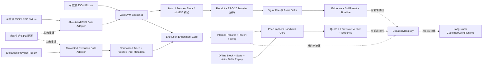

# Read-only EVM Transaction Analysis Core v0.1

## 当前状态

`@xxyy/transaction-analysis-core` 是纯 TypeScript、确定性、只读的领域包。它把已经归一化并带来源的 EVM transaction snapshot 转换为结构化事实、timeline、资产变化和统一 Evidence / SkillResult。

当前 core 包本身没有网络客户端，不访问 RPC、Indexer 或 Explorer，不依赖 LangGraph、LLM 或 MCP transport，也没有注册到 `CapabilityRegistry`、`ToolRegistry`、API、CLI 或 Telegram。独立的 `@xxyy/evm-data-adapter` 已能把受控标准 JSON-RPC 转成 snapshot；`@xxyy/evm-execution-enrichment-core` 已能离线消费额外 normalized trace 与 pool metadata，提取 internal transfer、revert 和首批 Uniswap swap 语义；`@xxyy/evm-execution-data-adapter` 已能从 allowlisted callTracer 和 factory 反查生成这些额外输入；`@xxyy/evm-mev-observation-data-adapter` 已能构建 canonical 同区块 swap/state/delta；`@xxyy/evm-price-impact-sandwich-core` 已能据此计算 price impact 与四态 verdict；`@xxyy/evm-chain-analysis-harness` 已能离线组合并执行合成回放评测；`@xxyy/evm-chain-analysis-readiness` 已定义 reviewed replay 治理和生产证据就绪控制面。这些包都没有生产接线，公开客服收到交易哈希、Explorer 链接、链上取证或 MEV 问题时仍返回既有边界回复。

## 数据流

## 输入契约

Snapshot 必须包含：

- 正十进制字符串形式的 `chainId`；
- 32-byte `requestedTransactionHash`；
- 1 到 8 个带稳定 id、类型和观测时间的来源；
- 可选 transaction、receipt、block 和显式 source conflicts。

金额、nonce、区块号、gas 和时间戳都使用 canonical 十进制字符串，并验证不超过 `uint256`。地址、hash、topics 和 bytes 在 schema 边界验证后统一转为小写；receipt 最多携带 500 条日志。外部 adapter 必须先把供应商格式转换为该 snapshot，领域算法不读取供应商私有字段。

来源冲突必须至少包含两个不同 source 和两个不同 value。算法保留冲突 field、source ids、Evidence 和 diagnostic，不把冲突值静默合并为一个确定结论；结果至少降级为 `partial`。

## v0.1 确定性行为

- 校验 requested hash 与 transaction / receipt 的关联。
- 区分 `success`、`reverted`、`pending` 和 `unknown` 执行状态。
- 只有成功 receipt 才把 transaction `value` 计入原生资产变化；回滚或缺少 receipt 时不会推测转账已生效。
- 使用 `gasUsed * effectiveGasPrice` 和 `bigint` 计算精确 wei fee；发送方资产变化包含 fee。
- 识别标准 ERC-20 `Transfer(address,address,uint256)` topic，按 log index 输出 transfer timeline。
- 区分普通 transfer、zero-address mint 和 burn；zero address 不作为账户资产余额。
- 聚合同一 address / asset 的 signed raw delta，保留支持该变化的 evidence ids。
- block context 只有在 block number 与 transaction / receipt 一致时才进入结果。
- 缺 transaction 返回 `insufficient_data`；缺 receipt、来源冲突、block/source 不一致、removed/重复/畸形 Transfer 日志返回 `partial` 和稳定 diagnostics。

所有结论来自 schema 校验后的链数据和整数计算。LLM 未来只能解释结果，不能决定交易顺序、执行状态、金额或 fee。

## 统一输出

`packages/shared/src/domain-contract.ts` 定义：

- `EvidenceItem`：稳定 id、kind、source、链/交易/区块定位、supports、置信度和 JSON-safe structured data；
- `SkillFinding`：statement、evidence ids、confidence 和 inference 标记；
- `SkillDiagnostic`：stage、code、retryable 和可选 evidence ids；
- `SkillResult`：`success | partial | insufficient_data | failed`、summary、findings、evidence、warnings 和 diagnostics。

公共 schema 会校验 finding/evidence/diagnostic 的双向引用，不允许重复 id 或悬空引用。交易结果在此基础上增加 transaction facts、timeline、ERC-20 transfers、asset changes 和 unresolved conflicts，并继续验证这些派生对象的 evidence 引用以及 timeline 连续编号。

## 可重放 Fixtures

| Fixture                                 | 覆盖行为                                              |
| --------------------------------------- | ----------------------------------------------------- |
| `success-native-erc20.json`             | 成功 receipt、原生 value、ERC-20 Transfer、fee、block |
| `reverted.json`                         | 回滚交易只扣 fee，不应用 value 或 logs                |
| `partial-missing-receipt.json`          | execution 未确认、无资产变化、retryable diagnostic    |
| `conflict-malformed-log.json`           | 双来源状态冲突、畸形 Transfer、partial 结果           |
| `insufficient-missing-transaction.json` | 缺少目标 transaction、insufficient_data               |

Fixtures 只包含合成地址、hash 和金额，不包含生产 RPC URL、用户账户或私有交易数据。

## 明确未实现

- 生产 RPC 配置、共享 QPS/熔断/缓存/metrics，以及 Indexer / Explorer adapter；
- 本包本身不接收 trace，也不合并 internal transfer/revert/swap 结果；这些位于独立 [execution enrichment core](evm-execution-enrichment.md)；
- token decimals、symbol、价格或法币换算；
- 本 core 内的 DEX router、multi-hop 路由、滑点和价格影响解码；enrichment core 仅解码带显式 metadata 的 V2/V3 pool event，独立 price-impact core 只支持有完整 state 的单 pool 范围；
- 本 core 内的 Sandwich 候选组合、攻击者收益和四态 verdict；独立 price-impact/Sandwich core 已实现严格的相邻单 pool 模型；
- MCP client/server、Capability adapter、Agent 路由或用户可见回答；
- 账户私有数据、签名、交易模拟、广播或任何写操作。

只读 EVM data adapter 的设计与边界见 [evm-data-adapter.md](evm-data-adapter.md)，执行数据获取与验证见 [evm-execution-data-adapter.md](evm-execution-data-adapter.md)，离线 trace/revert/swap 语义见 [evm-execution-enrichment.md](evm-execution-enrichment.md)，同区块 state/delta 构建见 [evm-mev-observation-data-adapter.md](evm-mev-observation-data-adapter.md)，价格影响与四态判定见 [evm-price-impact-sandwich.md](evm-price-impact-sandwich.md)，离线组合与评测见 [evm-chain-analysis-harness.md](evm-chain-analysis-harness.md)，reviewed corpus 与生产证据控制见 [evm-chain-analysis-readiness.md](evm-chain-analysis-readiness.md)。只有真实 reviewed 主网 corpus、provider backend/运维证据、Capability adapter、内部授权和端到端门禁完成后，才能考虑注册链上能力。
