# Transaction Hash Sandwich Detection Design

本文档设计“用户直接发送交易哈希，XXYY 客服 Agent 返回是否被夹、被夹信息和截图”的功能。目标是把当前 `mev_or_chain_forensics` 边界回复中的一类问题升级为受控、可审计、可解释的链上分析能力。

## Goals

- 用户可以在聊天里直接发送交易哈希或交易链接。
- 系统识别交易哈希后进入交易分析路径，而不是返回通用 MEV 边界回复。
- 系统返回是否被夹、判断置信度、关键证据、相关交易路径和可展示截图。
- 无法判断时返回明确原因，不把不确定结果说成确定结论。
- API/Web/CLI 使用统一业务契约，Web 可以展示截图附件。

## Non-goals

- 不查询用户账户、余额、订单或私有交易记录。
- 不提供买卖建议、喊单、收益承诺或投资结论。
- 不在 MVP 中构建完整链上取证平台。
- 不要求第一版同时覆盖所有链；实现应支持链无关接口，实际 provider 可以按链分阶段接入。

## MVP Scope

第一版做一个可验证闭环：

- 支持识别常见交易哈希格式。
- 支持从配置中启用一个或多个链上分析 provider。
- 支持 `sandwiched`、`not_sandwiched`、`inconclusive` 三类判断。
- 支持返回结构化证据和一张截图附件。
- 支持 provider 不可用、链不支持、交易不存在、证据不足等错误分支。
- 支持 mock/fixture provider，用于不依赖真实链上 API 的测试和评测。

## User Experience

用户输入示例：

```text
5hQK... 这个交易是不是被夹了？
```

回答应包含：

- 判断：是否被夹，或当前证据不足。
- 置信度：高、中、低，或数值 confidence。
- 证据：关键买卖顺序、相邻交易、价格影响、疑似夹子地址等。
- 相关交易：前置交易、用户交易、后置交易。
- 截图：交易路径或分析摘要图。
- 边界说明：这是基于可用链上数据的分析，不构成投资建议。

## High-level Flow

```mermaid
flowchart LR
  User["用户发送交易哈希"] --> Api["/api/chat 或 /api/chat/stream"]
  Api --> Classifier["意图分类"]
  Classifier --> TxIntent["tx_sandwich_detection"]
  TxIntent --> HashParser["交易哈希解析"]
  HashParser --> Provider["TxAnalysisProvider"]
  Provider --> Analyzer["SandwichAnalyzer"]
  Analyzer --> Screenshot["ScreenshotRenderer"]
  Analyzer --> Formatter["AnswerFormatter"]
  Screenshot --> Formatter
  Formatter --> Response["回答 + 证据 + 截图附件"]
```



## Intent and Routing

新增 intent：

```ts
type Intent =
  | 'product_qa'
  | 'how_to'
  | 'tx_sandwich_detection'
  | 'realtime_account_query'
  | 'mev_or_chain_forensics'
  | 'investment_advice'
  | 'unknown';
```

分类规则：

- 输入包含明确交易哈希或交易链接，并询问“是否被夹 / MEV / sandwich / 夹子”，进入 `tx_sandwich_detection`。
- 输入只泛泛询问 MEV 原理、链上取证或没有可解析交易哈希时，仍进入 `mev_or_chain_forensics` 边界回复。
- 输入同时包含投资建议诉求时，`investment_advice` 优先级更高。

## Shared Contract

建议在 `packages/shared` 增加交易分析类型：

```ts
export type TxAnalysisVerdict = 'sandwiched' | 'not_sandwiched' | 'inconclusive';

export type TxAnalysisChain = 'solana' | 'base' | 'ethereum' | 'bsc' | 'unknown';

export interface TxAnalysisRelatedTransaction {
  role: 'front_run' | 'user' | 'back_run' | 'related';
  hash: string;
  timestamp?: string;
  summary: string;
  explorerUrl?: string;
}

export interface TxAnalysisEvidence {
  label: string;
  detail: string;
  severity: 'info' | 'warning' | 'critical';
}

export interface TxAnalysisResult {
  txHash: string;
  chain: TxAnalysisChain;
  verdict: TxAnalysisVerdict;
  confidence: number;
  summary: string;
  evidence: TxAnalysisEvidence[];
  relatedTransactions: TxAnalysisRelatedTransaction[];
  screenshotUrl?: string;
  analyzedAt: string;
}
```

当前 `ChatAttachment` 只支持 video。截图能力需要扩展：

```ts
export type ChatAttachment =
  | {
      kind: 'video';
      title: string;
      url: string;
      mediaType: 'video/mp4';
    }
  | {
      kind: 'image';
      title: string;
      url: string;
      mediaType: 'image/png' | 'image/jpeg' | 'image/webp';
    };
```

## Components

### TxHashParser

职责：

- 从用户消息中提取交易哈希或交易链接。
- 初步识别链类型。
- 对无法识别或多链歧义输入返回明确错误。

### TxAnalysisProvider

职责：

- 按链查询交易详情、相邻交易、swap 路径、价格变化和地址信息。
- 隔离真实数据源差异。
- 支持 mock provider 和 fixture provider。

接口草案：

```ts
export interface TxAnalysisProvider {
  supports(input: { chain: TxAnalysisChain; txHash: string }): boolean;
  analyze(input: { chain: TxAnalysisChain; txHash: string }): Promise<TxAnalysisResult>;
}
```

### SandwichAnalyzer

职责：

- 判断是否存在典型 sandwich 模式。
- 输出结构化证据。
- 对证据不足返回 `inconclusive`。

### ScreenshotRenderer

职责：

- 根据 `TxAnalysisResult` 生成交易分析截图。
- 输出可由 Web UI 展示的图片 URL。
- MVP 可以先使用服务端生成的静态 PNG 或 fixture 图片。

### TxAnalysisAnswerProvider

职责：

- 把结构化分析结果格式化为中文客服回答。
- 保留边界说明，避免投资建议或过度确定结论。
- 把截图作为 `ChatAttachment(kind: 'image')` 返回。

## API Behavior

第一版可以复用现有 `/api/chat` 和 `/api/chat/stream`：

- 普通产品问题继续走 RAG。
- 交易哈希检测问题进入 tx analysis。
- 结果通过现有 `ChatResponse` 返回。

可选内部接口：

```http
POST /api/tx-analysis
```

该接口只作为后台、测试或未来独立页面使用，不必作为 MVP 公共入口。

## Error Handling

需要明确区分这些错误：

- `invalid_tx_hash`：输入不是可识别交易哈希或链接。
- `unsupported_chain`：交易链暂不支持。
- `tx_not_found`：provider 查不到该交易。
- `provider_unavailable`：链上数据源不可用。
- `analysis_inconclusive`：交易存在，但证据不足以判断是否被夹。
- `screenshot_unavailable`：分析结果可返回，但截图生成失败。

除 `invalid_tx_hash` 外，错误返回不应要求用户提供私钥、账户权限或敏感身份信息。

## Storage and Privacy

MVP 可以不持久化完整分析结果，但如果截图需要稳定 URL，需要一个受控存储位置：

- 本地开发：写入临时静态目录。
- 生产：写入对象存储或受保护的静态资源服务。

不要记录明文用户身份。日志可以记录：

- tx hash 是否存在。
- chain。
- verdict。
- provider 错误码。
- 耗时。

不要记录：

- 明文 `userId`。
- 用户私密账户数据。
- API key 或 provider token。

## Safety Rules

- 回答必须说明“这是基于可用链上数据的分析”。
- `inconclusive` 时必须直接说明证据不足。
- 不得把夹子检测结果扩展成买卖建议。
- 不得编造截图、交易路径或相关交易。
- provider 数据缺失时优先返回不可判断，而不是让 LLM 猜测。

## Testing

需要新增测试：

- 分类测试：带交易哈希和夹子/MEV 语义的问题进入 `tx_sandwich_detection`。
- 优先级测试：交易哈希 + 投资建议时，仍走投资建议边界。
- parser 测试：Solana/EVM/hash/link/无效输入。
- provider 测试：mock success、not found、unsupported chain、provider unavailable。
- analyzer 测试：sandwiched、not sandwiched、inconclusive。
- API 测试：`/api/chat` 返回截图附件和结构化回答。
- Web 测试：image attachment 可以渲染。
- CLI 测试：`rag:ask` 可以展示交易分析结果和截图 URL。

## Rollout Plan

1. 增加共享类型、intent 和分类测试。
2. 增加 mock `TxAnalysisProvider` 和分析服务接口。
3. 让 `ChatService` 支持 `tx_sandwich_detection` 路由。
4. 扩展 `ChatAttachment` 支持 image。
5. 更新 API/Web/CLI 展示交易分析结果。
6. 增加截图 renderer 的 fixture 版本。
7. 接入真实链上 provider。
8. 增加生产 health/ops 指标。

## Open Questions

- 第一版优先支持 Solana、Base，还是按配置选择一个链先上线？
- 截图是服务端静态 PNG，还是未来做独立分析页面截图？
- 是否需要把分析结果写入数据库用于缓存和客服复盘？
- provider 使用自建解析、RPC，还是第三方链上分析 API？
