# Transaction Hash Sandwich Detection Design

本文档设计“用户直接发送交易哈希，XXYY 客服 Agent 返回是否被夹、被夹信息和截图”的功能。目标是把当前 `mev_or_chain_forensics` 边界回复中的一类问题升级为受控、可审计、可解释的链上分析能力。

## Goals

- 用户可以在聊天里直接发送交易哈希或交易链接。
- 系统识别交易哈希后进入交易分析路径，而不是返回通用 MEV 边界回复。
- 系统返回是否被夹、判断置信度、关键证据、相关交易路径和可展示截图。
- 无法判断时返回明确原因，不把不确定结果说成确定结论。
- API/Web/CLI 使用统一业务契约，Web 可以展示截图附件。

## Non-goals

- 不查询用户账户、余额、订单或私有交易记录。
- 不提供买卖建议、喊单、收益承诺或投资结论。
- 不在 MVP 中构建完整链上取证平台。
- 不要求第一版同时覆盖所有链；实现应支持链无关接口，实际 provider 可以按链分阶段接入。

## MVP Scope

第一版做一个可验证闭环：

- 支持识别常见交易哈希格式。
- 支持从配置中启用一个或多个链上分析 provider。
- 支持 `sandwiched`、`not_sandwiched`、`inconclusive` 三类判断。
- 支持返回结构化证据和一张截图附件。
- 支持 provider 不可用、链不支持、交易不存在、证据不足等错误分支。
- 支持 mock/fixture provider，用于不依赖真实链上 API 的测试和评测。

## User Experience

用户输入示例：

```text
5hQK... 这个交易是不是被夹了？
```

回答应包含：

- 判断：是否被夹，或当前证据不足。
- 置信度：高、中、低，或数值 confidence。
- 证据：关键买卖顺序、相邻交易、价格影响、疑似夹子地址等。
- 相关交易：前置交易、用户交易、后置交易。
- 截图：交易路径或分析摘要图。
- 边界说明：这是基于可用链上数据的分析，不构成投资建议。

## High-level Flow

```mermaid
flowchart LR
  User["用户发送交易哈希"] --> Api["/api/chat 或 /api/chat/stream"]
  Api --> Classifier["意图分类"]
  Classifier --> TxIntent["tx_sandwich_detection"]
  TxIntent --> HashParser["交易哈希解析"]
  HashParser --> Provider["TxAnalysisProvider"]
  Provider --> Analyzer["SandwichAnalyzer"]
  Analyzer --> Screenshot["ScreenshotRenderer"]
  Analyzer --> Formatter["AnswerFormatter"]
  Screenshot --> Formatter
  Formatter --> Response["回答 + 证据 + 截图附件"]
```



## Intent and Routing

新增 intent：

```ts
type Intent =
  | 'product_qa'
  | 'how_to'
  | 'tx_sandwich_detection'
  | 'realtime_account_query'
  | 'mev_or_chain_forensics'
  | 'investment_advice'
  | 'unknown';
```

分类规则：

- 输入包含明确交易哈希或交易链接，并询问“是否被夹 / MEV / sandwich / 夹子”，进入 `tx_sandwich_detection`。
- 输入包含明确交易哈希或交易链接，并表达“查这笔交易 / lookup this transaction / 分析 / 检测”等具体交易取证诉求时，优先进入 `tx_sandwich_detection`；没有具体哈希的账户、余额、订单或交易记录查询仍走边界回复。
- 输入包含多笔不同交易哈希时，即使没有额外说明文字，也进入 `tx_sandwich_detection` 并提示用户一次只发送一笔，不默认选择其中一笔分析。
- 输入只泛泛询问 MEV 原理、链上取证或没有可解析交易哈希时，仍进入 `mev_or_chain_forensics` 边界回复。
- 输入同时包含投资建议诉求时，`investment_advice` 优先级更高。

## Shared Contract

建议在 `packages/shared` 增加交易分析类型：

```ts
export type TxAnalysisVerdict = 'sandwiched' | 'not_sandwiched' | 'inconclusive';

export type TxAnalysisChain = 'solana' | 'base' | 'ethereum' | 'bsc' | 'unknown';

export interface TxAnalysisRelatedTransaction {
  role: 'front_run' | 'user' | 'back_run' | 'related';
  hash: string;
  timestamp?: string;
  summary: string;
  explorerUrl?: string;
}

export interface TxAnalysisEvidence {
  label: string;
  detail: string;
  severity: 'info' | 'warning' | 'critical';
}

export interface TxAnalysisResult {
  txHash: string;
  chain: TxAnalysisChain;
  analysisRuleVersion?: string;
  contractAddress?: string;
  explorerUrl?: string;
  poolAddress?: string;
  probeAttempts?: Array<{
    chain: TxAnalysisChain;
    message: string;
    reason: TxAnalysisUnavailableReason;
  }>;
  routerAddress?: string;
  targetTradeSide?: 'buy' | 'sell' | 'unknown';
  targetTraderAddress?: string;
  transactionTime?: string;
  verdict: TxAnalysisVerdict;
  confidence: number;
  summary: string;
  evidence: TxAnalysisEvidence[];
  relatedTransactions: TxAnalysisRelatedTransaction[];
  reportUrl?: string;
  screenshotUrl?: string;
  screenshotTargetRowMarked?: boolean;
  xxyyPoolUrl?: string;
  analyzedAt: string;
}
```

当前 `ChatAttachment` 支持 video 和 image：

```ts
export type ChatAttachment =
  | {
      kind: 'video';
      title: string;
      url: string;
      mediaType: 'video/mp4';
    }
  | {
      kind: 'image';
      title: string;
      url: string;
      mediaType: 'image/png' | 'image/jpeg' | 'image/webp' | 'image/svg+xml';
    };
```

## Components

### TxHashParser

职责：

- 从用户消息中提取交易哈希或交易链接。
- 初步识别链类型。
- EVM hash 可从 explorer 域名或用户文本中的 Base、BSC、BNB、BNBChain、BNBSmartChain、BNB Chain、BNB SmartChain、BNB Smart Chain、BEP20、BEP-20、BEP 20、Binance Chain、Binance-Chain、Binance SmartChain、Binance Smart Chain、BinanceSmartChain、Binance-Smart-Chain、ETH/Ethereum、以太/以太链/以太坊、币安/币安链等链名推断链；`0x`/`0X` 前缀大小写都兼容；无法判断时保留 `unknown`。单一 explorer 域名优先作为链证据，但只接受已支持的主网 host：`basescan.org`、`base.blockscout.com`、`etherscan.io`、`eth.blockscout.com`、`bscscan.com`、`bsctrace.com` 及其 `www.` 形式；`testnet.bsctrace.com` 等主网 host 的非 `www.` 子域会被标记为未支持 explorer，不会退回裸 EVM 哈希自动探测；如果用户文本里的明确链名与单一 explorer 域名推断出的链冲突，或把裸 `0x` EVM hash 标成 Solana、`SOL 链` 或 `SOL chain`，聊天入口会走交易分析路径并返回 `invalid_reference`，要求重新发送清晰的单笔交易引用，不会静默按 explorer、文本或 hash 形状其中一边继续分析；`bsc.blockscout.com`、`optimistic.etherscan.io`、`sepolia.basescan.org`、`testnet.bscscan.com` 等未接入或测试网子域，以及 Polygon、Arbitrum、Avalanche、Linea、Scroll 等已知但未接入的 EVM explorer，不会被误判成 Ethereum、Base 或 BSC 主网。如果用户明确发送这些暂未支持的 explorer 链接，在文本里写 Base Sepolia、Ethereum Sepolia、BSC Testnet、ETH Goerli 等 EVM 测试网/开发网提示，或写 Polygon/MATIC/Polygon zkEVM、Arbitrum/ARB、Optimism/OP、Avalanche/AVAX、Linea、Scroll、Sonic、Berachain、Abstract、Gnosis/Gnosis Chain、Fantom/Fantom Opera、Moonriver、Mode/Mode Network、Taiko、World Chain、Zora/Zora Network、Manta/Manta Pacific、X Layer/XLayer/X-Layer、Plasma 等暂未支持链名，聊天入口会返回 `unsupported_chain`，不会继续拿裸哈希探测已支持主网。如果同一条用户文本里同时出现多个 EVM explorer 域名，或同时出现多个 EVM 链名但没有单一 explorer 域名，则不抢判某一条链，保留 `unknown` 让 browser provider 继续探测。Browser provider 会对裸 EVM hash 按 Base、Ethereum、BSC 顺序查询公开交易浏览器；单个 explorer 未找到、要求验证、超时或临时不可用时会继续探测下一条链，命中后用真实链继续分析；全部未命中时返回 `tx_not_found`，全部都被验证或临时故障挡住时优先保留验证码、再保留 timeout、再保留普通 provider 不可用，方便用户先处理最可操作的阻断原因；失败 metadata、JSON 报告和失败回答会保留每条链的探测结果摘要，方便客服看到 Base/Ethereum/BSC 分别是未找到、验证、超时还是公开站点不可用。
- Mantle 暂未接入交易取证；聊天文本中的 `Mantle 0x...` 和 `mantlescan.xyz` 交易链接会被标记为 `unsupported_chain`，不会继续拿同一裸 EVM 哈希探测 Base、Ethereum 或 BSC。
- zkSync Era 暂未接入交易取证；聊天文本中的 `zkSync Era 0x...`、`ZK-Sync Era 0x...` 和 `era.zksync.network` 交易链接会被标记为 `unsupported_chain`，不会继续拿同一裸 EVM 哈希探测 Base、Ethereum 或 BSC。
- Solana signature 默认按 Solana mainnet 分析；聊天文本中的 `SOL 链` / `SOL chain` 也会作为明确 Solana 链提示参与错链保护，但单独的 `SOL` 不会被当作链提示，避免把 token 描述误判成链名；Solana Explorer、Solscan 或 SolanaFM 链接如果在 query 或 URL fragment 里显式带 `cluster=devnet`、`cluster=testnet` 等非 mainnet 参数，聊天入口会返回 `unsupported_chain`，不会继续拿签名按 mainnet Solana 分析；如果同一条用户文本里用 Base、Ethereum、BSC 等 EVM 链名标注 Solana explorer 链接或裸 Solana 签名，也会返回 `invalid_reference` 要求重新发送清晰的单笔交易引用。缺省 cluster、`cluster=mainnet` 和 `cluster=mainnet-beta` 仍按 Solana mainnet 处理；复制粘贴时 `cluster=mainnet` 或 `cluster=mainnet-beta` 尾部多出的句号等标点会被忽略，但 `cluster=devnet.` 或 `#cluster=devnet` 仍会按 devnet 判定为不支持。
- 对无法识别或多链歧义输入返回明确错误；如果用户一次粘贴多笔不同交易哈希，即使没有附加“检测/被夹”等文字，也不会默认选第一笔，而是要求用户拆成单笔交易重新发送；同一笔 EVM 交易哈希在文本和 explorer 链接中重复出现时允许继续解析，大小写差异不会被误判为两笔交易。

### TxAnalysisProvider

职责：

- 按链查询交易详情、相邻交易、swap 路径、价格变化和地址信息。
- 隔离真实数据源差异。
- 支持 mock provider 和 fixture provider。
- 支持 browser provider：本地用可见 Chrome 访问公开网页，不要求 RPC URL 或第三方 API key。

接口草案：

```ts
export interface TxAnalysisProvider {
  supports(input: { chain: TxAnalysisChain; txHash: string }): boolean;
  analyze(input: { chain: TxAnalysisChain; txHash: string }): Promise<TxAnalysisResult>;
}
```

### SandwichAnalyzer

职责：

- 判断是否存在典型 sandwich 模式。
- 输出结构化证据。
- 对证据不足返回 `inconclusive`。

当前规则化实现：

- 目标交易信息规则：目标交易方向或交易者地址缺失时返回 `inconclusive`；成功结果、失败 metadata 和报告索引会保留目标交易方向 `targetTradeSide`，relatedTransactions 也会保留每条交易的 `side`，便于真实样本验收和客服复查；DOM 或接口返回的空白交易者地址按缺失信息处理，不参与同一交易者前后腿判断。
- 同一交易者规则：目标交易前需要出现不同于用户地址的同向交易，目标交易后需要出现同一交易者的反向交易。
- 池子一致性规则：当目标交易或候选前后腿带有明确池子/交易对地址时，候选前后腿必须与目标交易处于同一池子/交易对；同一地址在其它池子的相邻买卖不会被判为典型 sandwich；DOM 解析出的空白池子字段按缺失信息处理，不当作一个不同池子，但如果只有一条候选腿带有明确且不同于目标交易的池子，也会拒绝该候选组合。
- 地址比较规则：EVM `0x` 地址按大小写无关比较，避免 checksum 大小写导致漏判或误判；Solana 等非 EVM 地址保持原始大小写精确比较。
- 交易哈希身份规则：候选前腿或后腿不能复用目标交易哈希，前腿和后腿也不能是同一笔交易；EVM 交易哈希按大小写无关比较，Solana 等非 EVM 哈希保持原始大小写精确比较，避免页面重复行或 DOM 抽取错位拼出虚假的 sandwich。
- 时间窗口规则：当目标交易和前后腿都有时间戳时，前后腿默认必须在目标交易前后 `120` 秒内；超过时间窗的候选不会被判为典型 sandwich。
- 覆盖度规则：默认要求目标交易前后各 `5` 笔才视为完整窗口；窗口不足时即使未发现前后腿，也返回 `inconclusive` 而不是确定未被夹。
- 候选评分规则：存在多组同一交易者前后腿候选时，优先选择前后腿时间戳更完整的组合；时间戳完整度相同后，再选择目标交易前后总时间间隔最短的组合。缺少时间戳时不会把距离误写成 `0` 秒，而会在 `判断评分` 中说明总时间间隔无法计算。
- 规则版本：当前版本为 `sandwich-window-rules-v1`，会作为 `analysisRuleVersion` 结构化字段和 `判断规则版本` evidence 写入每次分析结果，随成功回答和报告一起保存，便于后续多链样本回归时区分判断规则变化。
- 证据输出：返回 `交易窗口覆盖`、`判断规则版本`、`同一交易者前后腿`、`复核交易哈希`、`池子一致性`、`时间窗口`、`判断评分` 等结构化 evidence；疑似被夹时 `复核交易哈希` 会列出目标交易、前置交易和后置交易 hash，供回答、报告、截图复核和后续多链 adapter 复用。

### BrowserTxAnalysisProvider

Browser provider 按链适配器路由：

- `BrowserTxChainAdapter` 负责声明是否支持某条链，并返回统一 `TxAnalysisResult`。
- Solana 是当前首个已接入适配器。它会打开公开交易浏览器页面和 XXYY 原池子页，定位目标交易、取前后各 5 笔，并截图 XXYY 原始成交表。
- Solscan、Solana Explorer fallback 和 SolanaFM fallback 的交易发起人解析兼容 `Signer` 和 `Fee Payer` 标签；如果成功页或 fallback 页只展示 fee payer，也会把该地址作为目标交易者地址传给 XXYY 窗口查询和 sandwich 判断；`Fee Payer:` 这类带冒号和大小写差异的展示也会被识别。SolanaFM 会优先使用显式发起人标签，再退回带日志锚点的 program log，避免把交易签名、池子或 token 片段误当成交易者地址。
- Base 取证优先打开 BaseScan，Ethereum 取证优先打开 Etherscan，BSC 取证优先打开 BscScan；如果主站导航阶段遇到 timeout、`net::ERR_*`、`ERR_EMPTY_RESPONSE` 等临时浏览器/网络故障，或页面进入 Cloudflare / 浏览器安全验证，Base 会继续尝试 Base Blockscout，Ethereum 会继续尝试 Ethereum Blockscout，BSC 会继续尝试 BSCTrace。成功结果、失败说明、报告和客服回答保留实际命中的 explorer URL 或站点名，避免把 fallback 取证或 fallback 失败误写成主 explorer；如果主 explorer 已经明确进入浏览器验证页、后续 fallback 又超时或临时不可用，最终失败原因仍优先返回 `browser_verification_required`，方便用户先处理可操作的验证阻断。
- XXYY Discover 合约搜索 fallback 会在输入合约前先选择当前交易链：Solana 选 SOL，Base 选 Base，Ethereum 选 ETH，BSC 选 BSC，避免默认链停在 BSC 时把其它链合约搜空或搜错链。
- Base、Ethereum、BSC 已接入初版 EVM adapter：打开 BaseScan、Etherscan 或 BscScan，Base 和 Ethereum 可在主站验证或临时故障时 fallback 到对应 Blockscout 解析公开交易页，从 token/contract/address 链接、事件文本里的 `Pair`/`Pool`/`LP` 地址、`PancakePair` / `UniswapV2Pair` 这类紧凑池子标签、`poolAddress`/`pool_addr`/`poolId`/`pool_id`/`pair_address`/`pairAddr`/`pairId`/`pair_id`/`lpAddress`、`pairContract`/`poolContract`、`uniswapV2PairAddress`/`uniswapV3PoolAddress` 这类 DEX 前缀 camelCase 字段、`lpToken`/`lp_token`、`lpTokenAddress`/`lp_token_address` 等事件字段名和页面文本提取合约、交易者、时间和候选池子；token/address 链接带 query string 或 hash fragment 时会先取 pathname 里的最后一段地址，避免 `?a=...`、`#code` 等后缀导致地址正则失配；交易时间解析兼容 `Jun-11-2026 12:00:01 PM +UTC`、`JUN-11-2026 12:00:01 PM UTC`、`Jun-11-2026 12:00:01 PM GMT (2 mins ago)`、`June 11, 2026 12:00:01 utc`、`June 11, 2026 at 12:00:01 UTC` 这类英文月份缩写/全称格式，`2026-06-11 12:00:01 UTC` / `2026-06-11 12:00:01 +UTC` / `2026-06-11 12:00:01 GMT` / `2026-06-11T12:00:01Z` / `2026-06-11T12:00:01.123456Z` / `2026-06-11T20:00:01+08` / `2026-06-11 12:00:01 (UTC)` 这类 ISO-like UTC/GMT 格式，明确标注的十进制或 `0x` 十六进制 `Unix Timestamp` 秒值，`Date (UTC): 2026-06-11 12:00:01` / `Date (+UTC): 2026-06-11 12:00:01` / `Timestamp (GMT): Jun-11-2026 12:00:01 PM` / `Date (UTC+8): 2026-06-11 20:00:01` 这类 UTC/GMT/+UTC 写在标签里的无尾随时区格式（标签大小写不敏感），以及 `11 Jun 2026 12:00:01 UTC` / `11 June 2026 at 12:00:01 GMT` / `11 JUNE 2026 12:00:01 GMT` / `Date (GMT): 11 June 2026 12:00:01` 这类 day-first 英文日期格式，以及 `2026-06-11 20:00:01 +08` / `2026-06-11 20:00:01 +08:00` / `Jun-11-2026 08:00:01 PM +0800` / `Jun-11-2026 08:00:01 PM gmt+8` 这类数字时区偏移格式，并统一换算成后续 XXYY 时间窗口查询可用的 UTC 表示；如果页面文本里出现无效月份、日期、小时、分钟或秒，解析器会返回缺失时间，不会让 JavaScript 日期自动进位后误导 30 秒窗口；池子文本解析兼容 `Pair/Pool/LP` 标签和地址同一行、相邻行，或中间隔着 `Address` 行、`Swap` 事件 emit 合约的 `Address` 行、交易对/费率说明行再显示地址的常见 explorer 布局；如果 explorer 文本把 EVM 地址按空格或换行拆开，池子、合约、路由和交易 `From` 解析都会先归一为完整地址再使用；合约文本解析兼容 `Token Contract`、`Token Address`、`Token Tracker`、`Contract Address`、`Token Contract (ERC-20)`、`Token Contract (BEP-20)`、冒号分隔、地址分行渲染，以及 token contract/tracker 标签后先显示 token 名称/符号再显示地址的形态，并且优先使用明确的 token contract/address/tracker 标签，只有缺失时才退回泛化 `Contract` 标签；裸 `Token 0x...` 转账行不会被当作目标合约，避免 token 链接采集失败时把 router 或转账 token 误当成代币合约搜索；交易方向解析会读取 `Swap ... For/To ...`、`Swapped ... For/To ...`、`Exchange ... For/To ...`、`Exchanged ... For/To ...`、`Trade ... For/To ...`、`Traded ... For/To ...`、`Bought/Purchased ... For/With ...`、`Sold ... For/To ...`、`Received ... From ...` 或 `Sent ... To ...` 动作文案，`On <DEX>` 后缀可有可无，也会识别 `swapExactETHForTokens`、`swapETHForExactTokens`、`swapExactTokensForETH`、`swapTokensForExactETH` 这类函数名式摘要、带 `path`/`_path`/`route`/`routes` 的 tokenA -> tokenB、`[tokenA, tokenB]`、`path[0] tokenA path[1] tokenB`、`path/_path address[] [0] tokenA [1] tokenB` 或 `path tokenA tokenB` 的 `swapExactTokensForTokens` / `swapTokensForExactTokens` 摘要（含 `SupportingFeeOnTransferTokens` 后缀），以及 decoded input 里的 `tokenIn` / `tokenOut`、`params.tokenIn` / `params.tokenOut`、`token_in` / `token_out`、`_tokenIn` / `_tokenOut`、`Token In` / `Token Out`、`srcToken` / `dstToken`、`sellToken` / `buyToken`、`assetIn` / `assetOut`、`assetFrom` / `assetTo`、`asset_from` / `asset_to`、`inputAsset` / `outputAsset`、`currencyIn` / `currencyOut` 等字段（含 `tokenIn:tokenA tokenOut:tokenB`、`token_in:tokenA token_out:tokenB`、`srcToken:tokenA dstToken:tokenB` 和 `srcTokenAddress:tokenA dstTokenAddress:tokenB` 紧凑写法，字段名带 `Address` / `Addr` 后缀也可识别，字段值可以是 token 符号或合约地址，输入/输出字段顺序前后颠倒也可识别），并从 token 链接文本中抽取括号前 token 全名、括号符号、无括号尾部大写 ticker 或目标合约地址做大小写不敏感匹配；多段 swap route 会遍历每一段并选择包含目标 token 的段，缺少 `On <DEX>` 后缀的段会在下一段或交易详情分隔词前结束，所以 `Example Meme Token (MEME)` / `Example Meme Token MEME` 链接和 `swap ETH for MEME`、`swapped ETH for MEME`、`exchanged ETH for MEME`、`bought MEME for ETH`、`purchased MEME with ETH`、`sold MEME for ETH`、`received MEME from DEX`、`sent MEME to DEX`、`swap USDC for MEME` 等文案都能识别买卖方向；路由合约解析兼容 explorer 把地址链接文本和 `Router` / `SwapRouter02` 这类标签分行渲染，也兼容 decoded input 里的 `routerAddress`、`router_addr`、`routerContract`、`permit2`、`permit2Address`、`permit2_addr`、`spender`、`allowanceTarget` 等字段，确保成功和失败报告里尽量保留 EVM 路由合约复查信息；如果 explorer 同时展示 USDC、USDT、WETH、WBNB 等常见报价/包装币和目标 token，合约 fallback 会结合地址和 token 文本符号优先选择非报价 token，避免后续 XXYY 搜索误搜稳定币；如果解析到一个或多个池子地址，会按候选顺序用小写 EVM 地址直达 `https://www.xxyy.io/base|eth|bsc/<pool>` 原池子页，并只接受能定位用户提交交易哈希的池子；XXYY 直达池子页导航超时或网络错误不会被静默吞成池子不匹配，而会进入统一失败归因和重试链路；Ethereum 直达确认会同时接受 `/eth/<pool>` 和 `/ethereum/<pool>`，未命中时再通过 XXYY 合约搜索进入池子页；搜索兜底后如果页面仍停留在 Discover、其它非池子路由、跳到与当前交易链不一致的池子路由，或跳到与 explorer 已解析池子地址不一致的同链池子路由，会返回 `pool_not_found`，不会继续用错误页面查交易窗口或截图；XXYY 搜索结果中的池子地址匹配支持完整地址，以及 `..`、`...`、`…`、`⋯` 等常见缩写形式。
- Browser provider 在生成成功结果前，还会二次校验可复查的 XXYY 池子页 URL 与已解析 `poolAddress` 一致；如果公开浏览器只解析到合约，但 XXYY 池子 URL 里已经包含当前链的完整池子地址，会先回填 `poolAddress`，再用于 sandwich 规则、回答字段、summary 和报告 metadata；如果 driver 返回非 XXYY 域名 URL，但已经解析到 `poolAddress`，会按当前链回填官方 XXYY 池子页；如果返回同链但不同池子的直达 URL，或 Discover 池子 URL 中暴露了另一个完整池子地址，会返回 `pool_not_found`，不会把外部域名或错池子页面写入成功回答、截图证据或报告。Discover URL 中只有缩写池子地址时仍按不可校验处理，由目标交易定位和截图行匹配继续兜底。
- Browser provider 在生成成功结果前，还会二次校验主交易浏览器链接解析出的链和交易哈希必须等于用户提交的链和哈希；如果 driver 返回的 explorer URL 指向另一笔交易或同 hash 的其它链，会返回 `tx_not_found`，并从失败 metadata 中移除该错误链接，避免回答、报告或运维复查入口继续指向错交易。
- EVM explorer 页面如果在 `Transaction Hash`、`Txn Hash`、`Tx Hash`、BSCTrace 风格的 `Transaction Hash Details` 标签，或 BSCTrace / Blockscout 风格的独立 `Hash` 字段附近明确展示完整交易哈希，会先校验它与用户提交的哈希一致；如果页面显示的是另一笔交易，返回 `tx_not_found`，不会继续解析合约、池子、交易窗口或截图。
- EVM explorer 的池子字段还兼容 `_pool`、`_pair`、`ammAddress`、`amm_addr`、`ammId`、`marketAddress`、`market_address` 和 `marketId` 这类 pool/pair/AMM/market 命名，也兼容 `AMM` / `Market` 作为独立标签后再显示地址的页面布局，并会排除 `Market Cap` / `Market Capitalization` 这类市值标签，避免 event log 或 decoded input 已经给出池子却只能退回合约搜索或误用非池子地址。
- EVM 交易时间解析还兼容 `2026/06/11 12:00:01 UTC`、`Date (UTC): 2026/06/11 12:00:01`、`06/13/2026 12:00:01 UTC`、`06/13/2026, 12:00:01 UTC`、`13/06/2026 12:00:01 UTC`、`Date (UTC): 06/13/2026 12:00:01` 和 `Date (UTC): 06/13/2026, 12:00:01` 这类斜杠日期格式；数字月/日格式只在其中一侧大于 12、能明确判断顺序时解析，`06/11/2026` 这类歧义日期不会猜测，避免公开浏览器页面排版差异导致 XXYY 30 秒兜底窗口缺失或窗口算错。
- EVM 交易时间解析还兼容 `2026-06-11 01:00:01 PM UTC` 和 `Date (UTC): 2026-06-11 01:00:01 PM` 这类数字日期加 12 小时制时间的 explorer 文案，会先按 AM/PM 换算再应用 UTC/GMT/数字时区偏移，避免把下午交易误当凌晨窗口。
- EVM 交易时间解析还兼容 `Age (UTC): 2026-06-11 12:00:01` 和 `Age (UTC) Jun-11-2026 12:00:01 PM` 这类 Etherscan 系绝对时间标签；只有标签明确给出 UTC/GMT/+UTC 等时区时才换算，不会把纯相对 age 文案猜成交易时间。
- EVM 交易时间解析还兼容只展示到分钟的 explorer 时间，例如 `2026-06-11 12:00 UTC` 和 `Jun 11, 2026 12:00 PM UTC`，会默认补成 `00` 秒后再换算成 UTC，避免页面省略秒数时丢失 XXYY 30 秒兜底窗口。
- EVM 交易发起地址解析还兼容 `Transaction Origin`、`Txn Origin`、`Originating Address`、`Transaction Initiator`、`Tx Initiator` 和 `Initiator` 标签；这类字段会和 `From` / `Sender` / `Caller` 等一起作为目标交易地址，用于后续 XXYY 交易者过滤和 sandwich 判断。
- EVM explorer 池子标签前后的地址正文如果只显示缩写、完整地址保留在 `/address/<pool>` 或 LP/Pair 的 `/token/<pool>` 链接 href 中，也会用 href 补全池子，避免页面缩写地址导致后续无法直达 XXYY 原池子页；LP/Pair token 链接会作为池子候选，不会抢占目标 token 合约选择，`Pair 0x4444...4444 To <完整地址>` 这类转账行也不会把后面的收款地址误收成池子候选。
- EVM explorer 的 Swap event log 如果用 `Address`、`Contract`、`Emitter`、`Emitted by` 或 `Emitted from` 展示 emit 合约，会把该地址作为池子候选；该规则只在 Swap event log 上下文启用，用于补齐 Blockscout/Etherscan 系页面对事件 emit 合约的不同命名。
- EVM explorer 的 `Token Contract`、`Token Address` 或 `Token Tracker` 附近如果只显示缩写地址、完整地址保留在 `/address/<contract>` 链接 href 中，也会用 href 补全目标合约地址，避免缺少池子时无法通过 XXYY 合约搜索兜底；同一上下文里的 token 名称或符号会继续用于买卖方向判断，避免合约地址缩写导致目标交易方向变成 `unknown`。
- EVM 合约地址解析还兼容 `Token Contract`、`Token Address`、`Token Tracker` 或 `Contract Address` 附近把地址编码为 32 字节 ABI word 的形态，例如 `000000000000000000000000` + 40 位地址，或 `0x000000000000000000000000` + 40 位地址；如果页面换行或排版在 ABI word 的十六进制连续段中插入空白，会先归并后取尾部真实 20 字节地址，避免把 ABI word 前半段截断成零前缀合约地址并送去 XXYY 合约搜索。
- EVM explorer 的 `Router`、`SwapRouter02`、`0x Exchange Proxy`、`routerAddress`、`permit2` / `permit2Address` / `permit2_addr`、`spender` 或 `allowanceTarget` 附近如果只显示缩写地址、完整地址保留在 `/address/<router>` 链接 href 中，也会用 href 补全路由合约地址，并保留到成功/失败报告与客服复查上下文。
- EVM 路由合约解析还兼容 `routerAddress`、`permit2` / `permit2Address` / `permit2_addr`、`spender` 或 `allowanceTarget` 附近把地址编码为 32 字节 ABI word 的形态，例如 `000000000000000000000000` + 40 位地址，或 `0x000000000000000000000000` + 40 位地址；如果页面换行或排版在 ABI word 的十六进制连续段中插入空白，会先归并后取尾部真实 20 字节地址，避免把 ABI word 前半段截断成零前缀路由地址。
- EVM 池子地址解析还兼容事件字段把地址编码为 32 字节 ABI word 的形态，例如 `pair` / `pool` 标签后展示 `000000000000000000000000` + 40 位地址，或 `0x000000000000000000000000` + 40 位地址；如果页面换行或排版在 ABI word 的十六进制连续段中插入空白，会先归并后取尾部真实 20 字节地址；解析仅在明确池子字段标签附近启用，避免把无关 topic、数量、哈希或 ABI word 前半段截断成池子地址。
- EVM explorer 链接采集失败时不会直接放弃正文解析；如果正文已经包含可用的 `From`、合约、池子和时间，仍会继续生成统一 explorer extraction。`Token Contract` / `Token Address` / `Token Tracker` 标签和地址之间的代币名称或符号会作为 token link 文本的兜底，用于 `Swap ETH For MEME` 这类动作文本的买卖方向判断。池子解析会优先使用 `Pair` / `Pool` / `LP` 标签之后的地址，再回退到标签之前的地址，避免 `From` 或 `Token Contract` 地址刚好出现在池子标签前方时被误选为池子。
- EVM 交易方向解析会在 `exactInput` / `exactOutput` 文案下识别 Uniswap V3 packed hex path，按 `20-byte token + 3-byte fee + 20-byte token...` 拆出路径首尾 token，用于判断目标 token 是买入还是卖出；packed path 可带或不带 `0x` 前缀，如果长 hex path 因页面换行或排版插入空白，会先归并再拆分；`exactOutput` 会按 V3 反向路径规则处理，不符合 packed path 长度结构的长 hex 不会被当作路径。
- EVM 交易方向解析会把 swap action 和 decoded path 里的 `->`、`=>`、`→`、`>`、`›`、`»` 统一视为方向分隔符，所以 `Swap ETH>MEME`、`Swap MEME›ETH`、`path:USDC>MEME` 或 `path:MEME»USDC` 这类紧凑展示也能按首尾 token 判断买入或卖出。
- EVM 交易方向解析还会把 decoded input 里的 `swapPath`、`tokenPath`、`pathTokens`、`pathAddresses`、`encodedPath` 和 `pathBytes` 当作 route/path 字段处理，支持 `tokenA -> tokenB`、`[tokenA, tokenB]`、空白分隔路径和 packed hex path，用首尾 token 判断目标 token 是买入还是卖出。
- EVM 交易方向解析读取空白分隔的 `path tokenA tokenB` 时，会在 `recipient`、`receiver`、`dstReceiver`、`dst_receiver`、`recipientAddress`、`recipient_address`、`receiverAddress`、`receiver_address`、`beneficiary`、`beneficiaryAddress`、`beneficiary_address`、`refundReceiver`、`refund_receiver`、`refundAddress`、`refund_address`、`to`、`amount` / `amountIn` / `amountOut` / `amountOutMin` 等金额参数、`deadline` 等后续参数前截断 path，避免把接收人地址、退款地址或金额字段误当成 swap path 的输出 token。
- EVM 交易方向解析会把 explorer 或聚合器动作里的 `Convert/Converted ... For/To/Into ...` 和 `Redeem/Redeemed ... For/To/Into ...` 作为 swap-like 文案处理，结合目标 token 文本或合约地址判断买卖方向。
- EVM 交易方向解析会把 explorer 或聚合器动作里的 `Received ... in exchange for ...`、`Paid ... to receive ...`、`Spent ... to receive ...` 和 `Paid/Spent ... for ...` 作为 swap-like 文案处理，结合目标 token 文本或合约地址判断买入或卖出。
- EVM 交易方向解析会把 explorer 或聚合器动作里的箭头 swap 路径作为 swap-like 文案处理，例如 `Swap ETH -> MEME` 或 `Swap ETH→MEME` 会按目标 token 买入判断，`Swap MEME -> ETH` 会按目标 token 卖出判断。
- EVM swap-like、bought/sold 和 received/sent 动作文案里的 `on <DEX>`、`via <聚合器>`、`using <聚合器>`、`through <聚合器>`、`at <聚合器>` 和 `from <聚合器>` 都作为交易场所后缀边界；目标 token 只出现在 `via MEME Router`、`using MEME Router`、`through MEME Router`、`at MEME Router` 或 `from MEME Router` 这类场所名里时，不会被当作实际买入或卖出的 token。
- EVM 交易方向解析会把 `Added Liquidity`、`Removed Liquidity`、`Increase Liquidity`、`Decrease Liquidity`、`addLiquidity`、`removeLiquidity`、`increaseLiquidity`、`decreaseLiquidity`、`Wrapped`、`Unwrapped`、`Deposit`、`Withdraw`、`Stake`、`Unstake`、`Restake`、`Claim Reward`、`Harvest`、`Supply`、`Borrow`、`Repay`、`Lend`、`Bridge`、`Approve`、`Permit`、`Increase Allowance`、`Decrease Allowance` 和 `Set Approval For All` 视为非 swap 资产管理动作；如果没有更明确的 swap action、swap function 或 decoded input 输入输出字段，后续 `Received <目标 token> From <池子>` / `Sent <目标 token> To <池子>` 不会被当作买入或卖出，避免加/撤流动性、包装/解包、存取款、质押/领取奖励、借贷/桥接或授权许可操作进入 sandwich 判断。
- EVM received/sent 动作还要求对手方具备交易场所上下文：`Received <目标 token> From PancakeSwap`、`Sent <目标 token> To Uniswap V2 Pool`、`Received <目标 token> From 0x Exchange Proxy`、`Sent <目标 token> To DODO V2`，或对手方文本匹配已解析出的池子/路由地址时才作为买入/卖出证据；`Received <目标 token> From Example Wallet`、`Sent <目标 token> To Example Wallet` 这类普通钱包转账保持 `unknown`，避免把非成交转账送入 sandwich 判断；常见聚合器/DEX 场所还包括 `1inch`、`KyberSwap`、`OpenOcean`、`Maverick`、`Odos`、`ParaSwap`、`Matcha`、`CowSwap` 和 `OKX DEX` 等。
- EVM 交易方向解析会把 decoded input 里的 `srcAsset` / `dstAsset`、`sourceAsset` / `destinationAsset`、`assetFrom` / `assetTo`、`fromAsset` / `toAsset`、`asset_from` / `asset_to`、`from_asset` / `to_asset`、`assetSold` / `assetBought`、`asset_sold` / `asset_bought`、`soldAsset` / `boughtAsset`、`sold_asset` / `bought_asset`、`payAsset` / `receiveAsset`、`pay_asset` / `receive_asset`、`spentAsset` / `receivedAsset`、`spent_asset` / `received_asset`、`tokenFrom` / `tokenTo`、`tokenSold` / `tokenBought`、`token_sold` / `token_bought`、`soldToken` / `boughtToken`、`sold_token` / `bought_token`、`payToken` / `receiveToken`、`pay_token` / `receive_token`、`spentToken` / `receivedToken`、`spent_token` / `received_token`、`takerToken` / `makerToken`、`taker_token` / `maker_token`、`takerAsset` / `makerAsset`、`taker_asset` / `maker_asset`、`tokenIn` / `tokenOut`、`inToken` / `outToken`、`tokensIn` / `tokensOut`、`inputToken` / `outputToken`、`inputTokens` / `outputTokens`、`inputTokenAddresses` / `outputTokenAddresses`、`inputTokenAddrs` / `outputTokenAddrs`、`srcTokens` / `dstTokens`、`srcTokenAddrs` / `dstTokenAddrs`、`srcCurrency` / `dstCurrency`、`sourceCurrency` / `destinationCurrency`、`currencyFrom` / `currencyTo`、`currency_from` / `currency_to`、`currencySold` / `currencyBought`、`currency_sold` / `currency_bought`、`soldCurrency` / `boughtCurrency`、`sold_currency` / `bought_currency`、`payCurrency` / `receiveCurrency` 和 `spentCurrency` / `receivedCurrency` 作为输入输出资产别名处理，和已有 `srcToken` / `dstToken`、`assetIn` / `assetOut` 等字段一样只用于判断目标 token 是买入还是卖出。
- EVM 交易方向解析还会识别 token、asset、currency 输入输出字段名里的 `Symbol` / `Symbols` / `Name` / `Names` 后缀，例如 `tokenInSymbol` / `tokenOutSymbol`、`fromTokenSymbol` / `toTokenSymbol`、`tokenInName` / `tokenOutName`、`fromTokenName` / `toTokenName`、`inputAssetSymbol` / `outputAssetSymbol`，字段值可用 token 符号或名称而不一定是合约地址。
- EVM 交易方向解析还会识别 `tokenAddressIn` / `tokenAddressOut` 和 `token_address_in` / `token_address_out` 这类 token 地址字段顺序变体，避免 decoded input 把 `address` 放在 `in/out` 前面时丢失买卖方向。
- EVM 交易方向解析还会识别 `assetAddressIn` / `assetAddressOut`、`assetAddressesIn` / `assetAddressesOut`、`asset_address_in` / `asset_address_out`、`currencyAddressIn` / `currencyAddressOut`、`currency_address_in` / `currency_address_out` 和 `currency_addrs_in` / `currency_addrs_out` 这类 asset/currency 地址字段顺序变体，避免聚合器 decoded input 把资产地址字段拆成不同命名后丢失买卖方向。
- EVM 交易方向解析还会识别 decoded input 输入输出字段里的 32 字节 ABI word token 地址，例如 `tokenIn` / `tokenOut`、`srcToken` / `dstToken`、`sellToken` / `buyToken` 附近展示 `0x000000000000000000000000` + 40 位地址时，会用尾部真实 20 字节地址和目标 token 合约比较；如果地址因为页面换行或排版在十六进制连续段中插入空白，也会先归并后再比较。
- EVM 交易方向解析会在 action/function/decoded input 缺失时读取 `ERC-20 Tokens Transferred` / `ERC-20 Token Transfers` / `Tokens Transferred` / `Token Transfers` 区域：目标 token 从池子、路由、常见 DEX 场所，或当前交易页其它区域已解析出的池子/路由地址转入交易发起地址时按买入处理；目标 token 从交易发起地址转入池子、路由、常见 DEX 场所或已解析出的池子/路由地址时按卖出处理；这些地址既可以是完整 `0x` 地址，也可以是 `0x1234...abcd`、`0x12...abcd`、`0x12345678...90abcdef` 等常见缩写展示；转账两端字段可写成 `From` / `To`，也可写成 `Sender` / `Recipient` / `Receiver`，这些标签后可以带冒号；`To` / `Recipient` / `Receiver` 在前、`From` / `Sender` 在后的页面排版也能识别；转账金额字段可写成 `For`、`Amount`、`Value`、`Quantity` 或 `Qty`，标签后也可以带冒号；也兼容 `Transferred 1,200 MEME From ... To ...` 或 `1,200 MEME From ... To ...` 这类金额在前的压缩行；没有池子/路由/DEX 上下文的普通钱包转账不作为买卖方向证据。
- EVM 英文日期解析允许年份后带一个逗号或 `at` 分隔词，例如 `June 11, 2026, 12:00:01 UTC`、`June 11, 2026 at 12:00:01 UTC` 或 `11 June 2026 at 12:00:01 GMT`，避免浏览器页面展示轻微排版差异时丢失交易时间窗口。
- EVM 数字时间解析只接受明确的 `Timestamp`、`Block Timestamp` 或 `Block Time` 标签加 10 位 Unix 秒值、13 位 Unix 毫秒值或 `0x` 十六进制 Unix 秒值；标签旁可带 `(UTC)`、`[GMT]`、`Z` 或 `(Unix)` 这类说明；不会把页面里的无标签区块号、金额或其它数字猜成交易时间。
- EVM 交易者地址会优先从 explorer 交易详情区的 `From`、`Sender`、`Caller`、`Called by`、`Initiated by`、`Initiator` 或 `Submitted By` 标签解析，兼容 `From: 0x...`、`From 0x...`、`From: <钱包标签> 0x...`、`Sender: 0x...`、`Caller: <钱包标签> 0x...`、`Called by: <钱包标签> 0x...`、`Initiated by: <钱包标签> 0x...`、`Initiator: <钱包标签> 0x...`、`Submitted By: <钱包标签> 0x...` 和标签/地址分行渲染；如果正文只显示 `0x1234..abcd`、`0x1234...abcd` 或省略号两侧带空白/换行的缩写地址，会在同一发起人上下文附近用 `/address/<完整地址>` 链接 href 补全，成功结果和 `tx_failed` 等失败报告都会尽量保留该复查上下文；如果 token transfer、decoded input 或 event log 区块排在交易详情之前，不会把转账行里的 `From` 池子地址或 decoded input 里的 `caller` 参数误当成用户交易地址，也不会越过 `Interacted With (To)` 去拿路由地址。
- XXYY 搜索兜底匹配预期 EVM 池子时，会按常见 `0x..` 地址缩写格式和大小写无关比较，避免 explorer checksum 地址与 XXYY 小写缩写不一致时误判为池子不匹配。
- Browser provider 可配置报告写入器；默认文件模式会在静态资产目录写入成功 JSON 报告或失败 JSON 报告，并把 `reportUrl` 回填到回答中。
- Browser provider 可配置异步 `analysisReviewer`；默认只使用规则化 SandwichAnalyzer，配置 reviewer 后会把链、目标交易、前后窗口、池子/合约上下文和规则分析结果交给 reviewer，允许后续接入模型复核、异常模式识别或更复杂策略，并在最终回答和报告里调整 verdict、confidence、summary 与 evidence。为了保证被夹结论可复查，reviewer 返回 `sandwiched` 但规则结果没有结构化前置和后置交易时，系统会保留规则 verdict、summary 和 confidence，并追加模型复核 warning；reviewer 返回无法识别的 verdict 时，也会忽略该 verdict、保留规则化判断，同时保留可用的置信度、摘要和证据；reviewer 返回非字符串 summary 时会按缺失处理，避免第三方复核器脏字段中断基础规则分析；reviewer 返回的 evidence 会清理空白标题/内容，并丢弃非法 severity，避免模型或第三方复核器把脏证据写进回答和报告。
- 文件报告写入器会同步追加 `tx-analysis-report-index.jsonl`，API 可按 `txHash` 查询历史报告 URL，也可以传 `chain` 做过滤，并在索引中直接返回截图、explorer、池子、合约、路由合约、XXYY 池子页、前置/用户/后置交易 explorer 链接、结论、置信度、判断规则版本和失败原因等复查字段；失败报告会保留当时已解析到的 explorer、池子、合约、路由合约和 XXYY 页面上下文；如果已定位交易窗口并识别出规则匹配的前置/后置腿，但带标记的 XXYY 原页面截图生成失败，失败报告和索引也会保留前置/用户/后置交易 explorer 链接，方便客服继续人工复查。文件报告 store 也支持通过受保护 API 更新处理状态、备注、负责人和更新人，并会同步重写 JSONL 索引和对应报告 JSON。
- 配置 `TX_ANALYSIS_REPORT_STORE=postgres` 后，成功/失败报告会写入 `tx_analysis_reports` 表；`pnpm rag:migrate`、`pnpm rag:ingest` 和 `pnpm sync` 的迁移阶段会创建表和索引。报告链接为 `/api/tx-analysis/reports/:id`，报告列表、摘要、`/api/ops/summary` 和 `/ops` 都从同一个报告 store 读取。
- 对 browser 取证返回的前置交易、用户交易和后置交易，会在交易哈希形状有效时按同链 explorer URL 生成可点击复查链接；如果 driver 采集到的相关交易链接为空白、错链或指向同链其它交易，会替换为当前链当前交易哈希对应的复查链接；内部占位 hash 不会伪装成浏览器链接。
- 未接入链会返回 `unsupported_chain`，不会误走 Solana 或编造结论；如果用户输入里带有未支持的 explorer 域名或链名，客服回答会在复查信息中展示具体域名或链名，方便用户修正输入或客服判断是否需要等待后续链支持。
- 后续多链工作重点是更多真实样本验证、页面结构变化兜底和客服后台化检索。

当前 Solana browser adapter：

- 优先打开 `https://solscan.io/tx/<signature>`，从交易详情页提取交易哈希、Signer、交易时间、token mint、pool/account、program 和交易方向。
- Solscan 交易页里的 `/account/<pool>` 链接如果用 `AMM ID`、`LP`、`Pair` 或 `Liquidity` 这类文本标记，也会作为池子候选，避免页面未写 `Pool` / `Market` 时只能退回合约搜索。
- Solscan、Solana Explorer 和 SolanaFM 页面如果在 `Signature`、`Transaction Signature`、`Tx Signature` 或 `Transaction Hash` 标签附近明确展示完整交易签名，会先校验它与用户提交的签名一致；如果页面显示的是另一笔交易，返回 `tx_not_found`，不会继续解析合约、池子、交易窗口或截图。
- Solscan 触发安全验证、导航超时、`net::ERR_*`、裸 `ERR_ABORTED` / `ERR_CONNECTION_ABORTED` / `ERR_ADDRESS_UNREACHABLE` / `ERR_NETWORK_ACCESS_DENIED` / `ERR_NETWORK_IO_SUSPENDED` / `ERR_CONNECTION_REFUSED` / `ERR_PROXY_CONNECTION_FAILED` / `ERR_TUNNEL_CONNECTION_FAILED` / `ERR_EMPTY_RESPONSE` / `ERR_NAME_NOT_RESOLVED` 等 Chrome 网络错误或底层 `ETIMEDOUT` 网络错误时，用 Solana Explorer 和 SolanaFM 公开页面作为 fallback，继续解析交易时间、合约、交易者和候选池子；Solana Explorer、SolanaFM 和 Solscan 时间解析会校验月份、日期、小时、分钟和秒，遇到无效页面文本时返回缺失时间，不会让 JavaScript 日期自动进位后误导 30 秒窗口；SolanaFM 兼容 UTC/GMT 零偏移时间；Solana Explorer 时间解析只接受可明确换算的 UTC/GMT/中国标准时间等时区，未知时区返回缺失时间，不会猜成 UTC；如果这些公开 fallback 页面也都被安全验证挡住，返回 `browser_verification_required`，如果公开页面全部超时、`NS_ERROR_NET_TIMEOUT` 或 `ETIMEDOUT` 则保留 `timeout`，如果全部都是 `ERR_ABORTED`、`ERR_CONNECTION_ABORTED`、`ERR_ADDRESS_UNREACHABLE`、`ERR_NETWORK_ACCESS_DENIED`、`ERR_NETWORK_IO_SUSPENDED`、`ERR_CONNECTION_CLOSED`、`ERR_CONNECTION_REFUSED`、`ERR_PROXY_CONNECTION_FAILED`、`ERR_TUNNEL_CONNECTION_FAILED`、`ERR_EMPTY_RESPONSE`、`ERR_NAME_NOT_RESOLVED`、`ECONNRESET`、`ENOTFOUND` 等临时网络故障则保留 `provider_unavailable`，不会误报成交易不存在。
- 对多候选池子，用浏览器上下文查询 XXYY 原池子交易数据，并用目标交易 SOL 数量匹配正确池子；SolanaFM 候选池子的 Wrapped SOL 数量和 XXYY 目标成交 SOL 数量会去掉千分位逗号后再匹配，避免页面金额格式变化导致选错池子；如果公开交易浏览器只解析到合约、未解析到池子，XXYY 合约搜索跳出的池子地址会回填到后续交易窗口查询和失败报告上下文。
- 进入 `https://www.xxyy.io/sol|base|eth|bsc/<pair>` 原页面，通过 XXYY 页面自己的历史成交接口定位目标交易前后各 5 笔；定位目标交易时优先按交易地址过滤，如果没有交易地址或地址过滤未命中，会用 explorer 交易时间前后 30 秒的收窄窗口兜底查询，避免高频池子里只设置单边时间导致目标交易被最新 100 条成交挤出。XXYY 成交接口返回 HTTP 429/5xx 等非 2xx 状态时会抛出可重试数据源错误，不会把接口短暂失败当成空交易窗口或目标交易不存在。
- 生成 XXYY 原页面截图前，会优先操作原页面的成交时间和交易者筛选控件：按目标交易本地时间前后 30 秒设置开始/结束时间，并填入目标交易者地址；筛选完成后先检查当前可见成交行是否匹配目标时间、方向和交易者短地址，再回退到原有虚拟列表滚动与接口响应监听。这样旧交易也能停在用户肉眼看到的 XXYY 原表格截图里。
- 截图时滚动 XXYY 原始虚拟列表到目标交易附近，并给目标行加黄色边框标记；如果可见行文本、链接或 `title`、`aria-label`、`aria-description`、`aria-describedby` / `aria-labelledby` 指向的 tooltip/popover 文本、`href`、`data-tooltip*`、`data-tip`、`data-title`、任意非空 `data-*` 属性、`data-tx*`、`data-txhash`、`data-tx_hash`、`data-txid`、`data-txn*`、`data-txn_hash`、`data-txnid`、`data-transaction*`、`data-transactionhash`、`data-transaction_hash`、`data-transactionid`、`data-signature*`、`data-signaturehash`、`data-signature_hash`、`data-signatureid`、`data-explorer`、`data-explorer-url`、`data-explorer-link`、`data-explorer-href`、`data-scan`、`data-scan-url`、`data-scan-link`、`data-scan-href`、`data-block-explorer`、`data-block-explorer-url`、`data-block-explorer-link`、`data-block-explorer-href`、`data-tx-url`、`data-tx-link`、`data-tx-href`、`data-transaction-url`、`data-transaction-link`、`data-transaction-href`、`data-txn-url`、`data-txn-link`、`data-txn-href`、`data-signature-url`、`data-signature-link`、`data-signature-href`、`data-copy-url`、`data-copy-link`、`data-copy-href`、`data-clipboard-url`、`data-clipboard-link`、`data-clipboard-href`、`data-key`、`data-hash`、`data-hash-url`、`data-hash-link`、`data-hash-href`、`data-id`、`data-id-url`、`data-id-link`、`data-id-href`、`data-row-key`、`data-row-id`、`data-record-key`、`data-record-id`、`data-href`、`data-link`、`data-url`、复制文本、点击跳转属性、`data-value` 属性或表单控件的实时 `value` 值里能识别提交的交易哈希，会优先标记包含该哈希的行，避免坐标轻微偏差时框错行；目标行缩写匹配兼容 `..`、`...`、`…`、`⋯`、`-`、`–`、`—`、`6...6` 这类前后等长缩写，更长的 EVM 前后缀缩写，以及分隔符两侧带空白或换行的常见省略形式；EVM 哈希匹配大小写无关，`0x` / `0X` 前缀的 EVM 哈希都会参与目标匹配和其它哈希防错检测，Solana 签名和缩写签名匹配保持大小写敏感；如果可见原页面行已经暴露其它完整或缩写交易哈希但没有目标哈希，会拒绝坐标兜底并返回截图不可用，避免框到错行或仅大小写不同的 Solana 行；如果目标交易已在首屏且前方新交易数未触达窗口上限，会直接定位首屏行，避免等待不到新列表响应时误报截图失败。截图内容仍是 XXYY 原表格，不生成自绘证据图。
- 截图目标行候选选择会兼容 `.row.row-clickable`、普通 `.row`、`.trade-row`、`.transaction-row`、`.ant-table-row`、`.el-table__row`、`.arco-table-tr`、`.n-data-table-tr`、`.v-data-table__tr`、`.ag-row`、`.MuiDataGrid-row`、`.MuiTableRow-root`、`.ReactVirtualized__Table__row`、`[data-testid="trade-row"]`、`[data-testid="transaction-row"]`、`[data-role="trade-row"]`、`[data-role="transaction-row"]`、`[data-index]`、`[data-rowindex]`、`[data-row-index]`、`[data-row-key]`、`[data-record-key]`、`.trade-table__row`、`.transaction-table__row`、`[role="row"]`、`tr` 和虚拟列表 item 等常见 XXYY 原页面 DOM 形态；交易列表容器会兼容 `.dashboard-bd-trades`、`[data-testid="trades"]`、`[data-testid="transactions"]`、`[data-testid="trade-list"]`、`[data-testid="transaction-list"]`、`[data-testid="tx-list"]`、`[data-testid="pool-trades"]`、`[data-testid="trades-table"]`、`[data-testid="transactions-table"]`、`[data-role="trades"]`、`[data-role="transactions"]`、`.trade-list`、`.transaction-list`、`.trades-list`、`.tx-list`、`.trade-table`、`.transactions-table`、`.pool-transactions`、`.latest-transactions`、`.ant-table-body`、`.el-table__body-wrapper`、`.arco-table-body`、`.n-data-table-base-table-body`、`.v-table__wrapper`、`.rc-virtual-list-holder`、`.virtuoso-scroller`、`.ag-body-viewport`、`.ag-center-cols-viewport`、`.MuiDataGrid-virtualScroller`、`.MuiTableContainer-root`、`.ReactVirtualized__Grid` 和 `.ReactVirtualized__Grid__innerScrollContainer`，并优先寻找这些容器内的 `.vue-recycle-scroller`；如果 XXYY 调整表格容器、滚动区、行 class 或哈希属性名，浏览器取证仍会优先尝试在原页面 DOM 中框选目标成交，而不是退回自绘截图。
- 结构化成交窗口的金额摘要按链显示原生币种：Solana 显示 SOL，Base/Ethereum 显示 ETH，BSC 显示 BNB，避免多链复查时把 EVM 成交误标成 SOL。XXYY 结构化接口、provider 校验和原页面滚动定位都会 trim 交易哈希，并能从 Solscan/BaseScan/Etherscan/Ethereum Blockscout/BscScan 交易链接中提取裸交易哈希再匹配；EVM 哈希大小写无关并统一按小写保留，Solana 签名仍保持大小写敏感。结构化成交记录兼容 `txHash`/`tx_hash`/`txUrl`/`tx_url`/`txLink`/`tx_link`/`transactionHash`/`transaction_hash`/`transactionUrl`/`transaction_url`/`transactionLink`/`transaction_link`/`txnHash`/`txn_hash`/`txnUrl`/`txn_url`/`txnLink`/`txn_link`/`signature`/`signatureLink`/`signature_link`/`explorerUrl`/`explorer_url`/`explorerLink`/`explorer_link`/`url`/`link`/`hash`/`id`、`maker`/`makerAddress`/`maker_address`/`makerAddr`/`maker_addr`/`traderAddress`/`trader_address`/`traderAddr`/`trader_addr`/`taker`/`takerAddress`/`taker_address`/`takerAddr`/`taker_addr`/`signer`/`signerAddress`/`signer_address`/`signerAddr`/`signer_addr`/`walletAddress`/`wallet_address`/`walletAddr`/`wallet_addr`/`userAddress`/`user_address`/`userAddr`/`user_addr`/`accountAddress`/`account_address`/`accountAddr`/`account_addr`/`ownerAddress`/`owner_address`/`ownerAddr`/`owner_addr`/`senderAddress`/`sender_address`/`senderAddr`/`sender_addr`/`initiatorAddress`/`initiator_address`/`initiatorAddr`/`initiator_addr`/`fromAddress`/`from_address`/`fromAddr`/`from_addr`、`type`/`side`/`sideText`/`side_text`/`direction`/`directionText`/`direction_text`/`tradeDirection`/`trade_direction`/`orderDirection`/`order_direction`/`swapDirection`/`swap_direction`/`transactionDirection`/`transaction_direction`/`txDirection`/`tx_direction`/`tradeSide`/`trade_side`/`tradeType`/`trade_type`/`transactionType`/`transaction_type`/`txType`/`tx_type`/`orderSide`/`order_side`/`eventType`/`event_type`/`kind`/`action`、中文 `买入`/`卖出`、`bid`/`ask`、`B`/`S`、`isBuy`/`is_buy`/`buy`/`isBuyer`/`is_buyer`/`buyer`、`isSell`/`is_sell`/`sell`/`isSeller`/`is_seller`/`seller`，其中布尔方向字段支持 `true`、`1`、`"true"`、`"1"` 和 `"yes"`，也兼容 `timestamp`/`time`/`dateTime`/`date_time`/`datetime`/`timeStamp`/`blockTime`/`blockTimestamp`/`tradeTime`/`transactionTime`/`createdAt`/`createdTime`、`poolAddress`/`pool_address`/`poolAddr`/`pool_addr`/`poolUrl`/`pool_url`/`pairAddress`/`pair_address`/`pairAddr`/`pair_addr`/`pairUrl`/`pair_url`，以及 `transaction`/`tx`/`txn` 嵌套对象里的交易哈希、交易链接、通用 `url` 或 `link` 字段、`maker`/`trader`/`taker`/`signer`/`wallet`/`user`/`account`/`owner`/`sender`/`initiator` 嵌套对象里的地址；`pair`/`pool`/`pairInfo`/`poolInfo` 嵌套对象里的 `address`/`poolAddress`/`poolAddr`/`poolUrl`/`pairAddress`/`pairAddr`/`pairUrl`/`url`、`priceUsd`/`price_usd`/`priceUSD`、`tokenAmount`/`token_amount`/`amountToken`/`amount_token`、`nativeAmount`/`native_amount`/`amountNative`/`amount_native`/`nativeTokenAmount`/`native_token_amount`/`solAmount`/`sol_amount`/`ethAmount`/`eth_amount`/`bnbAmount`/`bnb_amount`、`usdAmount`/`usd_amount`/`amountUsd`/`amount_usd`/`valueUsd`/`value_usd` 等字段形态也会保留；池子链接会提取为裸池子地址，EVM 池子地址统一按小写保留。成交列表既支持裸数组，也支持 `data`、`list`、`records`、`rows`、`items`、`result`、`results`、`page`、`pageData`、`page_data`、`content`、`payload`、`dataList`、`data_list`、`dataRows`、`data_rows`、`edges`、`nodes`、`resultList`、`result_list`、`trades`、`tradeList`、`trade_list`、`transactions`、`transactionList`、`transaction_list`、`txList`、`tx_list` 等分页响应容器，并会解包 `node` 里的成交记录、跳过无法归一化为成交记录的元数据数组；时间戳支持毫秒数字、Unix 秒数字、整数数字字符串、小数 Unix 秒字符串和 ISO 时间字符串，目标交易分页、前 5 笔和后 5 笔查询都会先转成毫秒再做加减，避免字段命名、分页包裹、元数据数组或 JSON 序列化形态变化导致目标交易窗口被丢弃、时间格式化失败或后置窗口时间被字符串拼接放大。
- 结构化成交记录的 token 数量字段还兼容 `tokenQuantity`/`token_quantity`、`baseTokenAmount`/`base_token_amount`、`amountBaseToken`/`amount_base_token`、`baseAmount`/`base_amount` 和 `amountBase`/`amount_base`，避免接口把基础 token 数量换成 quantity/base-token/base-amount 命名时丢失交易窗口摘要。
- 结构化成交记录的池子字段还兼容 `poolId`/`pool_id`/`poolID`、`poolContract`/`pool_contract`、`pairId`/`pair_id`/`pairID`、`pairContract`/`pair_contract`、`marketAddress`/`market_address`、`marketAddr`/`market_addr`、`marketId`/`market_id`/`marketID`、`marketContract`/`market_contract`、`ammId`/`amm_id`/`ammID`、`ammAddress`/`amm_address`、`ammAddr`/`amm_addr`、`ammContract`/`amm_contract`、`lpAddress`/`lp_address`、`lpAddr`/`lp_addr`、`lpId`/`lp_id`/`lpID`、`lpContract`/`lp_contract`、`liquidityPoolAddress`/`liquidity_pool_address`、`liquidityPoolAddr`/`liquidity_pool_addr`、`liquidityPoolId`/`liquidity_pool_id`/`liquidityPoolID`、`liquidityPoolContract`/`liquidity_pool_contract`、`poolUrl`/`pool_url`、`poolLink`/`pool_link`、`pairUrl`/`pair_url`、`pairLink`/`pair_link`、`marketUrl`/`market_url`、`marketLink`/`market_link`、`ammUrl`/`amm_url`、`ammLink`/`amm_link`、`lpUrl`/`lp_url`、`lpLink`/`lp_link`，以及 `pool`/`pair`/`market`/`amm`/`lp` 和 `poolInfo`/`pairInfo`/`marketInfo`/`ammInfo`/`lpInfo` 嵌套对象里的地址、ID、合约、URL 或通用 `link`，避免接口用 market、AMM ID、LP、liquidity pool、池子合约或池子链接命名池子时丢失同池校验证据。
- 结构化成交记录的时间字段选择会跳过 `null` 和空字符串，例如 `timestamp: null`、`time: ""` 后仍可继续读取 `blockTime` / `createdTime` 等后续有效别名，避免接口保留空字段时把目标交易或前后窗口整条过滤掉。
- 结构化成交记录的时间字段还兼容 `eventTime`/`event_time`、`transactionAt`/`transaction_at`、`transactedAt`/`transacted_at`、`txTime`/`tx_time`、`txnTime`/`txn_time`、`executedAt`/`executed_at`，避免接口用事件流、成交流、交易时间或执行时间命名时无法定位目标交易和前后 5 笔窗口。
- 结构化成交记录的时间字段还兼容 `timestampMs` / `timestamp_ms`、`timeMs` / `time_ms`、`txTimeMs` / `tx_time_ms`、`txnTimeMs` / `txn_time_ms`、`blockTimeMs` / `block_time_ms`、`blockTimestampMs` / `block_timestamp_ms`、`tradeTimeMs` / `trade_time_ms`、`eventTimeMs` / `event_time_ms`、`transactionTimeMs` / `transaction_time_ms`、`transactionAtMs` / `transaction_at_ms`、`transactedAtMs` / `transacted_at_ms`、`executedAtMs` / `executed_at_ms`、`createdAtMs` / `created_at_ms` 和 `createdTimeMs` / `created_time_ms` 这类毫秒后缀别名，并和普通时间字段一样用于目标交易定位、前后 5 笔窗口和报告摘要。
- 如果严格的目标时间前后查询不足 5 笔，会再按目标交易时间前后 30 秒读取池子成交窗口，并用目标交易哈希在原始列表中的位置恢复同秒或同毫秒的前后交易，避免时间戳精度较粗时把夹子前后腿排除到窗口之外。
- 如果公开交易浏览器未解析出交易时间，但 XXYY 目标成交行已经带有可用时间戳，浏览器取证结果、摘要和失败报告 metadata 会把该目标成交时间作为交易时间复查上下文，避免成功/失败报告缺少定位窗口。
- 结构化成交记录的交易者字段还兼容 `from` 嵌套对象、`payer` / `payerAddress` / `payer_address` / `payerAddr` / `payer_addr` / `payerWallet` / `payer_wallet`、`feePayer` / `feePayerAddress` / `fee_payer_address` / `feePayerAddr` / `fee_payer_addr` / `feePayerWallet` / `fee_payer_wallet`，以及 `makerWallet` / `maker_wallet`、`traderWallet` / `trader_wallet`、`takerWallet` / `taker_wallet`、`signerWallet` / `signer_wallet`、`userWallet` / `user_wallet`、`accountWallet` / `account_wallet`、`ownerWallet` / `owner_wallet`、`senderWallet` / `sender_wallet`、`initiatorWallet` / `initiator_wallet`、`fromWallet` / `from_wallet`、`makerUrl` / `maker_url`、`makerLink` / `maker_link`、`traderUrl` / `trader_url`、`traderLink` / `trader_link`、`takerUrl` / `taker_url`、`takerLink` / `taker_link`、`signerUrl` / `signer_url`、`signerLink` / `signer_link`、`walletUrl` / `wallet_url`、`walletLink` / `wallet_link`、`userUrl` / `user_url`、`userLink` / `user_link`、`accountUrl` / `account_url`、`accountLink` / `account_link`、`ownerUrl` / `owner_url`、`ownerLink` / `owner_link`、`senderUrl` / `sender_url`、`senderLink` / `sender_link`、`initiatorUrl` / `initiator_url`、`initiatorLink` / `initiator_link`、`fromUrl` / `from_url`、`fromLink` / `from_link`、`payerUrl` / `payer_url`、`payerLink` / `payer_link`、`feePayerUrl` / `fee_payer_url`、`feePayerLink` / `fee_payer_link` 这类账户链接或 wallet 前缀字段；嵌套对象里的通用 `link` 也会取路径最后一段作为地址，避免接口用链上付款人、fee payer 或账户链接命名时丢失交易者地址；顶层 `address` 和泛化 `to` 不作为交易者别名，避免把池子、合约或接收方误当用户地址。
- XXYY 结构化成交记录的布尔方向字段也会处理反向语义：`isBuy`/`isBuyer` 为 `false`、`0`、`"false"`、`"0"` 或 `"no"` 时按卖出处理，`isSell`/`isSeller` 为这些值时按买入处理，避免只返回单个布尔字段的接口把目标交易或前后腿方向丢成 `unknown`；如果买卖布尔字段同时暗示相互冲突的方向，则保持未知并停止窗口分析，不猜测目标交易方向。
- XXYY 结构化成交记录的方向文案如果是 `Buying`、`Selling`、`Swap Buy`、`Token Sell`、`buy_token` 等包含明确 buy/sell 词边界的复合短语，也会归一成买入或卖出；同一文案同时出现买和卖时保持不确定，不猜测方向。
- XXYY 结构化成交记录的方向字段还兼容 `tradeDirection`/`trade_direction`、`txSide`/`tx_side`、`buySell`/`buy_sell`、`orderType`/`order_type`，并复用同一套 buy/sell 文案归一化规则，避免目标交易、前 5 笔或后 5 笔因接口别名变化被过滤掉。
- 结构化成交记录的交易哈希字段还兼容 `txId`/`tx_id`/`txid`/`txID`、`transactionId`/`transaction_id`/`transactionID`、`txnId`/`txn_id`/`txnID`、`txHashUrl`/`tx_hash_url`、`txHashLink`/`tx_hash_link`、`txHashHref`/`tx_hash_href`、`txHref`/`tx_href`、`transactionHashUrl`/`transaction_hash_url`、`transactionHashLink`/`transaction_hash_link`、`transactionHashHref`/`transaction_hash_href`、`transactionHref`/`transaction_href`、`txnHashUrl`/`txn_hash_url`、`txnHashLink`/`txn_hash_link`、`txnHashHref`/`txn_hash_href`、`txnHref`/`txn_href`、`signatureHashUrl`/`signature_hash_url`、`signatureHashLink`/`signature_hash_link`、`signatureHashHref`/`signature_hash_href`、`signatureHref`/`signature_href`、`explorerHref`/`explorer_href`、`scanUrl`/`scan_url`、`scanLink`/`scan_link`、`scanHref`/`scan_href`、`blockExplorerUrl`/`block_explorer_url`、`blockExplorerLink`/`block_explorer_link`、`blockExplorerHref`/`block_explorer_href`、顶层 `url`/`link`/`href`/`hash`/`id`、`hashUrl`/`hash_url`、`hashLink`/`hash_link`、`hashHref`/`hash_href`、`idUrl`/`id_url`、`idLink`/`id_link`、`idHref`/`id_href` 字段、嵌套 `signature`/`transaction`/`tx`/`txn` 对象里的同名 id 字段和通用 `url` / `link` / `href` / hash / id 链接，避免接口以 id、hash 或跳转链接命名交易哈希时丢失目标交易。
- 结构化成交记录的交易哈希字段还兼容 `txSignature`/`tx_signature`、`transactionSignature`/`transaction_signature`、`txnSignature`/`txn_signature`、`signatureHash`/`signature_hash`、`signatureId`/`signature_id`/`signatureID`、`signatureUrl`/`signature_url`、`signatureLink`/`signature_link`、`signatureHref`/`signature_href`，以及 `signature` 嵌套对象里的 `hash`/`id`/`url`/`link`/`href`，避免接口用签名命名时无法匹配用户提交的目标交易。
- 结构化成交记录的交易哈希字段还兼容 `explorer`、`scan`、`blockExplorer` 和 `block_explorer` 这类嵌套浏览器对象里的 `url` / `link` / `href` / `hash` / `id` 字段，避免接口把交易浏览器链接对象化后丢失目标交易。
- 结构化成交列表容器还兼容 `tableData`/`table_data`、`tableRows`/`table_rows`、`tradeRows`/`trade_rows`、`transactionRows`/`transaction_rows`、`txRows`/`tx_rows`、`orderList`/`order_list`、`orderRows`/`order_rows`、`fills`、`fillList`/`fill_list`、`swaps`、`swapList`/`swap_list`、`events`、`eventList`/`event_list`、`activities`、`activityList`/`activity_list`、`activityRows`/`activity_rows`、`history`、`histories`、`historyList`/`history_list`、`historyRows`/`history_rows`、`latestTrades`/`latest_trades`、`latestTransactions`/`latest_transactions`、`recentTrades`/`recent_trades`、`recentTransactions`/`recent_transactions`，避免前端表格、订单、成交、swap、事件、活动、历史、最新或最近交易接口换包裹字段时目标交易窗口为空。
- Browser provider 要求成功结果必须包含带目标行标记的 XXYY 原页面截图；截图 URL 必须是非空字符串，并且 driver 必须返回 `screenshotTargetRowMarked: true`。空字符串、空白字符串、只有图片 URL 但未确认目标行已标记，都会被当作截图不可用处理；如果已确认 XXYY 池子页和目标交易但带标记截图未生成或不可用，会返回 `screenshot_unavailable`，并尽量附一张当前原页面失败现场截图供客服复查，而不是返回缺少原页面截图的分析结论。
- Browser provider 要求成功结果必须包含可复查的公开交易浏览器链接；源交易浏览器 URL 必须是非空字符串，空字符串或空白字符串会被当作数据源取证不完整并返回 `provider_unavailable`，不会返回缺少交易浏览器入口的成功结论。
- Browser provider 要求成功结果必须包含可复查的 XXYY 池子页面链接；输出 XXYY 池子页面链接时会先 trim，空字符串、空白字符串或非 XXYY 域名 URL 会被当作缺失链接。如果已经确认目标池子地址，provider 会按链回填 `https://www.xxyy.io/sol|base|eth|bsc/<pool>` 并写入成功结果、证据列表或失败 metadata；如果目标池子地址缺失，但可复查 XXYY 链接里包含当前链的完整池子地址，也会把该地址回填为 `poolAddress`；如果可复查链接里的完整池子地址与已解析池子不一致，会返回 `pool_not_found`；在目标交易不匹配等早期失败分支，failure metadata 也会丢弃错链或错池子的 XXYY URL，避免复查队列指向错误页面；如果既没有可用 XXYY 池子页 URL，也没有池子地址可回填，会返回 `pool_not_found`，避免复查队列出现不可打开的空白池子链接，也不会返回缺少可复查 XXYY 原池子页的成功结论。
- Browser provider 输出池子地址、合约地址、路由地址、目标交易者、交易时间和交易程序等复查字段时会先 trim；空字符串或空白字符串会被当作缺失字段，不能绕过“至少确认池子或合约”的成功条件，也不会写入成功结果、摘要、模型复核输入或失败 metadata。
- Browser provider 输出额外证据项和可选模型复核证据时会先 trim 证据标题和内容；标题或内容为空字符串/空白字符串的证据会被丢弃，避免 EVM Router、交易浏览器链接、模型复核说明或其它辅助证据以空白内容进入回答和报告。报告写入器保存成功报告前也会 trim evidence 的 label/detail 并丢弃空白项，避免其它 provider 或历史路径绕过 browser 层清洗。可选模型复核返回空白摘要时不会覆盖规则化摘要，确保客服回答和报告仍保留可读结论。
- Browser provider 输出前置交易、用户交易和后置交易复查链接时，会把空字符串或空白字符串视为缺失链接，并按当前链的公开交易浏览器和交易哈希生成可打开链接；自带的非空链接会先 trim 再写入结果和报告。
- 标记和截取 XXYY 原页面交易列表时，外层容器不会只依赖 `.dashboard-bd-trades`，也会尝试 `[data-testid="trades"]`、`[data-testid="transactions"]`、`[data-testid="trade-list"]`、`[data-testid="transaction-list"]`、`[data-testid="tx-list"]`、`[data-testid="pool-trades"]`、`[data-role="trades"]`、`.trade-list`、`.transaction-list`、`.trades-list`、`.tx-list`、`.ant-table-body`、`.el-table__body-wrapper`、`.arco-table-body`、`.n-data-table-base-table-body`、`.v-table__wrapper`、`.rc-virtual-list-holder`、`.virtuoso-scroller`、`.ag-body-viewport`、`.ag-center-cols-viewport`、`.MuiDataGrid-virtualScroller`、`.MuiTableContainer-root`、`.ReactVirtualized__Grid` 和 `.ReactVirtualized__Grid__innerScrollContainer` 等明确交易列表容器；滚动定位会先查这些容器下的 `.vue-recycle-scroller`，找不到虚拟列表时回退到容器本身，兼容普通可滚动表格；行高估算、行标记和截图复用同一套常见行/容器/滚动区选择器，并会识别 `.trade-row`、`.transaction-row`、`.ant-table-row`、`.el-table__row`、`.arco-table-tr`、`.n-data-table-tr`、`.v-data-table__tr`、`.ag-row`、`.MuiDataGrid-row`、`.MuiTableRow-root`、`.ReactVirtualized__Table__row`、`[data-index]`、`[data-rowindex]`、`[data-row-index]`、`[data-row-key]` 和 `[data-record-key]` 等行 class 或虚拟列表 item，避免外层 DOM 名称调整后只完成滚动或只完成标记却无法截取原表格。
- 标记 XXYY 原页面目标行时，除了行文本和交易浏览器链接，还会采集行及其子元素的 `title`、`aria-label`、`aria-description`、`aria-describedby`、`aria-labelledby`、`href`、`onclick`、`data-tx`、`data-tx-hash`、`data-tx-id`、`data-txid`、`data-tx-href`、`data-tx-link`、`data-tx-url`、`data-onclick`、`data-key`、`data-hash`、`data-hash-url`、`data-hash-link`、`data-hash-href`、`data-id`、`data-id-url`、`data-id-link`、`data-id-href`、`data-row-key`、`data-row-id`、`data-record-key`、`data-record-id`、`data-txn`、`data-txn-hash`、`data-txn-id`、`data-txnid`、`data-txn-href`、`data-txn-link`、`data-txn-url`、`data-transaction`、`data-transaction-hash`、`data-transaction-id`、`data-transactionid`、`data-transaction-key`、`data-transaction-href`、`data-transaction-link`、`data-transaction-url`、`data-signature`、`data-signature-hash`、`data-signatureid`、`data-signature-href`、`data-signature-link`、`data-signature-url`、`data-action`、`data-row-action`、`data-click`、`data-click-url`、`data-explorer`、`data-explorer-href`、`data-explorer-link`、`data-explorer-url`、`data-scan`、`data-scan-href`、`data-scan-link`、`data-scan-url`、`data-block-explorer`、`data-block-explorer-href`、`data-block-explorer-link`、`data-block-explorer-url`、`data-clipboard`、`data-clipboard-href`、`data-clipboard-link`、`data-clipboard-text`、`data-clipboard-url`、`data-clipboard-value`、`data-copy`、`data-copy-href`、`data-copy-link`、`data-copy-text`、`data-copy-url`、`data-copy-value`、`data-tip`、`data-title`、`data-tooltip`、`data-tooltip-content`、`data-tooltip-title`、`data-href`、`data-link`、`data-url`、`data-value` 等常见属性，以及 `input`、`textarea`、`select` 和 `button` 的实时 `value` 值；如果 `aria-describedby` 或 `aria-labelledby` 指向页面中的 tooltip/popover 元素，也会把被引用元素的文本纳入匹配，用于匹配隐藏在表格 key、复制按钮、点击跳转、tooltip 或可访问性标签里的交易哈希；如果这些属性暴露了其它完整或缩写交易哈希但没有目标哈希，会拒绝坐标兜底，避免框错原页面行。
- 标记 XXYY 原页面目标行时，会把行文本、交易链接和这些属性值中的 URL/form 编码内容先解码再参与匹配；因此 `?tx=0x1234%20...%20cdef` 或 `?tx=0x1234+...+cdef` 这类编码后的缩写哈希也能命中目标行，编码后暴露的其它交易哈希也会阻止坐标兜底。
- 如果只从交易浏览器拿到疑似池子地址，但没有合约兜底且未能确认可截图的 XXYY 原池子页，仍返回 `pool_not_found`，避免把池子确认失败误归因为截图失败。
- 成功结果必须先在 XXYY 结构化成交列表中定位到提交的交易哈希；provider 还会在统一结果入口校验目标成交 hash 与用户提交 hash 一致，EVM 按大小写无关比较，Solana 按原始签名精确比较；成功回答和报告索引会保留目标交易地址、交易时间和 EVM 路由合约，方便用户和客服复查；如果没有找到目标交易，或定位到的是其它成交，返回 `target_trade_not_found`，不会使用附近时间段、文本解析窗口、错行截图或整页截图猜测结论。
- 如果页面验证、页面结构变化、池子不唯一或交易窗口不足，则返回 `inconclusive` 或数据源不可用，不猜测。

本地配置：

```bash
TX_ANALYSIS_PROVIDER=browser
TX_ANALYSIS_REVIEWER=none
TX_ANALYSIS_BROWSER_HEADLESS=false
TX_ANALYSIS_BROWSER_MAX_CONCURRENCY=1
TX_ANALYSIS_BROWSER_MAX_RETRIES=1
TX_ANALYSIS_BROWSER_TIMEOUT_MS=60000
TX_ANALYSIS_DISCOVER_URL=
TX_ANALYSIS_REPORT_STORE=file
```

公开交易浏览器可能触发 Cloudflare 验证页、Verifying you are human、Human verification required、verify you are not a bot、verify your browser、press-and-hold / confirm / prove human、Just a moment、Attention Required、Access denied、Error code 1020、Turnstile、`cf-chl` / `cf_chl` challenge、`cf-challenge-running`、`Cloudflare Ray ID`、`cf-mitigated: challenge`、`challenge-platform`、`cf_clearance`、`cf-turnstile-response`、`g-recaptcha`、`h-captcha`、DDoS-Guard、DataDome、Akamai Bot Manager、`_abck`、`bm_sz`、PerimeterX、`_px3`、`pxvid`、Kasada、`x-kpsdk`、Arkose、连接安全检查、security check、not a bot、not a robot、验证码、启用 Cookie/JavaScript、`security service to protect itself from online attacks`、`triggered the security solution` 或 `Sorry, you have been blocked` 等安全验证；本地应使用可见 Chrome 和持久 profile，必要时用户手动通过验证后重试。Browser driver 会把这些页面统一归类为 `browser_verification_required`，XXYY Discover 搜索页和原池子页也会检查页面正文是否为安全验证页；即使 URL 已经是 `/sol|base|eth|bsc/<pool>` 路由，也不会把验证页当作原页面截图证据；XXYY 结构化成交窗口查询也复用这套分类；provider 也会把带有常见安全验证文案的普通浏览器错误归到同一失败原因，避免误报成交易不存在或笼统数据源不可用；如果普通浏览器错误同时出现明确安全验证文案和 timeout、HTTP 503/Bad Gateway 等短暂故障文案，会优先保留 `browser_verification_required`；同一条 EVM 链主 explorer 已经命中浏览器验证、fallback explorer 之后超时或临时不可用时，也按这套优先级选择失败原因，不会只返回最后一次 fallback 的 timeout；直达 XXYY 池子页导航或结构化成交窗口查询已经附带 explorer、pool、contract、router、交易者地址和交易时间等 metadata 时，也会保留这些复查上下文，不会为了归因为验证而丢失 metadata；但单独的 `Cloudflare SSL handshake failed` 仍按临时网络/SSL 故障处理并参与重试。
Browser provider 默认按单并发执行浏览器取证，并对 timeout 类失败重试 1 次，避免并发启动过多 Chrome 或因单次页面慢加载直接失败。公开交易浏览器加载、XXYY 池子页加载、XXYY 结构化成交窗口查询和截图定位里的超时都会保留为 `timeout`，`net::ERR_TIMED_OUT` / `timed_out` 这类 Chrome 错误以及底层 `ETIMEDOUT` 网络错误也会归为 `timeout`，从而进入同一套重试与失败报告链路；Solana/EVM 直达 XXYY 池子页导航失败时，失败报告仍会保留已解析到的 explorer、pool、contract、router、交易者地址和交易时间等复查上下文。普通浏览器错误文案里同时出现交易失败、目标交易缺失、池子缺失、截图标记失败或交易不存在等具体根因和 `protocol error` 这类短暂浏览器噪声时，会优先保留具体根因，例如 `tx_failed`，避免复查队列只看到泛化的 `provider_unavailable`。`Execution context was destroyed`、`frame detached`、其它 `net::ERR_*`、裸 `ERR_ABORTED`、裸 `ERR_FAILED`、裸 `ERR_INTERNET_DISCONNECTED`、裸 `ERR_CONNECTION_ABORTED`、裸 `ERR_ADDRESS_UNREACHABLE`、裸 `ERR_NETWORK_ACCESS_DENIED`、裸 `ERR_NETWORK_IO_SUSPENDED`、裸 `ERR_CONNECTION_RESET`、裸 `ERR_CONNECTION_CLOSED`、裸 `ERR_CONNECTION_REFUSED`、裸 `ERR_PROXY_CONNECTION_FAILED`、裸 `ERR_TUNNEL_CONNECTION_FAILED`、裸 `ERR_HTTP2_PROTOCOL_ERROR`、裸 `ERR_QUIC_PROTOCOL_ERROR`、裸 `ERR_HTTP_RESPONSE_CODE_FAILURE`、裸 `ERR_INVALID_RESPONSE`、裸 `ERR_SSL_PROTOCOL_ERROR`、裸 `ERR_CERT_*`、裸 `ERR_NETWORK_CHANGED`、裸 `ERR_EMPTY_RESPONSE`、裸 `ERR_NAME_NOT_RESOLVED`、`NetworkError when attempting to fetch resource`、`The Internet connection appears to be offline`、`protocol error`、`target/page/browser/context closed`、`ECONNRESET`、`ECONNREFUSED`、`EAI_AGAIN`、`ENOTFOUND`、socket hang up、connection reset、getaddrinfo、page/renderer crashed 等常见临时浏览器上下文或网络错误，HTTP 429、Too Many Requests、rate limit 这类公开站点限流文案，以及 HTTP 502/503/504/520-526、Bad Gateway、Service Unavailable、Gateway Timeout、SSL handshake failed、invalid SSL certificate 这类公开站点短暂 5xx 或 SSL 临时故障文案，会保持 `provider_unavailable` 语义，但也会按同一重试次数重试一次，避免页面瞬断、页面重载、页面崩溃、DNS 抖动、socket 断连、短期限流或公开站点临时故障直接变成失败报告；同一条 EVM 链的主交易浏览器和备用浏览器都遇到这些临时网络错误时，也会明确归因为 `provider_unavailable`，不会把最后一次底层浏览器 Error 原样漏到回答或报告。默认访问 `https://www.xxyy.io/discover`，配置 `TX_ANALYSIS_DISCOVER_URL` 后可改用 staging、镜像或本地代理页面。默认 `TX_ANALYSIS_REVIEWER=none`，只使用规则化 SandwichAnalyzer；配置 `TX_ANALYSIS_REVIEWER=openai` 后，会复用 `OPENAI_BASE_URL`、`OPENAI_API_KEY`、`OPENAI_MODEL`、`OPENAI_REQUEST_TIMEOUT_MS` 和 `OPENAI_MAX_RETRIES` 调用 OpenAI-compatible `/chat/completions`，只基于已抓取的交易窗口和规则证据做模型复核。模型复核支持裸 JSON 和 `result`/`review`/`analysis`/`data` 包裹的 JSON，也会提取模型回复里的 fenced JSON 代码块和普通前后缀文本中的 JSON 对象，并兼容 OpenAI-compatible text content parts；`evidence`/`evidences`/`findings` 支持数组或单个对象，evidence item 里的 `detail`/`message`/`description`、`label`/`title`/`name` 和 `severity`/`level`/`riskLevel` 字段都会归一化；`confidence` 0-100 数字、数字字符串、分数式字符串或半角/全角百分比字符串、verdict 大写/空格/连字符枚举和 `sandwich`/`sandwich detected`/`no sandwich`/`not sandwich`/`uncertain`/`unknown`/`insufficient evidence` 等常见别名、`isSandwiched`/`is_sandwiched`/`sandwiched` 布尔或 `true`/`false`/`yes`/`no`/`是`/`否` 字符串结论字段，以及 severity 大写枚举和 `warn`/`medium`/`high`/`error`/`low` 等常见别名都会被归一化；如果模型复核超时、失败或返回不可解析内容，系统会保留规则分析结果，并追加 `模型复核` warning evidence，不让可选复核破坏基础浏览器取证；如果复核异常的错误 message 是空字符串或空白字符串，也会使用固定可读文案，避免回答或报告出现空白复核证据。截图、成功 JSON 报告和失败 JSON 报告默认写入 `docs/product-features/assets`；配置 `TX_ANALYSIS_SCREENSHOT_DIR` 和 `TX_ANALYSIS_SCREENSHOT_BASE_URL` 后会改用对应资产目录和 URL 前缀；报告写入器返回的 report URL 会 trim，空白 report URL 会按报告保存失败处理；失败报告 message 写入 JSON 或 Postgres 前也会 trim，空白 message 会写成固定可读文案；如果成功报告写入失败，分析结果会保留并追加 warning evidence；如果失败报告写入失败，失败回答会保留“报告保存失败”信息，未接入链或 adapter 缺失导致的 `unsupported_chain` 失败也会透出该保存失败原因，方便客服知道复查队列没有落盘。受保护的 `/api/ops/summary` 会返回 `txAnalysisRuntime`，包含 provider、reviewer、报告 store、浏览器并发、重试、超时、Discover URL 和截图 URL 前缀等可公开运行配置；`/ops` 的 Transaction Analysis 面板会展示这些字段，便于排查并发和超时行为。

XXYY 池子链接只会在能被复查时进入成功结果或失败 metadata：如果公开浏览器只解析到合约，provider 只会从当前链且地址形状有效的 XXYY 池子 URL 回填 `poolAddress`；同链直达 URL 里的池子段格式无效时，会保留 `pool_not_found` 根因，不会把坏 URL 当成池子地址或写进复查链接；adapter 直接抛出的 failure metadata 在 `writeFailureReport` 前也会复用同一套 XXYY 池子链接清洗，确保失败回答、失败报告和 ops 复查队列看到的是同一份可信上下文。

XXYY 成交窗口或其它结构化 fetch 如果抛出 undici 的 `UND_ERR_CONNECT_TIMEOUT`、`UND_ERR_HEADERS_TIMEOUT` 或 `UND_ERR_BODY_TIMEOUT`，也会归入 `timeout`，复用同一套重试、失败回答和报告链路。

XXYY 成交窗口或其它结构化 fetch 如果抛出 `UND_ERR_SOCKET`、`EPIPE`、`EHOSTUNREACH`、`ENETUNREACH`、`ENETDOWN`、`ENETRESET`、`ECONNABORTED` 或 `other side closed`，会按临时数据源不可用参与重试，避免把底层 socket 断连错误原样暴露给用户或客服报告。

模型复核布尔判断字段还兼容 `isSandwich`/`is_sandwich`、`hasSandwich`/`has_sandwich` 和 `sandwichDetected`/`sandwich_detected`，并统一转成 `sandwiched` 或 `not_sandwiched` verdict；显式 `verdict` 字段仍优先于布尔字段。
模型复核置信度字段还兼容 `confidenceScore`、`confidence_score`、`score`、`probability` 和 `likelihood`，并复用 `confidence` 的 0-1、0-100、百分比和分数式归一化逻辑。

`pnpm ops:smoke -- --tx-verify-assets` 会校验成功报告里的 `summary`、`analyzedAt`、`screenshotUrl` 和 evidence 标题/内容必须是非空且无首尾空白的文本，且成功报告必须声明 `screenshotTargetRowMarked: true`，证明返回的 XXYY 原页面截图已经完成目标交易行标记；relatedTransactions 的可选 `timestamp` / `traderAddress` 一旦出现也必须是非空且无首尾空白的文本，且 success/failure relatedTransactions 都不能包含重复交易哈希，完整 EVM 哈希按大小写无关比较，避免真实样本验收放过可读性脏数据或重复复查行；失败报告 `message`、metadata、probeAttempts 和 failure relatedTransactions 也会执行同类非空、无首尾空白检查，failure metadata 中可选的 `screenshotTargetRowMarked` 还必须是布尔值，避免字符串 `"true"` / `"false"` 这类脏状态进入复查队列。

真实样本文件还支持 `expectedChain`、`expectedConfidence`、`expectedScreenshotTargetRowMarked`、`expectedFailureMessage`、`expectedProbeAttempts`、`expectedRelatedTransactionCount` 和 `expectedRelatedTransactionRoles`，并且 `expectedRelatedTransactions` 每项可以固定 `explorerUrl`；相关交易复查链接字段也兼容 `explorer_url`、`explorerLink`、`explorer_link`、`txUrl`、`tx_url`、`txLink`、`tx_link`、`transactionUrl`、`transaction_url`、`transactionLink`、`transaction_link`、`url`、`link` 和 `href`，且必须是 HTTP(S) URL。`expectedChain` 可固定报告最终归档链，适合 `chain: "unknown"` 的裸 EVM 自动识别样本；`expectedRelatedTransactionCount` 必须是非负整数，`expectedRelatedTransactionRoles` 必须是非空数组且每项只能是 `front_run`、`user`、`back_run` 或 `related`，用于把最终归档链、0-1 置信度、截图目标行标记状态、失败报告文案、失败原因、裸 EVM 自动探测链路、前后文交易数量、角色顺序和复查链接一起固定住，避免页面结构变化时只保留同一 reason 却丢掉可操作的客服说明或探测上下文。

如果 expectedProbeAttempts 已经命中相近探测记录，但 chain、reason 或 message 不匹配，smoke 会分别返回字段级错误；如果 expectedChain、expectedRelatedTransactionCount 或 expectedRelatedTransactionRoles 不匹配，smoke 会明确指出报告归档链、related transaction 数量或角色顺序漂移；如果 expectedRelatedTransactions 里的 hash 和 role 已经命中，但 `explorerUrl`、`side`、`timestamp` 或 `traderAddress` 不匹配，smoke 也会分别返回字段级错误，便于区分是链探测路径、报告归档链、复查链接、交易方向、成交时间还是交易者解析漂移；显式写入的可选预期文本字段、probe message、related transaction 的复查链接 / `timestamp` / `traderAddress` 也必须非空，避免样本文件里的空白预期被静默忽略。

报告查询接口为 `GET /api/tx-analysis/reports`，不带过滤条件时按 `limit` 返回最近报告；也可以用 `txHash=<hash-or-mainnet-explorer-link>` 查询指定交易，用 `chain=<chain>`、`status=success|failure`、`reviewStatus=open|in_review|closed`、`assignee=<name>`、`reason=<failure_reason>` 和 `limit=<n>` 组合筛选；`reason` 支持后端完整失败原因枚举，包括 `not_configured`、`invalid_reference`、`tx_failed`、`tx_pending`、`pool_not_found`、`target_trade_not_found`、`screenshot_unavailable`、`timeout` 等；文件和 Postgres 报告查询会把 `limit` 限制到最多 100 条，摘要接口的最近报告列表也使用同一上限，避免超大复查队列拖慢运维页；文件报告索引里如果混入历史无效 `generatedAt`，会排在有效时间报告之后，不会抢占最近报告列表；`chain` 过滤支持规范值和 `SOL`、`SOL chain`、`SOL mainnet`、`Base`、`ETH`、`以太链`、`BNBChain`、`BNBSmartChain`、`BNB SmartChain`、`BNB Smart Chain`、`Binance SmartChain`、`BinanceSmartChain`、`BEP20`、`币安` 等常见别名。完整 EVM 交易哈希按大小写无关匹配，Solana 交易签名仍按原始字符串精确匹配；报告 store 会 trim 查询 hash 和历史索引 hash，并能从 Solscan/BaseScan/Etherscan/Ethereum Blockscout/BscScan 主网交易链接中提取裸交易哈希，避免复制粘贴 explorer 链接、大小写或 JSONL 历史数据里的首尾空白导致漏查；显式 devnet/testnet 等不支持 explorer 链接不会被剥成裸 hash 去匹配主网历史报告；文件和 Postgres 报告缺失或历史异常处理状态会统一按 open 进入复查队列，负责人过滤也会 trim 并按大小写不敏感匹配。success 记录包含 report URL、verdict、confidence、analysisRuleVersion、screenshot、screenshotTargetRowMarked、explorer、目标交易地址、交易时间、pool、contract、router 和相关交易 explorer 链接等字段；failure 记录包含 reason、message、report URL，以及失败前已解析到的 explorer、目标交易地址、交易时间、pool、contract、router、screenshot、已知的 screenshotTargetRowMarked、XXYY pool URL、不支持的 explorer 域名、不支持的链/网络提示，以及截图生成失败前已识别到的相关交易 explorer 链接等复查字段；文件和 Postgres 报告列表读取历史 JSON 中的 failure message 时会去掉首尾空白并过滤空白 message，读取 relatedTransactions 时会过滤空白 hash/summary、空白 explorerUrl 或带首尾空白 timestamp/traderAddress 的脏复查行；裸 EVM 自动探测全失败时，failure 列表项也会带上 `probeAttempts`，保存 Base/Ethereum/BSC 各自的链、失败原因和错误信息，失败回答格式化链探测摘要、失败报告写入 JSON/Postgres、文件和 Postgres 列表读取时都会 trim probeAttempts message 并丢弃空白 attempt，失败报告在清洗后没有字段时会省略 metadata 空对象。裸 EVM 哈希自动探测到具体链后，即使后续截图、池子或目标交易定位失败，失败报告也按已命中的真实链归档，而不是继续挂在 `unknown`；如果某条链的 explorer 只是在探测阶段被验证或超时挡住，会继续尝试其它 EVM 链。`GET /api/tx-analysis/reports/summary` 返回 total/success/failure 数量、链分布、失败原因分布、处理状态分布、规则版本分布和最近报告列表；同一份摘要会进入受保护的 `/api/ops/summary` 和 `/ops` 运维页。`/ops` 还提供交易分析报告筛选面板，可按交易哈希、主网交易浏览器链接、链、状态、处理状态、负责人、失败原因和数量上限查询报告；链筛选是可输入字段，支持规范链名和常见别名，并在列表中直接打开前置/用户/后置交易 explorer 链接、查看 EVM 路由合约地址、目标行截图标记状态、未支持链/网络提示，或查看裸 EVM 探测失败时每条链的 Probe 结果。文件模式下 report URL 指向静态 JSON，同时 `GET /api/tx-analysis/reports/:id` 可按文件名读取报告文档；Postgres 模式下 report URL 指向 `GET /api/tx-analysis/reports/:id`。文件和 Postgres store 都支持处理状态、备注、负责人、更新人和更新时间字段，受保护接口 `PATCH /api/tx-analysis/reports/:id/review` 可更新 `open`、`in_review`、`closed` 状态；`PATCH /api/tx-analysis/reports/review` 可按 `ids` 列表对多条报告执行同一处理动作，并返回 updated/notFound 结果；请求必须携带 `API_OPS_TOKEN`。写入处理记录时，负责人、备注和更新人会 trim，空白备注/负责人不会写入有意义字段，避免队列筛选被空格污染。该接口也支持复查工作流动作：`action: "claim"` 会把报告转为 `in_review` 并要求负责人，`action: "close"` 会把报告转为 `closed` 并要求处理备注，`action: "reopen"` 会把报告转回 `open` 并清空负责人。`/ops` 的报告列表已提供处理状态、备注和负责人保存控件，也提供 Claim / Close / Reopen 快捷按钮，并可在摘要和筛选面板按处理状态或负责人查看复查队列；报告搜索结果可勾选多条报告批量执行同一 review 动作；更完整的自动重跑、失败聚类、真实样本补充和质量队列仍待建设。

### ScreenshotRenderer

职责：

- 根据 `TxAnalysisResult` 生成交易分析截图。
- 输出可由 Web UI 展示的图片 URL。
- MVP 可以先使用服务端生成的静态 PNG 或 fixture 图片。

### TxAnalysisAnswerProvider

职责：

- 把结构化分析结果格式化为中文客服回答。
- 保留边界说明，避免投资建议或过度确定结论。
- 成功结果在回答中展示交易浏览器链接、XXYY 原池子页、XXYY 原页面截图链接、XXYY 池子地址、合约地址、EVM 路由合约，以及交易窗口内前后文交易的 explorer 复查链接、交易方向、交易者和时间。规则化判断确认的前置/用户/后置腿分别标为 `front_run`、`user`、`back_run`；其它窗口上下文交易标为 `related`，因此未被夹、跨池候选被排除或模型复核降级时，客服仍能看到目标交易前后窗口。
- 把截图作为 `ChatAttachment(kind: 'image')` 返回。

## API Behavior

第一版复用现有 `/api/chat` 和 `/api/chat/stream`：

- 普通产品问题继续走 RAG。
- 交易哈希检测问题进入 tx analysis。
- 结果通过现有 `ChatResponse` 返回。

后台、测试工具和未来独立分析页也可以使用专用内部接口：

```http
POST /api/tx-analysis
```

请求体支持 `txHash`、可选 `chain`、`channel`、`sessionId` 和 `userId`；`txHash` 可以是裸交易哈希，也可以是 Solscan、BaseScan、Etherscan、Ethereum Blockscout 或 BscScan 主网交易链接。受支持的 explorer 链接会在 API 边界标准化为具体链和裸交易哈希后再进入统一交易分析路径；`chain` 省略或显式传 `unknown` 时，会使用 explorer 链接推断出的具体链；显式 devnet/testnet 等不支持链接，或在 `txHash` 文本、`chain` 字段写 Base Sepolia、Ethereum Sepolia、BSC Testnet、ETH Goerli 等 EVM 测试网/开发网提示，或写 Polygon/MATIC/Polygon zkEVM、Arbitrum/ARB、Optimism/OP、Avalanche/AVAX、Gnosis/Gnosis Chain、Fantom/Fantom Opera、Sonic、Berachain、Abstract、Moonriver、Mode/Mode Network、Taiko、World Chain、Zora/Zora Network、Manta/Manta Pacific、X Layer/XLayer/X-Layer、Plasma 等暂未支持链名时，会保留原始输入，让后续解析返回 `unsupported_chain`，不会误按主网裸哈希继续分析，也不会先被 API 边界拦成普通 400。服务端会复用同一条交易分析路径，并返回与 `/api/chat` 一致的 `ChatResponse`、截图附件、置信度和 `tx_sandwich_detection` intent。该接口不替代用户聊天入口，只作为后台、测试或未来独立页面使用。报告查询接口同样会校验显式 `chain` 与主网 explorer 链接链一致，避免后台把 Etherscan 链接误按 Base/BSC 等其它链查询历史报告。
BSCTrace 主网交易链接 `https://bsctrace.com/tx/<hash>` 也会被标准化为 BSC 交易引用，用于聊天入口、直连交易分析接口和报告查询。
`chain: "Mantle"` 和 `chain: "Mantle Mainnet"` 同样会作为暂未支持链名透传到聊天交易分析路径，返回 `unsupported_chain` 业务回答，而不是在 API 边界返回普通 400。
`chain: "zkSync Era"`、`chain: "ZK-Sync Era"` 和 `chain: "zkSync Era Mainnet"` 也会作为暂未支持链名透传到聊天交易分析路径，返回 `unsupported_chain` 业务回答，而不是在 API 边界返回普通 400。
`chain` 入参会规范化常见用户叫法：`SOL`/`SOL chain`/`SOL mainnet` -> `solana`，`Base` -> `base`，`ETH`/`以太`/`以太链`/`以太坊` -> `ethereum`，`BNB`/`BNBChain`/`BNBSmartChain`/`BNB Chain`/`BNB SmartChain`/`BNB Smart Chain`/`Binance Chain`/`Binance-Chain`/`Binance SmartChain`/`Binance Smart Chain`/`BinanceSmartChain`/`Binance-Smart-Chain`/`BEP20`/`BEP-20`/`BEP 20`/`币安`/`币安链` -> `bsc`；如果 `txHash` 是交易浏览器链接且链接可明确推断链，显式 `chain` 必须与链接链一致，否则直接返回 `bad_request`，避免后台或测试工具把 Etherscan 链接误按 Base/BSC 等错链分析；如果显式 `chain` 与裸交易哈希形状冲突，例如 `chain=solana` 搭配 `0x` EVM hash，也会直接返回 `bad_request`；报告查询接口的 `chain` 过滤复用同一套规范化。

链名规范化会去掉末尾 `mainnet` 或 `mainnet-beta` 后缀，因此 `Base Mainnet`、`Ethereum Mainnet`、`BNB SmartChain Mainnet`、`BNB Smart Chain Mainnet`、`Solana mainnet-beta`、`Sonic Mainnet`、`Berachain Mainnet`、`Abstract Mainnet`、`Moonriver Mainnet`、`X Layer Mainnet` 和 `Plasma Mainnet` 会按原链名继续处理；单独传 `mainnet` 不会被当作合法链。

## Error Handling

需要明确区分这些错误：

- `invalid_tx_hash`：输入不是可识别交易哈希或链接。
- `unsupported_chain`：交易链暂不支持。
- `tx_not_found`：provider 查不到该交易。
- `tx_failed`：公开交易浏览器显示交易执行失败，不把它当成成功 swap 继续判断是否被夹。
- `tx_pending`：公开交易浏览器显示交易未确认、待处理、仍在 mempool、尚未被打包、被丢弃、被替换或被取消，不把它当成成功 swap 继续判断是否被夹。
- `provider_unavailable`：链上数据源不可用。
- `browser_verification_required`：公开交易浏览器要求人工完成安全验证。
- `pool_not_found`：已读取交易信息，但无法确认 XXYY 对应池子。
- `target_trade_not_found`：已打开池子页，但未在成交列表定位目标交易。
- `analysis_inconclusive`：交易存在，但证据不足以判断是否被夹。
- `screenshot_unavailable`：已进入浏览器取证流程，但 XXYY 原页面截图没有生成或不可用；当前不会用无图结论或自绘截图替代原页面证据。
- `timeout`：交易浏览器、XXYY 页面、XXYY 结构化成交窗口查询或截图定位超过受控超时时间；`net::ERR_TIMED_OUT`、`ERR_CONNECTION_TIMED_OUT`、`NS_ERROR_NET_TIMEOUT`、底层 `ETIMEDOUT`，以及 undici 的 `UND_ERR_CONNECT_TIMEOUT`、`UND_ERR_HEADERS_TIMEOUT`、`UND_ERR_BODY_TIMEOUT` 网络超时也会归入该原因并参与重试。`Failed to fetch`、`fetch failed` 和 `Load failed` 这类临时页面内请求失败会按临时数据源不可用参与重试。

provider 抛出的具体失败原因会透传到客服回答层；browser provider 配置报告写入器时还会为失败写入 JSON 报告，并把报告链接随错误带到回答中。浏览器 driver 在 XXYY 搜索、池子确认或目标交易定位失败时，会尽量把已解析到的 explorer、合约、池子、路由合约、交易者地址和交易时间写入失败 metadata；失败报告写入前会再次校验主 explorer URL 必须指向当前 reference 的同链同一笔交易，adapter 直接抛出的错链或错交易 explorer URL 会被过滤，避免失败回答、失败报告和 ops 队列展示错误交易页；adapter 直接抛出的合约、池子、路由、截图、交易者、交易时间、错误信息和未支持链提示等普通字符串字段会先去掉首尾空白并过滤空白值，裸 EVM 探测失败列表里的每条错误信息也会 trim，空白 attempt 不会进入失败报告；报告 store 写入 JSON 或 Postgres 失败报告时也会再次 trim probeAttempts message 并丢弃空白 attempt，防止其它调用路径绕过 browser 层清洗；adapter 直接抛出的 relatedTransactions 也会逐条校验 hash 和 explorer URL，错链或错交易链接会按已验证主 explorer 补成当前链对应交易链接，无法确认 hash 的记录会被过滤，`frontRun`/`target`/`backRun` 等 role 别名会归一化为合法角色，未知 role 会降级为 `related`，相关交易 summary 会 trim，空 summary 会按 role 兜底为“前置交易”“用户交易”“后置交易”或“相关交易”，窗口缺少用户交易时会按当前 reference 补入用户交易。如果已经打开 XXYY 原池子页但未定位到目标交易，或已定位目标交易但无法生成带目标行标记的原表格截图，会尽量额外保存当前原页面截图，用于客服确认筛选状态和页面现场。客服回答也会直接展示这些复查信息，不要求用户必须先打开 JSON 报告才能看到上下文；如果截图失败前已经定位到 XXYY 交易窗口，失败 metadata 会把窗口内前置交易、用户交易和后置交易转成 relatedTransactions，并按当前交易浏览器补齐 explorer 复查链接，失败回答、失败报告和报告索引都会展示这些链接。如果失败 metadata 里已有截图 URL，客服回答会同时返回 image attachment，用于展示失败现场截图。失败原因应尽量保留根因：例如未确认 XXYY 池子或合约时返回 `pool_not_found`，不会被后续截图缺失掩盖为 `screenshot_unavailable`；Solscan、Solana Explorer 或 SolanaFM 明确显示 `Status: Failed` / `Status: Err` / `Result: Error` / `Transaction failed with error` / `Instruction Error` / `InstructionError` / `Instruction #... Failed` / `Program Error` / `Program failed` / `Failed to process transaction` / `Error processing instruction`，或 EVM 交易浏览器明确显示 `Status: Fail/Failed/Failure/Reverted/Error/Unsuccessful/0/0x0/false`、`Transaction Receipt Status: Fail/Failed/Failure/Reverted/Error/Unsuccessful/0/0x0/false`、`Success: false`、`isError: 1`、`Transaction Failed`、`Transaction Failure`、`Transaction Reverted`、`Transaction/Txn has been reverted`、`Failed with error`、`execution reverted`、`Error encountered during contract execution` 或 `out of gas` 时返回 `tx_failed`，即使此时 explorer 地址链接采集失败，也不会让链接采集错误掩盖公开浏览器已确认的交易失败；公开浏览器明确显示 `Status: Pending`、`Status: Awaiting Confirmation`、`Result: Pending`、`Transaction Receipt Status: Pending`、`Pending Transaction`、`Unconfirmed`、`Confirming`、`Processing`、signature not finalized、processing signature、`mempool`、`not yet mined`、`queued`、`Dropped`、`Replaced`、`Cancelled` 或 `Canceled` 时返回 `tx_pending`，不会继续按成功交易查 XXYY 池子或把根因降级成普通数据源不可用；Solscan 因临时浏览器错误转到 Solana Explorer 或 SolanaFM fallback 时，如果 fallback 页面显示交易未确认，也会保留 `tx_pending` 和已解析到的交易者地址、交易时间等复查上下文，而不是继续探测其它 fallback 或汇总成 `tx_not_found`；原始浏览器异常、失败 metadata 附加路径或 XXYY 结构化成交窗口查询错误里包含这些交易失败或未确认文案时也会归因为对应具体原因；带 pool/pair/池子/交易对的 not found 普通浏览器错误会归类为 `pool_not_found`；带 target trade/目标交易的 not found 普通浏览器错误会归类为 `target_trade_not_found`；带 screenshot/capture/mark row/截图/标记 的普通浏览器错误会归类为 `screenshot_unavailable`；带 transaction/tx/signature 的 not found 普通浏览器错误、signature could not be found、no transaction found、transaction hash cannot be found、`unable to locate this TxnHash`、could not locate this TxnHash、`unable to locate this signature` 或 `transaction hash does not exist` 会归类为 `tx_not_found`，避免把池子未确认、XXYY 成交列表未定位、截图生成失败、浏览器查无交易和数据源不可用混在一起。无法识别的浏览器错误才降级为 `provider_unavailable`。除 `invalid_tx_hash` 外，错误返回不应要求用户提供私钥、账户权限或敏感身份信息。
relatedTransactions 写入成功/失败报告前会先 trim hash、summary、explorerUrl、timestamp 和 traderAddress，丢弃空白 hash，然后和最终客服回答、文件/Postgres 报告列表读取历史 JSON/DB 行一样按交易哈希去重；同一哈希重复出现时保留角色优先级更高的记录，`user` 高于前置/后置交易，前置/后置交易高于普通上下文交易。成功结果和截图失败 metadata 都会把窗口里的非关键前后文交易保留为 `related`，避免非 `sandwiched` 结论只剩目标交易、客服无法复查前后 5 笔。完整 EVM 交易哈希按大小写无关归并，Solana 等非 EVM 哈希保持原始精确匹配。最终客服回答会在相关交易行里展示清洗后的可用交易方向、交易者、时间和 explorer 复查链接，空白字段不会渲染给用户。

## Storage and Privacy

MVP 可以不持久化完整分析结果，但如果截图需要稳定 URL，需要一个受控存储位置：

- 本地开发：写入临时静态目录。
- 生产：写入对象存储或受保护的静态资源服务。

不要记录明文用户身份。日志可以记录：

- tx hash 是否存在。
- chain。
- verdict。
- provider 错误码。
- 耗时。

不要记录：

- 明文 `userId`。
- 用户私密账户数据。
- API key 或 provider token。

## Safety Rules

- 回答必须说明“这是基于可用链上数据的分析”。
- `inconclusive` 时必须直接说明证据不足。
- 不得把夹子检测结果扩展成买卖建议。
- 不得编造截图、交易路径或相关交易。
- provider 数据缺失时优先返回不可判断，而不是让 LLM 猜测。

## Testing

需要新增测试：

- 分类测试：带交易哈希和夹子/MEV 语义的问题进入 `tx_sandwich_detection`。
- 优先级测试：交易哈希 + 投资建议时，仍走投资建议边界。
- parser 测试：Solana/EVM/hash/link/无效输入。
- provider 测试：mock success、not found、unsupported chain、provider unavailable。
- analyzer 测试：sandwiched、not sandwiched、inconclusive。
- API 测试：`/api/chat` 返回截图附件和结构化回答。
- 报告测试：浏览器分析成功后写入报告；浏览器分析失败后写入 failure 报告，回答中返回报告 URL。
- 报告检索测试：按链、交易哈希、状态和失败原因查询文件索引或 Postgres 报告 store，并汇总链分布和失败原因。
- Web 测试：image attachment 可以渲染。
- CLI 测试：`rag:ask` 可以展示交易分析结果和截图 URL。

## Rollout Status

以下第一版闭环已经落地：

1. 增加共享类型、intent 和分类测试。
2. 增加 mock `TxAnalysisProvider` 和分析服务接口。
3. 让 `ChatService` 支持 `tx_sandwich_detection` 路由。
4. 扩展 `ChatAttachment` 支持 image。
5. 更新 API/Web/CLI 展示交易分析结果。
6. 增加 fixture 截图和 browser provider 的 XXYY 原页面截图链路。
7. 接入 Solana、Base、Ethereum、BSC 浏览器取证初版。
8. 增加生产 health/ops 指标、报告存储、报告筛选和复查处理状态。

## Remaining Questions

- 多链实站稳定性：Base、Ethereum、BSC 还需要更多真实交易样本验证不同 explorer 页面结构、XXYY 搜索结果和池子交易窗口。
- 自动复查和质量队列：文件和 Postgres store、受保护 API 和 `/ops` 报告列表已支持处理状态、备注、负责人、更新人、更新时间字段、处理状态/负责人筛选，以及 Claim 认领、Close 关闭和 Reopen 重新打开快捷动作；受保护批量 review API 和 `/ops` 报告搜索结果已支持按 id 列表执行同一处理动作；后续应建设自动重跑、失败聚类、真实样本补充和质量队列，不作为用户侧人工接管入口。
- 独立分析页面：当前返回服务端静态 PNG 和 JSON 报告，后续是否需要做可交互的分析详情页。
- 模型辅助判断：当前默认使用规则化 SandwichAnalyzer，并已预留 `analysisReviewer` 扩展点；后续需要选择具体模型、提示词、评测集和启用策略。
